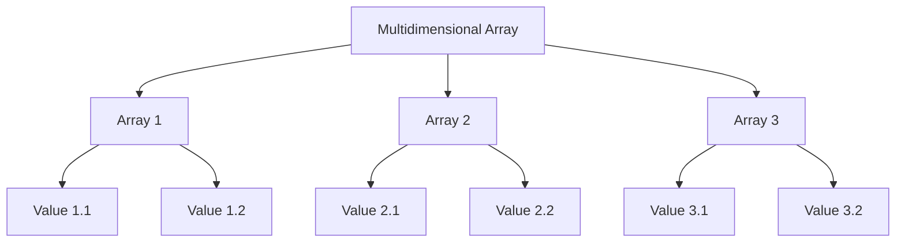

# PHP Multidimensional Arrays

## Introduction

Multidimensional arrays are arrays that contain other arrays as elements. Think of them as "arrays of arrays" - data structures that allow you to organize and store complex, hierarchical data. In PHP, you can create arrays with as many dimensions as you need, making them incredibly versatile for storing and manipulating structured data.

While a regular (one-dimensional) array can be visualized as a simple list, a multidimensional array can be thought of as a table or matrix with rows and columns, or even more complex structures like cubes or higher-dimensional objects.

## Understanding Multidimensional Arrays

### What is a Multidimensional Array?

A multidimensional array is an array where each element can also be an array. These nested arrays can themselves contain other arrays, creating a hierarchical structure.



### Types of Multidimensional Arrays

1. **Two-dimensional arrays**: Arrays containing arrays (like a table with rows and columns)
2. **Three-dimensional arrays**: Arrays containing arrays of arrays (like a cube)
3. **Higher-dimensional arrays**: Arrays with four or more dimensions

## Creating Multidimensional Arrays in PHP

### Two-dimensional Arrays

A two-dimensional array can be created in several ways:

```php
// Method 1: Direct assignment
$grades = array(
    array(85, 90, 78, 88),    // Student 1's grades
    array(76, 92, 84, 81),    // Student 2's grades
    array(91, 87, 82, 95)     // Student 3's grades
);

// Method 2: Using the short array syntax (PHP 5.4+)
$grades = [
    [85, 90, 78, 88],    // Student 1's grades
    [76, 92, 84, 81],    // Student 2's grades
    [91, 87, 82, 95]     // Student 3's grades
];

// Method 3: Building the array step by step
$grades = array();
$grades[0] = array(85, 90, 78, 88);
$grades[1] = array(76, 92, 84, 81);
$grades[2] = array(91, 87, 82, 95);
```

### Associative Multidimensional Arrays

Multidimensional arrays in PHP can use string keys (associative arrays) for more meaningful data representation:

```php
$students = [
    'John' => [
        'math' => 85,
        'english' => 90,
        'science' => 78,
        'history' => 88
    ],
    'Sarah' => [
        'math' => 76,
        'english' => 92,
        'science' => 84,
        'history' => 81
    ],
    'Mike' => [
        'math' => 91,
        'english' => 87,
        'science' => 82,
        'history' => 95
    ]
];
```

### Three-dimensional Arrays

Here's how you can create a three-dimensional array:

```php
$school = [
    'Grade 9' => [
        'Class A' => [
            'John' => ['math' => 85, 'english' => 90],
            'Sarah' => ['math' => 76, 'english' => 92]
        ],
        'Class B' => [
            'Mike' => ['math' => 91, 'english' => 87],
            'Lisa' => ['math' => 82, 'english' => 88]
        ]
    ],
    'Grade 10' => [
        'Class A' => [
            'Tom' => ['math' => 79, 'english' => 85],
            'Emily' => ['math' => 94, 'english' => 89]
        ]
    ]
];
```

## Accessing Elements in Multidimensional Arrays

To access elements in a multidimensional array, you need to specify an index for each dimension:

```php
// Accessing elements in a two-dimensional array
$studentGrades = [
    [85, 90, 78, 88],    // Student 1's grades
    [76, 92, 84, 81],    // Student 2's grades
    [91, 87, 82, 95]     // Student 3's grades
];

// Access the second student's third grade
echo $studentGrades[1][2]; // Outputs: 84

// For associative arrays
$students = [
    'John' => [
        'math' => 85,
        'english' => 90
    ],
    'Sarah' => [
        'math' => 76,
        'english' => 92
    ]
];

// Access Sarah's English grade
echo $students['Sarah']['english']; // Outputs: 92

// For three-dimensional arrays
$school = [
    'Grade 9' => [
        'Class A' => [
            'John' => ['math' => 85, 'english' => 90]
        ]
    ]
];

// Access John's math grade in Grade 9, Class A
echo $school['Grade 9']['Class A']['John']['math']; // Outputs: 85
```

## Modifying Multidimensional Arrays

You can modify values in a multidimensional array by accessing the specific element and assigning a new value:

```php
$students = [
    'John' => [
        'math' => 85,
        'english' => 90
    ],
    'Sarah' => [
        'math' => 76,
        'english' => 92
    ]
];

// Update John's math grade
$students['John']['math'] = 88;

// Add a new subject for Sarah
$students['Sarah']['science'] = 89;

// Add a new student
$students['Mike'] = [
    'math' => 91,
    'english' => 87,
    'science' => 82
];

// Delete a subject
unset($students['John']['english']);

// Delete a student
unset($students['Sarah']);
```

## Iterating Through Multidimensional Arrays

### Using Nested Loops

To iterate through a multidimensional array, you can use nested loops:

```php
$grades = [
    [85, 90, 78, 88],
    [76, 92, 84, 81],
    [91, 87, 82, 95]
];

// Loop through each student
for ($i = 0; $i < count($grades); $i++) {
    echo "Student " . ($i + 1) . "'s grades: ";
    
    // Loop through each grade for the current student
    for ($j = 0; $j < count($grades[$i]); $j++) {
        echo $grades[$i][$j] . " ";
    }
    
    echo "<br>";
}

// Output:
// Student 1's grades: 85 90 78 88
// Student 2's grades: 76 92 84 81
// Student 3's grades: 91 87 82 95
```

### Using foreach Loops

The `foreach` loop provides a more elegant way to iterate through multidimensional arrays, especially associative ones:

```php
$students = [
    'John' => [
        'math' => 85,
        'english' => 90,
        'science' => 78
    ],
    'Sarah' => [
        'math' => 76,
        'english' => 92,
        'science' => 84
    ]
];

// Loop through each student
foreach ($students as $name => $subjects) {
    echo "$name's grades: <br>";
    
    // Loop through each subject and grade
    foreach ($subjects as $subject => $grade) {
        echo "$subject: $grade <br>";
    }
    
    echo "<br>";
}

// Output:
// John's grades:
// math: 85
// english: 90
// science: 78
//
// Sarah's grades:
// math: 76
// english: 92
// science: 84
```

## Real-World Applications of Multidimensional Arrays

### Example 1: Student Management System

```php
$classes = [
    'Computer Science' => [
        'students' => [
            'John' => ['midterm' => 85, 'final' => 90, 'project' => 92],
            'Sarah' => ['midterm' => 82, 'final' => 88, 'project' => 95],
            'Mike' => ['midterm' => 78, 'final' => 85, 'project' => 90]
        ],
        'instructor' => 'Dr. Smith',
        'room' => '101'
    ],
    'Mathematics' => [
        'students' => [
            'John' => ['midterm' => 90, 'final' => 92, 'project' => 88],
            'Lisa' => ['midterm' => 86, 'final' => 90, 'project' => 92],
            'Tom' => ['midterm' => 80, 'final' => 85, 'project' => 87]
        ],
        'instructor' => 'Dr. Johnson',
        'room' => '203'
    ]
];

// Calculate average grade for each student in Computer Science
echo "Computer Science Class Averages:<br>";
foreach ($classes['Computer Science']['students'] as $student => $grades) {
    $average = array_sum($grades) / count($grades);
    echo "$student: " . round($average, 2) . "<br>";
}

// Output:
// Computer Science Class Averages:
// John: 89
// Sarah: 88.33
// Mike: 84.33
```

### Example 2: Product Inventory System

```php
$inventory = [
    'electronics' => [
        'laptops' => [
            'MacBook Pro' => ['price' => 1299, 'stock' => 15],
            'Dell XPS' => ['price' => 999, 'stock' => 20],
            'HP Spectre' => ['price' => 1099, 'stock' => 8]
        ],
        'smartphones' => [
            'iPhone 13' => ['price' => 999, 'stock' => 25],
            'Samsung Galaxy S21' => ['price' => 899, 'stock' => 30],
            'Google Pixel 6' => ['price' => 799, 'stock' => 12]
        ]
    ],
    'furniture' => [
        'chairs' => [
            'Office Chair' => ['price' => 199, 'stock' => 40],
            'Gaming Chair' => ['price' => 299, 'stock' => 35]
        ],
        'tables' => [
            'Dining Table' => ['price' => 599, 'stock' => 10],
            'Coffee Table' => ['price' => 249, 'stock' => 15]
        ]
    ]
];

// Calculate total inventory value
$totalValue = 0;

foreach ($inventory as $category) {
    foreach ($category as $subcategory) {
        foreach ($subcategory as $product) {
            $totalValue += $product['price'] * $product['stock'];
        }
    }
}

echo "Total inventory value: $" . number_format($totalValue, 2);
// Output: Total inventory value: $109,630.00
```

### Example 3: Menu for a Restaurant Website

```php
$menu = [
    'Appetizers' => [
        'Calamari' => [
            'price' => 9.99,
            'ingredients' => ['squid', 'flour', 'salt', 'pepper', 'marinara sauce'],
            'vegan' => false,
            'gluten_free' => false
        ],
        'Bruschetta' => [
            'price' => 7.99,
            'ingredients' => ['bread', 'tomatoes', 'basil', 'garlic', 'olive oil'],
            'vegan' => true,
            'gluten_free' => false
        ]
    ],
    'Main Courses' => [
        'Spaghetti Carbonara' => [
            'price' => 14.99,
            'ingredients' => ['pasta', 'eggs', 'pancetta', 'parmesan', 'black pepper'],
            'vegan' => false,
            'gluten_free' => false
        ],
        'Grilled Salmon' => [
            'price' => 18.99,
            'ingredients' => ['salmon', 'lemon', 'dill', 'olive oil', 'asparagus'],
            'vegan' => false,
            'gluten_free' => true
        ]
    ],
    'Desserts' => [
        'Tiramisu' => [
            'price' => 8.99,
            'ingredients' => ['ladyfingers', 'coffee', 'mascarpone', 'cocoa powder', 'eggs'],
            'vegan' => false,
            'gluten_free' => false
        ],
        'Fruit Sorbet' => [
            'price' => 6.99,
            'ingredients' => ['mixed fruits', 'sugar', 'water'],
            'vegan' => true,
            'gluten_free' => true
        ]
    ]
];

// Function to display vegan items
function displayVeganItems($menu) {
    echo "Vegan Options:<br>";
    foreach ($menu as $category => $items) {
        echo "<strong>$category</strong><br>";
        $foundVegan = false;
        
        foreach ($items as $name => $details) {
            if ($details['vegan']) {
                echo "- $name: $" . number_format($details['price'], 2) . "<br>";
                $foundVegan = true;
            }
        }
        
        if (!$foundVegan) {
            echo "No vegan options available<br>";
        }
        
        echo "<br>";
    }
}

// Display vegan menu items
displayVeganItems($menu);

// Output:
// Vegan Options:
// Appetizers
// - Bruschetta: $7.99
//
// Main Courses
// No vegan options available
//
// Desserts
// - Fruit Sorbet: $6.99
```

## Advanced Techniques

### Sorting Multidimensional Arrays

PHP provides several functions for sorting multidimensional arrays:

```php
// Sample data
$students = [
    ['name' => 'John', 'grade' => 85],
    ['name' => 'Sarah', 'grade' => 92],
    ['name' => 'Mike', 'grade' => 78],
    ['name' => 'Lisa', 'grade' => 96]
];

// Sort by grade (ascending)
usort($students, function($a, $b) {
    return $a['grade'] - $b['grade'];
});

echo "Students sorted by grade (ascending):<br>";
foreach ($students as $student) {
    echo $student['name'] . ": " . $student['grade'] . "<br>";
}

// Output:
// Students sorted by grade (ascending):
// Mike: 78
// John: 85
// Sarah: 92
// Lisa: 96

// Sort by name (alphabetically)
usort($students, function($a, $b) {
    return strcmp($a['name'], $b['name']);
});

echo "<br>Students sorted by name:<br>";
foreach ($students as $student) {
    echo $student['name'] . ": " . $student['grade'] . "<br>";
}

// Output:
// Students sorted by name:
// John: 85
// Lisa: 96
// Mike: 78
// Sarah: 92
```

### Searching in Multidimensional Arrays

To search for specific values in multidimensional arrays, you can use the `array_filter()` function:

```php
$products = [
    ['id' => 1, 'name' => 'Laptop', 'price' => 999, 'category' => 'Electronics'],
    ['id' => 2, 'name' => 'Smartphone', 'price' => 699, 'category' => 'Electronics'],
    ['id' => 3, 'name' => 'Chair', 'price' => 199, 'category' => 'Furniture'],
    ['id' => 4, 'name' => 'Table', 'price' => 299, 'category' => 'Furniture'],
    ['id' => 5, 'name' => 'Headphones', 'price' => 149, 'category' => 'Electronics']
];

// Find all electronics products
$electronics = array_filter($products, function($product) {
    return $product['category'] === 'Electronics';
});

echo "Electronics products:<br>";
foreach ($electronics as $product) {
    echo $product['name'] . ": $" . $product['price'] . "<br>";
}

// Output:
// Electronics products:
// Laptop: $999
// Smartphone: $699
// Headphones: $149

// Find products priced under $200
$affordable = array_filter($products, function($product) {
    return $product['price'] < 200;
});

echo "<br>Affordable products (under $200):<br>";
foreach ($affordable as $product) {
    echo $product['name'] . ": $" . $product['price'] . "<br>";
}

// Output:
// Affordable products (under $200):
// Chair: $199
// Headphones: $149
```

## Common Pitfalls and Best Practices

### Pitfalls to Avoid

1. **Excessive nesting**: Too many dimensions can make your code difficult to read and maintain. Try to limit nesting to 3-4 levels.

2. **Inconsistent structure**: Make sure each subarray follows the same structure to avoid unexpected errors when iterating or accessing elements.

3. **Memory issues**: Very large multidimensional arrays can consume significant memory. Consider using database solutions for complex data structures in production applications.

### Best Practices

1. **Use descriptive keys**: Especially with associative arrays, use meaningful keys that describe what the data represents.

2. **Document your array structure**: For complex arrays, document the structure with comments or a visual diagram.

3. **Use functions for common operations**: Create reusable functions for operations you perform frequently on your arrays.

4. **Check if indices exist before accessing**: Use `isset()` or `array_key_exists()` to check if an index exists before trying to access it.

```php
// Safe way to access nested array elements
if (isset($students['John']['math'])) {
    echo $students['John']['math'];
} else {
    echo "Data not found";
}
```

## Summary

Multidimensional arrays in PHP provide a powerful way to store and manipulate complex, hierarchical data structures. They can represent tables, matrices, or even more complex relationships, making them suitable for a wide range of applications.

Key points covered in this guide:

1. **Creating multidimensional arrays**: Using various methods to create arrays with multiple dimensions
2. **Accessing and modifying elements**: Using multiple indices to work with nested data
3. **Iterating through arrays**: Using nested loops and foreach to process all elements
4. **Real-world applications**: Examples of multidimensional arrays in practical scenarios
5. **Advanced techniques**: Sorting, searching, and best practices

With a solid understanding of multidimensional arrays, you'll be well-equipped to handle complex data structures in your PHP applications.

## Exercises

To reinforce your learning, try these exercises:

1. Create a three-dimensional array to represent a small library with books organized by genre, author, and individual book details (title, year, ISBN).

2. Write a function that calculates the average score for each student in a class, where student grades are stored in a multidimensional array.

3. Create a multidimensional array for a shopping cart system, with products organized by category and containing details like price, quantity, and product info.

4. Write a function that finds the most expensive item in each category of a product inventory stored as a multidimensional array.

5. Create a function that converts a multidimensional array to an HTML table.

## Additional Resources

To further enhance your knowledge of PHP arrays:

1. [PHP Manual: Arrays](https://www.php.net/manual/en/language.types.array.php)
2. [PHP Manual: Array Functions](https://www.php.net/manual/en/ref.array.php)
3. [W3Schools PHP Arrays](https://www.w3schools.com/php/php_arrays_multi.asp)
4. [PHP: The Right Way](https://phptherightway.com/)