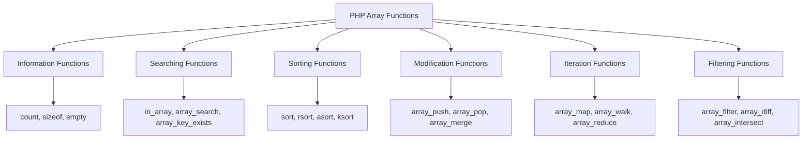

# PHP Array Functions

## Introduction

Arrays are fundamental data structures in PHP that allow you to store multiple values under a single variable name. While creating and accessing arrays is essential, PHP provides a rich set of built-in functions specifically designed to manipulate, search, sort, and transform arrays effectively.

In this tutorial, we'll explore the most commonly used PHP array functions that will help you work with arrays efficiently. Whether you're counting elements, searching for specific values, or transforming entire arrays, these functions will become valuable tools in your PHP programming toolkit.

## Common Array Functions Categories

PHP array functions can be grouped into several categories based on their purpose:



Let's dive into each category and explore these functions in detail.

## Array Information Functions

These functions provide information about the array itself.

### `count()` and `sizeof()`

The `count()` function returns the number of elements in an array. `sizeof()` is an alias of `count()`.

```php
$fruits = ["apple", "banana", "orange", "mango"];
echo "Number of fruits: " . count($fruits);
// Output: Number of fruits: 4

// Using sizeof (alias of count)
echo "Number of fruits: " . sizeof($fruits);
// Output: Number of fruits: 4
```

### `empty()`

The `empty()` function checks if an array is empty.

```php
$emptyArray = [];
$nonEmptyArray = [1, 2, 3];

if (empty($emptyArray)) {
    echo "The array is empty";
} 
// Output: The array is empty

if (!empty($nonEmptyArray)) {
    echo "The array is not empty";
}
// Output: The array is not empty
```

### `array_key_exists()`

Checks if a specified key exists in an array.

```php
$person = [
    "name" => "John",
    "age" => 30,
    "city" => "New York"
];

if (array_key_exists("age", $person)) {
    echo "The key 'age' exists in the array";
}
// Output: The key 'age' exists in the array

if (!array_key_exists("country", $person)) {
    echo "The key 'country' does not exist in the array";
}
// Output: The key 'country' does not exist in the array
```

## Array Searching Functions

These functions help you search for values within arrays.

### `in_array()`

The `in_array()` function checks if a value exists in an array.

```php
$fruits = ["apple", "banana", "orange", "mango"];

if (in_array("banana", $fruits)) {
    echo "Banana is in the fruits array";
}
// Output: Banana is in the fruits array

if (!in_array("grape", $fruits)) {
    echo "Grape is not in the fruits array";
}
// Output: Grape is not in the fruits array
```

### `array_search()`

The `array_search()` function searches for a value in an array and returns the corresponding key.

```php
$fruits = ["apple", "banana", "orange", "mango"];

$key = array_search("orange", $fruits);
echo "The key of 'orange' is: " . $key;
// Output: The key of 'orange' is: 2

// If the value doesn't exist, false is returned
$key = array_search("grape", $fruits);
if ($key === false) {
    echo "Grape was not found in the array";
}
// Output: Grape was not found in the array
```

## Array Sorting Functions

PHP provides various functions to sort arrays in different ways.

### `sort()` and `rsort()`

The `sort()` function sorts an array in ascending order, while `rsort()` sorts in descending order.

```php
$numbers = [5, 3, 8, 1, 9, 4];

// Sort in ascending order
sort($numbers);
echo "Sorted numbers (ascending): ";
print_r($numbers);
// Output: Sorted numbers (ascending): Array ( [0] => 1 [1] => 3 [2] => 4 [3] => 5 [4] => 8 [5] => 9 )

// Reset array
$numbers = [5, 3, 8, 1, 9, 4];

// Sort in descending order
rsort($numbers);
echo "Sorted numbers (descending): ";
print_r($numbers);
// Output: Sorted numbers (descending): Array ( [0] => 9 [1] => 8 [2] => 5 [3] => 4 [4] => 3 [5] => 1 )
```

### `asort()` and `arsort()`

The `asort()` function sorts an associative array by values (ascending), while `arsort()` sorts by values (descending).

```php
$ages = [
    "John" => 30,
    "Mary" => 25,
    "Peter" => 40,
    "Sarah" => 22
];

// Sort by value (ascending)
asort($ages);
echo "Sorted ages (ascending): ";
print_r($ages);
// Output: Sorted ages (ascending): Array ( [Sarah] => 22 [Mary] => 25 [John] => 30 [Peter] => 40 )

// Sort by value (descending)
arsort($ages);
echo "Sorted ages (descending): ";
print_r($ages);
// Output: Sorted ages (descending): Array ( [Peter] => 40 [John] => 30 [Mary] => 25 [Sarah] => 22 )
```

### `ksort()` and `krsort()`

The `ksort()` function sorts an associative array by keys (ascending), while `krsort()` sorts by keys (descending).

```php
$scores = [
    "Math" => 85,
    "English" => 90,
    "Science" => 78,
    "History" => 92
];

// Sort by key (ascending)
ksort($scores);
echo "Sorted subjects (alphabetically): ";
print_r($scores);
// Output: Sorted subjects (alphabetically): Array ( [English] => 90 [History] => 92 [Math] => 85 [Science] => 78 )

// Sort by key (descending)
krsort($scores);
echo "Sorted subjects (reverse alphabetically): ";
print_r($scores);
// Output: Sorted subjects (reverse alphabetically): Array ( [Science] => 78 [Math] => 85 [History] => 92 [English] => 90 )
```

## Array Modification Functions

These functions modify the structure or content of arrays.

### `array_push()` and `array_pop()`

`array_push()` adds one or more elements to the end of an array, while `array_pop()` removes the last element.

```php
$fruits = ["apple", "banana"];

// Add elements to the end
array_push($fruits, "orange", "mango");
print_r($fruits);
// Output: Array ( [0] => apple [1] => banana [2] => orange [3] => mango )

// Remove the last element
$lastFruit = array_pop($fruits);
echo "Removed fruit: " . $lastFruit;
// Output: Removed fruit: mango

print_r($fruits);
// Output: Array ( [0] => apple [1] => banana [2] => orange )
```

### `array_unshift()` and `array_shift()`

`array_unshift()` adds elements to the beginning of an array, while `array_shift()` removes the first element.

```php
$fruits = ["orange", "banana"];

// Add elements to the beginning
array_unshift($fruits, "apple", "pear");
print_r($fruits);
// Output: Array ( [0] => apple [1] => pear [2] => orange [3] => banana )

// Remove the first element
$firstFruit = array_shift($fruits);
echo "Removed fruit: " . $firstFruit;
// Output: Removed fruit: apple

print_r($fruits);
// Output: Array ( [0] => pear [1] => orange [2] => banana )
```

### `array_merge()`

The `array_merge()` function merges two or more arrays into one.

```php
$fruits1 = ["apple", "banana"];
$fruits2 = ["orange", "mango"];
$vegetables = ["carrot", "potato"];

$combined = array_merge($fruits1, $fruits2, $vegetables);
print_r($combined);
// Output: Array ( [0] => apple [1] => banana [2] => orange [3] => mango [4] => carrot [5] => potato )
```

### `array_slice()`

The `array_slice()` function extracts a portion of an array.

```php
$fruits = ["apple", "banana", "orange", "mango", "pineapple"];

// Extract 2 elements starting from index 1
$slice = array_slice($fruits, 1, 2);
print_r($slice);
// Output: Array ( [0] => banana [1] => orange )

// Extract all elements from index 3 to the end
$slice = array_slice($fruits, 3);
print_r($slice);
// Output: Array ( [0] => mango [1] => pineapple )
```

## Array Iteration Functions

These functions allow you to apply operations to each element of an array.

### `array_map()`

The `array_map()` function applies a callback function to each element of an array and returns a new array with the results.

```php
$numbers = [1, 2, 3, 4, 5];

// Double each number
$doubled = array_map(function($num) {
    return $num * 2;
}, $numbers);

print_r($doubled);
// Output: Array ( [0] => 2 [1] => 4 [2] => 6 [3] => 8 [4] => 10 )
```

### `array_walk()`

The `array_walk()` function applies a callback function to each element of an array. Unlike `array_map()`, it modifies the original array.

```php
$fruits = ["apple", "banana", "orange"];

// Convert each fruit to uppercase
array_walk($fruits, function(&$value, $key) {
    $value = strtoupper($value);
});

print_r($fruits);
// Output: Array ( [0] => APPLE [1] => BANANA [2] => ORANGE )
```

### `array_reduce()`

The `array_reduce()` function iteratively reduces an array to a single value using a callback function.

```php
$numbers = [1, 2, 3, 4, 5];

// Calculate the sum
$sum = array_reduce($numbers, function($carry, $item) {
    return $carry + $item;
}, 0);

echo "The sum is: " . $sum;
// Output: The sum is: 15

// Calculate the product
$product = array_reduce($numbers, function($carry, $item) {
    return $carry * $item;
}, 1);

echo "The product is: " . $product;
// Output: The product is: 120
```

## Array Filtering Functions

These functions help you filter arrays based on specific conditions.

### `array_filter()`

The `array_filter()` function filters elements of an array using a callback function.

```php
$numbers = [1, 2, 3, 4, 5, 6, 7, 8, 9, 10];

// Get only even numbers
$evenNumbers = array_filter($numbers, function($num) {
    return $num % 2 === 0;
});

print_r($evenNumbers);
// Output: Array ( [1] => 2 [3] => 4 [5] => 6 [7] => 8 [9] => 10 )

// Get numbers greater than 5
$greaterThanFive = array_filter($numbers, function($num) {
    return $num > 5;
});

print_r($greaterThanFive);
// Output: Array ( [5] => 6 [6] => 7 [7] => 8 [8] => 9 [9] => 10 )
```

### `array_diff()`

The `array_diff()` function returns the values in the first array that are not present in any of the other arrays.

```php
$array1 = ["apple", "banana", "orange", "kiwi"];
$array2 = ["banana", "pear", "kiwi"];
$array3 = ["orange", "melon"];

$diff = array_diff($array1, $array2, $array3);
print_r($diff);
// Output: Array ( [0] => apple )
```

### `array_intersect()`

The `array_intersect()` function returns the values that are present in all of the arrays.

```php
$array1 = ["apple", "banana", "orange", "kiwi"];
$array2 = ["banana", "pear", "kiwi", "apple"];
$array3 = ["orange", "apple", "melon"];

$common = array_intersect($array1, $array2, $array3);
print_r($common);
// Output: Array ( [0] => apple )
```

## Real-World Examples

Let's look at some practical examples of using PHP array functions in real-world applications.

### Example 1: Filtering Products by Price

```php
// Sample product data
$products = [
    ["id" => 1, "name" => "Laptop", "price" => 999.99],
    ["id" => 2, "name" => "Smartphone", "price" => 499.99],
    ["id" => 3, "name" => "Headphones", "price" => 149.99],
    ["id" => 4, "name" => "Tablet", "price" => 349.99],
    ["id" => 5, "name" => "Smartwatch", "price" => 199.99]
];

// Filter products priced below $300
$affordableProducts = array_filter($products, function($product) {
    return $product["price"] < 300;
});

echo "Affordable Products (under $300):
";
foreach ($affordableProducts as $product) {
    echo "{$product['name']} - \${$product['price']}
";
}
// Output:
// Affordable Products (under $300):
// Headphones - $149.99
// Smartwatch - $199.99
```

### Example 2: Calculating Average Rating

```php
// Sample review data
$reviews = [
    ["product_id" => 1, "rating" => 4],
    ["product_id" => 1, "rating" => 5],
    ["product_id" => 1, "rating" => 3],
    ["product_id" => 2, "rating" => 5],
    ["product_id" => 2, "rating" => 4]
];

// Extract all ratings for product 1
$product1Ratings = array_map(function($review) {
    return $review["rating"];
}, array_filter($reviews, function($review) {
    return $review["product_id"] === 1;
}));

// Calculate average rating
$averageRating = array_sum($product1Ratings) / count($product1Ratings);
echo "Average rating for product 1: " . number_format($averageRating, 1);
// Output: Average rating for product 1: 4.0
```

### Example 3: Grouping Data by Category

```php
// Sample article data
$articles = [
    ["id" => 1, "title" => "PHP Arrays Explained", "category" => "PHP"],
    ["id" => 2, "title" => "JavaScript Basics", "category" => "JavaScript"],
    ["id" => 3, "title" => "Advanced CSS Techniques", "category" => "CSS"],
    ["id" => 4, "title" => "PHP Functions Deep Dive", "category" => "PHP"],
    ["id" => 5, "title" => "Responsive Design", "category" => "CSS"]
];

// Group articles by category
$groupedArticles = [];
foreach ($articles as $article) {
    $category = $article["category"];
    if (!isset($groupedArticles[$category])) {
        $groupedArticles[$category] = [];
    }
    $groupedArticles[$category][] = $article;
}

// Display articles by category
foreach ($groupedArticles as $category => $categoryArticles) {
    echo "$category Articles:
";
    foreach ($categoryArticles as $article) {
        echo "- {$article['title']}
";
    }
    echo "
";
}
// Output:
// PHP Articles:
// - PHP Arrays Explained
// - PHP Functions Deep Dive
//
// JavaScript Articles:
// - JavaScript Basics
//
// CSS Articles:
// - Advanced CSS Techniques
// - Responsive Design
```

## Summary

PHP array functions are powerful tools that simplify working with arrays. Throughout this tutorial, we've explored various categories of array functions:

1. **Information Functions**: `count()`, `sizeof()`, `empty()`, `array_key_exists()`
2. **Searching Functions**: `in_array()`, `array_search()`
3. **Sorting Functions**: `sort()`, `rsort()`, `asort()`, `arsort()`, `ksort()`, `krsort()`
4. **Modification Functions**: `array_push()`, `array_pop()`, `array_unshift()`, `array_shift()`, `array_merge()`, `array_slice()`
5. **Iteration Functions**: `array_map()`, `array_walk()`, `array_reduce()`
6. **Filtering Functions**: `array_filter()`, `array_diff()`, `array_intersect()`

These functions allow you to manipulate arrays efficiently, making your code more readable and maintainable. By understanding and using these functions, you can avoid writing repetitive loops and custom logic for common array operations.

## Exercises

To reinforce your understanding of PHP array functions, try these exercises:

1. Create an array of 10 random numbers, then use array functions to:
   - Find the highest and lowest numbers
   - Calculate the average
   - Filter out numbers less than 50

2. Create an associative array representing a shopping cart with product names and quantities. Use array functions to:
   - Sort the cart by quantity (highest to lowest)
   - Calculate the total number of items
   - Filter out items with a quantity less than 2

3. Given two arrays of user IDs, use array functions to:
   - Find which users are in both arrays
   - Find which users are only in the first array
   - Merge the arrays without duplicates

## Additional Resources

- [PHP Manual: Array Functions](https://www.php.net/manual/en/ref.array.php)
- [PHP.net Function Reference](https://www.php.net/manual/en/funcref.php)
- [W3Schools PHP Array Reference](https://www.w3schools.com/php/php_ref_array.asp)