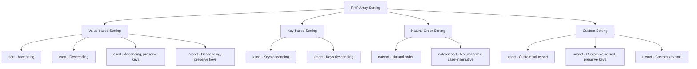

# PHP Array Sorting

## Introduction

Sorting arrays is one of the most common operations when working with collections of data in PHP. Whether you're organizing user information, product listings, or any kind of structured data, PHP provides several built-in functions that make sorting arrays straightforward and efficient.

In this guide, we'll explore the various sorting functions PHP offers, understand how they work, and see how to apply them in real-world scenarios. By the end, you'll be able to choose the right sorting method for any data structure you're working with.

## Basic Array Sorting

PHP provides several functions for sorting arrays, each with different behaviors for sorting order and maintaining key associations.

### The `sort()` Function

The `sort()` function sorts an array in ascending order. It reindexes the array, which means the keys are replaced with numeric indices.

```php
<?php
$fruits = ["banana", "apple", "orange", "grape"];
sort($fruits);

echo "Sorted fruits array: ";
print_r($fruits);
?>
```

**Output:**
```
Sorted fruits array: Array
(
    [0] => apple
    [1] => banana
    [2] => grape
    [3] => orange
)
```

### The `rsort()` Function

The `rsort()` function sorts an array in descending order and also reindexes the array.

```php
<?php
$numbers = [5, 8, 2, 10, 3];
rsort($numbers);

echo "Sorted numbers in descending order: ";
print_r($numbers);
?>
```

**Output:**
```
Sorted numbers in descending order: Array
(
    [0] => 10
    [1] => 8
    [2] => 5
    [3] => 3
    [4] => 2
)
```

## Preserving Keys While Sorting

Sometimes you need to maintain the association between keys and values when sorting. PHP offers specific functions for this purpose.

### The `asort()` Function

The `asort()` function sorts an array in ascending order based on values but preserves the keys.

```php
<?php
$age = [
    "John" => 35,
    "Mary" => 28,
    "Peter" => 43,
    "Sarah" => 31
];

asort($age);

echo "Sorted ages (ascending): ";
print_r($age);
?>
```

**Output:**
```
Sorted ages (ascending): Array
(
    [Mary] => 28
    [Sarah] => 31
    [John] => 35
    [Peter] => 43
)
```

### The `arsort()` Function

The `arsort()` function sorts an array in descending order based on values while preserving keys.

```php
<?php
$age = [
    "John" => 35,
    "Mary" => 28,
    "Peter" => 43,
    "Sarah" => 31
];

arsort($age);

echo "Sorted ages (descending): ";
print_r($age);
?>
```

**Output:**
```
Sorted ages (descending): Array
(
    [Peter] => 43
    [John] => 35
    [Sarah] => 31
    [Mary] => 28
)
```

## Sorting by Keys

Sometimes, you may want to sort an array based on its keys rather than values.

### The `ksort()` Function

The `ksort()` function sorts an array by keys in ascending order.

```php
<?php
$employees = [
    "Samuel" => "IT",
    "Olivia" => "HR",
    "Daniel" => "Finance",
    "Anna" => "Marketing"
];

ksort($employees);

echo "Employees sorted by name (ascending): ";
print_r($employees);
?>
```

**Output:**
```
Employees sorted by name (ascending): Array
(
    [Anna] => Marketing
    [Daniel] => Finance
    [Olivia] => HR
    [Samuel] => IT
)
```

### The `krsort()` Function

The `krsort()` function sorts an array by keys in descending order.

```php
<?php
$employees = [
    "Samuel" => "IT",
    "Olivia" => "HR",
    "Daniel" => "Finance",
    "Anna" => "Marketing"
];

krsort($employees);

echo "Employees sorted by name (descending): ";
print_r($employees);
?>
```

**Output:**
```
Employees sorted by name (descending): Array
(
    [Samuel] => IT
    [Olivia] => HR
    [Daniel] => Finance
    [Anna] => Marketing
)
```

## Natural Order Sorting

When dealing with strings containing numbers, the standard sorting functions may not provide the expected results. For such cases, PHP offers natural order sorting.

### The `natsort()` Function

The `natsort()` function sorts an array using a "natural order" algorithm, which sorts alphanumeric strings in a way that humans would expect.

```php
<?php
$files = ["img1.png", "img10.png", "img2.png", "img12.png"];

// Standard sort
sort($files);
echo "Standard sort: ";
print_r($files);

// Natural order sort
natsort($files);
echo "Natural order sort: ";
print_r($files);
?>
```

**Output:**
```
Standard sort: Array
(
    [0] => img1.png
    [1] => img10.png
    [2] => img12.png
    [3] => img2.png
)

Natural order sort: Array
(
    [0] => img1.png
    [2] => img2.png
    [1] => img10.png
    [3] => img12.png
)
```

### The `natcasesort()` Function

The `natcasesort()` function is similar to `natsort()` but performs a case-insensitive sort.

```php
<?php
$files = ["Image1.jpg", "image10.jpg", "Image2.jpg", "image12.jpg"];

natcasesort($files);
echo "Case-insensitive natural order sort: ";
print_r($files);
?>
```

**Output:**
```
Case-insensitive natural order sort: Array
(
    [0] => Image1.jpg
    [2] => Image2.jpg
    [1] => image10.jpg
    [3] => image12.jpg
)
```

## Custom Sorting with User-Defined Functions

Sometimes, the built-in sorting functions don't cover your specific needs. PHP allows you to define custom sorting logic using the following functions.

### The `usort()` Function

The `usort()` function sorts an array by values using a user-defined comparison function. It reindexes the array with numeric keys.

```php
<?php
function compare_length($a, $b) {
    return strlen($a) - strlen($b);
}

$words = ["apple", "pineapple", "banana", "kiwi", "strawberry"];

usort($words, "compare_length");

echo "Words sorted by length: ";
print_r($words);
?>
```

**Output:**
```
Words sorted by length: Array
(
    [0] => kiwi
    [1] => apple
    [2] => banana
    [3] => pineapple
    [4] => strawberry
)
```

### The `uasort()` Function

The `uasort()` function sorts an array by values using a user-defined comparison function while maintaining key associations.

```php
<?php
function compare_by_department_length($a, $b) {
    return strlen($a) - strlen($b);
}

$employees = [
    "John" => "Information Technology",
    "Mary" => "HR",
    "Peter" => "Finance",
    "Sarah" => "Customer Service"
];

uasort($employees, "compare_by_department_length");

echo "Employees sorted by department name length: ";
print_r($employees);
?>
```

**Output:**
```
Employees sorted by department name length: Array
(
    [Mary] => HR
    [Peter] => Finance
    [Sarah] => Customer Service
    [John] => Information Technology
)
```

### The `uksort()` Function

The `uksort()` function sorts an array by keys using a user-defined comparison function.

```php
<?php
function compare_by_last_char($a, $b) {
    return substr($a, -1) <=> substr($b, -1);
}

$fruits = [
    "apple" => "red",
    "banana" => "yellow",
    "orange" => "orange",
    "kiwi" => "green"
];

uksort($fruits, "compare_by_last_char");

echo "Fruits sorted by last character of name: ";
print_r($fruits);
?>
```

**Output:**
```
Fruits sorted by last character of name: Array
(
    [apple] => red
    [orange] => orange
    [kiwi] => green
    [banana] => yellow
)
```

## Array Sorting Overview

Here's a summary of PHP's array sorting functions:



## Practical Examples

### Example 1: Sorting a Product List

Let's create a practical example of sorting products by different criteria:

```php
<?php
// Product data
$products = [
    ["name" => "Laptop", "price" => 899.99, "stock" => 15],
    ["name" => "Smartphone", "price" => 499.99, "stock" => 28],
    ["name" => "Tablet", "price" => 349.99, "stock" => 8],
    ["name" => "Headphones", "price" => 129.99, "stock" => 33],
    ["name" => "Monitor", "price" => 279.99, "stock" => 12]
];

// Sort by price (lowest to highest)
usort($products, function($a, $b) {
    return $a["price"] <=> $b["price"];
});

echo "Products sorted by price (lowest to highest):
";
foreach ($products as $product) {
    echo "- {$product['name']}: \${$product['price']} ({$product['stock']} in stock)
";
}

// Sort by stock availability (highest to lowest)
usort($products, function($a, $b) {
    return $b["stock"] <=> $a["stock"];
});

echo "
Products sorted by stock (highest to lowest):
";
foreach ($products as $product) {
    echo "- {$product['name']}: {$product['stock']} in stock (\${$product['price']})
";
}

// Sort alphabetically by name
usort($products, function($a, $b) {
    return $a["name"] <=> $b["name"];
});

echo "
Products sorted alphabetically by name:
";
foreach ($products as $product) {
    echo "- {$product['name']}
";
}
?>
```

**Output:**
```
Products sorted by price (lowest to highest):
- Headphones: $129.99 (33 in stock)
- Monitor: $279.99 (12 in stock)
- Tablet: $349.99 (8 in stock)
- Smartphone: $499.99 (28 in stock)
- Laptop: $899.99 (15 in stock)

Products sorted by stock (highest to lowest):
- Headphones: 33 in stock ($129.99)
- Smartphone: 28 in stock ($499.99)
- Laptop: 15 in stock ($899.99)
- Monitor: 12 in stock ($279.99)
- Tablet: 8 in stock ($349.99)

Products sorted alphabetically by name:
- Headphones
- Laptop
- Monitor
- Smartphone
- Tablet
```

### Example 2: Sorting User Data

This example sorts user data for display in a dashboard:

```php
<?php
$users = [
    "user123" => ["name" => "John Smith", "last_login" => "2023-09-10", "role" => "admin"],
    "user456" => ["name" => "Sarah Johnson", "last_login" => "2023-09-15", "role" => "editor"],
    "user789" => ["name" => "Mike Williams", "last_login" => "2023-09-01", "role" => "user"],
    "user234" => ["name" => "Emma Davis", "last_login" => "2023-09-12", "role" => "editor"],
    "user567" => ["name" => "David Brown", "last_login" => "2023-09-08", "role" => "user"]
];

// Sort by most recent login
uasort($users, function($a, $b) {
    return strtotime($b["last_login"]) - strtotime($a["last_login"]);
});

echo "Users sorted by most recent login:
";
foreach ($users as $id => $user) {
    echo "- {$user['name']} ({$id}): Last login {$user['last_login']}
";
}

// Group users by role and sort alphabetically within each group
$grouped_users = [];
foreach ($users as $id => $user) {
    $grouped_users[$user["role"]][$id] = $user;
}

// Sort roles alphabetically
ksort($grouped_users);

// Sort users alphabetically within each role
foreach ($grouped_users as $role => &$role_users) {
    uasort($role_users, function($a, $b) {
        return strcmp($a["name"], $b["name"]);
    });
}

echo "
Users grouped by role and sorted alphabetically:
";
foreach ($grouped_users as $role => $role_users) {
    echo "
{$role}s:
";
    foreach ($role_users as $id => $user) {
        echo "- {$user['name']} ({$id})
";
    }
}
?>
```

**Output:**
```
Users sorted by most recent login:
- Sarah Johnson (user456): Last login 2023-09-15
- Emma Davis (user234): Last login 2023-09-12
- John Smith (user123): Last login 2023-09-10
- David Brown (user567): Last login 2023-09-08
- Mike Williams (user789): Last login 2023-09-01

Users grouped by role and sorted alphabetically:

admins:
- John Smith (user123)

editors:
- Emma Davis (user234)
- Sarah Johnson (user456)

users:
- David Brown (user567)
- Mike Williams (user789)
```

## Summary

PHP offers a rich set of array sorting functions that can handle various sorting requirements:

1. Basic sorting with `sort()` and `rsort()`
2. Preserving keys while sorting values with `asort()` and `arsort()`
3. Sorting by keys with `ksort()` and `krsort()`
4. Natural order sorting with `natsort()` and `natcasesort()`
5. Custom sorting with `usort()`, `uasort()`, and `uksort()`

By understanding these functions and when to use each one, you can effectively organize and manipulate array data in your PHP applications.

## Additional Resources and Exercises

### Additional Resources
- [PHP Array Sorting Functions (Official Documentation)](https://www.php.net/manual/en/array.sorting.php)
- [PHP Comparison Operators](https://www.php.net/manual/en/language.operators.comparison.php)
- [PHP Anonymous Functions](https://www.php.net/manual/en/functions.anonymous.php)

### Exercises

1. **Basic Sorting Practice**:
   Create an array of 10 random numbers and sort them in both ascending and descending order.

2. **Associative Array Challenge**:
   Create an associative array representing a student directory with names as keys and grades as values. Sort this directory by grades (highest to lowest) while preserving the student names.

3. **Multidimensional Array Sorting**:
   Create an array of books with multiple attributes (title, author, year, rating). Implement sorting by each attribute, and then create a function that allows sorting by any attribute specified as a parameter.

4. **Natural Order Sorting Application**:
   Create a function that takes a directory path and returns a naturally sorted list of all the files in that directory.

5. **Custom Comparison Logic**:
   Implement a custom sorting algorithm that sorts strings first by length and then alphabetically for strings of the same length.