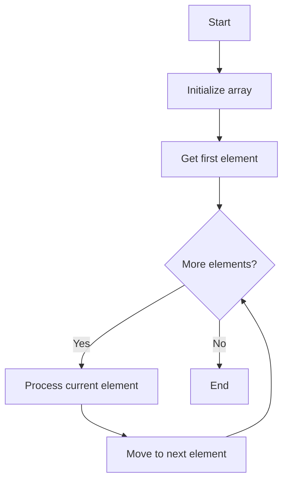

# PHP Array Iteration

## Introduction

Iteration is one of the most common operations performed on arrays. In PHP, there are several ways to iterate (loop) through array elements, allowing you to access and manipulate each value. Whether you're working with simple indexed arrays, associative arrays, or multidimensional arrays, understanding how to efficiently iterate through them is essential for PHP programming.

This guide will walk you through various methods to iterate through PHP arrays, from basic loops to specialized built-in functions.

## Basic Array Iteration Methods

### The `foreach` Loop

The `foreach` loop is the most common and straightforward way to iterate through PHP arrays. It works with both indexed and associative arrays.

#### Basic Syntax:

```php
foreach ($array as $value) {
    // Code to execute for each value
}
```

#### Example with Indexed Array:

```php
$fruits = ["Apple", "Banana", "Orange", "Mango"];

foreach ($fruits as $fruit) {
    echo $fruit . "<br>";
}
```

**Output:**
```
Apple
Banana
Orange
Mango
```

#### Accessing Both Keys and Values:

```php
foreach ($array as $key => $value) {
    // Code using both key and value
}
```

#### Example with Associative Array:

```php
$employee = [
    "name" => "John Doe",
    "position" => "Developer",
    "age" => 30,
    "skills" => ["PHP", "JavaScript", "MySQL"]
];

foreach ($employee as $key => $value) {
    if (is_array($value)) {
        echo $key . ": " . implode(", ", $value) . "<br>";
    } else {
        echo $key . ": " . $value . "<br>";
    }
}
```

**Output:**
```
name: John Doe
position: Developer
age: 30
skills: PHP, JavaScript, MySQL
```

### The `for` Loop

The `for` loop is useful when you need to iterate through indexed arrays and need more control over the iteration process.

```php
$numbers = [10, 20, 30, 40, 50];

for ($i = 0; $i < count($numbers); $i++) {
    echo "Element at index $i is: " . $numbers[$i] . "<br>";
}
```

**Output:**
```
Element at index 0 is: 10
Element at index 1 is: 20
Element at index 2 is: 30
Element at index 3 is: 40
Element at index 4 is: 50
```

> **Note:** The `for` loop is not ideal for associative arrays as it requires numeric indices.

### The `while` Loop

You can also use a `while` loop with the help of array pointer functions.

```php
$colors = ["red", "green", "blue", "yellow"];

// Reset the internal pointer to the beginning
reset($colors);

while (($color = current($colors)) !== false) {
    echo $color . "<br>";
    next($colors);
}
```

**Output:**
```
red
green
blue
yellow
```

## Array Pointer Functions

PHP provides several functions to work with the internal array pointer:

| Function | Description |
|----------|-------------|
| `current()` | Returns the current element pointed by the internal pointer |
| `key()` | Returns the key of the current element |
| `next()` | Advances the pointer and returns the next element |
| `prev()` | Moves the pointer backwards and returns the previous element |
| `reset()` | Resets the pointer to the first element |
| `end()` | Moves the pointer to the last element |

### Example:

```php
$fruits = ["Apple", "Banana", "Orange", "Mango"];
reset($fruits);

echo "First fruit: " . current($fruits) . "<br>";  // Apple
echo "Key of first fruit: " . key($fruits) . "<br>";  // 0

next($fruits);
echo "Second fruit: " . current($fruits) . "<br>";  // Banana

end($fruits);
echo "Last fruit: " . current($fruits) . "<br>";  // Mango

prev($fruits);
echo "Second last fruit: " . current($fruits) . "<br>";  // Orange
```

## Built-in Array Iteration Functions

### `array_walk()` and `array_walk_recursive()`

The `array_walk()` function applies a user-defined function to each element of an array.

```php
$fruits = ["Apple", "Banana", "Orange", "Mango"];

array_walk($fruits, function(&$value, $key) {
    $value = strtoupper($value);
});

print_r($fruits);
```

**Output:**
```
Array
(
    [0] => APPLE
    [1] => BANANA
    [2] => ORANGE
    [3] => MANGO
)
```

For multidimensional arrays, you can use `array_walk_recursive()`:

```php
$person = [
    "name" => "John",
    "details" => [
        "age" => 30,
        "location" => "New York"
    ]
];

array_walk_recursive($person, function(&$value, $key) {
    if (is_string($value)) {
        $value = strtoupper($value);
    }
});

print_r($person);
```

**Output:**
```
Array
(
    [name] => JOHN
    [details] => Array
        (
            [age] => 30
            [location] => NEW YORK
        )
)
```

### `array_map()`

The `array_map()` function applies a callback to each element of an array and returns a new array with modified values.

```php
$numbers = [1, 2, 3, 4, 5];

$squared = array_map(function($num) {
    return $num * $num;
}, $numbers);

print_r($squared);
```

**Output:**
```
Array
(
    [0] => 1
    [1] => 4
    [2] => 9
    [3] => 16
    [4] => 25
)
```

### `array_filter()`

The `array_filter()` function filters elements of an array using a callback function.

```php
$numbers = [1, 2, 3, 4, 5, 6, 7, 8, 9, 10];

$evenNumbers = array_filter($numbers, function($num) {
    return $num % 2 === 0;
});

print_r($evenNumbers);
```

**Output:**
```
Array
(
    [1] => 2
    [3] => 4
    [5] => 6
    [7] => 8
    [9] => 10
)
```

> **Note:** `array_filter()` preserves the original keys of the array.

### `array_reduce()`

The `array_reduce()` function reduces an array to a single value using a callback function.

```php
$numbers = [1, 2, 3, 4, 5];

$sum = array_reduce($numbers, function($carry, $item) {
    return $carry + $item;
}, 0);

echo "Sum of all numbers: $sum";  // Sum of all numbers: 15
```

## Iterating Multidimensional Arrays

### Using Nested `foreach` Loops

```php
$employees = [
    [
        "name" => "John",
        "department" => "IT",
        "skills" => ["PHP", "JavaScript"]
    ],
    [
        "name" => "Jane",
        "department" => "HR",
        "skills" => ["Communication", "Management"]
    ]
];

foreach ($employees as $employee) {
    echo "Name: " . $employee["name"] . "<br>";
    echo "Department: " . $employee["department"] . "<br>";
    echo "Skills: ";
    
    foreach ($employee["skills"] as $skill) {
        echo $skill . ", ";
    }
    
    echo "<br><br>";
}
```

**Output:**
```
Name: John
Department: IT
Skills: PHP, JavaScript, 

Name: Jane
Department: HR
Skills: Communication, Management, 
```

### Using Recursion

For arrays with unknown depth, you can use recursion:

```php
function iterateArray($array, $prefix = '') {
    foreach ($array as $key => $value) {
        if (is_array($value)) {
            iterateArray($value, $prefix . $key . '.');
        } else {
            echo $prefix . $key . ': ' . $value . "<br>";
        }
    }
}

$data = [
    "person" => [
        "name" => "John",
        "contact" => [
            "email" => "john@example.com",
            "phone" => "123-456-7890"
        ]
    ],
    "company" => "Acme Inc."
];

iterateArray($data);
```

**Output:**
```
person.name: John
person.contact.email: john@example.com
person.contact.phone: 123-456-7890
company: Acme Inc.
```

## Common Iteration Patterns

### Processing Items in Chunks

Sometimes you need to process array elements in chunks:

```php
$numbers = range(1, 10);
$chunkSize = 3;

foreach (array_chunk($numbers, $chunkSize) as $chunk) {
    echo "Processing chunk: " . implode(", ", $chunk) . "<br>";
    // Process each chunk
}
```

**Output:**
```
Processing chunk: 1, 2, 3
Processing chunk: 4, 5, 6
Processing chunk: 7, 8, 9
Processing chunk: 10
```

### Iterating with Keys While Preserving Order

If you need to iterate through an array in a specific order while preserving keys:

```php
$scores = [
    "John" => 85,
    "Mary" => 92,
    "Bob" => 78,
    "Alice" => 95
];

// Sort by values in descending order
arsort($scores);

foreach ($scores as $name => $score) {
    echo "$name: $score<br>";
}
```

**Output:**
```
Alice: 95
Mary: 92
John: 85
Bob: 78
```

### Parallel Array Iteration

You can iterate through multiple arrays simultaneously using `array_map()`:

```php
$names = ["John", "Jane", "Bob"];
$ages = [25, 30, 22];
$cities = ["New York", "Boston", "Chicago"];

$combined = array_map(function($name, $age, $city) {
    return "$name is $age years old and lives in $city.";
}, $names, $ages, $cities);

foreach ($combined as $info) {
    echo $info . "<br>";
}
```

**Output:**
```
John is 25 years old and lives in New York.
Jane is 30 years old and lives in Boston.
Bob is 22 years old and lives in Chicago.
```

## Visualization of Array Iteration

Here's a diagram showing the flow of a `foreach` loop:



## Best Practices for Array Iteration

1. **Choose the right iteration method** for your specific needs:
   - Use `foreach` for most cases, especially with associative arrays
   - Use `for` when you need more control over the index
   - Use array functions (`array_map`, `array_filter`, etc.) for functional programming approaches

2. **Avoid modifying the array** while iterating through it, as this can lead to unexpected behaviors.

3. **Use references** (`&$value`) in `foreach` loops when you need to modify the original array elements.

4. **Be aware of memory usage** when iterating through large arrays. Consider using generators for large datasets.

5. **Consider performance** - `foreach` is generally faster than other methods for simple iterations.

## Practical Example: Building a Simple Report

Let's create a simple sales report using array iteration techniques:

```php
// Sample sales data
$sales = [
    [
        "product" => "Laptop",
        "quantity" => 5,
        "price" => 1200
    ],
    [
        "product" => "Smartphone",
        "quantity" => 10,
        "price" => 800
    ],
    [
        "product" => "Headphones",
        "quantity" => 15,
        "price" => 200
    ],
    [
        "product" => "Monitor",
        "quantity" => 3,
        "price" => 400
    ]
];

// Calculate totals
$totalRevenue = 0;
$totalItems = 0;
$productRevenues = [];

foreach ($sales as $item) {
    $itemRevenue = $item["quantity"] * $item["price"];
    $totalRevenue += $itemRevenue;
    $totalItems += $item["quantity"];
    $productRevenues[$item["product"]] = $itemRevenue;
}

// Sort products by revenue
arsort($productRevenues);

// Generate report
echo "<h2>Sales Report</h2>";
echo "<p>Total Revenue: $" . number_format($totalRevenue, 2) . "</p>";
echo "<p>Total Items Sold: $totalItems</p>";
echo "<h3>Product Breakdown:</h3>";
echo "<ul>";
foreach ($productRevenues as $product => $revenue) {
    echo "<li>$product: $" . number_format($revenue, 2) . "</li>";
}
echo "</ul>";
```

**Output:**
```
Sales Report

Total Revenue: $13,700.00
Total Items Sold: 33

Product Breakdown:
• Smartphone: $8,000.00
• Laptop: $6,000.00
• Headphones: $3,000.00
• Monitor: $1,200.00
```

## Summary

In this guide, we've covered the main methods for iterating through PHP arrays:

- Basic iteration techniques using `foreach`, `for`, and `while` loops
- Array pointer functions like `current()` and `next()`
- Built-in array functions such as `array_walk()`, `array_map()`, and `array_filter()`
- Techniques for handling multidimensional arrays
- Common iteration patterns and best practices

Mastering array iteration is essential for effective PHP programming. It allows you to process, transform, and extract data from arrays in various ways to meet your application's needs.

## Exercises for Practice

1. Create a function that takes an array of numbers and returns a new array with each number doubled.

2. Write a script that counts the frequency of each element in an array.

3. Create a function that flattens a multidimensional array into a single-dimensional array.

4. Build a simple product filtering system that allows users to filter products by price range and category.

5. Create a function that takes an array of associative arrays (representing people) and sorts them by a specified field (e.g., age, name).

## Additional Resources

- [PHP Manual: Arrays](https://www.php.net/manual/en/language.types.array.php)
- [PHP Manual: Array Functions](https://www.php.net/manual/en/ref.array.php)
- [PHP: The Right Way - Arrays](https://phptherightway.com/#arrays)