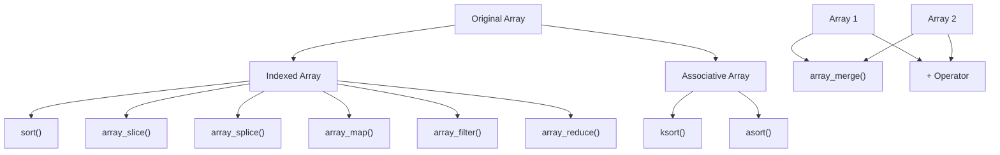

# PHP Array Operations

Arrays are fundamental data structures in PHP that allow you to store multiple values in a single variable. Understanding how to manipulate arrays effectively is crucial for PHP development. This guide covers the essential operations you'll need to work with arrays in PHP.

## Introduction to PHP Array Operations

In PHP, arrays are incredibly versatile and can store values of different types together. The language provides numerous built-in functions and operators to create, modify, access, and process array data. Whether you're building a simple website or a complex application, mastering array operations will significantly enhance your PHP programming skills.

## Creating Arrays

PHP offers multiple ways to create arrays:

### Basic Array Creation

```php
// Simple indexed array
$fruits = array("Apple", "Banana", "Orange");

// Using the short array syntax (PHP 5.4+)
$vegetables = ["Carrot", "Broccoli", "Spinach"];

// Output
echo '<pre>';
print_r($fruits);
echo '</pre>';
```

**Output:**
```
Array
(
    [0] => Apple
    [1] => Banana
    [2] => Orange
)
```

### Associative Arrays

Associative arrays use named keys instead of numeric indices:

```php
// Associative array
$person = array(
    "name" => "John Doe",
    "age" => 28,
    "email" => "john@example.com"
);

// Short syntax
$settings = [
    "theme" => "dark",
    "notifications" => true,
    "sidebar" => "left"
];

// Output
echo '<pre>';
print_r($person);
echo '</pre>';
```

**Output:**
```
Array
(
    [name] => John Doe
    [age] => 28
    [email] => john@example.com
)
```

### Multidimensional Arrays

Arrays can contain other arrays, creating multidimensional structures:

```php
// 2D array
$students = [
    ["name" => "Alice", "grade" => 85],
    ["name" => "Bob", "grade" => 92],
    ["name" => "Charlie", "grade" => 78]
];

// 3D array example
$classrooms = [
    "ClassA" => [
        "Alice" => ["Math" => 90, "Science" => 95],
        "Bob" => ["Math" => 85, "Science" => 80]
    ],
    "ClassB" => [
        "Charlie" => ["Math" => 75, "Science" => 85],
        "Dave" => ["Math" => 95, "Science" => 90]
    ]
];

// Output
echo '<pre>';
print_r($students);
echo '</pre>';
```

**Output:**
```
Array
(
    [0] => Array
        (
            [name] => Alice
            [grade] => 85
        )
    [1] => Array
        (
            [name] => Bob
            [grade] => 92
        )
    [2] => Array
        (
            [name] => Charlie
            [grade] => 78
        )
)
```

## Array Access and Modification

### Accessing Array Elements

```php
$colors = ["red", "green", "blue", "yellow"];

// Access by index
echo $colors[0]; // Outputs: red

$user = ["name" => "Jane", "role" => "Admin"];

// Access by key
echo $user["role"]; // Outputs: Admin

// Accessing nested arrays
$data = [
    "products" => [
        ["id" => 1, "name" => "Laptop"],
        ["id" => 2, "name" => "Phone"]
    ]
];

echo $data["products"][1]["name"]; // Outputs: Phone
```

### Adding Elements

```php
$fruits = ["Apple", "Banana"];

// Add to the end
$fruits[] = "Orange";

// Add with specific key
$fruits[3] = "Mango";

// Add to associative array
$user = ["name" => "John"];
$user["email"] = "john@example.com";

// Output
echo '<pre>';
print_r($fruits);
print_r($user);
echo '</pre>';
```

**Output:**
```
Array
(
    [0] => Apple
    [1] => Banana
    [2] => Orange
    [3] => Mango
)
Array
(
    [name] => John
    [email] => john@example.com
)
```

### Modifying Elements

```php
$numbers = [10, 20, 30, 40];

// Change value
$numbers[2] = 35;

$settings = ["theme" => "light", "sidebar" => "left"];

// Update value
$settings["theme"] = "dark";

// Output
echo '<pre>';
print_r($numbers);
print_r($settings);
echo '</pre>';
```

**Output:**
```
Array
(
    [0] => 10
    [1] => 20
    [2] => 35
    [3] => 40
)
Array
(
    [theme] => dark
    [sidebar] => left
)
```

### Removing Elements

```php
$colors = ["red", "green", "blue", "yellow", "purple"];

// Remove last element
array_pop($colors);

// Remove first element
array_shift($colors);

// Remove specific element
unset($colors[1]); // Removes "blue"

// Output
echo '<pre>';
print_r($colors);
echo '</pre>';
```

**Output:**
```
Array
(
    [0] => green
)
```

## Array Iteration

### Using foreach Loop

The foreach loop is the most common way to iterate through arrays:

```php
$fruits = ["Apple", "Banana", "Orange", "Mango"];

// Basic foreach
foreach ($fruits as $fruit) {
    echo $fruit . "<br>";
}

// With key and value
$person = [
    "name" => "John",
    "age" => 30,
    "job" => "Developer"
];

foreach ($person as $key => $value) {
    echo "$key: $value<br>";
}
```

**Output:**
```
Apple
Banana
Orange
Mango
name: John
age: 30
job: Developer
```

### Using for Loop (with Indexed Arrays)

```php
$numbers = [10, 20, 30, 40, 50];

for ($i = 0; $i < count($numbers); $i++) {
    echo "Index $i: " . $numbers[$i] . "<br>";
}
```

**Output:**
```
Index 0: 10
Index 1: 20
Index 2: 30
Index 3: 40
Index 4: 50
```

### Using while and each (Legacy)

```php
$colors = ["red", "green", "blue"];
reset($colors);

while (list($key, $value) = each($colors)) {
    echo "$key: $value<br>";
}
```

> Note: The `each()` function is deprecated as of PHP 7.2. It's recommended to use `foreach` instead.

## Common Array Functions

PHP provides many built-in functions for array manipulation:

### Array Size and Properties

```php
$fruits = ["Apple", "Banana", "Orange", "Mango", "Lemon"];

// Count elements
echo "Count: " . count($fruits) . "<br>";

// Check if element exists
echo "Contains Orange? " . (in_array("Orange", $fruits) ? "Yes" : "No") . "<br>";

// Get keys of array
$keys = array_keys($fruits);
echo "Keys: " . implode(", ", $keys) . "<br>";

// Check if key exists
echo "Has key 3? " . (array_key_exists(3, $fruits) ? "Yes" : "No") . "<br>";
```

**Output:**
```
Count: 5
Contains Orange? Yes
Keys: 0, 1, 2, 3, 4
Has key 3? Yes
```

### Transformation Functions

```php
$numbers = [1, 2, 3, 4, 5];

// Map values
$squared = array_map(function($n) {
    return $n * $n;
}, $numbers);

// Filter values
$evenNumbers = array_filter($numbers, function($n) {
    return $n % 2 == 0;
});

// Reduce to single value
$sum = array_reduce($numbers, function($carry, $n) {
    return $carry + $n;
}, 0);

echo "Original: " . implode(", ", $numbers) . "<br>";
echo "Squared: " . implode(", ", $squared) . "<br>";
echo "Even numbers: " . implode(", ", $evenNumbers) . "<br>";
echo "Sum: $sum<br>";
```

**Output:**
```
Original: 1, 2, 3, 4, 5
Squared: 1, 4, 9, 16, 25
Even numbers: 2, 4
Sum: 15
```

### Array Sorting

```php
$fruits = ["banana", "apple", "orange", "grape"];
$numbers = [3, 1, 4, 1, 5, 9];
$assoc = ["d" => 4, "a" => 1, "c" => 3, "b" => 2];

// Sort indexed arrays
sort($fruits);  // Alphabetical
sort($numbers); // Numerical

// Sort associative arrays
asort($assoc);  // Sort by value, keep keys
ksort($assoc);  // Sort by key

// Reverse sort
rsort($fruits); // Reverse alphabetical

echo '<pre>';
echo "Sorted fruits: ";
print_r($fruits);
echo "Sorted numbers: ";
print_r($numbers);
echo "Sorted by value: ";
print_r($assoc); // After ksort
echo '</pre>';
```

**Output:**
```
Sorted fruits: 
Array
(
    [0] => orange
    [1] => grape
    [2] => banana
    [3] => apple
)
Sorted numbers: 
Array
(
    [0] => 1
    [1] => 1
    [2] => 3
    [3] => 4
    [4] => 5
    [5] => 9
)
Sorted by value: 
Array
(
    [a] => 1
    [b] => 2
    [c] => 3
    [d] => 4
)
```

### Array Combining and Merging

```php
$firstNames = ["John", "Jane"];
$lastNames = ["Doe", "Smith"];

// Combine (keys from first, values from second)
$fullNames = array_combine($firstNames, $lastNames);

// Merge arrays
$array1 = ["a" => "apple", "b" => "banana"];
$array2 = ["b" => "berry", "c" => "cherry"];
$merged = array_merge($array1, $array2);

echo '<pre>';
echo "Combined arrays: ";
print_r($fullNames);
echo "Merged arrays: ";
print_r($merged);
echo '</pre>';
```

**Output:**
```
Combined arrays: 
Array
(
    [John] => Doe
    [Jane] => Smith
)
Merged arrays: 
Array
(
    [a] => apple
    [b] => berry
    [c] => cherry
)
```

## Array Operators

PHP provides specific operators for array operations:

```php
$a = ["a" => "apple", "b" => "banana"];
$b = ["b" => "berry", "c" => "cherry"];

// Union
$union = $a + $b;

// Equality comparison
$c = ["a" => "apple", "b" => "banana"];
$equal = ($a == $c); // true
$identical = ($a === $c); // true

echo '<pre>';
echo "Union result: ";
print_r($union);
echo "Equal: " . ($equal ? "true" : "false") . "<br>";
echo "Identical: " . ($identical ? "true" : "false") . "<br>";
echo '</pre>';
```

**Output:**
```
Union result: 
Array
(
    [a] => apple
    [b] => banana
    [c] => cherry
)
Equal: true
Identical: true
```

## Advanced Array Operations

### Array Slicing

```php
$fruits = ["Apple", "Banana", "Orange", "Mango", "Grapes"];

// Extract a portion
$slice = array_slice($fruits, 1, 2);  // Start at index 1, take 2 elements

// Remove and replace elements
$removed = array_splice($fruits, 2, 1, ["Peach", "Pineapple"]);

echo '<pre>';
echo "Sliced array: ";
print_r($slice);
echo "After splice: ";
print_r($fruits);
echo "Removed items: ";
print_r($removed);
echo '</pre>';
```

**Output:**
```
Sliced array: 
Array
(
    [0] => Banana
    [1] => Orange
)
After splice: 
Array
(
    [0] => Apple
    [1] => Banana
    [2] => Peach
    [3] => Pineapple
    [4] => Mango
    [5] => Grapes
)
Removed items: 
Array
(
    [0] => Orange
)
```

### Array Diff and Intersect

```php
$array1 = ["apple", "banana", "cherry", "date"];
$array2 = ["banana", "cherry", "elderberry", "fig"];

// Find differences
$diff = array_diff($array1, $array2);  // In array1 but not in array2

// Find common elements
$intersect = array_intersect($array1, $array2);  // In both arrays

echo '<pre>';
echo "Difference: ";
print_r($diff);
echo "Intersection: ";
print_r($intersect);
echo '</pre>';
```

**Output:**
```
Difference: 
Array
(
    [0] => apple
    [3] => date
)
Intersection: 
Array
(
    [1] => banana
    [2] => cherry
)
```

## Array Visualization

Let's visualize how different array operations transform arrays:



## Practical Examples

### Example 1: User Management System

```php
// User database simulation
$users = [
    [
        "id" => 1,
        "name" => "John Doe",
        "email" => "john@example.com",
        "role" => "admin",
        "active" => true
    ],
    [
        "id" => 2,
        "name" => "Jane Smith",
        "email" => "jane@example.com",
        "role" => "editor",
        "active" => true
    ],
    [
        "id" => 3,
        "name" => "Bob Johnson",
        "email" => "bob@example.com",
        "role" => "user",
        "active" => false
    ]
];

// Function to find a user by ID
function findUserById($users, $id) {
    foreach ($users as $user) {
        if ($user["id"] === $id) {
            return $user;
        }
    }
    return null;
}

// Filter active users
$activeUsers = array_filter($users, function($user) {
    return $user["active"] === true;
});

// Get all user emails (for newsletter)
$emails = array_map(function($user) {
    return $user["email"];
}, $users);

// Group users by role
$usersByRole = [];
foreach ($users as $user) {
    $role = $user["role"];
    if (!isset($usersByRole[$role])) {
        $usersByRole[$role] = [];
    }
    $usersByRole[$role][] = $user;
}

// Example usage
$user = findUserById($users, 2);
echo "User found: " . $user["name"] . "<br>";

echo "Active users: " . count($activeUsers) . "<br>";

echo "User emails: " . implode(", ", $emails) . "<br>";

echo '<pre>';
echo "Users by role: ";
print_r($usersByRole);
echo '</pre>';
```

**Output:**
```
User found: Jane Smith
Active users: 2
User emails: john@example.com, jane@example.com, bob@example.com
Users by role: 
Array
(
    [admin] => Array
        (
            [0] => Array
                (
                    [id] => 1
                    [name] => John Doe
                    [email] => john@example.com
                    [role] => admin
                    [active] => 1
                )
        )
    [editor] => Array
        (
            [0] => Array
                (
                    [id] => 2
                    [name] => Jane Smith
                    [email] => jane@example.com
                    [role] => editor
                    [active] => 1
                )
        )
    [user] => Array
        (
            [0] => Array
                (
                    [id] => 3
                    [name] => Bob Johnson
                    [email] => bob@example.com
                    [role] => user
                    [active] => 
                )
        )
)
```

### Example 2: Shopping Cart

```php
// Product catalog
$products = [
    1 => ["name" => "Laptop", "price" => 999.99],
    2 => ["name" => "Smartphone", "price" => 499.50],
    3 => ["name" => "Headphones", "price" => 149.75],
    4 => ["name" => "Tablet", "price" => 299.99]
];

// Shopping cart
$cart = [
    ["product_id" => 1, "quantity" => 1],
    ["product_id" => 3, "quantity" => 2],
    ["product_id" => 4, "quantity" => 1]
];

// Calculate cart total
function calculateTotal($cart, $products) {
    $total = 0;
    foreach ($cart as $item) {
        $productId = $item["product_id"];
        $quantity = $item["quantity"];
        
        if (isset($products[$productId])) {
            $price = $products[$productId]["price"];
            $total += $price * $quantity;
        }
    }
    return $total;
}

// Function to display cart with product details
function displayCart($cart, $products) {
    $cartDetails = [];
    
    foreach ($cart as $item) {
        $productId = $item["product_id"];
        $quantity = $item["quantity"];
        
        if (isset($products[$productId])) {
            $product = $products[$productId];
            $cartDetails[] = [
                "name" => $product["name"],
                "price" => $product["price"],
                "quantity" => $quantity,
                "subtotal" => $product["price"] * $quantity
            ];
        }
    }
    
    return $cartDetails;
}

// Example usage
$cartTotal = calculateTotal($cart, $products);
$cartDetails = displayCart($cart, $products);

echo "Cart Total: $" . number_format($cartTotal, 2) . "<br>";

echo '<pre>';
echo "Cart Contents: ";
print_r($cartDetails);
echo '</pre>';
```

**Output:**
```
Cart Total: $1,599.49
Cart Contents: 
Array
(
    [0] => Array
        (
            [name] => Laptop
            [price] => 999.99
            [quantity] => 1
            [subtotal] => 999.99
        )
    [1] => Array
        (
            [name] => Headphones
            [price] => 149.75
            [quantity] => 2
            [subtotal] => 299.5
        )
    [2] => Array
        (
            [name] => Tablet
            [price] => 299.99
            [quantity] => 1
            [subtotal] => 299.99
        )
)
```

## Summary

Array operations are foundational to PHP programming. In this guide, we've covered:

1. **Creating Arrays**: Indexed, associative, and multidimensional arrays
2. **Accessing and Modifying**: Adding, changing, and removing elements
3. **Iteration**: Different approaches to loop through arrays
4. **Array Functions**: Essential built-in functions for manipulation
5. **Array Operators**: Union and comparison operations
6. **Advanced Operations**: Working with slices, differences, and intersections
7. **Practical Examples**: Real-world applications of array operations

Mastering these array operations will significantly improve your PHP programming skills and enable you to build more complex and efficient applications.

## Additional Resources

- [PHP Manual: Arrays](https://www.php.net/manual/en/language.types.array.php)
- [PHP Manual: Array Functions](https://www.php.net/manual/en/ref.array.php)

## Exercises

1. Create a function that takes an array of numbers and returns a new array containing only the even numbers.
2. Write a script that takes two arrays and returns their union, intersection, and difference.
3. Create a multidimensional array representing a simple database of products with categories. Then write functions to:
   - Find all products in a specific category
   - Calculate the total value of all products
   - Find the most expensive product
4. Build a simple to-do list application that uses arrays to store tasks. Include functionality to add, remove, and mark tasks as complete.
5. Challenge: Create a function that flattens a multidimensional array into a single-dimensional array while preserving the keys.