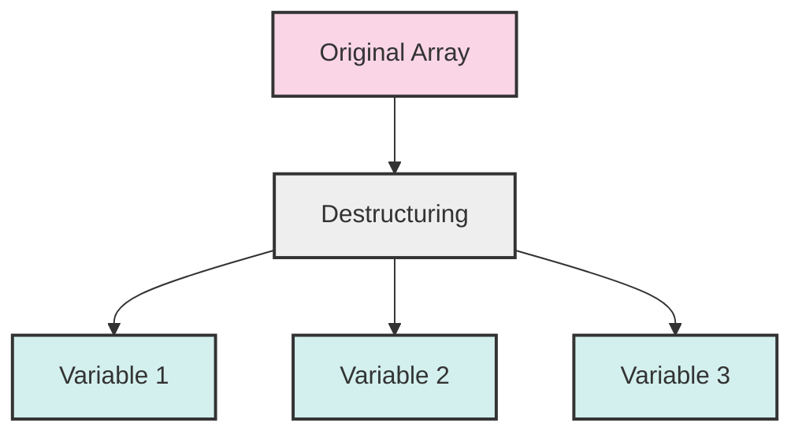

# PHP Array Destructuring

## Introduction

Array destructuring is a powerful and convenient feature in PHP that allows you to unpack values from arrays into distinct variables in a single operation. This technique helps write cleaner, more readable code by reducing the amount of repetitive array access syntax. Introduced in PHP 7.1, array destructuring (also known as "array unpacking" or "list assignment") has become an essential tool in modern PHP programming.

In this tutorial, you'll learn how to use array destructuring to extract data from arrays efficiently, making your code more concise and expressive.

## Basic Array Destructuring

At its simplest, array destructuring allows you to assign multiple variables at once from an array's values.

### Traditional Array Access vs. Destructuring

Let's first look at how we would traditionally access array elements:

```php
<?php
// Traditional array access
$colors = ['red', 'green', 'blue'];

$first = $colors[0];
$second = $colors[1];
$third = $colors[2];

echo "First: $first, Second: $second, Third: $third";
// Output: First: red, Second: green, Third: blue
?>
```

Now, using array destructuring:

```php
<?php
// Using array destructuring
$colors = ['red', 'green', 'blue'];

[$first, $second, $third] = $colors;

echo "First: $first, Second: $second, Third: $third";
// Output: First: red, Second: green, Third: blue
?>
```

The destructuring syntax `[$first, $second, $third] = $colors;` assigns the first element of `$colors` to `$first`, the second to `$second`, and the third to `$third` in a single line.

## Skipping Elements

You can skip elements you don't need by using empty positions in the destructuring list:

```php
<?php
$colors = ['red', 'green', 'blue', 'yellow', 'purple'];

// Skip the second and fourth elements
[$first, , $third, , $fifth] = $colors;

echo "First: $first, Third: $third, Fifth: $fifth";
// Output: First: red, Third: blue, Fifth: purple
?>
```

## Destructuring a Subset of Elements

You don't have to destructure all elements in an array:

```php
<?php
$numbers = [1, 2, 3, 4, 5, 6, 7];

// Only get the first three elements
[$one, $two, $three] = $numbers;

echo "First three: $one, $two, $three";
// Output: First three: 1, 2, 3
?>
```

## Using list() Function

The `list()` function is an alternative syntax for array destructuring that has been available since earlier versions of PHP:

```php
<?php
$fruits = ['apple', 'banana', 'cherry'];

// Using list() function
list($a, $b, $c) = $fruits;

echo "Fruits: $a, $b, $c";
// Output: Fruits: apple, banana, cherry
?>
```

The square bracket syntax `[$a, $b, $c]` introduced in PHP 7.1 is equivalent to `list($a, $b, $c)` but is generally preferred in modern PHP code.

## Destructuring with Associative Arrays

With associative arrays, you can destructure by key names to extract specific values:

```php
<?php
$user = [
    'name' => 'John',
    'age' => 30,
    'email' => 'john@example.com'
];

// Destructuring by key names
['name' => $name, 'email' => $email, 'age' => $age] = $user;

echo "User: $name is $age years old and can be reached at $email";
// Output: User: John is 30 years old and can be reached at john@example.com
?>
```

Note that when destructuring associative arrays, the order of keys in the destructuring assignment doesn't have to match the order in the original array.

## Nested Array Destructuring

You can also destructure nested arrays:

```php
<?php
$data = [
    'user' => 'john_doe',
    'profile' => ['firstName' => 'John', 'lastName' => 'Doe'],
    'permissions' => ['read', 'write']
];

// Destructuring nested arrays
[
    'user' => $username,
    'profile' => ['firstName' => $firstName, 'lastName' => $lastName],
    'permissions' => [$permission1, $permission2]
] = $data;

echo "Username: $username
";
echo "Name: $firstName $lastName
";
echo "Permissions: $permission1, $permission2";

/* Output:
Username: john_doe
Name: John Doe
Permissions: read, write
*/
?>
```

## Practical Examples

### Example 1: Swapping Variables

A common use case for array destructuring is swapping variable values without a temporary variable:

```php
<?php
$a = 5;
$b = 10;

// Swap variables using array destructuring
[$a, $b] = [$b, $a];

echo "a = $a, b = $b";
// Output: a = 10, b = 5
?>
```

### Example 2: Returning Multiple Values from a Function

Array destructuring makes it easier to work with functions that return multiple values:

```php
<?php
function getUserInfo() {
    // Simulate fetching user data
    return ['Jane Doe', 'jane@example.com', 28];
}

// Destructure the return value
[$name, $email, $age] = getUserInfo();

echo "User: $name ($age) - $email";
// Output: User: Jane Doe (28) - jane@example.com
?>
```

### Example 3: Processing CSV Data

Array destructuring can make processing data like CSV much cleaner:

```php
<?php
// Sample CSV data
$csvRows = [
    ['id001', 'Product A', 29.99, 10],
    ['id002', 'Product B', 49.99, 5],
    ['id003', 'Product C', 19.99, 20]
];

echo "Product Summary:
";
foreach ($csvRows as [$id, $name, $price, $quantity]) {
    $total = $price * $quantity;
    echo "$id: $name - $quantity units at \$$price each, total: \$$total
";
}

/* Output:
Product Summary:
id001: Product A - 10 units at $29.99 each, total: $299.9
id002: Product B - 5 units at $49.99 each, total: $249.95
id003: Product C - 20 units at $19.99 each, total: $399.8
*/
?>
```

### Example 4: Working with API Responses

Destructuring can make handling API responses cleaner:

```php
<?php
// Simulate an API response
$apiResponse = [
    'status' => 'success',
    'data' => [
        'posts' => [
            ['title' => 'PHP Basics', 'views' => 1250],
            ['title' => 'Advanced PHP', 'views' => 850]
        ],
        'totalCount' => 2
    ],
    'error' => null
];

// Destructure to get what we need
[
    'status' => $status, 
    'data' => [
        'posts' => $posts,
        'totalCount' => $count
    ]
] = $apiResponse;

echo "Status: $status
";
echo "Found $count posts:
";

foreach ($posts as ['title' => $title, 'views' => $views]) {
    echo "- $title ($views views)
";
}

/* Output:
Status: success
Found 2 posts:
- PHP Basics (1250 views)
- Advanced PHP (850 views)
*/
?>
```

## Visual Representation of Array Destructuring

Here's a visual representation of how array destructuring works:



## Common Pitfalls and Tips

### Undefined Index Warning

If you try to destructure more elements than exist in the array, you'll get an "Undefined offset" warning:

```php
<?php
$colors = ['red', 'green'];

// Warning: Undefined array key 2
[$first, $second, $third] = $colors;

echo $third; // Outputs: NULL (with a warning)
?>
```

### Using Default Values

You can avoid Undefined index warnings by providing default values:

```php
<?php
$colors = ['red', 'green'];

// Using the null coalescing operator for default values
$first = $colors[0] ?? 'unknown';
$second = $colors[1] ?? 'unknown';
$third = $colors[2] ?? 'unknown';

echo "Colors: $first, $second, $third";
// Output: Colors: red, green, unknown
?>
```

Unfortunately, PHP doesn't support default values directly in the destructuring syntax like some other languages do. You'll need to check and provide defaults separately.

### Working with Non-existent Keys in Associative Arrays

When destructuring associative arrays, undefined keys will result in warnings:

```php
<?php
$user = ['name' => 'John', 'age' => 30];

// Will cause a warning for 'email' key
['name' => $name, 'email' => $email] = $user;

echo $email; // Outputs: NULL (with a warning)
?>
```

To avoid this, you can check if the key exists before destructuring:

```php
<?php
$user = ['name' => 'John', 'age' => 30];

// Check if key exists and provide default
$email = $user['email'] ?? 'no-email@example.com';

echo $email; // Outputs: no-email@example.com
?>
```

## Summary

Array destructuring is a powerful feature in PHP that allows you to extract values from arrays in a clean, readable way. Key takeaways include:

1. Basic syntax uses square brackets: `[$var1, $var2] = $array;`
2. You can skip elements with empty positions: `[$first, , $third] = $array;`
3. You can destructure by keys for associative arrays: `['key' => $var] = $array;`
4. Nested destructuring allows you to extract values from multilevel arrays
5. Practical applications include swapping variables, handling function returns, and processing data sets

By mastering array destructuring, you'll write more concise, readable PHP code with less repetitive array access syntax. This modern approach to array handling is especially useful when working with complex data structures like API responses or database results.

## Exercises

To practice array destructuring, try these exercises:

1. Create a function that returns a person's full name, age, and location. Use destructuring to extract and display this information.
2. Use destructuring in a foreach loop to process an array of product data (with fields for ID, name, price, and category).
3. Create a nested array structure (such as a user with profile information and settings) and use nested destructuring to extract specific values.
4. Create a configuration array with default settings and use destructuring to extract specific settings while providing fallback values for missing ones.

## Additional Resources

- [PHP Manual: list (Assignment Operator)](https://www.php.net/manual/en/function.list.php)
- [PHP 7.1 Release Notes - Feature updates](https://www.php.net/manual/en/migration71.new-features.php)
- [PHP: The Right Way](https://phptherightway.com/)