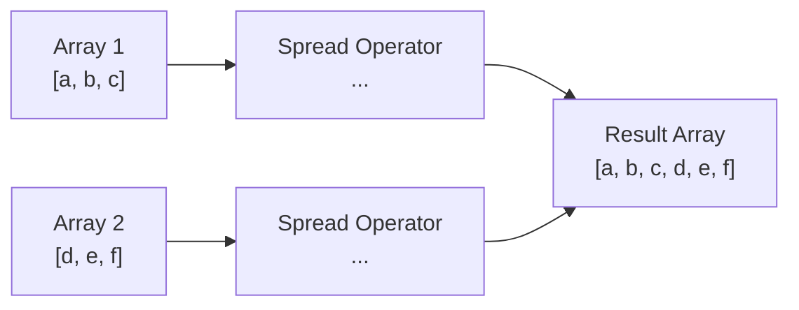

# PHP Array Unpacking

## Introduction

Array unpacking (also known as the spread operator) is a powerful feature in PHP that allows you to expand arrays in place. Introduced in PHP 7.4, this feature makes it easier to merge arrays, pass variable-length arguments to functions, and create copies of arrays with modifications. If you're familiar with JavaScript, this concept works similarly to the spread (`...`) operator.

In this tutorial, we'll explore how array unpacking works in PHP, when to use it, and practical examples to help you apply this concept in your own projects.

## Understanding Array Unpacking Syntax

PHP uses the spread operator (`...`) for array unpacking. When placed before an array, it "unpacks" all the elements of that array, allowing them to be used in various contexts.

### Basic Syntax

```php
$newArray = [...$array1, ...$array2];
```

This syntax tells PHP to take all the elements from `$array1` and `$array2` and place them into `$newArray`.

## Basic Array Unpacking Examples

Let's start with some simple examples to illustrate how array unpacking works:

### Example 1: Merging Arrays

**Input:**
```php
<?php
$fruits = ['apple', 'banana', 'cherry'];
$vegetables = ['carrot', 'broccoli', 'spinach'];

// Using array unpacking to merge arrays
$foods = [...$fruits, ...$vegetables];

print_r($foods);
?>
```

**Output:**
```
Array
(
    [0] => apple
    [1] => banana
    [2] => cherry
    [3] => carrot
    [4] => broccoli
    [5] => spinach
)
```

### Example 2: Adding Elements to an Array

**Input:**
```php
<?php
$numbers = [1, 2, 3];

// Add elements at the beginning
$newNumbers1 = [0, ...$numbers];

// Add elements at the end
$newNumbers2 = [...$numbers, 4];

// Add elements at both ends
$newNumbers3 = [0, ...$numbers, 4];

print_r($newNumbers1);
print_r($newNumbers2);
print_r($newNumbers3);
?>
```

**Output:**
```
Array
(
    [0] => 0
    [1] => 1
    [2] => 2
    [3] => 3
)
Array
(
    [0] => 1
    [1] => 2
    [2] => 3
    [3] => 4
)
Array
(
    [0] => 0
    [1] => 1
    [2] => 2
    [3] => 3
    [4] => 4
)
```

## Comparison with Traditional Methods

Before array unpacking was introduced, PHP developers used functions like `array_merge()` to combine arrays. Let's compare both approaches:

### Using array_merge()

```php
<?php
$fruits = ['apple', 'banana', 'cherry'];
$vegetables = ['carrot', 'broccoli', 'spinach'];

$foods = array_merge($fruits, $vegetables);
print_r($foods);
?>
```

### Using Array Unpacking

```php
<?php
$fruits = ['apple', 'banana', 'cherry'];
$vegetables = ['carrot', 'broccoli', 'spinach'];

$foods = [...$fruits, ...$vegetables];
print_r($foods);
?>
```

Both approaches produce the same result, but array unpacking offers a more concise and readable syntax, especially when working with multiple arrays or when you need to insert elements between arrays.

## How Array Unpacking Handles Keys

It's important to understand how array unpacking handles array keys:

### Numeric Keys

For arrays with numeric keys, unpacking works as expected, but the keys are reindexed (starting from 0):

**Input:**
```php
<?php
$array1 = [10 => 'a', 11 => 'b'];
$array2 = [20 => 'c', 21 => 'd'];

$result = [...$array1, ...$array2];
print_r($result);
?>
```

**Output:**
```
Array
(
    [0] => a
    [1] => b
    [2] => c
    [3] => d
)
```

### String Keys

For associative arrays (with string keys), unpacking preserves the keys, but if there are duplicate keys, the later value overwrites the earlier one:

**Input:**
```php
<?php
$user1 = ['name' => 'John', 'age' => 25];
$user2 = ['name' => 'Jane', 'email' => 'jane@example.com'];

$mergedUser = [...$user1, ...$user2];
print_r($mergedUser);
?>
```

**Output:**
```
Array
(
    [name] => Jane
    [age] => 25
    [email] => jane@example.com
)
```

Notice that `name` from `$user2` overwrote the value from `$user1`.

## Practical Applications

Let's explore some practical use cases for array unpacking:

### 1. Creating Configuration Arrays

Array unpacking is perfect for creating configuration arrays with default values that can be overridden:

```php
<?php
function createConfig($userOptions = []) {
    $defaultOptions = [
        'debug' => false,
        'cache' => true,
        'timeout' => 30,
        'retries' => 3
    ];
    
    // User options override defaults
    return [...$defaultOptions, ...$userOptions];
}

// User only wants to change the timeout
$config = createConfig(['timeout' => 60]);
print_r($config);
?>
```

**Output:**
```
Array
(
    [debug] => false
    [cache] => true
    [timeout] => 60
    [retries] => 3
)
```

### 2. Inserting Elements at Specific Positions

Array unpacking makes it easy to insert elements at specific positions in an array:

```php
<?php
$days = ['Monday', 'Tuesday', 'Thursday', 'Friday'];

// We forgot Wednesday! Let's add it in the correct position
$correctDays = [
    ...(array_slice($days, 0, 2)),
    'Wednesday',
    ...(array_slice($days, 2))
];

print_r($correctDays);
?>
```

**Output:**
```
Array
(
    [0] => Monday
    [1] => Tuesday
    [2] => Wednesday
    [3] => Thursday
    [4] => Friday
)
```

### 3. Using with Variable-Length Arguments

Array unpacking works well with PHP's variable-length arguments (`...` in function parameters):

```php
<?php
function sum(...$numbers) {
    return array_sum($numbers);
}

$values = [1, 2, 3, 4];
$additionalValues = [5, 6];

// Pass all values to the sum function
echo sum(...$values, ...$additionalValues);
?>
```

**Output:**
```
21
```

## Array Unpacking with Other Data Structures

Array unpacking can be combined with other array operations for more complex data manipulation:

### Example: Multi-dimensional Arrays

```php
<?php
$userData = [
    'name' => 'John',
    'age' => 30
];

$userAddress = [
    'address' => [
        'street' => '123 Main St',
        'city' => 'Boston',
        'zip' => '02101'
    ]
];

// Merge user data with nested address information
$completeUserData = [
    ...$userData,
    ...$userAddress
];

print_r($completeUserData);
?>
```

**Output:**
```
Array
(
    [name] => John
    [age] => 30
    [address] => Array
        (
            [street] => 123 Main St
            [city] => Boston
            [zip] => 02101
        )
)
```

## Visual Representation of Array Unpacking

Below is a diagram that shows how array unpacking works when merging arrays:



## Limitations and Considerations

While array unpacking is powerful, there are some things to keep in mind:

1. **PHP Version Requirement**: Array unpacking requires PHP 7.4 or later.

2. **Memory Usage**: Unpacking very large arrays can potentially use more memory since it creates a new array.

3. **Key Collisions**: As shown in the examples, when unpacking associative arrays with the same keys, the later values will overwrite earlier ones.

4. **Performance Considerations**: For very simple merges, the traditional `array_merge()` might be slightly faster, but the difference is negligible in most applications.

## Summary

PHP array unpacking provides a concise and readable way to:

- Merge multiple arrays
- Add elements to the beginning or end of arrays
- Create copies of arrays with modifications
- Override default values in configuration arrays
- Pass arrays as variable-length arguments to functions

The spread operator (`...`) syntax makes these operations more intuitive and can lead to cleaner, more maintainable code, especially when working with complex array manipulations.

## Exercises

To solidify your understanding of array unpacking, try these exercises:

1. Create a function that takes an array of products and adds a new product at a specific position in the array using array unpacking.

2. Write code that merges three associative arrays representing different parts of a user profile (personal info, work info, and preferences).

3. Create a function that takes a to-do list array and moves a specific task to the top of the list using array unpacking.

## Additional Resources

To learn more about PHP array handling, check out these resources:

- [PHP Official Documentation on Arrays](https://www.php.net/manual/en/language.types.array.php)
- [PHP 7.4 Release Notes](https://www.php.net/releases/7_4_0.php) - Details about the introduction of the spread operator
- [PHP Array Functions](https://www.php.net/manual/en/ref.array.php) - Full list of PHP's built-in array functions