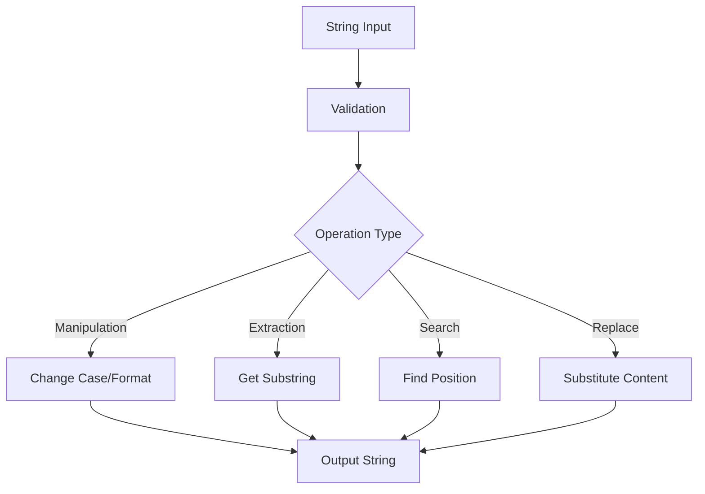

# PHP Strings Basics

## Introduction

Strings are one of the most fundamental data types in any programming language, and PHP is no exception. A string in PHP is a sequence of characters, such as letters, numbers, and symbols. Whether you're displaying text on a webpage, processing user input, or manipulating data, understanding how to work with strings is essential for PHP developers.

In this tutorial, we'll explore the basics of PHP strings, including:
- How to create and define strings
- Different string declaration methods
- Basic string operations and manipulations
- Commonly used string functions

## Creating Strings in PHP

In PHP, you can create strings using several different methods. The most common ways are using single quotes (`'`) or double quotes (`"`).

### Single Quoted Strings

The simplest way to create a string is by enclosing text in single quotes:

```php
<?php
$simple_string = 'This is a simple string in PHP';
echo $simple_string;
?>
```

**Output:**
```
This is a simple string in PHP
```

When using single quotes, the string is taken almost literally. The only escape sequences recognized in single-quoted strings are `\'` (to represent a single quote) and `\\` (to represent a backslash).

```php
<?php
$single_quote_example = 'I\'m learning PHP strings';
echo $single_quote_example;
?>
```

**Output:**
```
I'm learning PHP strings
```

### Double Quoted Strings

Double quotes offer more flexibility as they allow for variable interpolation and escape sequences:

```php
<?php
$name = "John";
$greeting = "Hello, $name!";
echo $greeting;
?>
```

**Output:**
```
Hello, John!
```

Double-quoted strings support several escape sequences to represent special characters:

| Escape Sequence | Meaning         |
|-----------------|-----------------|
| `               |                 |
| `               | New line        |
| `\r`            | Carriage return |
| `\t`            | Tab             |
| `\\`            | Backslash       |
| `\"`            | Double quote    |
| `\$`            | Dollar sign     |

Example with escape sequences:

```php
<?php
$formatted_text = "First line.
Second line.\tTabbed text.";
echo $formatted_text;
?>
```

**Output:**
```
First line.
Second line.	Tabbed text.
```

When displayed in an HTML page, line breaks won't render as expected. To display them properly, you'll need to use the `nl2br()` function or output within a `<pre>` tag.

### Heredoc Syntax

For longer strings or strings that contain both single and double quotes, you can use the heredoc syntax:

```php
<?php
$long_text = <<<EOT
This is a longer string that can span
multiple lines and can contain both 'single'
and "double" quotes without escaping them.
Variables like $name are also interpreted.
EOT;

echo $long_text;
?>
```

### Nowdoc Syntax

Similar to heredoc, nowdoc syntax (introduced in PHP 5.3) allows for creating multi-line strings but does not interpret variables, similar to single quotes:

```php
<?php
$name = "John";
$long_text = <<<'EOT'
This is a longer string where variables like $name
are NOT interpreted. It works like a single-quoted string
but can span multiple lines.
EOT;

echo $long_text;
?>
```

**Output:**
```
This is a longer string where variables like $name
are NOT interpreted. It works like a single-quoted string
but can span multiple lines.
```

## String Length

To find the length of a string, use the `strlen()` function:

```php
<?php
$text = "Hello, PHP!";
$length = strlen($text);
echo "The string '$text' is $length characters long.";
?>
```

**Output:**
```
The string 'Hello, PHP!' is 11 characters long.
```

## Accessing Individual Characters

You can access individual characters in a string by using square brackets `[]` with a zero-based index:

```php
<?php
$string = "PHP";
echo $string[0]; // Outputs: P
echo $string[1]; // Outputs: H
echo $string[2]; // Outputs: P
?>
```

## Concatenating Strings

To join strings together in PHP, you can use the concatenation operator (`.`):

```php
<?php
$first_name = "Jane";
$last_name = "Doe";
$full_name = $first_name . " " . $last_name;
echo $full_name;
?>
```

**Output:**
```
Jane Doe
```

You can also use the concatenation assignment operator (`.=`) to append to an existing string:

```php
<?php
$text = "Hello";
$text .= ", World!";
echo $text;
?>
```

**Output:**
```
Hello, World!
```

## Common String Functions

PHP provides numerous built-in functions for working with strings. Here are some of the most commonly used ones:

### Converting Case

```php
<?php
$string = "Hello World";
echo strtolower($string); // Outputs: hello world
echo strtoupper($string); // Outputs: HELLO WORLD
echo ucfirst("hello world"); // Outputs: Hello world
echo ucwords("hello world"); // Outputs: Hello World
?>
```

### Finding Substrings

The `strpos()` function finds the position of the first occurrence of a substring:

```php
<?php
$text = "The quick brown fox jumps over the lazy dog";
$position = strpos($text, "brown");
echo "The word 'brown' starts at position: $position";
?>
```

**Output:**
```
The word 'brown' starts at position: 10
```

If the substring is not found, `strpos()` returns `false`. Always use the strict comparison operator (`===`) when checking the result:

```php
<?php
$text = "Hello World";
$pos = strpos($text, "PHP");

if ($pos === false) {
    echo "'PHP' not found in the string.";
} else {
    echo "'PHP' found at position $pos.";
}
?>
```

### Extracting Substrings

The `substr()` function extracts a portion of a string:

```php
<?php
$text = "The quick brown fox";
$substring = substr($text, 4, 5); // Start at position 4, extract 5 characters
echo $substring; // Outputs: quick

// Extract from a position to the end
$substring2 = substr($text, 10); // Start at position 10 to the end
echo $substring2; // Outputs: brown fox

// Extract from the end using negative position
$substring3 = substr($text, -3); // Extract last 3 characters
echo $substring3; // Outputs: fox
?>
```

### Replacing Substrings

The `str_replace()` function replaces all occurrences of a substring with another string:

```php
<?php
$text = "The quick brown fox jumps over the lazy dog";
$replaced = str_replace("brown", "red", $text);
echo $replaced;
?>
```

**Output:**
```
The quick red fox jumps over the lazy dog
```

You can also replace multiple substrings at once:

```php
<?php
$text = "The quick brown fox jumps over the lazy dog";
$replaced = str_replace(
    ["quick", "brown", "lazy"], 
    ["slow", "black", "energetic"], 
    $text
);
echo $replaced;
?>
```

**Output:**
```
The slow black fox jumps over the energetic dog
```

## Practical Examples

Let's look at some practical examples of working with strings in PHP:

### Example 1: Creating a URL Slug

A common task in web development is converting a title into a URL-friendly slug:

```php
<?php
function createSlug($string) {
    // Convert to lowercase
    $slug = strtolower($string);
    
    // Replace spaces with hyphens
    $slug = str_replace(' ', '-', $slug);
    
    // Remove special characters
    $slug = preg_replace('/[^a-z0-9-]/', '', $slug);
    
    // Remove multiple hyphens
    $slug = preg_replace('/-+/', '-', $slug);
    
    return $slug;
}

$title = "How to Learn PHP String Manipulation!";
$slug = createSlug($title);
echo "Original: $title<br>";
echo "Slug: $slug";
?>
```

**Output:**
```
Original: How to Learn PHP String Manipulation!
Slug: how-to-learn-php-string-manipulation
```

### Example 2: Truncating Text for Summaries

When displaying article summaries, you often want to limit the text length:

```php
<?php
function truncateText($text, $length = 100, $ending = '...') {
    // If the text is shorter than the max length, return it as is
    if (strlen($text) <= $length) {
        return $text;
    }
    
    // Truncate the text and append the ending
    $truncated = substr($text, 0, $length);
    
    // Make sure we don't cut in the middle of a word
    $lastSpace = strrpos($truncated, ' ');
    if ($lastSpace !== false) {
        $truncated = substr($truncated, 0, $lastSpace);
    }
    
    return $truncated . $ending;
}

$article = "PHP is a widely-used open source general-purpose scripting language that is especially suited for web development and can be embedded into HTML. While PHP originally stood for Personal Home Page, it now stands for the recursive initialism PHP: Hypertext Preprocessor.";

echo truncateText($article, 50);
?>
```

**Output:**
```
PHP is a widely-used open source general-purpose...
```

### Example 3: Formatting Names

Properly formatting user names for display:

```php
<?php
function formatName($firstName, $lastName, $middleInitial = null) {
    $fullName = $firstName;
    
    if (!empty($middleInitial)) {
        $fullName .= ' ' . strtoupper($middleInitial) . '.';
    }
    
    $fullName .= ' ' . $lastName;
    
    return $fullName;
}

echo formatName('john', 'doe', 'a');
echo "<br>";
echo formatName('jane', 'SMITH');
?>
```

**Output:**
```
john A. doe
jane SMITH
```

## String Operations Flow

Here's a visual representation of common string operations:



## Summary

In this tutorial, we've covered the basics of working with strings in PHP:

- Different ways to create strings (single quotes, double quotes, heredoc, nowdoc)
- Finding string length and accessing individual characters
- Concatenating strings
- Converting case (uppercase, lowercase, etc.)
- Finding and replacing substrings
- Extracting portions of strings
- Practical applications of string functions

Strings are fundamental to almost all PHP applications, and mastering their manipulation will help you build more dynamic and user-friendly websites.

## Exercises

To practice what you've learned, try these exercises:

1. Create a function that reverses a string without using PHP's built-in `strrev()` function.
2. Write a function that counts the number of words in a string.
3. Create a password strength checker that verifies if a string contains at least 8 characters, one uppercase letter, one lowercase letter, and one number.
4. Build a function that extracts the domain name from an email address.
5. Write a function that converts a string from camelCase to snake_case (e.g., "helloWorld" to "hello_world").

## Additional Resources

For more information on PHP strings, check out these resources:

- [PHP Manual: String Functions](https://www.php.net/manual/en/ref.strings.php)
- [PHP Manual: String Operators](https://www.php.net/manual/en/language.operators.string.php)
- [PHP Manual: String Type](https://www.php.net/manual/en/language.types.string.php)