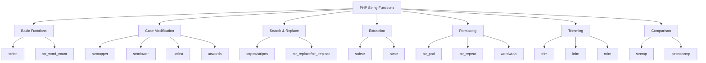

# PHP String Functions

## Introduction

Strings are one of the most common data types you'll work with in PHP. Whether you're building a web form, processing user input, or generating dynamic content, string manipulation is essential. Fortunately, PHP provides a rich set of built-in functions that make working with strings easy and efficient.

In this guide, we'll explore the most commonly used string functions in PHP, with clear examples and practical applications. By the end, you'll be comfortable using these functions to solve real-world programming problems.

## Basic String Functions

### String Length: `strlen()`

The `strlen()` function returns the length of a string (number of characters).

```php
$text = "Hello, World!";
echo strlen($text); // Output: 13
```

### String Word Count: `str_word_count()`

The `str_word_count()` function counts the number of words in a string.

```php
$text = "PHP is fun and easy to learn";
echo str_word_count($text); // Output: 7
```

## Case Modification Functions

### Convert to Uppercase: `strtoupper()`

This function converts all characters in a string to uppercase.

```php
$text = "Hello, World!";
echo strtoupper($text); // Output: HELLO, WORLD!
```

### Convert to Lowercase: `strtolower()`

This function converts all characters in a string to lowercase.

```php
$text = "Hello, World!";
echo strtolower($text); // Output: hello, world!
```

### Capitalize First Character: `ucfirst()`

This function capitalizes the first character of a string.

```php
$text = "hello, world!";
echo ucfirst($text); // Output: Hello, world!
```

### Capitalize Each Word: `ucwords()`

This function capitalizes the first character of each word in a string.

```php
$text = "hello, world!";
echo ucwords($text); // Output: Hello, World!
```

## String Search and Replacement Functions

### Find Position of Text: `strpos()`

The `strpos()` function finds the position of the first occurrence of a substring in a string.

```php
$text = "Hello, World!";
echo strpos($text, "World"); // Output: 7

// Case-sensitive search
echo strpos($text, "world"); // Output: nothing (evaluates to false)
```

### Case-Insensitive Position Search: `stripos()`

Similar to `strpos()`, but case-insensitive.

```php
$text = "Hello, World!";
echo stripos($text, "world"); // Output: 7
```

### Replace Text: `str_replace()`

The `str_replace()` function replaces all occurrences of a search string with a replacement string.

```php
$text = "Hello, World!";
echo str_replace("World", "PHP", $text); // Output: Hello, PHP!

// Replace multiple strings at once
$search = ["Hello", "World"];
$replace = ["Hi", "PHP"];
echo str_replace($search, $replace, $text); // Output: Hi, PHP!
```

### Case-Insensitive Replace: `str_ireplace()`

Similar to `str_replace()`, but case-insensitive.

```php
$text = "Hello, World!";
echo str_ireplace("world", "PHP", $text); // Output: Hello, PHP!
```

## String Extraction Functions

### Substring Extraction: `substr()`

The `substr()` function extracts a part of a string.

```php
$text = "Hello, World!";
echo substr($text, 0, 5); // Output: Hello
echo substr($text, 7); // Output: World!
echo substr($text, -6); // Output: World!
```

### Extract Substring Between Two Strings: `strstr()`

The `strstr()` function returns the part of a string from the first occurrence of a specified string to the end.

```php
$email = "user@example.com";
echo strstr($email, "@"); // Output: @example.com

// Get the part before the @ (with the before parameter)
echo strstr($email, "@", true); // Output: user
```

## String Formatting Functions

### Pad a String: `str_pad()`

The `str_pad()` function pads a string to a specified length with another string.

```php
$text = "Hello";
echo str_pad($text, 10, "-"); // Output: Hello-----
echo str_pad($text, 10, "-", STR_PAD_BOTH); // Output: --Hello---
echo str_pad($text, 10, "-", STR_PAD_LEFT); // Output: -----Hello
```

### Repeat a String: `str_repeat()`

The `str_repeat()` function repeats a string a specified number of times.

```php
$text = "PHP ";
echo str_repeat($text, 3); // Output: PHP PHP PHP 
```

### Wrap Text to a Specific Length: `wordwrap()`

The `wordwrap()` function wraps a string to a specified number of characters.

```php
$text = "This is a very long sentence that needs to be wrapped.";
echo wordwrap($text, 20, "<br>
");
/* Output:
This is a very long<br>
sentence that needs<br>
to be wrapped.
*/
```

## String Trimming Functions

### Remove Whitespace: `trim()`, `ltrim()`, `rtrim()`

These functions remove whitespace (or other characters) from a string.

```php
$text = "  Hello, World!  ";
echo trim($text); // Output: "Hello, World!"
echo ltrim($text); // Output: "Hello, World!  "
echo rtrim($text); // Output: "  Hello, World!"

// Remove specific characters
$text = "###Hello, World!###";
echo trim($text, "#"); // Output: "Hello, World!"
```

## String Comparison Functions

### Compare Strings: `strcmp()` and `strcasecmp()`

These functions compare two strings.

```php
$str1 = "Hello";
$str2 = "hello";

// Case-sensitive comparison
echo strcmp($str1, $str2); // Output: non-zero (strings are not equal)

// Case-insensitive comparison
echo strcasecmp($str1, $str2); // Output: 0 (strings are equal)
```

## Real-World Applications

Let's look at some practical examples where string functions prove useful.

### Example 1: Form Input Validation

```php
function validateUsername($username) {
    // Trim whitespace
    $username = trim($username);
    
    // Check length
    if (strlen($username) < 3 || strlen($username) > 20) {
        return false;
    }
    
    // Check if alphanumeric
    if (!ctype_alnum($username)) {
        return false;
    }
    
    return $username;
}

$input = "  John123  ";
$validUsername = validateUsername($input);

if ($validUsername) {
    echo "Valid username: " . $validUsername;
} else {
    echo "Invalid username!";
}
// Output: Valid username: John123
```

### Example 2: Email Masking for Privacy

```php
function maskEmail($email) {
    $atPosition = strpos($email, '@');
    
    if ($atPosition === false) {
        return "Invalid email";
    }
    
    $domain = substr($email, $atPosition);
    $username = substr($email, 0, $atPosition);
    
    $maskedUsername = substr($username, 0, 2) . str_repeat('*', strlen($username) - 2);
    
    return $maskedUsername . $domain;
}

$email = "john.doe@example.com";
echo maskEmail($email); // Output: jo********@example.com
```

### Example 3: URL Slug Generator

```php
function createSlug($title) {
    // Convert to lowercase
    $slug = strtolower($title);
    
    // Replace spaces with hyphens
    $slug = str_replace(' ', '-', $slug);
    
    // Remove special characters
    $slug = preg_replace('/[^a-z0-9-]/', '', $slug);
    
    // Remove multiple hyphens
    $slug = preg_replace('/-+/', '-', $slug);
    
    return $slug;
}

$articleTitle = "How to Use PHP String Functions!";
echo createSlug($articleTitle); // Output: how-to-use-php-string-functions
```

## String Functions Overview Diagram

Here's a visual overview of the PHP string functions we've covered:



## Summary

PHP offers a comprehensive set of string functions that make text manipulation straightforward and efficient. We've covered the most important functions for:

- Getting string information (length, word count)
- Changing case (upper, lower, capitalize)
- Searching and replacing content
- Extracting portions of text
- Formatting text for display
- Removing unwanted characters
- Comparing strings

These functions form the foundation of text processing in PHP and are essential tools for any PHP developer.

## Exercises

To strengthen your understanding of PHP string functions, try these exercises:

1. Create a function that capitalizes the first letter of each sentence in a paragraph.
2. Build a simple password strength checker that evaluates length and character variety.
3. Write a function that extracts all hashtags from a social media post.
4. Create a text summarizer that returns the first 100 characters of a text followed by "..." if the text is longer.
5. Build a function that converts "snake_case" to "camelCase" and vice versa.

## Additional Resources

- [PHP Manual: String Functions](https://www.php.net/manual/en/ref.strings.php)
- [PHP Manual: Multibyte String Functions](https://www.php.net/manual/en/ref.mbstring.php) (for handling UTF-8 and international character sets)
- [PHP Manual: Regular Expressions](https://www.php.net/manual/en/book.pcre.php) (for advanced string manipulation)