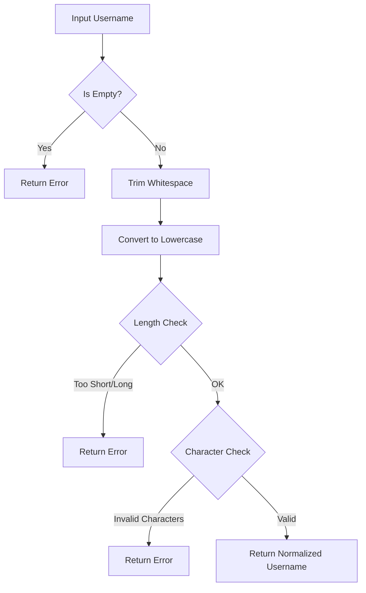

# PHP String Manipulation

## Introduction

String manipulation is one of the most common tasks in web development. Whether you're processing user input, formatting output, or working with data from databases, knowing how to effectively manipulate strings in PHP is essential. This guide will walk you through the fundamental string manipulation techniques in PHP, from basic operations to more advanced functions.

In PHP, a string is a sequence of characters that can include letters, numbers, symbols, and whitespace. PHP provides a rich set of functions specifically designed for working with strings, making it a powerful language for text processing.

## Basic String Operations

### Concatenation

Concatenation is the process of joining two or more strings together. In PHP, you can concatenate strings using the dot (`.`) operator:

```php
<?php
$firstName = "John";
$lastName = "Doe";
$fullName = $firstName . " " . $lastName;

echo $fullName; // Output: John Doe
?>
```

You can also use the concatenation assignment operator (`.=`) to append to an existing string:

```php
<?php
$greeting = "Hello";
$greeting .= ", World!";

echo $greeting; // Output: Hello, World!
?>
```

### String Length

To determine the length of a string (the number of characters), use the `strlen()` function:

```php
<?php
$text = "PHP is fun";
$length = strlen($text);

echo "The string length is: " . $length; // Output: The string length is: 10
?>
```

### Accessing Characters

You can access individual characters in a string using square brackets with the zero-based index:

```php
<?php
$string = "Hello";
echo $string[0]; // Output: H
echo $string[1]; // Output: e
?>
```

## String Search Functions

### Finding Text

PHP provides several functions to search for text within strings:

#### strpos() - Find the position of the first occurrence

```php
<?php
$sentence = "The quick brown fox jumps over the lazy dog";
$position = strpos($sentence, "fox");

echo "Position of 'fox': " . $position; // Output: Position of 'fox': 16
?>
```

If the substring is not found, `strpos()` returns `false`.

#### strrpos() - Find the position of the last occurrence

```php
<?php
$text = "The cat sat on the mat";
$lastPosition = strrpos($text, "the");

echo "Last position of 'the': " . $lastPosition; // Output: Last position of 'the': 15
?>
```

#### stripos() and strripos() - Case-insensitive search

```php
<?php
$sentence = "The quick brown FOX jumps over the lazy dog";
$position = stripos($sentence, "fox"); // Case-insensitive search

echo "Position of 'fox': " . $position; // Output: Position of 'fox': 16
?>
```

### Checking if a String Contains Another String

To check if a string contains a specific substring, you can use `strpos()` with an additional check:

```php
<?php
$haystack = "Programming in PHP is amazing";
$needle = "PHP";

if (strpos($haystack, $needle) !== false) {
    echo "The string contains '$needle'";
} else {
    echo "The string does not contain '$needle'";
}
// Output: The string contains 'PHP'
?>
```

Since PHP 8.0, you can also use the `str_contains()` function:

```php
<?php
$haystack = "Programming in PHP is amazing";
$needle = "PHP";

if (str_contains($haystack, $needle)) {
    echo "The string contains '$needle'";
} else {
    echo "The string does not contain '$needle'";
}
// Output: The string contains 'PHP'
?>
```

## String Modification Functions

### Replacing Text

#### str_replace() - Replace all occurrences

```php
<?php
$text = "I like apples, apples are my favorite fruit";
$newText = str_replace("apples", "oranges", $text);

echo $newText; // Output: I like oranges, oranges are my favorite fruit
?>
```

You can also replace multiple strings at once:

```php
<?php
$text = "Red, Green, Blue";
$colors = array("Red", "Green", "Blue");
$fruits = array("Apple", "Lime", "Blueberry");
$newText = str_replace($colors, $fruits, $text);

echo $newText; // Output: Apple, Lime, Blueberry
?>
```

#### str_ireplace() - Case-insensitive replacement

```php
<?php
$text = "The APPLE doesn't fall far from the Apple tree";
$newText = str_ireplace("apple", "orange", $text);

echo $newText; // Output: The orange doesn't fall far from the orange tree
?>
```

### Trimming Whitespace

#### trim() - Remove whitespace from both ends

```php
<?php
$text = "  Hello World!  ";
$trimmed = trim($text);

echo "Original: '" . $text . "'";    // Output: Original: '  Hello World!  '
echo "Trimmed: '" . $trimmed . "'";  // Output: Trimmed: 'Hello World!'
?>
```

#### ltrim() and rtrim() - Remove whitespace from left or right only

```php
<?php
$text = "  Hello World!  ";
$leftTrimmed = ltrim($text);
$rightTrimmed = rtrim($text);

echo "Left Trimmed: '" . $leftTrimmed . "'";   // Output: Left Trimmed: 'Hello World!  '
echo "Right Trimmed: '" . $rightTrimmed . "'"; // Output: Right Trimmed: '  Hello World!'
?>
```

### Changing Case

PHP provides several functions to change the case of strings:

```php
<?php
$string = "Hello World";

echo strtolower($string);  // Output: hello world
echo strtoupper($string);  // Output: HELLO WORLD
echo ucfirst($string);     // Output: Hello World (first letter uppercase)
echo lcfirst($string);     // Output: hello World (first letter lowercase)
echo ucwords($string);     // Output: Hello World (first letter of each word uppercase)
?>
```

## String Formatting

### Formatting Numbers and Decimal Places

```php
<?php
$number = 1234.56789;

// Format as currency
$formatted = number_format($number, 2);
echo $formatted; // Output: 1,234.57

// Custom formatting with different separators
$formatted = number_format($number, 2, ',', '.');
echo $formatted; // Output: 1.234,57
?>
```

### Padding Strings

#### str_pad() - Pad a string to a certain length

```php
<?php
$productId = "42";
$paddedId = str_pad($productId, 5, "0", STR_PAD_LEFT);

echo $paddedId; // Output: 00042
?>
```

### Formatting with printf() and sprintf()

The `printf()` function outputs a formatted string, while `sprintf()` returns the formatted string:

```php
<?php
$name = "Alice";
$age = 25;

// Using printf()
printf("Name: %s, Age: %d", $name, $age);
// Output: Name: Alice, Age: 25

// Using sprintf()
$formatted = sprintf("Name: %s, Age: %d", $name, $age);
echo $formatted;
// Output: Name: Alice, Age: 25
?>
```

Common format specifiers:
- `%s` - String
- `%d` - Integer
- `%f` - Float
- `%.2f` - Float with 2 decimal places
- `%b` - Binary number

## Substring Functions

### Extract a Portion of a String

#### substr() - Extract a portion of a string

```php
<?php
$email = "user@example.com";
$domain = substr($email, strpos($email, '@') + 1);

echo "Domain: " . $domain; // Output: Domain: example.com

// Get first 4 characters
$str = "Hello World";
echo substr($str, 0, 4); // Output: Hell

// Get last 5 characters
echo substr($str, -5); // Output: World
?>
```

## Practical Examples

### Example 1: Form Input Validation and Sanitization

```php
<?php
// Simulated form data
$userInput = "   John.Doe@Example.COM  ";

// Clean and standardize email address
$email = strtolower(trim($userInput));

echo "Original input: '" . $userInput . "'";
echo "Processed email: '" . $email . "'";
// Output: 
// Original input: '   John.Doe@Example.COM  '
// Processed email: 'john.doe@example.com'

// Validate email format
if (filter_var($email, FILTER_VALIDATE_EMAIL)) {
    echo "Valid email address";
} else {
    echo "Invalid email address";
}
// Output: Valid email address
?>
```

### Example 2: Creating URL Slugs

```php
<?php
function createSlug($string) {
    // Replace non-alphanumeric characters with hyphens
    $string = preg_replace('/[^a-zA-Z0-9]/', '-', $string);
    // Remove multiple hyphens
    $string = preg_replace('/-+/', '-', $string);
    // Convert to lowercase
    $string = strtolower($string);
    // Trim hyphens from beginning and end
    $string = trim($string, '-');
    
    return $string;
}

$articleTitle = "How to Master PHP String Functions: A Beginner's Guide!";
$slug = createSlug($articleTitle);

echo "Original title: " . $articleTitle;
echo "Generated slug: " . $slug;
// Output:
// Original title: How to Master PHP String Functions: A Beginner's Guide!
// Generated slug: how-to-master-php-string-functions-a-beginner-s-guide
?>
```

### Example 3: Extracting Information from a String

```php
<?php
// Extract username and domain from an email address
function parseEmail($email) {
    $parts = explode('@', $email);
    if (count($parts) === 2) {
        return [
            'username' => $parts[0],
            'domain' => $parts[1]
        ];
    }
    return false;
}

$email = "user.name@example.com";
$emailParts = parseEmail($email);

if ($emailParts) {
    echo "Username: " . $emailParts['username'];
    echo "Domain: " . $emailParts['domain'];
}
// Output:
// Username: user.name
// Domain: example.com
?>
```

## String Exploding and Imploding

### explode() - Split a string into an array

```php
<?php
$csv = "apple,banana,orange,grape";
$fruits = explode(",", $csv);

echo "First fruit: " . $fruits[0]; // Output: First fruit: apple
echo "Second fruit: " . $fruits[1]; // Output: Second fruit: banana
?>
```

### implode() or join() - Join array elements into a string

```php
<?php
$fruits = ["apple", "banana", "orange", "grape"];
$csv = implode(",", $fruits);

echo $csv; // Output: apple,banana,orange,grape
?>
```

## Common String Processing Workflows

Let's look at a flowchart for a common string processing workflow - validating and normalizing a username:



## Regular Expressions for Advanced String Manipulation

PHP provides powerful regular expression functions for more complex string manipulation:

```php
<?php
// Extract all email addresses from a text
$text = "Contact us at support@example.com or sales@example.com for assistance.";
preg_match_all('/[\w.+-]+@[\w-]+\.[\w.-]+/', $text, $matches);

print_r($matches[0]);
// Output:
// Array
// (
//     [0] => support@example.com
//     [1] => sales@example.com
// )
?>
```

## Summary

In this guide, we've covered the fundamental techniques for manipulating strings in PHP:

- Basic operations like concatenation and finding string length
- Searching for text within strings
- Modifying strings with replacement, case changes, and trimming
- Extracting portions of strings
- Formatting strings for display
- Splitting and joining strings
- Using regular expressions for more complex operations

PHP's extensive library of string functions makes it a powerful tool for text processing in web applications. By mastering these techniques, you'll be able to handle almost any string manipulation task in your PHP projects.

## Additional Resources and Exercises

### Resources
- [PHP Manual: String Functions](https://www.php.net/manual/en/ref.strings.php)
- [PHP Manual: Regular Expressions](https://www.php.net/manual/en/book.pcre.php)

### Exercises

1. **Name Formatter**: Write a function that takes a full name (e.g., "john michael smith") and formats it with proper capitalization (e.g., "John Michael Smith").

2. **Password Validator**: Create a function that checks if a password meets specific criteria (minimum length, contains uppercase, lowercase, numbers, and special characters).

3. **Text Truncator**: Implement a function that truncates a text to a specified length without cutting words in half, and adds an ellipsis (...) at the end.

4. **CSV Parser**: Build a function that parses a CSV string into an associative array, handling quoted values correctly.

5. **URL Parser**: Create a function that extracts the different components of a URL (protocol, domain, path, query parameters).