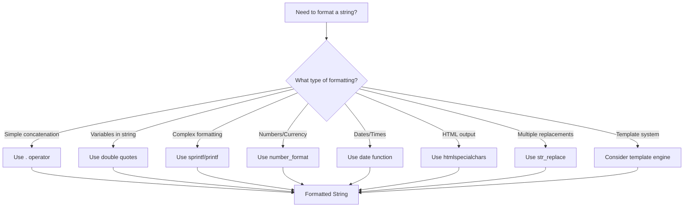

# PHP String Formatting

## Introduction

String formatting is a fundamental skill for any PHP developer. It allows you to dynamically create text by combining static text with variables, applying specific formats, and controlling how values are displayed. Whether you're building a web application, processing data, or generating reports, understanding the various methods of string formatting in PHP will make your code more efficient and readable.

In this tutorial, we'll explore different techniques for formatting strings in PHP, from basic concatenation to more advanced methods like `printf()` and `sprintf()`. By the end, you'll have a comprehensive toolkit for manipulating strings in your PHP applications.

## Basic String Formatting Methods

### String Concatenation

The simplest way to format strings in PHP is by using the concatenation operator (`.`). This operator combines two or more strings into a single string.

```php
$firstName = "John";
$lastName = "Doe";
$fullName = $firstName . " " . $lastName;

echo $fullName; // Output: John Doe
```

You can also use the concatenation assignment operator (`.=`) to append a string to an existing variable:

```php
$greeting = "Hello, ";
$greeting .= "world!";

echo $greeting; // Output: Hello, world!
```

### String Interpolation

PHP allows you to include variables directly within double-quoted strings, a technique known as string interpolation or variable parsing.

```php
$name = "Lisa";
$age = 25;

// Using interpolation
echo "My name is $name and I am $age years old.";
// Output: My name is Lisa and I am 25 years old.

// For comparison, this is how you would do it with concatenation
echo "My name is " . $name . " and I am " . $age . " years old.";
// Output: My name is Lisa and I am 25 years old.
```

When using more complex expressions or object properties, you need to use curly braces `{}`:

```php
$fruits = ["apple", "banana", "orange"];

echo "I like {$fruits[1]}.";
// Output: I like banana.

$user = new stdClass();
$user->name = "Michael";

echo "Welcome, {$user->name}!";
// Output: Welcome, Michael!
```

### Heredoc and Nowdoc Syntax

For multiline strings with variable interpolation, you can use heredoc syntax:

```php
$title = "PHP String Formatting";
$author = "Web Developer";

$content = <<<EOT
<article>
    <h1>$title</h1>
    <p>Written by: $author</p>
    <p>This is a comprehensive guide to formatting strings in PHP.</p>
</article>
EOT;

echo $content;
// Output:
// <article>
//     <h1>PHP String Formatting</h1>
//     <p>Written by: Web Developer</p>
//     <p>This is a comprehensive guide to formatting strings in PHP.</p>
// </article>
```

If you want to create a multiline string without variable interpolation (similar to single quotes), you can use nowdoc syntax:

```php
$code = <<<'EOT'
function greet($name) {
    return "Hello, $name!";
}
EOT;

echo $code;
// Output:
// function greet($name) {
//     return "Hello, $name!";
// }
```

## Advanced String Formatting with printf Family

PHP provides a set of functions that offer more control over string formatting, inspired by the C programming language's printf functions.

### printf()

The `printf()` function outputs a formatted string based on a format string and variables.

```php
$name = "Alice";
$score = 95.75;

printf("Student: %s, Score: %.1f%%", $name, $score);
// Output: Student: Alice, Score: 95.8%
```

In this example:
- `%s` is a placeholder for a string value (`$name`)
- `%.1f` formats the number (`$score`) with 1 decimal place
- `%%` outputs a literal percent sign

### sprintf()

The `sprintf()` function works like `printf()`, but instead of printing the result, it returns the formatted string.

```php
$product = "Laptop";
$price = 899.99;
$discount = 15;

$message = sprintf(
    "The %s is now on sale: $%.2f (%.0f%% off)!",
    $product, $price, $discount
);

echo $message;
// Output: The Laptop is now on sale: $899.99 (15% off)!
```

### Common Format Specifiers

Here are the most commonly used format specifiers in printf/sprintf:

| Specifier | Description | Example |
|-----------|-------------|---------|
| `%s` | String | `%s` → "Hello" |
| `%d` | Integer | `%d` → 42 |
| `%f` | Float/Double | `%f` → 3.141593 |
| `%.2f` | Float with precision | `%.2f` → 3.14 |
| `%x` | Hexadecimal (lowercase) | `%x` → 2a |
| `%X` | Hexadecimal (uppercase) | `%X` → 2A |
| `%%` | Literal percent sign | `%%` → % |

### Formatting with Field Width and Padding

You can control the alignment and padding of values:

```php
// Right-align numbers in a 10-character field (padded with spaces)
printf("Price: %10.2f EUR
", 59.99);
// Output: Price:      59.99 EUR

// Left-align text in a 15-character field
printf("Product: %-15s Category: %s
", "Smartphone", "Electronics");
// Output: Product: Smartphone      Category: Electronics

// Zero-padding for numeric values
printf("ID: %05d
", 42);
// Output: ID: 00042
```

### vsprintf() and vprintf()

These functions work like `sprintf()` and `printf()`, but they accept an array of values instead of individual arguments:

```php
$data = ["Computer", 1299.99, 20];

$formatted = vsprintf("Product: %s, Price: $%.2f, Stock: %d", $data);
echo $formatted;
// Output: Product: Computer, Price: $1299.99, Stock: 20
```

## Number Formatting

### number_format()

For formatting numbers, especially monetary values, PHP provides the `number_format()` function:

```php
// Format with thousands separator
echo number_format(1234567.89);
// Output: 1,234,568

// Format with specific number of decimals
echo number_format(1234567.89, 2);
// Output: 1,234,567.89

// Format with custom separators
echo number_format(1234567.89, 2, ',', ' ');
// Output: 1 234 567,89
```

## Date and Time Formatting

The `date()` function allows you to format dates and timestamps:

```php
// Format current date and time
echo date("Y-m-d H:i:s");
// Output: 2023-06-15 14:30:45

// Format specific timestamp
$timestamp = strtotime("2023-01-15 10:30:00");
echo date("F j, Y, g:i a", $timestamp);
// Output: January 15, 2023, 10:30 am
```

## HTML Formatting

When displaying strings in HTML, you should use proper escaping to prevent security issues:

```php
$userInput = "<script>alert('XSS attack');</script>";

// Safely output in HTML context
echo htmlspecialchars($userInput);
// Output: &lt;script&gt;alert('XSS attack');&lt;/script&gt;
```

For formatting text with HTML formatting:

```php
$text = "This is a paragraph with some **bold** and *italic* text.";

// Convert to HTML (simple example)
$html = str_replace(
    ["**", "*"],
    ["<strong>", "<em>"],
    $text
);

echo $html;
// Output: This is a paragraph with some <strong>bold</strong> and <em>italic</em> text.
```

## String Template Systems

For more complex formatting needs, you might want to use template systems:

```php
// Simple template system
$template = "Hello, {name}! Your balance is {balance}.";
$data = [
    "{name}" => "Sarah",
    "{balance}" => "$145.50"
];

echo str_replace(array_keys($data), array_values($data), $template);
// Output: Hello, Sarah! Your balance is $145.50.
```

## Real-World Examples

### Example 1: Generating a product display

```php
function formatProductCard($product) {
    return sprintf(
        '<div class="product">
            <h3>%s</h3>
            <p class="price">$%.2f</p>
            <p class="stock">%s</p>
            <p class="rating">Rating: %.1f/5.0</p>
        </div>',
        htmlspecialchars($product['name']),
        $product['price'],
        $product['stock'] > 0 ? 'In Stock' : 'Out of Stock',
        $product['rating']
    );
}

$product = [
    'name' => 'Wireless Headphones',
    'price' => 79.99,
    'stock' => 15,
    'rating' => 4.7
];

echo formatProductCard($product);
```

### Example 2: Formatting a CSV file line

```php
function formatCsvLine($data) {
    $formattedFields = [];
    
    foreach ($data as $field) {
        // Escape quotes and enclose in quotes if needed
        if (is_string($field) && (strpos($field, ',') !== false || 
                                 strpos($field, '"') !== false || 
                                 strpos($field, "
") !== false)) {
            $field = '"' . str_replace('"', '""', $field) . '"';
        }
        $formattedFields[] = $field;
    }
    
    return implode(',', $formattedFields);
}

$orderData = [
    'ORD-1234',
    'John Smith',
    'Product with, comma',
    89.99,
    '2023-06-15'
];

echo formatCsvLine($orderData);
// Output: ORD-1234,John Smith,"Product with, comma",89.99,2023-06-15
```

### Example 3: Creating a URL with query parameters

```php
function buildUrl($baseUrl, $params) {
    $queryString = http_build_query($params);
    return $baseUrl . '?' . $queryString;
}

$searchParams = [
    'q' => 'php string formatting',
    'category' => 'tutorials',
    'page' => 1,
    'filters' => ['language' => 'php', 'level' => 'beginner']
];

echo buildUrl('https://example.com/search', $searchParams);
// Output: https://example.com/search?q=php+string+formatting&category=tutorials&page=1&filters%5Blanguage%5D=php&filters%5Blevel%5D=beginner
```

## String Formatting Flowchart

Here's a flowchart to help you decide which string formatting method to use:



## Summary

PHP provides multiple ways to format strings, each with its own advantages:

- **Basic methods**: String concatenation (`.`) and interpolation (using variables inside double quotes) are simple and effective for basic needs.
- **Heredoc/Nowdoc**: Great for multiline strings and maintaining formatting.
- **printf family**: Offers precise control over output formatting, especially for numbers and alignment.
- **Specialized functions**: `number_format()` for numbers, `date()` for dates and times, and `htmlspecialchars()` for safe HTML output.

As you develop your PHP applications, you'll find yourself using different methods depending on the context and requirements. The key is to choose the most readable and maintainable approach for each situation.

## Exercises

1. Create a function that formats a phone number from "1234567890" to "(123) 456-7890".
2. Write a script that generates an invoice table with product names, quantities, unit prices, and total prices, all properly formatted.
3. Create a function that turns an associative array of user data into a formatted profile string.
4. Write a function that formats a file size in bytes to a human-readable format (KB, MB, GB).
5. Format the current date in three different localized formats using PHP's date formatting functions.

## Additional Resources

- [PHP Manual: String Functions](https://www.php.net/manual/en/ref.strings.php)
- [PHP Manual: printf](https://www.php.net/manual/en/function.printf.php)
- [PHP Manual: number_format](https://www.php.net/manual/en/function.number-format.php)
- [PHP Manual: date](https://www.php.net/manual/en/function.date.php)
- [PHP Manual: Heredoc Syntax](https://www.php.net/manual/en/language.types.string.php#language.types.string.syntax.heredoc)