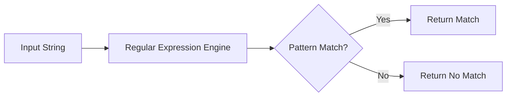

# PHP Regular Expressions

## Introduction

Regular expressions (regex) are powerful tools for pattern matching and text manipulation. In PHP, regular expressions allow you to search, extract, and modify strings based on complex patterns. Whether you need to validate email addresses, parse data, or find specific text patterns, regular expressions provide a concise and flexible solution.

This guide will walk you through PHP's regular expression functionality, starting with the basics and progressing to more advanced techniques.

## What are Regular Expressions?

Regular expressions are special text strings used to describe search patterns. Think of them as a mini-language for defining patterns within text. PHP implements regular expressions through the PCRE (Perl Compatible Regular Expressions) library, giving you access to powerful pattern matching capabilities.



## Basic PHP Regex Functions

PHP offers several functions for working with regular expressions:

| Function | Purpose |
|----------|---------|
| `preg_match()` | Checks if a pattern matches a string and returns 1 if it does |
| `preg_match_all()` | Finds all matches of a pattern in a string |
| `preg_replace()` | Replaces text that matches the pattern |
| `preg_split()` | Splits a string using a pattern as a delimiter |
| `preg_grep()` | Returns array elements that match the pattern |

## Creating Your First Regex Pattern

In PHP, regular expression patterns are enclosed between delimiters, commonly forward slashes (`/`). Let's start with a simple example:

```php
<?php
// Check if a string contains the word "PHP"
$string = "Learn PHP programming";
$pattern = "/PHP/";

if (preg_match($pattern, $string)) {
    echo "Pattern found!";
} else {
    echo "Pattern not found!";
}
// Output: Pattern found!
?>
```

In this example:
- `/PHP/` is our regular expression pattern
- The pattern searches for the exact text "PHP"
- `preg_match()` returns `1` (true) because "PHP" exists in our string

## Basic Pattern Matching

### Matching Exact Text

The simplest form of a regular expression is matching exact text:

```php
<?php
$text = "The quick brown fox jumps over the lazy dog";
$pattern = "/quick/";
preg_match($pattern, $text, $matches);
print_r($matches);
// Output: Array ( [0] => quick )
?>
```

### Character Classes

Character classes let you match any one character from a set:

```php
<?php
$text = "The year is 2023";
$pattern = "/[0-9]/"; // Matches any single digit
preg_match_all($pattern, $text, $matches);
print_r($matches[0]);
// Output: Array ( [0] => 2 [1] => 0 [2] => 2 [3] => 3 )
?>
```

Common character classes include:
- `[0-9]` or `\d`: Any digit
- `[a-z]`: Any lowercase letter
- `[A-Z]`: Any uppercase letter
- `[a-zA-Z]`: Any letter
- `[a-zA-Z0-9]` or `\w`: Any alphanumeric character or underscore
- `\s`: Any whitespace character (space, tab, newline)

### Quantifiers

Quantifiers specify how many times an element should occur:

```php
<?php
$text = "PHP PHP PHP";
$pattern = "/PHP+/"; // Match "PHP" one or more times
preg_match_all($pattern, $text, $matches);
print_r($matches[0]);
// Output: Array ( [0] => PHP [1] => PHP [2] => PHP )
?>
```

Common quantifiers:
- `*`: Zero or more times
- `+`: One or more times
- `?`: Zero or one time
- `{n}`: Exactly n times
- `{n,}`: At least n times
- `{n,m}`: Between n and m times

## Anchors and Boundaries

Anchors help you match patterns at specific positions in the text:

```php
<?php
$text = "PHP is great";
$pattern1 = "/^PHP/"; // Matches "PHP" at the beginning of the string
$pattern2 = "/great$/"; // Matches "great" at the end of the string

echo preg_match($pattern1, $text) ? "Pattern 1 matched
" : "Pattern 1 not matched
";
echo preg_match($pattern2, $text) ? "Pattern 2 matched
" : "Pattern 2 not matched
";
// Output:
// Pattern 1 matched
// Pattern 2 matched
?>
```

Common anchors and boundaries:
- `^`: Beginning of line
- `$`: End of line
- `\b`: Word boundary
- `\B`: Not a word boundary

## Practical Example: Email Validation

Let's create a simple email validator using regular expressions:

```php
<?php
function validateEmail($email) {
    $pattern = "/^[a-zA-Z0-9._%+-]+@[a-zA-Z0-9.-]+\.[a-zA-Z]{2,}$/";
    return preg_match($pattern, $email) === 1;
}

$emails = [
    "user@example.com",
    "invalid-email",
    "user.name@company.co.uk",
    "user@.com"
];

foreach ($emails as $email) {
    echo "$email: " . (validateEmail($email) ? "Valid" : "Invalid") . "
";
}

// Output:
// user@example.com: Valid
// invalid-email: Invalid
// user.name@company.co.uk: Valid
// user@.com: Invalid
?>
```

Let's break down this email pattern:
- `^[a-zA-Z0-9._%+-]+`: Username can contain letters, numbers, and certain special characters
- `@`: The @ symbol
- `[a-zA-Z0-9.-]+`: Domain name can contain letters, numbers, dots, and hyphens
- `\.`: A literal dot (escaped with a backslash)
- `[a-zA-Z]{2,}$`: Top-level domain must be at least 2 letters

## Finding and Replacing Text

The `preg_replace()` function allows you to replace text that matches a pattern:

```php
<?php
$text = "Contact us at info@example.com or support@example.com";
$pattern = "/([a-zA-Z0-9._%+-]+@[a-zA-Z0-9.-]+\.[a-zA-Z]{2,})/";
$replacement = "<a href=\"mailto:$1\">$1</a>";
$result = preg_replace($pattern, $replacement, $text);

echo $result;
// Output: Contact us at <a href="mailto:info@example.com">info@example.com</a> or <a href="mailto:support@example.com">support@example.com</a>
?>
```

In this example, we're finding email addresses and wrapping them in HTML anchor tags for easy clicking.

## Capturing Groups

Parentheses `()` create capturing groups that allow you to extract specific parts of the matched pattern:

```php
<?php
$date = "2023-04-15";
$pattern = "/(\d{4})-(\d{2})-(\d{2})/";
preg_match($pattern, $date, $matches);

print_r($matches);
// Output:
// Array (
//     [0] => 2023-04-15
//     [1] => 2023
//     [2] => 04
//     [3] => 15
// )

echo "Year: {$matches[1]}, Month: {$matches[2]}, Day: {$matches[3]}";
// Output: Year: 2023, Month: 04, Day: 15
?>
```

In this example:
- The entire match is stored in `$matches[0]`
- The first group (year) is in `$matches[1]`
- The second group (month) is in `$matches[2]`
- The third group (day) is in `$matches[3]`

## Named Capturing Groups

For better readability, you can name your capturing groups:

```php
<?php
$date = "2023-04-15";
$pattern = "/(?<year>\d{4})-(?<month>\d{2})-(?<day>\d{2})/";
preg_match($pattern, $date, $matches);

print_r($matches);
// Output includes named keys:
// Array (
//     [0] => 2023-04-15
//     [year] => 2023
//     [1] => 2023
//     [month] => 04
//     [2] => 04
//     [day] => 15
//     [3] => 15
// )

echo "Year: {$matches['year']}, Month: {$matches['month']}, Day: {$matches['day']}";
// Output: Year: 2023, Month: 04, Day: 15
?>
```

## Pattern Modifiers

PHP regular expressions support modifiers that change how the pattern is interpreted:

```php
<?php
$text = "PHP is a programming language.
php is used for web development.";

// Case-insensitive search
$pattern = "/php/i";
preg_match_all($pattern, $text, $matches);
print_r($matches[0]);
// Output: Array ( [0] => PHP [1] => php )

// Multi-line search
$text = "First line
Second line
Third line";
$pattern = "/^Second/m"; // ^ normally matches start of string, but with m modifier, it matches start of line
preg_match($pattern, $text, $matches);
print_r($matches);
// Output: Array ( [0] => Second )
?>
```

Common modifiers:
- `i`: Case-insensitive
- `m`: Multi-line mode (^ and $ match beginning/end of each line)
- `s`: Dot matches all (including newlines)
- `x`: Extended mode (allows comments and whitespace in the pattern)
- `u`: Unicode mode

## Real-World Example: Parsing HTML

Here's how you might extract all images from an HTML string:

```php
<?php
$html = '<div class="content">
    
    <p>Some text</p>
    
</div>';

$pattern = '/]*src=["\']([^"\']*)["\'][^>]*>/i';
preg_match_all($pattern, $html, $matches);

print_r($matches[1]); // This will contain all image sources
// Output: Array ( [0] => image1.jpg [1] => image2.jpg )
?>
```

Note: While regex can parse HTML in simple cases, it's generally better to use a DOM parser for complex HTML.

## Common Regex Patterns for PHP

Here are some useful patterns for common PHP tasks:

### URL Validation
```php
$pattern = '/^(https?:\/\/)?([\da-z\.-]+)\.([a-z\.]{2,6})([\/\w \.-]*)*\/?$/';
```

### Strong Password Validation
```php
$pattern = '/^(?=.*[a-z])(?=.*[A-Z])(?=.*\d)(?=.*[@$!%*?&])[A-Za-z\d@$!%*?&]{8,}$/';
```

### Date Validation (YYYY-MM-DD)
```php
$pattern = '/^([0-9]{4})-([0-1][0-9])-([0-3][0-9])$/';
```

## Performance Considerations

Regular expressions are powerful but can become complex and impact performance. Here are some tips:

1. Be specific: The more specific your pattern, the faster it will run
2. Avoid excessive backtracking with careful use of quantifiers
3. Use alternative functions when appropriate (e.g., `strpos()` for simple string searches)
4. Test performance-critical regex on large datasets

## Summary

Regular expressions in PHP provide a powerful way to handle string manipulations and pattern matching. They can seem intimidating at first, but with practice, they become an essential tool for tasks like:

- Form validation
- Data extraction
- Search and replace operations
- Text parsing and formatting

Remember that while regular expressions are powerful, they aren't always the best solution. For simple string operations, PHP's built-in string functions are often more efficient and readable.

## Practice Exercises

1. Create a regex pattern to validate a phone number in the format (XXX) XXX-XXXX
2. Write a PHP function that extracts all URLs from a given text
3. Create a function that censors profanity in a string by replacing certain words with asterisks
4. Write a pattern to validate usernames (alphanumeric, 3-16 characters, may include underscore)
5. Create a function to extract hashtags from a social media post

## Additional Resources

- [PHP.net Official Documentation on PCRE](https://www.php.net/manual/en/book.pcre.php)
- [Regular Expressions 101](https://regex101.com/) - An online tool for testing regex with PHP flavor
- [RegexOne](https://regexone.com/) - Interactive regex tutorial
- [PHP The Right Way: Regular Expressions](https://phptherightway.com/)

Happy coding with PHP regular expressions!