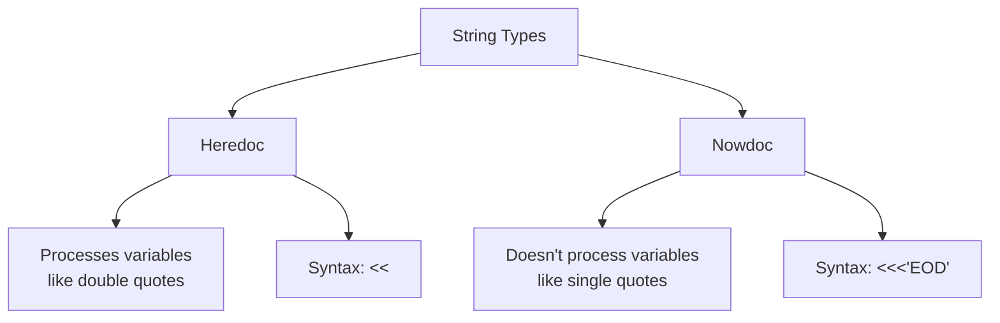

# PHP Heredoc Syntax

## Introduction

When working with strings in PHP, you'll often need to create multi-line text blocks or include quotes within your strings. While you could use standard string notation with concatenation and escape characters, PHP offers a more elegant solution: **Heredoc syntax**.

Heredoc provides a clean way to create multi-line strings without the need to escape quotes or worry about line breaks. It's especially useful when working with HTML, SQL queries, or any text that spans multiple lines and contains quotes.

## What is Heredoc Syntax?

Heredoc is a way to define strings that preserves all formatting and doesn't require escaping of quotes. It starts with `<<<` followed by an identifier, then the string content, and ends with the same identifier.

### Basic Heredoc Syntax

```php
<?php
$string = <<<EOD
This is a multi-line string
that preserves all formatting
and doesn't require escaping "quotes"
or 'single quotes'.
EOD;

echo $string;
?>
```

**Output:**
```
This is a multi-line string
that preserves all formatting
and doesn't require escaping "quotes"
or 'single quotes'.
```

Let's break down the syntax:

1. `<<<EOD`: Starts the Heredoc with an identifier (in this case, "EOD")
2. The content of the string on multiple lines
3. `EOD;`: The closing identifier (must be on its own line with no indentation)

## Rules for Using Heredoc

To use Heredoc correctly, you need to follow a few important rules:

1. The identifier can be any name, but it's common to use `EOD` (End of Data), `EOT` (End of Text), or `HEREDOC`
2. The identifier must not be enclosed in quotes
3. The identifier must follow variable naming rules (alphanumeric and underscores, starting with a letter or underscore)
4. The closing identifier must:
   - Be on its own line
   - Have no indentation (no spaces or tabs before it)
   - Only be followed by a semicolon and optionally a new line
5. The heredoc can be used anywhere a string can be used

## Heredoc with Variables

One of the powerful features of Heredoc is that, like double-quoted strings, it supports variable interpolation:

```php
<?php
$name = "John";
$age = 30;

$message = <<<EOD
Hello, my name is $name.
I am $age years old.
EOD;

echo $message;
?>
```

**Output:**
```
Hello, my name is John.
I am 30 years old.
```

## Practical Applications

### 1. Creating HTML Templates

Heredoc is perfect for embedding HTML in your PHP code:

```php
<?php
$title = "My Webpage";
$content = "Welcome to my website!";

$html = <<<HTML
<!DOCTYPE html>
<html>
<head>
    <title>$title</title>
</head>
<body>
    <h1>$title</h1>
    <p>$content</p>
    <p>This HTML doesn't require any quote escaping, even if we use "quotes" or 'single quotes'.</p>
</body>
</html>
HTML;

echo $html;
?>
```

### 2. SQL Queries

When working with database queries that might contain quotes:

```php
<?php
$tableName = "users";
$condition = "active";

$query = <<<SQL
SELECT * 
FROM `$tableName` 
WHERE `status` = '$condition' 
AND `last_login` > '2023-01-01'
SQL;

echo $query;
?>
```

**Output:**
```
SELECT * 
FROM `users` 
WHERE `status` = 'active' 
AND `last_login` > '2023-01-01'
```

### 3. JSON Templates

When creating JSON structures:

```php
<?php
$userId = 123;
$username = "john_doe";

$jsonTemplate = <<<JSON
{
    "user": {
        "id": $userId,
        "username": "$username",
        "preferences": {
            "theme": "dark",
            "notifications": true
        }
    }
}
JSON;

echo $jsonTemplate;
?>
```

## PHP 7.3+ Flexible Heredoc Syntax

Starting from PHP 7.3, the Heredoc syntax became more flexible. The closing identifier can now be indented, and that indentation will be stripped from all lines of the heredoc content:

```php
<?php
function getUserInfo() {
    $name = "Alice";
    $role = "Administrator";
    
    return <<<EOD
        User Information:
        ----------------
        Name: $name
        Role: $role
    EOD;
}

echo getUserInfo();
?>
```

**Output:**
```
User Information:
----------------
Name: Alice
Role: Administrator
```

## Heredoc vs. Nowdoc

PHP offers a similar syntax called **Nowdoc** that uses single quotes around the identifier. The key difference is that Nowdoc doesn't process variables:

```php
<?php
$name = "Sarah";

// Heredoc (processes variables)
$heredoc = <<<EOD
Hello, $name!
EOD;

// Nowdoc (doesn't process variables)
$nowdoc = <<<'EOD'
Hello, $name!
EOD;

echo "Heredoc: $heredoc
";
echo "Nowdoc: $nowdoc";
?>
```

**Output:**
```
Heredoc: Hello, Sarah!
Nowdoc: Hello, $name!
```

This comparison can be visualized as:



## Common Mistakes to Avoid

1. **Indentation errors**: Before PHP 7.3, any indentation before the closing identifier would cause a syntax error
2. **Missing semicolon**: Forgetting to add a semicolon after the closing identifier
3. **Spaces after the identifier**: Having spaces after the closing identifier
4. **Using quotes**: Putting quotes around the opening identifier (unless you're using Nowdoc)

## Summary

Heredoc syntax provides a clean and readable way to work with multi-line strings in PHP without the hassle of escaping quotes or manually adding line breaks. It's particularly useful for:

- HTML templates
- SQL queries
- Multi-line text with quotes
- JSON structures
- Any scenario where readability matters

Remember that Heredoc processes variables like double-quoted strings, while Nowdoc (with single quotes around the identifier) treats everything as a literal string like single-quoted strings.

## Exercises

1. Create a Heredoc string that contains an HTML form with input fields for name, email, and message.
2. Write a PHP function that uses Heredoc to generate a SQL query for selecting users based on parameters passed to the function.
3. Compare the readability of a complex string written with:
   - Traditional concatenation
   - Double quotes with escapes
   - Heredoc syntax

## Additional Resources

- [PHP Manual: Heredoc Syntax](https://www.php.net/manual/en/language.types.string.php#language.types.string.syntax.heredoc)
- [PHP String Types](https://www.php.net/manual/en/language.types.string.php)
- [PHP 7.3 Flexible Heredoc and Nowdoc Syntax](https://wiki.php.net/rfc/flexible_heredoc_nowdoc_syntaxes)