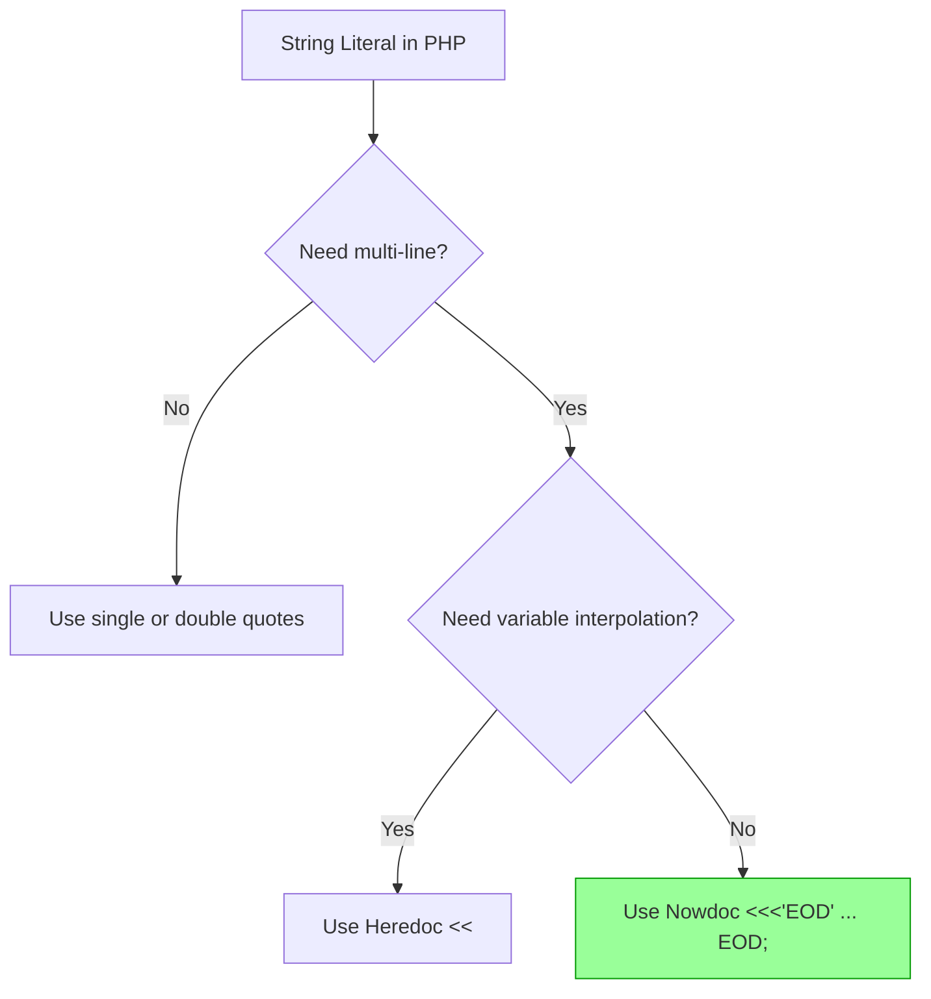

# PHP Nowdoc Syntax

## Introduction

When working with strings in PHP, you'll often need to include multi-line text, special characters, or literal content without variable interpolation. PHP's **Nowdoc** syntax provides an elegant solution for these scenarios. Introduced in PHP 5.3.0, Nowdoc syntax is similar to Heredoc but with one crucial difference: variables are not parsed within Nowdoc strings.

Nowdoc syntax is particularly useful when:
- You need to preserve string literals exactly as written
- You're working with code examples that contain PHP variables
- You want to include HTML or other markup without escaping
- You need to store SQL queries with precise formatting

## Basic Syntax

The Nowdoc syntax uses single quotes (`'`) around an identifier, followed by a line break, your content, and then the same identifier to close the string.

```php
$text = <<<'IDENTIFIER'
Your text goes here
without variable interpolation
IDENTIFIER;
```

Let's break down the key components:

1. The opening sequence consists of three left angle brackets (`<<<`) followed by an identifier in single quotes
2. The identifier can be any valid label (letters, numbers, underscores) but is commonly written in uppercase
3. The content follows on a new line
4. The closing identifier must appear on its own line
5. The closing identifier must have the same indentation as the line containing the semicolon
6. A semicolon (`;`) is required after the closing identifier

## Nowdoc vs. Heredoc

Before diving deeper, let's clarify the difference between Nowdoc and Heredoc:

```php
// Heredoc - variables ARE processed
$name = "John";
$heredoc_string = <<<EOD
Hello, $name!
EOD;
echo $heredoc_string; // Outputs: Hello, John!

// Nowdoc - variables are NOT processed
$name = "John";
$nowdoc_string = <<<'EOD'
Hello, $name!
EOD;
echo $nowdoc_string; // Outputs: Hello, $name!
```

The only syntactic difference is that the Nowdoc identifier is enclosed in single quotes (`'EOD'`), while the Heredoc identifier is not (`EOD`).

## Code Examples

### Example 1: Basic Usage

```php
<?php
$nowdoc = <<<'TEXT'
This is a nowdoc string.
It preserves all whitespace
    and indentation.
$variables are not interpreted.
Special characters like 
 remain as-is.
TEXT;

echo $nowdoc;
?>
```

**Output:**
```
This is a nowdoc string.
It preserves all whitespace
    and indentation.
$variables are not interpreted.
Special characters like 
 remain as-is.
```

### Example 2: Storing HTML Code

Nowdoc is excellent for storing HTML fragments in your PHP code:

```php
<?php
$html_template = <<<'HTML'
<!DOCTYPE html>
<html>
<head>
    <title>My Page</title>
</head>
<body>
    <div class="container">
        <h1>Welcome</h1>
        <p>This is a paragraph with a $variable that won't be processed.</p>
    </div>
</body>
</html>
HTML;

echo $html_template;
?>
```

The HTML code is preserved exactly as written, making it ideal for templates where you don't want PHP to process the content yet.

### Example 3: Storing SQL Queries

Nowdoc is perfect for complex SQL queries that need to maintain specific formatting:

```php
<?php
$sql_query = <<<'SQL'
SELECT 
    users.id, 
    users.name, 
    COUNT(orders.id) AS order_count
FROM 
    users
LEFT JOIN 
    orders ON users.id = orders.user_id
WHERE 
    users.status = 'active'
    AND users.created_at > '2023-01-01'
GROUP BY 
    users.id, users.name
HAVING 
    COUNT(orders.id) > 5
ORDER BY 
    order_count DESC
LIMIT 10;
SQL;

echo "Executing query: 
" . $sql_query;
// In a real app, you would use this with your database connection
// $result = $db->query($sql_query);
?>
```

The query's exact formatting is preserved, making the code more readable and easier to maintain.

## Practical Applications

### Code Generation

Nowdoc is useful when generating code:

```php
<?php
function generateClassTemplate($className) {
    $template = <<<'CLASS_TEMPLATE'
<?php

class CLASS_NAME_PLACEHOLDER
{
    private $data;
    
    public function __construct($data = null)
    {
        $this->data = $data;
    }
    
    public function getData()
    {
        return $this->data;
    }
    
    public function setData($data)
    {
        $this->data = $data;
        return $this;
    }
}
CLASS_TEMPLATE;

    return str_replace('CLASS_NAME_PLACEHOLDER', $className, $template);
}

// Generate a User class
$userClass = generateClassTemplate('User');
echo $userClass;
?>
```

Notice that we use string replacement (`str_replace`) instead of variable interpolation since Nowdoc doesn't process variables.

### Email Templates

Nowdoc is great for email templates:

```php
<?php
function getEmailTemplate() {
    return <<<'EMAIL'
From: support@example.com
To: {{RECIPIENT}}
Subject: Your Account Information

Dear {{NAME}},

Thank you for registering with our service.

Your account details:
- Username: {{USERNAME}}
- Registration Date: {{DATE}}

If you have any questions, please contact support@example.com.

Best regards,
The Support Team
EMAIL;
}

function prepareEmail($recipient, $name, $username) {
    $template = getEmailTemplate();
    $replacements = [
        '{{RECIPIENT}}' => $recipient,
        '{{NAME}}' => $name,
        '{{USERNAME}}' => $username,
        '{{DATE}}' => date('Y-m-d'),
    ];
    
    return str_replace(array_keys($replacements), array_values($replacements), $template);
}

$email = prepareEmail('user@example.com', 'John Doe', 'johnd');
echo $email;
?>
```

Again, we use placeholders and string replacement since Nowdoc preserves the template exactly as written.

### Documentation Generation

Nowdoc is excellent for preserving formatting in documentation:

```php
<?php
$function_docs = <<<'DOC'
/**
 * Processes user data and returns formatted results
 *
 * @param array $userData The user data to process
 * @param bool $includeMetadata Whether to include metadata
 * @return array Processed data
 *
 * Example usage:
 * ```php
 * $data = processUserData(['name' => 'John'], true);
 * echo $data['formatted_name']; // Outputs: "John"
 * ```
 */
DOC;

echo $function_docs;
?>
```

## Common Gotchas and Best Practices

### 1. Closing Identifier Placement

The closing identifier must:
- Be on its own line
- Not have any whitespace before it
- Be followed immediately by a semicolon

```php
// Incorrect - indentation before closing identifier
$text = <<<'EOD'
Some text
    EOD;

// Incorrect - text after closing identifier
$text = <<<'EOD'
Some text
EOD other text;

// Correct
$text = <<<'EOD'
Some text
EOD;
```

### 2. Mixing with Variables

Since Nowdoc doesn't process variables, you'll need to concatenate or use replacement:

```php
<?php
$name = "John";

// Method 1: Concatenation
$greeting = <<<'TEXT'
Hello, 
TEXT;
$fullGreeting = $greeting . $name . '!';
echo $fullGreeting; // Outputs: Hello, John!

// Method 2: Placeholder replacement
$template = <<<'TEXT'
Hello, {{NAME}}!
TEXT;
$fullGreeting = str_replace('{{NAME}}', $name, $template);
echo $fullGreeting; // Outputs: Hello, John!
?>
```

### 3. PHP 7.3+ Flexible Heredoc/Nowdoc Syntax

PHP 7.3 introduced a more flexible syntax where the closing identifier can be indented:

```php
<?php
// PHP 7.3+ allows indented closing identifier
function getTemplate() {
    $template = <<<'TEMPLATE'
        <div class="user-card">
            <h2>{{NAME}}</h2>
            <p>{{BIO}}</p>
        </div>
    TEMPLATE;
    
    return $template;
}

echo getTemplate();
?>
```

The indentation before the closing `TEMPLATE` is allowed in PHP 7.3+, and PHP automatically strips the indentation from all lines in the string.

## Visualizing Nowdoc vs Heredoc



## Summary

PHP Nowdoc syntax provides a powerful way to work with multi-line string literals while preserving their exact formatting and preventing variable interpolation. Key takeaways include:

- Nowdoc uses single quotes around the identifier (`<<<'ID'`)
- Variables are not processed inside Nowdoc strings
- Perfect for HTML templates, SQL queries, code generation, and documentation
- The closing identifier must be on its own line with no indentation (prior to PHP 7.3)
- Use string replacement or concatenation when you need to include dynamic values

## Exercises

1. Create a Nowdoc string that contains a PHP code example with variables and echo it to the browser.
2. Write a function that uses Nowdoc to generate an HTML form template and accepts parameters to customize the form's action and method.
3. Create a SQL query template using Nowdoc that allows for flexible WHERE conditions by using placeholders.
4. Compare the output of the same multi-line text with variables using both Heredoc and Nowdoc.

## Additional Resources

- [PHP Manual: Strings](https://www.php.net/manual/en/language.types.string.php)
- [PHP Manual: Nowdoc](https://www.php.net/manual/en/language.types.string.php#language.types.string.syntax.nowdoc)
- [PHP 7.3 Flexible Heredoc Syntax](https://wiki.php.net/rfc/flexible_heredoc_nowdoc_syntaxes)

By mastering Nowdoc syntax, you'll have a powerful tool in your PHP programming toolkit for handling complex string literals with precision and clarity.