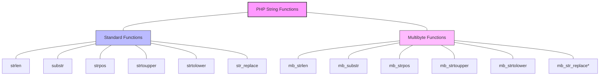

# PHP Multibyte Strings

## Introduction

When programming applications that need to support multiple languages or special characters, you'll encounter a challenge: many programming languages, including PHP's standard string functions, are designed to work with single-byte character sets (like ASCII). However, characters in languages like Japanese, Chinese, or even special symbols in European languages often require multiple bytes of data.

This is where PHP's **Multibyte String Extension (mbstring)** comes to the rescue. It provides functions specifically designed to handle strings in various encodings, particularly those that use multiple bytes per character, like UTF-8.

In this tutorial, we'll explore how to use multibyte string functions in PHP to properly handle international text content.

## Understanding Character Encodings

Before diving into the functions, let's understand why multibyte strings are necessary:

- **ASCII** (American Standard Code for Information Interchange) uses just 1 byte per character, supporting only 256 different characters
- **UTF-8** (Unicode Transformation Format 8-bit) is a variable-width encoding that uses 1 to 4 bytes per character, supporting over 1 million characters

When using standard PHP string functions on UTF-8 encoded text, you may encounter issues because these functions assume each character is a single byte.

Let's see an example of the problem:

```php
<?php
$text = "こんにちは"; // "Hello" in Japanese

// Using standard PHP string function
echo "String length using strlen(): " . strlen($text) . "
";

// Output: String length using strlen(): 15
// This is incorrect! It counts bytes, not characters
?>
```

The Japanese text "こんにちは" contains 5 characters, but `strlen()` returns 15 because each Japanese character in UTF-8 encoding requires 3 bytes.

## Installing and Enabling mbstring

The mbstring extension is bundled with PHP but may not be enabled by default. Here's how to enable it:

### On Windows
Uncomment the following line in your php.ini file:
```
extension=mbstring
```

### On Linux (Ubuntu/Debian)
```bash
sudo apt-get install php-mbstring
sudo service apache2 restart
```

### On macOS with Homebrew
```bash
brew install php
```

### Checking if mbstring is Enabled
Create a PHP file with the following code:

```php
<?php
if (extension_loaded('mbstring')) {
    echo "mbstring extension is installed and enabled!";
} else {
    echo "mbstring extension is not enabled.";
}
?>
```

## Basic Multibyte String Functions

Let's start with the most common multibyte string functions:

### 1. mb_strlen() - Getting String Length

```php
<?php
$text = "こんにちは"; // "Hello" in Japanese

// Using standard PHP string function
echo "String length using strlen(): " . strlen($text) . "
";

// Using multibyte string function
echo "String length using mb_strlen(): " . mb_strlen($text, 'UTF-8') . "
";

// Output:
// String length using strlen(): 15
// String length using mb_strlen(): 5
?>
```

The second parameter of `mb_strlen()` specifies the character encoding. If omitted, it uses the internal encoding setting.

### 2. mb_substr() - Getting Part of a String

```php
<?php
$text = "こんにちは世界"; // "Hello World" in Japanese

// Using standard PHP string function
echo "Using substr(): " . substr($text, 0, 5) . "
";

// Using multibyte string function
echo "Using mb_substr(): " . mb_substr($text, 0, 5, 'UTF-8') . "
";

// Output:
// Using substr(): (garbled text because it cuts in the middle of multibyte characters)
// Using mb_substr(): こんにちは
?>
```

### 3. mb_strpos() - Finding Position of a Substring

```php
<?php
$text = "こんにちは世界"; // "Hello World" in Japanese
$search = "世界"; // "World"

// Using standard PHP string function
echo "Position using strpos(): " . strpos($text, $search) . "
";

// Using multibyte string function
echo "Position using mb_strpos(): " . mb_strpos($text, $search, 0, 'UTF-8') . "
";

// Output:
// Position using strpos(): 15 (byte position)
// Position using mb_strpos(): 5 (character position)
?>
```

## Setting Default Encoding

Instead of specifying the encoding in each function call, you can set the default encoding:

```php
<?php
// Set the internal character encoding to UTF-8
mb_internal_encoding('UTF-8');

$text = "こんにちは";

// Now we don't need to specify UTF-8 in each function call
echo mb_strlen($text); // Outputs: 5
?>
```

## Common Character Encodings

Here are some commonly used character encodings you might work with:

- **UTF-8**: The most widely used encoding that can represent any Unicode character
- **UTF-16**: Uses 2 or 4 bytes per character
- **ISO-8859-1**: Single-byte encoding for Western European languages
- **Shift-JIS**: Encoding mainly used for Japanese
- **EUC-JP**: Another encoding for Japanese

You can check available encodings in your PHP installation:

```php
<?php
var_dump(mb_list_encodings());
?>
```

## Practical Examples

### Example 1: Safely Truncating a String

When creating excerpts or previews of text, you need to safely truncate text without breaking multibyte characters:

```php
<?php
function safeTextTruncate($text, $length = 100, $suffix = '...') {
    mb_internal_encoding('UTF-8');
    
    if (mb_strlen($text) <= $length) {
        return $text;
    }
    
    return mb_substr($text, 0, $length) . $suffix;
}

$longText = "PHP (recursive acronym for PHP: Hypertext Preprocessor) is a widely-used open source general-purpose scripting language that is especially suited for web development and can be embedded into HTML. こんにちは世界！";

echo safeTextTruncate($longText, 50);

// Output: PHP (recursive acronym for PHP: Hypertext Preproces...
?>
```

### Example 2: Case Conversion for Different Languages

Case conversion (uppercase, lowercase) works differently in various languages:

```php
<?php
mb_internal_encoding('UTF-8');

$germanText = "grüße"; // Greetings in German with umlaut
$turkishText = "istanbul";

// Standard functions may not work correctly with special characters
echo "Standard strtoupper: " . strtoupper($germanText) . "
";

// Multibyte version handles special characters correctly
echo "mb_strtoupper for German: " . mb_strtoupper($germanText) . "
";

// Turkish language has special case conversion rules for i/I
echo "mb_strtoupper for Turkish (with correct locale): " . 
     mb_strtoupper($turkishText, 'UTF-8', 'tr_TR') . "
";

// Output:
// Standard strtoupper: GRüßE (incorrect, ü remains lowercase)
// mb_strtoupper for German: GRÜSSE
// mb_strtoupper for Turkish (with correct locale): İSTANBUL (with dotted İ)
?>
```

### Example 3: Validating User Input

When validating user input that might contain international characters:

```php
<?php
mb_internal_encoding('UTF-8');

function validateUsername($username) {
    // Check length (between 3 and 20 characters)
    if (mb_strlen($username) < 3 || mb_strlen($username) > 20) {
        return false;
    }
    
    // Allow letters, numbers, and some symbols
    // Note: \p{L} matches any Unicode letter
    return preg_match('/^[\p{L}0-9_\-\.]+$/u', $username);
}

$username1 = "john_doe123";
$username2 = "josé.garcía";
$username3 = "李小龙"; // Bruce Lee in Chinese
$username4 = "u$er!";

echo "Username 1: " . (validateUsername($username1) ? "Valid" : "Invalid") . "
";
echo "Username 2: " . (validateUsername($username2) ? "Valid" : "Invalid") . "
";
echo "Username 3: " . (validateUsername($username3) ? "Valid" : "Invalid") . "
";
echo "Username 4: " . (validateUsername($username4) ? "Valid" : "Invalid") . "
";

// Output:
// Username 1: Valid
// Username 2: Valid
// Username 3: Valid
// Username 4: Invalid
?>
```

## String Conversions and Encoding Management

### Converting Between Encodings

You can convert strings between different encodings using `mb_convert_encoding()`:

```php
<?php
// Text in Shift-JIS encoding (Japanese)
$shift_jis_text = "\x82\xB1\x82\xF1\x82\xC9\x82\xBF\x82\xCD"; // "こんにちは" in Shift-JIS

// Convert from Shift-JIS to UTF-8
$utf8_text = mb_convert_encoding($shift_jis_text, 'UTF-8', 'SJIS');
echo $utf8_text . "
"; // Outputs: こんにちは

// Convert from UTF-8 to ISO-8859-1 (for European languages)
$latin_text = "café"; // in UTF-8
$iso_text = mb_convert_encoding($latin_text, 'ISO-8859-1', 'UTF-8');

// Convert back to UTF-8 to display
echo mb_convert_encoding($iso_text, 'UTF-8', 'ISO-8859-1') . "
"; // Outputs: café
?>
```

### Detecting Encoding

Sometimes you receive data without knowing its encoding. Use `mb_detect_encoding()` to guess:

```php
<?php
// Text in different encodings
$utf8_text = "こんにちは"; // UTF-8
$shift_jis_text = "\x82\xB1\x82\xF1\x82\xC9\x82\xBF\x82\xCD"; // Shift-JIS

// Try to detect encoding
echo "UTF-8 text encoding: " . mb_detect_encoding($utf8_text, ['UTF-8', 'SJIS', 'EUC-JP']) . "
";
echo "Shift-JIS text encoding: " . mb_detect_encoding($shift_jis_text, ['UTF-8', 'SJIS', 'EUC-JP']) . "
";

// Output:
// UTF-8 text encoding: UTF-8
// Shift-JIS text encoding: SJIS
?>
```

Note that detection is not always 100% accurate, especially for short strings that might be valid in multiple encodings.

## Working with HTML and Email

### Encoding HTML Output

When outputting multibyte strings in HTML, ensure proper encoding:

```php
<?php
mb_internal_encoding('UTF-8');
$text = "こんにちは & <welcome>";

// Bad practice (potential XSS vulnerability and encoding issues)
echo "Unsafe output: " . $text . "
";

// Good practice (HTML-safe)
echo "Safe output: " . htmlspecialchars($text, ENT_QUOTES, 'UTF-8') . "
";

// Output:
// Unsafe output: こんにちは & <welcome>
// Safe output: こんにちは &amp; &lt;welcome&gt;
?>
```

### Email Headers

When sending emails with non-ASCII characters in the subject or sender name:

```php
<?php
mb_internal_encoding('UTF-8');

$to = "recipient@example.com";
$subject = "Meeting about こんにちは project";
$message = "Hello,

We need to discuss the こんにちは project tomorrow.

Regards,
The Team";
$from = "Jürgen Müller <sender@example.com>";

// Properly encode the subject and sender name
$encoded_subject = mb_encode_mimeheader($subject, 'UTF-8');
$encoded_from = mb_encode_mimeheader($from, 'UTF-8');

$headers = "From: $encoded_from\r
" .
    "Reply-To: $encoded_from\r
" .
    "Content-Type: text/plain; charset=UTF-8\r
";

// Now you can send the email with proper encoding
// mail($to, $encoded_subject, $message, $headers);

echo "Encoded subject: $encoded_subject
";
echo "Encoded from: $encoded_from
";

// Output:
// Encoded subject: =?UTF-8?B?TWVldGluZyBhYm91dCDjgZPjgpPjgavjgaHjga8gcHJvamVjdA==?=
// Encoded from: =?UTF-8?B?SsO8cmdlbiBNw7xsbGVy?= <sender@example.com>
?>
```

## Common Multibyte String Operations

Here's a reference table of standard string functions and their multibyte equivalents:



*Note: `mb_str_replace()` doesn't exist; you need to use `str_replace()` with proper handling.

### Additional Useful Functions:

- `mb_stripos()`: Case-insensitive find position
- `mb_strripos()`: Find position of last occurrence, case-insensitive
- `mb_stristr()`: Case-insensitive find first occurrence
- `mb_strrchr()`: Find the last occurrence of a character
- `mb_strimwidth()`: Get truncated string with specified width
- `mb_strrpos()`: Find position of last occurrence
- `mb_strstr()`: Find first occurrence
- `mb_strwidth()`: Return width of string
- `mb_substr_count()`: Count the number of substring occurrences

## Performance Considerations

While multibyte string functions are essential for correct handling of international text, they can be slightly slower than their single-byte counterparts. For optimal performance:

1. Only use multibyte functions when necessary (e.g., for user-generated content that might contain international characters)
2. Set the default encoding with `mb_internal_encoding()` once at the beginning of your script
3. Cache results of expensive operations when processing large texts
4. Consider using single-byte functions for ASCII-only internal data

## Summary

PHP's multibyte string extension provides essential tools for working with text in international character sets. By using the `mb_*` functions instead of their regular counterparts, you can ensure your PHP applications properly handle text in any language.

Key points to remember:

- Standard PHP string functions assume 1 byte = 1 character, which is incorrect for many languages
- Always use `mb_*` functions when working with user input that might contain non-ASCII characters
- Set your encoding to UTF-8 using `mb_internal_encoding('UTF-8')` for best compatibility
- Be careful with form submissions, email headers, and database storage of multibyte strings

## Exercises

1. Create a function that counts words in a text that may contain international characters.
2. Write a function that validates a password with requirements for length based on characters (not bytes) and allows international characters.
3. Create a function that properly truncates a text at word boundaries (not in the middle of a word) while respecting multibyte characters.
4. Write a PHP script that can detect and convert text between UTF-8, Shift-JIS, and ISO-8859-1 encodings.

## Additional Resources

- [PHP mbstring Documentation](https://www.php.net/manual/en/book.mbstring.php)
- [Unicode Standard](https://unicode.org/)
- [UTF-8 and Unicode FAQ](https://www.cl.cam.ac.uk/~mgk25/unicode.html)
- [Character Encoding Best Practices](https://www.w3.org/International/questions/qa-choosing-encodings)
- [PHP Internationalization (i18n) Libraries](https://github.com/Teahouse-Studios/i18n-php)