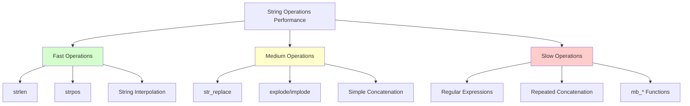

# PHP String Performance

## Introduction

String operations are fundamental to almost any PHP application. Whether you're processing user input, manipulating text, or generating HTML output, strings are involved. However, not all string operations are created equal when it comes to performance. In this guide, we'll explore how different PHP string operations affect performance and learn techniques to optimize string handling in your applications.

## Why String Performance Matters

In PHP applications, string manipulation can become a performance bottleneck, especially when:

- Processing large volumes of text
- Handling user-generated content
- Generating dynamic HTML
- Working with web APIs that return text data

Even small efficiency improvements in string operations can significantly impact your application's performance when executed thousands of times.

## String Creation and Memory Usage

### String Assignment

The most basic string operation is assignment. In PHP, strings are stored in memory and passed by value (not by reference).

```php
// Simple string assignment
$greeting = "Hello, world!";
```

For small strings, this is very efficient. However, when working with very large strings, PHP needs to allocate enough memory to store the entire string.

### String Concatenation vs Interpolation

There are multiple ways to combine strings in PHP. Let's compare:

```php
// String concatenation with the dot operator
$name = "John";
$greeting1 = "Hello, " . $name . "!";

// String interpolation (variables inside double quotes)
$greeting2 = "Hello, $name!";

// Using single quotes and concatenation
$greeting3 = 'Hello, ' . $name . '!';
```

**Performance comparison:**

- String interpolation (`"Hello, $name!"`) is generally faster than concatenation when combining a few strings.
- Single quotes are slightly faster than double quotes when there are no variables to interpolate.
- For complex strings with many variables, concatenation can sometimes be more readable but slightly less efficient.

## Efficient String Operations

### String Length

Getting the length of a string is a common operation:

```php
$text = "Hello, world!";
$length = strlen($text); // Returns 13
```

The `strlen()` function is highly optimized and very fast, even for large strings.

### String Functions vs Regular Expressions

PHP offers two main approaches for text processing:

1. Built-in string functions (`str_replace`, `substr`, etc.)
2. Regular expressions (`preg_*` functions)

Let's compare:

```php
$text = "The quick brown fox jumps over the lazy dog";

// Using string functions
$replaced1 = str_replace("quick", "fast", $text);

// Using regular expressions
$replaced2 = preg_replace("/quick/", "fast", $text);
```

**Performance implications:**

- String functions like `str_replace()` are generally faster for simple text replacements
- Regular expressions are more powerful but come with overhead
- Only use regular expressions when you need their pattern-matching capabilities
- For simple searches, `strpos()` is faster than `preg_match()`

### String Building: Concatenation vs Arrays

When building a large string piece by piece (like HTML output), there are two common approaches:

```php
// Approach 1: Concatenation
$html = "";
for ($i = 0; $i < 1000; $i++) {
    $html .= "<div>Item " . $i . "</div>";
}

// Approach 2: Array joining
$parts = [];
for ($i = 0; $i < 1000; $i++) {
    $parts[] = "<div>Item " . $i . "</div>";
}
$html = implode("", $parts);
```

**Results:**

- For a small number of concatenations, the first approach is simpler and works fine
- For many iterations (like in a large loop), the array joining approach is significantly faster
- This is because each concatenation with `.=` creates a new temporary string

## Best Practices for String Performance

### 1. Use the Right String Function

PHP has numerous string functions. Choosing the right one can make a big difference:

```php
$haystack = "The quick brown fox";
$needle = "quick";

// Less efficient for simple searches
if (preg_match("/quick/", $haystack)) {
    // Found!
}

// More efficient for simple text search
if (strpos($haystack, $needle) !== false) {
    // Found!
}
```

### 2. Minimize String Transformations

Each string operation creates a new string. Minimize transformations when possible:

```php
// Less efficient (3 separate operations)
$text = "hello, world";
$text = ucfirst($text);  // "Hello, world"
$text = str_replace("world", "PHP", $text);  // "Hello, PHP"
$text = $text . "!";  // "Hello, PHP!"

// More efficient (single operation)
$text = ucfirst(str_replace("world", "PHP", "hello, world")) . "!";
```

### 3. Use Single Quotes When No Interpolation Is Needed

```php
// Slightly slower - PHP looks for variables to interpolate
$greeting = "Hello, world!";

// Slightly faster - PHP doesn't need to parse for variables
$greeting = 'Hello, world!';
```

### 4. Heredoc for Multi-line Strings

For multi-line strings with variable interpolation, heredoc syntax can be both readable and efficient:

```php
$name = "Jane";
$age = 25;

$html = <<<HTML
<div class="profile">
    <h1>Name: {$name}</h1>
    <p>Age: {$age}</p>
</div>
HTML;
```

## Performance Optimization Example

Let's look at a real-world example of optimizing a function that processes a large text file:

```php
// Less efficient version
function processText($filename) {
    $content = file_get_contents($filename);
    $content = str_replace("\r
", "
", $content);
    $lines = explode("
", $content);
    
    $result = "";
    foreach ($lines as $line) {
        if (empty(trim($line))) continue;
        $result .= "<p>" . htmlspecialchars($line) . "</p>";
    }
    
    return $result;
}

// More efficient version
function processTextOptimized($filename) {
    $lines = file($filename);
    $paragraphs = [];
    
    foreach ($lines as $line) {
        $line = trim($line);
        if (empty($line)) continue;
        $paragraphs[] = "<p>" . htmlspecialchars($line) . "</p>";
    }
    
    return implode("
", $paragraphs);
}
```

The optimized version:
1. Uses `file()` which directly returns an array of lines
2. Collects output in an array and joins once at the end
3. Avoids unnecessary string replacements

## String Performance Visualization

Here's a diagram showing the relative performance of different string operations:



## Memory Considerations

String operations don't just impact CPU time, but also memory usage:

1. **String copying**: PHP creates a new string for most operations
2. **Memory allocation**: Large strings need contiguous memory space
3. **Garbage collection**: Old strings need to be cleaned up

```php
// This causes high memory usage for large files
$content = file_get_contents("large_file.txt");
$transformed = expensive_transformation($content);

// This is more memory efficient
$handle = fopen("large_file.txt", "r");
while (($line = fgets($handle)) !== false) {
    process_line($line);
}
fclose($handle);
```

## Summary

Optimizing PHP string performance involves:

1. Choosing the appropriate string functions for your needs
2. Minimizing unnecessary string transformations
3. Using array joining for building large strings in loops
4. Being mindful of memory usage with large strings
5. Using the right quotation style (single vs. double quotes)
6. Avoiding regular expressions when simpler functions will do

These optimizations might seem small individually, but they compound in larger applications and can lead to significant performance improvements.

## Additional Resources

- [PHP Manual: String Functions](https://www.php.net/manual/en/ref.strings.php)
- [PHP Manual: Performance Tips](https://www.php.net/manual/en/features.gc.performance-considerations.php)

## Exercises

1. Compare the performance of string concatenation versus array joining for building a string with 10,000 elements.
2. Write a function to efficiently extract all email addresses from a large text file.
3. Optimize a function that replaces multiple different words in a string at once.
4. Create a benchmark script that compares the performance of `strpos()` versus `preg_match()` for simple string searches.