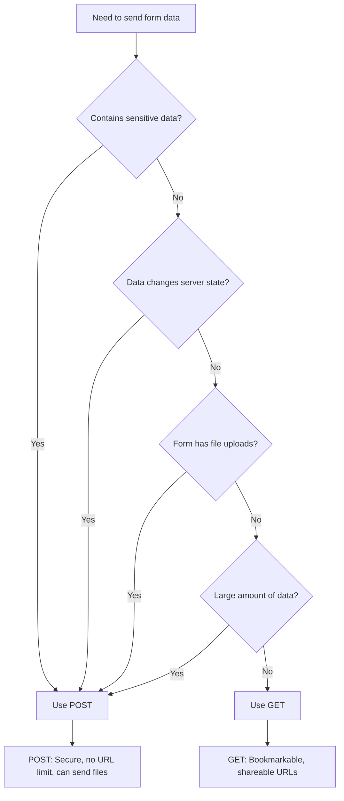
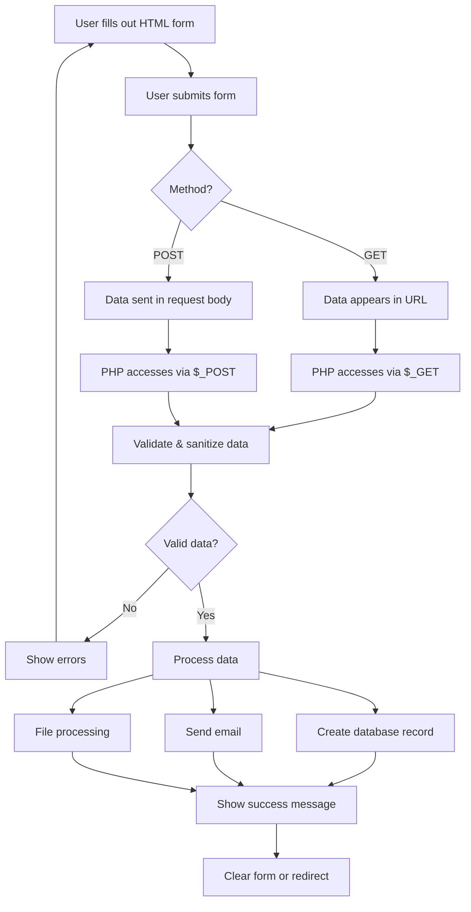

# PHP Form Handling

## Introduction

Form handling is one of the most fundamental skills for PHP developers. When users interact with your website—whether they're submitting contact information, logging in, or uploading files—they're likely using HTML forms. PHP provides powerful tools to process this form data on the server side.

In this tutorial, you'll learn how to:
- Create HTML forms that connect to PHP scripts
- Process form data using PHP superglobals
- Validate user input to ensure data integrity
- Implement security measures to protect against common vulnerabilities
- Build practical, real-world form applications

## HTML Forms Basics

Before diving into PHP, let's review the HTML form structure that sends data to our PHP scripts:

```html
<form action="process.php" method="POST">
    <label for="username">Username:</label>
    <input type="text" id="username" name="username">
    
    <label for="email">Email:</label>
    <input type="email" id="email" name="email">
    
    <input type="submit" value="Submit">
</form>
```

Key components:
- The `action` attribute specifies which PHP file will process the form
- The `method` attribute determines how data is sent (GET or POST)
- Each input has a `name` attribute that PHP uses to access the value

## Processing Form Data in PHP

When a form is submitted to a PHP script, the form data becomes available through PHP superglobals: `$_GET`, `$_POST`, or `$_REQUEST`.

### Using the $_POST Superglobal

When the form method is set to "POST", PHP stores form data in the `$_POST` associative array:

```php
<?php
// process.php
if ($_SERVER["REQUEST_METHOD"] == "POST") {
    $username = $_POST["username"];
    $email = $_POST["email"];
    
    echo "Username: " . $username . "<br>";
    echo "Email: " . $email;
}
?>
```

### Using the $_GET Superglobal

When the form method is "GET", data appears in the URL and is accessed through the `$_GET` array:

```php
<?php
// search.php
if ($_SERVER["REQUEST_METHOD"] == "GET") {
    $query = $_GET["search_query"];
    
    echo "You searched for: " . $query;
}
?>
```

### GET vs POST: When to Use Each



- **Use POST when:**
  - Handling sensitive information (passwords, personal details)
  - Changing data on the server (inserting/updating database records)
  - Uploading files
  - Sending large amounts of data

- **Use GET when:**
  - Creating bookmarkable/shareable URLs (search results, filters)
  - The form submission doesn't change server state
  - Data isn't sensitive

## Form Validation

Never trust user input! Always validate form data before processing it.

### Basic Validation Techniques

```php
<?php
$errors = [];

if ($_SERVER["REQUEST_METHOD"] == "POST") {
    // Check if username is empty
    if (empty($_POST["username"])) {
        $errors[] = "Username is required";
    } else {
        $username = clean_input($_POST["username"]);
        // Check length
        if (strlen($username) < 3) {
            $errors[] = "Username must be at least 3 characters";
        }
    }
    
    // Validate email
    if (empty($_POST["email"])) {
        $errors[] = "Email is required";
    } else {
        $email = clean_input($_POST["email"]);
        // Check if it's a valid email format
        if (!filter_var($email, FILTER_VALIDATE_EMAIL)) {
            $errors[] = "Invalid email format";
        }
    }
    
    // If no errors, process the form
    if (empty($errors)) {
        // Process valid form data
        echo "Form submitted successfully!";
    } else {
        // Display errors
        foreach ($errors as $error) {
            echo $error . "<br>";
        }
    }
}

// Function to sanitize input data
function clean_input($data) {
    $data = trim($data);
    $data = stripslashes($data);
    $data = htmlspecialchars($data);
    return $data;
}
?>
```

### PHP Filter Functions

PHP provides built-in filtering functions to validate and sanitize data:

```php
// Validate an email address
$email = filter_var($_POST["email"], FILTER_VALIDATE_EMAIL);
if ($email === false) {
    echo "Invalid email format";
}

// Validate an integer
$age = filter_var($_POST["age"], FILTER_VALIDATE_INT);
if ($age === false) {
    echo "Age must be a number";
}

// Sanitize a string
$comment = filter_var($_POST["comment"], FILTER_SANITIZE_STRING);
```

## Handling Different Input Types

Forms can include various input types, each requiring specific handling.

### Checkboxes

Checkboxes send data only when checked. They can be processed like this:

```php
// HTML
<input type="checkbox" name="interests[]" value="php"> PHP
<input type="checkbox" name="interests[]" value="javascript"> JavaScript
<input type="checkbox" name="interests[]" value="python"> Python

// PHP processing
if (isset($_POST["interests"])) {
    $interests = $_POST["interests"];
    echo "Your interests: ";
    foreach ($interests as $interest) {
        echo $interest . ", ";
    }
} else {
    echo "No interests selected";
}
```

### Radio Buttons

```php
// HTML
<input type="radio" name="gender" value="male"> Male
<input type="radio" name="gender" value="female"> Female
<input type="radio" name="gender" value="other"> Other

// PHP processing
if (isset($_POST["gender"])) {
    $gender = $_POST["gender"];
    echo "Gender: " . $gender;
} else {
    echo "No gender selected";
}
```

### Select Dropdowns

```php
// HTML
<select name="country">
    <option value="">Select Country</option>
    <option value="us">United States</option>
    <option value="ca">Canada</option>
    <option value="uk">United Kingdom</option>
</select>

// PHP processing
if (!empty($_POST["country"])) {
    $country = $_POST["country"];
    echo "Country: " . $country;
} else {
    echo "No country selected";
}
```

## File Uploads

Handling file uploads requires special configuration:

1. Set the form's `enctype` attribute:

```html
<form action="upload.php" method="POST" enctype="multipart/form-data">
    <input type="file" name="file_upload">
    <input type="submit" value="Upload File">
</form>
```

2. Process the uploaded file:

```php
<?php
if ($_SERVER["REQUEST_METHOD"] == "POST") {
    // Check if file was uploaded without errors
    if (isset($_FILES["file_upload"]) && $_FILES["file_upload"]["error"] == 0) {
        $allowed = array("jpg" => "image/jpg", "jpeg" => "image/jpeg", "png" => "image/png", "pdf" => "application/pdf");
        $filename = $_FILES["file_upload"]["name"];
        $filetype = $_FILES["file_upload"]["type"];
        $filesize = $_FILES["file_upload"]["size"];
        
        // Verify file extension
        $ext = pathinfo($filename, PATHINFO_EXTENSION);
        if (!array_key_exists($ext, $allowed)) {
            die("Error: Please select a valid file format.");
        }
        
        // Verify file size - 5MB maximum
        $maxsize = 5 * 1024 * 1024;
        if ($filesize > $maxsize) {
            die("Error: File size is larger than the allowed limit.");
        }
        
        // Verify MIME type of the file
        if (in_array($filetype, $allowed)) {
            // Check whether file exists before uploading it
            if (file_exists("uploads/" . $filename)) {
                echo $filename . " already exists.";
            } else {
                move_uploaded_file($_FILES["file_upload"]["tmp_name"], "uploads/" . $filename);
                echo "Your file was uploaded successfully.";
            }
        } else {
            echo "Error: There was a problem uploading your file. Please try again.";
        }
    } else {
        echo "Error: " . $_FILES["file_upload"]["error"];
    }
}
?>
```

## Security Best Practices

### Preventing XSS (Cross-Site Scripting)

Always sanitize user input before displaying it:

```php
// BAD: Directly outputting user input
echo $_POST["comment"]; // Vulnerable to XSS

// GOOD: Sanitize before output
echo htmlspecialchars($_POST["comment"]); // Safe from XSS
```

### Preventing SQL Injection

When storing form data in a database, use prepared statements:

```php
// Connect to database
$conn = new mysqli("localhost", "username", "password", "database");

// VULNERABLE to SQL Injection:
$username = $_POST["username"];
$query = "SELECT * FROM users WHERE username = '$username'";
$result = $conn->query($query);

// SAFE from SQL Injection (using prepared statements):
$stmt = $conn->prepare("SELECT * FROM users WHERE username = ?");
$stmt->bind_param("s", $_POST["username"]);
$stmt->execute();
$result = $stmt->get_result();
```

### CSRF Protection

Cross-Site Request Forgery (CSRF) protection ensures forms are submitted from your website:

```php
// In your form page (form.php)
<?php
session_start();
$_SESSION["token"] = bin2hex(random_bytes(32));
?>

<form action="process.php" method="POST">
    <input type="hidden" name="csrf_token" value="<?php echo $_SESSION["token"]; ?>">
    <!-- Form fields -->
    <input type="submit" value="Submit">
</form>

// In your processing page (process.php)
<?php
session_start();
if (!isset($_POST["csrf_token"]) || $_POST["csrf_token"] !== $_SESSION["token"]) {
    die("CSRF token validation failed");
}
// Process form normally
?>
```

## Practical Example: Complete Contact Form

Let's combine everything we've learned into a complete contact form example:

```php
<?php
// contact.php
session_start();

// Generate CSRF token if not exists
if (!isset($_SESSION["csrf_token"])) {
    $_SESSION["csrf_token"] = bin2hex(random_bytes(32));
}

$errors = [];
$success = false;

if ($_SERVER["REQUEST_METHOD"] == "POST") {
    // Validate CSRF token
    if (!isset($_POST["csrf_token"]) || $_POST["csrf_token"] !== $_SESSION["csrf_token"]) {
        die("CSRF token validation failed");
    }
    
    // Validate name
    if (empty($_POST["name"])) {
        $errors[] = "Name is required";
    } else {
        $name = clean_input($_POST["name"]);
    }
    
    // Validate email
    if (empty($_POST["email"])) {
        $errors[] = "Email is required";
    } else {
        $email = clean_input($_POST["email"]);
        if (!filter_var($email, FILTER_VALIDATE_EMAIL)) {
            $errors[] = "Invalid email format";
        }
    }
    
    // Validate subject
    if (empty($_POST["subject"])) {
        $errors[] = "Subject is required";
    } else {
        $subject = clean_input($_POST["subject"]);
    }
    
    // Validate message
    if (empty($_POST["message"])) {
        $errors[] = "Message is required";
    } else {
        $message = clean_input($_POST["message"]);
        if (strlen($message) < 20) {
            $errors[] = "Message must be at least 20 characters";
        }
    }
    
    // Process form if no errors
    if (empty($errors)) {
        // In a real application, you might:
        // - Send an email
        // - Store in database
        // - Redirect to thank you page
        
        // For this example, we'll just set a success flag
        $success = true;
        
        // Clear form data after successful submission
        $name = $email = $subject = $message = "";
        
        // Generate new CSRF token
        $_SESSION["csrf_token"] = bin2hex(random_bytes(32));
    }
}

function clean_input($data) {
    $data = trim($data);
    $data = stripslashes($data);
    $data = htmlspecialchars($data);
    return $data;
}
?>

<!DOCTYPE html>
<html>
<head>
    <title>Contact Form</title>
    <style>
        .error { color: red; }
        .success { color: green; }
        .form-group { margin-bottom: 15px; }
        label { display: block; margin-bottom: 5px; }
        input[type=text], input[type=email], textarea {
            width: 100%;
            padding: 8px;
            box-sizing: border-box;
        }
        textarea { height: 150px; }
    </style>
</head>
<body>
    <h2>Contact Us</h2>
    
    <?php if ($success): ?>
        <p class="success">Thank you for your message! We'll get back to you soon.</p>
    <?php endif; ?>
    
    <?php if (!empty($errors)): ?>
        <div class="error">
            <ul>
                <?php foreach ($errors as $error): ?>
                    <li><?php echo $error; ?></li>
                <?php endforeach; ?>
            </ul>
        </div>
    <?php endif; ?>
    
    <form method="POST" action="<?php echo htmlspecialchars($_SERVER["PHP_SELF"]); ?>">
        <input type="hidden" name="csrf_token" value="<?php echo $_SESSION["csrf_token"]; ?>">
        
        <div class="form-group">
            <label for="name">Name:</label>
            <input type="text" id="name" name="name" value="<?php echo isset($name) ? $name : ''; ?>">
        </div>
        
        <div class="form-group">
            <label for="email">Email:</label>
            <input type="email" id="email" name="email" value="<?php echo isset($email) ? $email : ''; ?>">
        </div>
        
        <div class="form-group">
            <label for="subject">Subject:</label>
            <input type="text" id="subject" name="subject" value="<?php echo isset($subject) ? $subject : ''; ?>">
        </div>
        
        <div class="form-group">
            <label for="message">Message:</label>
            <textarea id="message" name="message"><?php echo isset($message) ? $message : ''; ?></textarea>
        </div>
        
        <input type="submit" value="Send Message">
    </form>
</body>
</html>
```

This example includes:
- CSRF protection with tokens
- Complete validation for all fields
- Error reporting
- Success message
- Form input persistence (repopulates fields after failed submission)
- Input sanitization
- Clean, responsive styling

## Form Handling Flow

Here's a visualization of the complete form handling process:



## Summary

In this tutorial, you've learned:

1. How to create HTML forms that connect to PHP scripts
2. The difference between GET and POST methods and when to use each
3. How to access form data using PHP superglobals
4. Essential validation and sanitization techniques
5. How to handle different input types (text, checkboxes, radio buttons, files)
6. Security best practices including XSS and CSRF protection
7. A complete contact form implementation

Form handling is a fundamental skill that you'll use in nearly every PHP web application you build. By following the security practices outlined in this tutorial, you'll be able to create forms that are both user-friendly and secure.

## Additional Resources and Exercises

### Resources

- [PHP Manual: Handling Forms](https://www.php.net/manual/en/tutorial.forms.php)
- [PHP Filter Functions](https://www.php.net/manual/en/book.filter.php)
- [OWASP XSS Prevention Cheat Sheet](https://cheatsheetseries.owasp.org/cheatsheets/Cross_Site_Scripting_Prevention_Cheat_Sheet.html)

### Practice Exercises

1. **Basic Form Processor**
   Create a simple registration form with fields for name, email, password, and a submit button. Process the form and display the submitted data.

2. **Form Validation Challenge**
   Create a form with at least 5 different input types and add appropriate validation for each field.

3. **File Upload Gallery**
   Build a simple image upload form that validates file types and sizes, then displays all uploaded images in a gallery.

4. **Database Integration**
   Create a form that adds records to a database table, then retrieves and displays all records.

5. **Multi-step Form**
   Build a multi-step form (like a wizard) that collects information across several pages before final submission.