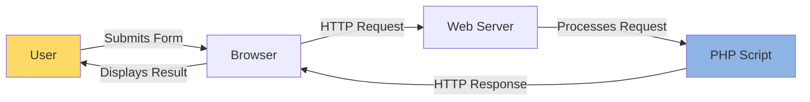
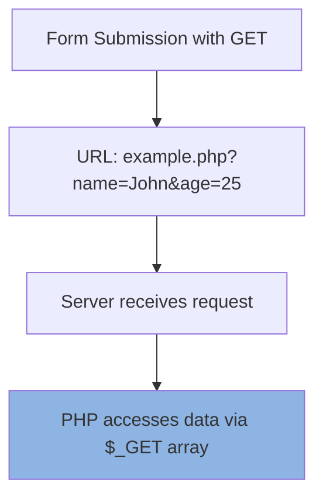
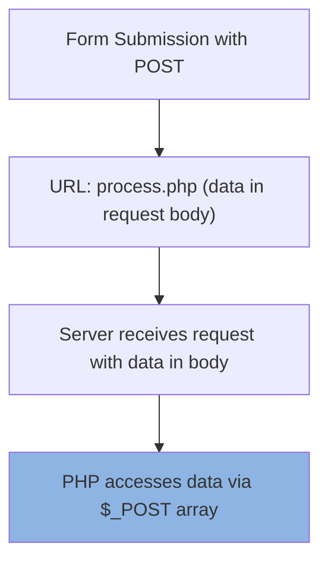

# PHP GET and POST Methods

## Introduction

When building web applications, one of the most common tasks is handling form data. PHP provides two primary methods for receiving data from HTML forms: **GET** and **POST**. Understanding these methods is essential for any PHP developer, as they form the backbone of user interaction in web applications.

In this tutorial, we'll explore both methods in detail, understand their differences, and learn when to use each one. We'll also look at practical examples to solidify your understanding.

## HTTP Request Methods Overview

Before diving into PHP's implementation, let's understand what GET and POST methods are in the context of HTTP:



When a user submits a form or clicks a link, the browser sends an HTTP request to the server. This request can use different methods, with GET and POST being the most common for form submissions.

## The GET Method

The GET method sends data as part of the URL in what's known as a query string.

### How GET Works

When a form is submitted using the GET method, the data is appended to the URL after a question mark (`?`), with name-value pairs separated by ampersands (`&`).



### HTML Form with GET Method

```html
<form action="process.php" method="GET">
    <label for="name">Name:</label>
    <input type="text" id="name" name="name">
    
    <label for="email">Email:</label>
    <input type="email" id="email" name="email">
    
    <input type="submit" value="Submit">
</form>
```

### PHP Code to Process GET Data

```php
<?php
// Check if the form was submitted via GET
if ($_SERVER["REQUEST_METHOD"] == "GET") {
    // Check if name parameter exists
    if (isset($_GET["name"]) && isset($_GET["email"])) {
        $name = htmlspecialchars($_GET["name"]);
        $email = htmlspecialchars($_GET["email"]);
        
        echo "Name: " . $name . "<br>";
        echo "Email: " . $email;
    } else {
        echo "Name or email parameter is missing!";
    }
}
?>
```

### Example Output

If a user submits the form with "John Doe" as the name and "john@example.com" as the email, the URL might look like:

```
process.php?name=John+Doe&email=john%40example.com
```

And the output would be:

```
Name: John Doe
Email: john@example.com
```

### Advantages of GET

1. **Bookmarkable URLs**: Since all parameters are in the URL, users can bookmark the result page.
2. **Shareable**: URLs with GET parameters can be easily shared.
3. **Cached**: GET requests can be cached by browsers.
4. **Visible in server logs**: Useful for debugging.
5. **History**: Parameters remain in browser history.

### Disadvantages of GET

1. **Limited Data Size**: URLs have a length limit (typically 2048 characters for most browsers).
2. **Security Concerns**: Data is visible in the URL, making it unsuitable for sensitive information like passwords.
3. **Data Types**: Only ASCII characters are allowed in URLs.

## The POST Method

The POST method sends data in the body of the HTTP request rather than in the URL.

### How POST Works

When a form is submitted using the POST method, the data is sent in the HTTP request body, invisible in the URL.



### HTML Form with POST Method

```html
<form action="process.php" method="POST">
    <label for="username">Username:</label>
    <input type="text" id="username" name="username">
    
    <label for="password">Password:</label>
    <input type="password" id="password" name="password">
    
    <input type="submit" value="Login">
</form>
```

### PHP Code to Process POST Data

```php
<?php
// Check if the form was submitted via POST
if ($_SERVER["REQUEST_METHOD"] == "POST") {
    // Check if username and password parameters exist
    if (isset($_POST["username"]) && isset($_POST["password"])) {
        $username = htmlspecialchars($_POST["username"]);
        // In a real application, you would validate and securely handle the password
        $password = $_POST["password"]; // Note: never echo passwords in production!
        
        echo "Login attempt for user: " . $username;
        // Process login (authentication code would go here)
    } else {
        echo "Username or password parameter is missing!";
    }
}
?>
```

### Advantages of POST

1. **No Size Limitations**: POST can send much larger amounts of data.
2. **Security**: Data isn't visible in the URL, making it better for sensitive information.
3. **Data Types**: Can send binary data and non-ASCII characters.
4. **More Secure Forms**: Less vulnerable to CSRF attacks when implemented properly.

### Disadvantages of POST

1. **Not Bookmarkable**: Results of POST requests can't be bookmarked.
2. **Not Cacheable**: By default, browsers don't cache POST requests.
3. **Not in History**: POST parameters aren't saved in browser history.
4. **Requires Form**: POST typically requires an HTML form (unless using JavaScript).

## Security Considerations

### Input Validation

Regardless of whether you use GET or POST, **always validate and sanitize user input**:

```php
<?php
// Basic validation example
$email = $_POST["email"] ?? '';

if (!filter_var($email, FILTER_VALIDATE_EMAIL)) {
    echo "Invalid email format";
} else {
    // Process the valid email
    $safeEmail = htmlspecialchars($email);
    echo "Email is valid: " . $safeEmail;
}
?>
```

### Prevention of XSS Attacks

Cross-Site Scripting (XSS) attacks can occur when user input is displayed without proper sanitization:

```php
<?php
// Bad practice (vulnerable to XSS):
echo "Welcome, " . $_GET["username"];

// Good practice (prevents XSS):
echo "Welcome, " . htmlspecialchars($_GET["username"]);
?>
```

### SQL Injection Prevention

When working with databases, use prepared statements to prevent SQL injection:

```php
<?php
// Connection setup
$conn = new mysqli("localhost", "username", "password", "database");

// Bad practice (vulnerable to SQL injection):
$query = "SELECT * FROM users WHERE username = '" . $_POST["username"] . "'";

// Good practice (using prepared statements):
$stmt = $conn->prepare("SELECT * FROM users WHERE username = ?");
$stmt->bind_param("s", $_POST["username"]);
$stmt->execute();
$result = $stmt->get_result();
?>
```

## Choosing Between GET and POST

### Use GET when:

1. The operation is idempotent (doesn't change server state)
2. Dealing with non-sensitive data
3. Creating bookmarkable or shareable pages
4. Working with search forms
5. Parameters need to be visible in the URL

### Use POST when:

1. Sending sensitive information (passwords, personal data)
2. Uploading files
3. The data exceeds URL length limits
4. Modifying data on the server (creating, updating, deleting)
5. Using complex forms with many fields

## Practical Examples

### Example 1: Search Form (GET)

```html
<!-- search.html -->
<form action="search-results.php" method="GET">
    <input type="text" name="query" placeholder="Search...">
    <select name="category">
        <option value="all">All Categories</option>
        <option value="articles">Articles</option>
        <option value="products">Products</option>
    </select>
    <input type="submit" value="Search">
</form>
```

```php
<!-- search-results.php -->
<?php
$query = $_GET["query"] ?? '';
$category = $_GET["category"] ?? 'all';

// Sanitize inputs
$query = htmlspecialchars($query);
$category = htmlspecialchars($category);

echo "<h1>Search Results</h1>";
echo "<p>Searching for: " . $query . " in category: " . $category . "</p>";

// In a real application, you would perform a database search here
?>
```

### Example 2: Contact Form (POST)

```html
<!-- contact.html -->
<form action="process-contact.php" method="POST">
    <label for="name">Your Name:</label>
    <input type="text" id="name" name="name" required>
    
    <label for="email">Your Email:</label>
    <input type="email" id="email" name="email" required>
    
    <label for="message">Message:</label>
    <textarea id="message" name="message" rows="5" required></textarea>
    
    <input type="submit" value="Send Message">
</form>
```

```php
<!-- process-contact.php -->
<?php
if ($_SERVER["REQUEST_METHOD"] == "POST") {
    $name = $_POST["name"] ?? '';
    $email = $_POST["email"] ?? '';
    $message = $_POST["message"] ?? '';
    
    // Validate inputs
    $errors = [];
    
    if (empty($name)) {
        $errors[] = "Name is required";
    }
    
    if (empty($email) || !filter_var($email, FILTER_VALIDATE_EMAIL)) {
        $errors[] = "Valid email is required";
    }
    
    if (empty($message)) {
        $errors[] = "Message is required";
    }
    
    // If there are no errors, process the form
    if (empty($errors)) {
        // Sanitize data
        $name = htmlspecialchars($name);
        $email = htmlspecialchars($email);
        $message = htmlspecialchars($message);
        
        // In a real application, you might send an email or save to database
        echo "<h1>Thank You!</h1>";
        echo "<p>We've received your message and will respond shortly.</p>";
    } else {
        // Display errors
        echo "<h1>There were errors with your submission:</h1>";
        echo "<ul>";
        foreach ($errors as $error) {
            echo "<li>" . $error . "</li>";
        }
        echo "</ul>";
        echo "<p><a href='javascript:history.back()'>Go back</a> and try again.</p>";
    }
} else {
    // If someone tries to access this page directly without submitting the form
    header("Location: contact.html");
    exit;
}
?>
```

### Example 3: Combining GET and POST

Sometimes you might want to use both methods together. For example, a multi-step form:

```html
<!-- step1.php -->
<form action="step2.php?step=2" method="POST">
    <input type="text" name="name" placeholder="Your Name">
    <input type="submit" value="Next Step">
</form>
```

```php
<!-- step2.php -->
<?php
$step = $_GET["step"] ?? '';
$name = $_POST["name"] ?? '';

if ($step == "2" && !empty($name)) {
    echo "<h1>Step 2</h1>";
    echo "<p>Hello, " . htmlspecialchars($name) . "! Please complete step 2.</p>";
    
    echo '<form action="final.php?step=3" method="POST">';
    echo '<input type="hidden" name="name" value="' . htmlspecialchars($name) . '">';
    echo '<input type="email" name="email" placeholder="Your Email">';
    echo '<input type="submit" value="Complete">';
    echo '</form>';
} else {
    // Redirect back to step 1 if accessed incorrectly
    header("Location: step1.php");
    exit;
}
?>
```

## The $_REQUEST Array

PHP also provides the `$_REQUEST` array, which contains the contents of `$_GET`, `$_POST`, and `$_COOKIE`. While convenient, it's generally better practice to use the specific array for clarity and security:

```php
<?php
// Using $_REQUEST (not recommended for most cases)
$username = $_REQUEST["username"] ?? '';

// Better practice: be explicit about where the data is coming from
if ($_SERVER["REQUEST_METHOD"] == "POST") {
    $username = $_POST["username"] ?? '';
} else {
    $username = $_GET["username"] ?? '';
}
?>
```

## File Uploads with POST

When uploading files, you must use the POST method along with the `enctype="multipart/form-data"` attribute:

```html
<form action="upload.php" method="POST" enctype="multipart/form-data">
    <label for="profile_pic">Select profile picture:</label>
    <input type="file" id="profile_pic" name="profile_pic">
    <input type="submit" value="Upload">
</form>
```

```php
<?php
if ($_SERVER["REQUEST_METHOD"] == "POST") {
    if (isset($_FILES["profile_pic"]) && $_FILES["profile_pic"]["error"] == 0) {
        $allowed = ["jpg" => "image/jpg", "jpeg" => "image/jpeg", "gif" => "image/gif", "png" => "image/png"];
        $filename = $_FILES["profile_pic"]["name"];
        $filetype = $_FILES["profile_pic"]["type"];
        $filesize = $_FILES["profile_pic"]["size"];
        
        // Validate file extension
        $ext = pathinfo($filename, PATHINFO_EXTENSION);
        if (!array_key_exists($ext, $allowed)) {
            die("Error: Please select a valid file format.");
        }
        
        // Validate file size - 5MB maximum
        $maxsize = 5 * 1024 * 1024;
        if ($filesize > $maxsize) {
            die("Error: File size is larger than the allowed limit.");
        }
        
        // Validate MIME type of the file
        if (in_array($filetype, $allowed)) {
            // Check if file exists before uploading
            if (file_exists("uploads/" . $filename)) {
                echo $filename . " already exists.";
            } else {
                if (move_uploaded_file($_FILES["profile_pic"]["tmp_name"], "uploads/" . $filename)) {
                    echo "Your file was uploaded successfully.";
                } else {
                    echo "Error: There was a problem uploading your file.";
                }
            }
        } else {
            echo "Error: There was a problem with the file upload. Please try again.";
        }
    } else {
        echo "Error: " . $_FILES["profile_pic"]["error"];
    }
}
?>
```

## Summary

Understanding the difference between GET and POST methods is crucial for developing secure and efficient PHP applications:

| Feature | GET | POST |
|---------|-----|------|
| Visibility | Data visible in URL | Data not visible in URL |
| Security | Less secure for sensitive data | More secure for sensitive data |
| Data Size | Limited (typically 2048 chars) | Virtually unlimited |
| Bookmarkable | Yes | No |
| Cached | Yes | No |
| Use Case | Retrieving data, search forms | Submitting data, login forms, file uploads |

Remember these key points:

1. **Always choose the appropriate method**: GET for retrieving data, POST for submitting or changing data.
2. **Always validate and sanitize user input** regardless of the method.
3. **Never trust user input**: Implement proper security measures to prevent XSS, SQL injection, and other attacks.
4. **Be aware of the limitations** of each method.

## Exercises

1. Create a simple search form using the GET method that allows users to search by keyword and filter by date range.
2. Build a user registration form using the POST method with proper validation for all fields.
3. Create a multi-step form that collects user information across several pages, storing the data in sessions.
4. Implement a file upload form that accepts images and displays a preview before confirmation.
5. Build a form that demonstrates CSRF protection with a token-based approach.

## Additional Resources

- [PHP Official Documentation: GET and POST](https://www.php.net/manual/en/reserved.variables.post.php)
- [PHP Filter Functions](https://www.php.net/manual/en/book.filter.php) for input validation
- [PHP Sessions](https://www.php.net/manual/en/book.session.php) for maintaining state across multiple forms
- [OWASP Guide on Cross-Site Scripting Prevention](https://owasp.org/www-community/attacks/xss/)
- [OWASP Guide on SQL Injection Prevention](https://owasp.org/www-community/attacks/SQL_Injection)