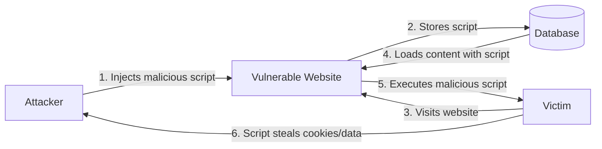

# PHP XSS Prevention

## Introduction

Cross-Site Scripting (XSS) is one of the most common web application vulnerabilities that can have serious security implications. When creating PHP forms, it's crucial to understand how XSS attacks work and how to prevent them to build secure web applications.

In this tutorial, you'll learn:
- What XSS attacks are and why they're dangerous
- How XSS vulnerabilities occur in PHP applications
- Different types of XSS attacks
- Practical techniques to prevent XSS in your PHP code
- Best practices for form validation and output encoding

## What is Cross-Site Scripting (XSS)?

Cross-Site Scripting (XSS) is a security vulnerability that occurs when an attacker injects malicious client-side scripts (usually JavaScript) into web pages viewed by other users. When these scripts execute in a victim's browser, they can:

- Steal cookies and session tokens
- Redirect users to malicious websites
- Manipulate the page content
- Capture keystrokes and form input
- Perform actions on behalf of the victim



## Types of XSS Attacks

There are three main types of XSS attacks:

1. **Reflected XSS**: The malicious script is included in a URL and only affects users who click on that specific link.
2. **Stored XSS**: The malicious script is permanently stored on the target server (e.g., in a database) and executes whenever a user accesses the affected page.
3. **DOM-based XSS**: The vulnerability exists in client-side code rather than server-side code, with the attack payload being executed as a result of modifying the DOM environment.

## How XSS Vulnerabilities Occur in PHP

PHP applications are vulnerable to XSS attacks when they:

1. Accept user input through forms, URL parameters, or cookies
2. Fail to properly validate or sanitize this input
3. Include this unsanitized input in the HTML response sent to users

Let's look at a vulnerable example:

```php
// Vulnerable PHP code
$username = $_GET['username'];
echo "<h1>Welcome, " . $username . "!</h1>";
```

In this example, if a user submits a request with `?username=<script>alert('XSS!')</script>`, the browser will execute the JavaScript code, displaying an alert box.

## PHP XSS Prevention Techniques

### 1. Input Validation

Always validate user input to ensure it meets expected formats and constraints.

```php
// Example of input validation
$username = $_POST['username'];

// Validate that username only contains letters and numbers
if (!preg_match('/^[a-zA-Z0-9]+$/', $username)) {
    die("Username can only contain letters and numbers.");
}

// Now it's safe to use $username
echo "<h1>Welcome, " . $username . "!</h1>";
```

### 2. Output Encoding

The most important defense against XSS is proper output encoding. PHP provides several functions for this purpose:

#### Using `htmlspecialchars()`

```php
// Safe PHP code using htmlspecialchars()
$username = $_GET['username'];
echo "<h1>Welcome, " . htmlspecialchars($username, ENT_QUOTES, 'UTF-8') . "!</h1>";
```

This function converts special characters to their HTML entities:
- `&` becomes `&amp;`
- `<` becomes `&lt;`
- `>` becomes `&gt;`
- `"` becomes `&quot;`
- `'` becomes `&#039;` (with ENT_QUOTES flag)

#### Input and Output Example

**Input:**
```
<script>alert('XSS attack!');</script>
```

**Output with no encoding:**
```html
<h1>Welcome, <script>alert('XSS attack!');</script>!</h1>
```
(The script would execute in the browser)

**Output with proper encoding:**
```html
<h1>Welcome, &lt;script&gt;alert(&#039;XSS attack!&#039;);&lt;/script&gt;!</h1>
```
(The script appears as text and doesn't execute)

### 3. Using `htmlentities()`

An alternative to `htmlspecialchars()` is `htmlentities()`, which encodes all characters that have HTML entity equivalents:

```php
$username = $_GET['username'];
echo "<h1>Welcome, " . htmlentities($username, ENT_QUOTES, 'UTF-8') . "!</h1>";
```

### 4. Context-Specific Encoding

Different parts of an HTML document require different encoding strategies:

#### For JavaScript Contexts

When outputting PHP variables in JavaScript, use both `htmlspecialchars()` and `json_encode()`:

```php
$username = $_GET['username'];
?>

<script>
    // Safe way to output PHP variable in JavaScript
    const username = <?php echo json_encode(htmlspecialchars($username, ENT_QUOTES, 'UTF-8')); ?>;
    document.getElementById('greeting').textContent = 'Welcome, ' + username;
</script>
```

#### For URL Contexts

When including user input in URLs, use `urlencode()`:

```php
$searchTerm = $_GET['search'];
$encodedSearch = urlencode($searchTerm);
echo "<a href='search.php?term=" . $encodedSearch . "'>Search again</a>";
```

### 5. Using Output Filtering Functions

PHP has built-in filter functions for sanitizing data:

```php
// Using filter_var for sanitization
$email = filter_var($_POST['email'], FILTER_SANITIZE_EMAIL);

// Using filter_input directly from input source
$username = filter_input(INPUT_POST, 'username', FILTER_SANITIZE_SPECIAL_CHARS);
```

## Real-World Example: Secure Comment System

Here's a practical example of a secure comment form:

```php
<?php
// Initialize variables
$comment = $username = $error = "";

// Process form submission
if ($_SERVER["REQUEST_METHOD"] == "POST") {
    // Validate username (required, alphanumeric only)
    if (empty($_POST["username"])) {
        $error = "Username is required";
    } elseif (!preg_match('/^[a-zA-Z0-9]+$/', $_POST["username"])) {
        $error = "Username can only contain letters and numbers";
    } else {
        $username = $_POST["username"];
    }
    
    // Validate comment (required)
    if (empty($_POST["comment"])) {
        $error = "Comment is required";
    } else {
        $comment = $_POST["comment"];
    }
    
    // If no errors, process the comment (e.g., save to database)
    if (empty($error)) {
        // In a real application, you would save to database here
        $success = "Comment posted successfully!";
        
        // Clear form fields after successful submission
        $comment = $username = "";
    }
}
?>

<!-- Comment Form -->
<form method="post" action="<?php echo htmlspecialchars($_SERVER["PHP_SELF"]); ?>">
    <div>
        <label for="username">Username:</label>
        <input type="text" id="username" name="username" value="<?php echo htmlspecialchars($username); ?>">
    </div>
    <div>
        <label for="comment">Comment:</label>
        <textarea id="comment" name="comment"><?php echo htmlspecialchars($comment); ?></textarea>
    </div>
    <div>
        <input type="submit" value="Post Comment">
    </div>
    <?php if (!empty($error)): ?>
        <div style="color: red;"><?php echo htmlspecialchars($error); ?></div>
    <?php endif; ?>
    <?php if (!empty($success)): ?>
        <div style="color: green;"><?php echo htmlspecialchars($success); ?></div>
    <?php endif; ?>
</form>

<!-- Display Comments -->
<div class="comments">
    <h2>Comments</h2>
    <?php
    // In a real application, you would fetch comments from a database
    $sampleComments = [
        ['username' => 'user1', 'comment' => 'This is a great tutorial!'],
        ['username' => 'user2', 'comment' => 'I learned a lot about XSS <3']
    ];
    
    foreach ($sampleComments as $c) {
        echo '<div class="comment">';
        echo '<strong>' . htmlspecialchars($c['username']) . '</strong>: ';
        echo htmlspecialchars($c['comment']);
        echo '</div>';
    }
    ?>
</div>
```

## Best Practices for PHP XSS Prevention

1. **Never trust user input** - Always assume user input could be malicious
2. **Validate input** - Ensure user data conforms to expected formats (type, length, format)
3. **Context-appropriate encoding** - Use the right encoding function for where the data will be output
4. **Use Content Security Policy (CSP)** headers to restrict sources of executable scripts
5. **Consider using PHP frameworks** that handle output encoding automatically
6. **Keep PHP updated** to benefit from security patches
7. **Consider using prepared statements** for database queries to prevent SQL injection (another common attack)
8. **Implement input and output filtering** at multiple levels of your application

## Content Security Policy (CSP)

Content Security Policy is an HTTP header that helps prevent XSS by restricting which scripts can execute on your page:

```php
// Add Content Security Policy header
header("Content-Security-Policy: default-src 'self'; script-src 'self' https://trusted-cdn.com");
```

This tells the browser to only execute scripts from your own domain and trusted-cdn.com.

## PHP Security Libraries and Frameworks

Consider using established PHP security libraries and frameworks:

1. **HTML Purifier** - A comprehensive library for filtering HTML to prevent XSS
2. **Laravel** - Includes automatic XSS protection through its `{{ }}` Blade templating syntax
3. **Symfony** - Provides Twig templating engine with automatic output escaping

## Summary

Cross-Site Scripting (XSS) attacks remain one of the most common web vulnerabilities, but with proper prevention techniques, you can build secure PHP applications:

- Always validate user input to ensure it meets expected formats
- Use context-appropriate output encoding (like `htmlspecialchars()`) when displaying user data
- Implement content security policies to restrict which scripts can execute
- Never trust user input and always encode data before displaying it
- Consider using established frameworks and libraries that handle security automatically

By implementing these techniques, you can protect your users from malicious attacks and build more secure PHP web applications.

## Additional Resources

- [OWASP XSS Prevention Cheat Sheet](https://cheatsheetseries.owasp.org/cheatsheets/Cross_Site_Scripting_Prevention_Cheat_Sheet.html)
- [PHP Security Guide](https://phpsecurity.readthedocs.io/en/latest/index.html)
- [Content Security Policy Documentation](https://developer.mozilla.org/en-US/docs/Web/HTTP/CSP)

## Exercises

1. Create a simple PHP form that accepts user input and displays it back to the user. Implement proper XSS prevention techniques.
2. Modify the comment system example to include a "reply" feature while maintaining security.
3. Experiment with different malicious inputs and verify that your XSS prevention techniques are effective.
4. Implement a Content Security Policy header in your PHP application and test its effectiveness.
5. Create a PHP function that sanitizes user input for different contexts (HTML, JavaScript, URL, CSS).