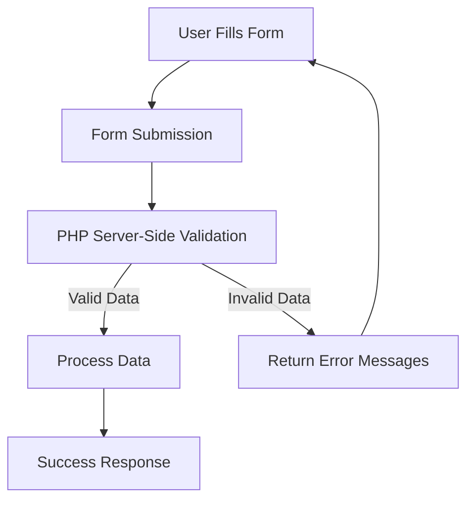

# PHP Form Validation

## Introduction

Form validation is a critical aspect of web development that helps ensure the data submitted by users meets your application's requirements. When users fill out forms on your website, their input needs to be checked for accuracy, completeness, and security before processing it. In PHP, you can implement validation both on the client-side (using JavaScript) and server-side (using PHP) to create a robust validation system.

This guide focuses on PHP server-side validation, which is essential because:

- It runs regardless of whether JavaScript is enabled in the user's browser
- It provides a security layer that cannot be bypassed by malicious users
- It ensures data integrity before saving to databases or processing further

## Basic Form Validation Concepts

### The Validation Process

Let's visualize the typical form validation process:



### Common Types of Validation

Before diving into code examples, let's understand what we typically need to validate:

1. **Required Fields**: Ensuring mandatory fields are not empty
2. **Data Format**: Checking if the data matches expected formats (email, date, etc.)
3. **Data Length**: Verifying inputs meet minimum/maximum length requirements
4. **Data Range**: Ensuring numeric inputs fall within acceptable ranges
5. **Security Validation**: Preventing harmful inputs (SQL injection, XSS attacks)

## Getting Started with PHP Form Validation

Let's create a simple contact form and validate it step by step.

### HTML Form Example

First, let's create a basic contact form:

```html
<!DOCTYPE html>
<html>
<head>
    <title>Contact Form</title>
    <style>
        .error {color: #FF0000;}
    </style>
</head>
<body>
    <h2>Contact Form</h2>
    <p><span class="error">* required field</span></p>
    
    <form method="post" action="<?php echo htmlspecialchars($_SERVER["PHP_SELF"]);?>">
        Name: <input type="text" name="name">
        <span class="error">* <?php echo $nameErr;?></span>
        <br><br>
        
        Email: <input type="text" name="email">
        <span class="error">* <?php echo $emailErr;?></span>
        <br><br>
        
        Website: <input type="text" name="website">
        <span class="error"><?php echo $websiteErr;?></span>
        <br><br>
        
        Comment: <textarea name="comment" rows="5" cols="40"></textarea>
        <br><br>
        
        Gender:
        <input type="radio" name="gender" value="female">Female
        <input type="radio" name="gender" value="male">Male
        <input type="radio" name="gender" value="other">Other
        <span class="error">* <?php echo $genderErr;?></span>
        <br><br>
        
        <input type="submit" name="submit" value="Submit">
    </form>
</body>
</html>
```

### Basic PHP Validation Implementation

Now, let's add PHP code to validate this form:

```php
<?php
// Define variables and set to empty values
$nameErr = $emailErr = $genderErr = $websiteErr = "";
$name = $email = $gender = $comment = $website = "";

if ($_SERVER["REQUEST_METHOD"] == "POST") {
    // Validate Name
    if (empty($_POST["name"])) {
        $nameErr = "Name is required";
    } else {
        $name = test_input($_POST["name"]);
        // Check if name only contains letters and whitespace
        if (!preg_match("/^[a-zA-Z-' ]*$/", $name)) {
            $nameErr = "Only letters and white space allowed";
        }
    }
    
    // Validate Email
    if (empty($_POST["email"])) {
        $emailErr = "Email is required";
    } else {
        $email = test_input($_POST["email"]);
        // Check if e-mail address is valid
        if (!filter_var($email, FILTER_VALIDATE_EMAIL)) {
            $emailErr = "Invalid email format";
        }
    }
    
    // Validate Website (optional)
    if (empty($_POST["website"])) {
        $website = "";
    } else {
        $website = test_input($_POST["website"]);
        // Check if URL address syntax is valid
        if (!preg_match("/\b(?:(?:https?|ftp):\/\/|www\.)[-a-z0-9+&@#\/%?=~_|!:,.;]*[-a-z0-9+&@#\/%=~_|]/i", $website)) {
            $websiteErr = "Invalid URL";
        }
    }
    
    // Get Comment (no validation required)
    if (empty($_POST["comment"])) {
        $comment = "";
    } else {
        $comment = test_input($_POST["comment"]);
    }
    
    // Validate Gender
    if (empty($_POST["gender"])) {
        $genderErr = "Gender is required";
    } else {
        $gender = test_input($_POST["gender"]);
    }
}

// Helper function to sanitize input data
function test_input($data) {
    $data = trim($data);
    $data = stripslashes($data);
    $data = htmlspecialchars($data);
    return $data;
}
?>
```

### The Complete Example

Let's combine the HTML and PHP to create a full working example:

```php
<?php
// Define variables and set to empty values
$nameErr = $emailErr = $genderErr = $websiteErr = "";
$name = $email = $gender = $comment = $website = "";
$formValid = false;

if ($_SERVER["REQUEST_METHOD"] == "POST") {
    $isValid = true;
    
    // Validate Name
    if (empty($_POST["name"])) {
        $nameErr = "Name is required";
        $isValid = false;
    } else {
        $name = test_input($_POST["name"]);
        // Check if name only contains letters and whitespace
        if (!preg_match("/^[a-zA-Z-' ]*$/", $name)) {
            $nameErr = "Only letters and white space allowed";
            $isValid = false;
        }
    }
    
    // Validate Email
    if (empty($_POST["email"])) {
        $emailErr = "Email is required";
        $isValid = false;
    } else {
        $email = test_input($_POST["email"]);
        // Check if e-mail address is valid
        if (!filter_var($email, FILTER_VALIDATE_EMAIL)) {
            $emailErr = "Invalid email format";
            $isValid = false;
        }
    }
    
    // Validate Website (optional)
    if (empty($_POST["website"])) {
        $website = "";
    } else {
        $website = test_input($_POST["website"]);
        // Check if URL address syntax is valid
        if (!preg_match("/\b(?:(?:https?|ftp):\/\/|www\.)[-a-z0-9+&@#\/%?=~_|!:,.;]*[-a-z0-9+&@#\/%=~_|]/i", $website)) {
            $websiteErr = "Invalid URL";
            $isValid = false;
        }
    }
    
    // Get Comment (no validation required)
    if (empty($_POST["comment"])) {
        $comment = "";
    } else {
        $comment = test_input($_POST["comment"]);
    }
    
    // Validate Gender
    if (empty($_POST["gender"])) {
        $genderErr = "Gender is required";
        $isValid = false;
    } else {
        $gender = test_input($_POST["gender"]);
    }
    
    $formValid = $isValid;
}

// Helper function to sanitize input data
function test_input($data) {
    $data = trim($data);
    $data = stripslashes($data);
    $data = htmlspecialchars($data);
    return $data;
}
?>

<!DOCTYPE html>
<html>
<head>
    <title>PHP Form Validation Example</title>
    <style>
        .error {color: #FF0000;}
        .success {color: #008000; background-color: #eaffea; padding: 10px; border: 1px solid #008000;}
        form {margin-bottom: 20px;}
    </style>
</head>
<body>
    <h2>PHP Form Validation Example</h2>
    
    <?php if ($formValid): ?>
        <div class="success">
            <h3>Form submitted successfully!</h3>
            <p>Here's what we received:</p>
            <ul>
                <li>Name: <?php echo $name; ?></li>
                <li>Email: <?php echo $email; ?></li>
                <li>Website: <?php echo $website; ?></li>
                <li>Comment: <?php echo $comment; ?></li>
                <li>Gender: <?php echo $gender; ?></li>
            </ul>
        </div>
    <?php endif; ?>
    
    <p><span class="error">* required field</span></p>
    
    <form method="post" action="<?php echo htmlspecialchars($_SERVER["PHP_SELF"]);?>">
        Name: <input type="text" name="name" value="<?php echo $name;?>">
        <span class="error">* <?php echo $nameErr;?></span>
        <br><br>
        
        Email: <input type="text" name="email" value="<?php echo $email;?>">
        <span class="error">* <?php echo $emailErr;?></span>
        <br><br>
        
        Website: <input type="text" name="website" value="<?php echo $website;?>">
        <span class="error"><?php echo $websiteErr;?></span>
        <br><br>
        
        Comment: <textarea name="comment" rows="5" cols="40"><?php echo $comment;?></textarea>
        <br><br>
        
        Gender:
        <input type="radio" name="gender" value="female" <?php if (isset($gender) && $gender=="female") echo "checked";?>>Female
        <input type="radio" name="gender" value="male" <?php if (isset($gender) && $gender=="male") echo "checked";?>>Male
        <input type="radio" name="gender" value="other" <?php if (isset($gender) && $gender=="other") echo "checked";?>>Other
        <span class="error">* <?php echo $genderErr;?></span>
        <br><br>
        
        <input type="submit" name="submit" value="Submit">
    </form>
</body>
</html>
```

## Advanced Form Validation Techniques

### Using PHP Filter Functions

PHP provides built-in filter functions that make validation more straightforward:

```php
// Validate email using filter_var
$email = $_POST["email"];
if (!filter_var($email, FILTER_VALIDATE_EMAIL)) {
    $emailErr = "Invalid email format";
}

// Validate integers
$age = $_POST["age"];
if (!filter_var($age, FILTER_VALIDATE_INT, ["options" => ["min_range" => 1, "max_range" => 120]])) {
    $ageErr = "Age must be a number between 1 and 120";
}

// Validate URLs
$website = $_POST["website"];
if (!filter_var($website, FILTER_VALIDATE_URL)) {
    $websiteErr = "Invalid URL format";
}
```

### Regular Expressions for Complex Validation

For more complex validation patterns, regular expressions are powerful:

```php
// Password validation (min 8 chars, at least one letter and one number)
$password = $_POST["password"];
if (!preg_match("/^(?=.*[A-Za-z])(?=.*\d)[A-Za-z\d]{8,}$/", $password)) {
    $passwordErr = "Password must be at least 8 characters and contain at least one letter and one number";
}

// Phone number validation (US format)
$phone = $_POST["phone"];
if (!preg_match("/^[2-9]\d{2}-\d{3}-\d{4}$/", $phone)) {
    $phoneErr = "Phone number must be in format xxx-xxx-xxxx";
}
```

### File Upload Validation

When handling file uploads, validation is crucial for security:

```php
if (isset($_FILES["file"])) {
    $target_dir = "uploads/";
    $target_file = $target_dir . basename($_FILES["file"]["name"]);
    $uploadOk = 1;
    $imageFileType = strtolower(pathinfo($target_file, PATHINFO_EXTENSION));
    
    // Check if file already exists
    if (file_exists($target_file)) {
        $fileErr = "Sorry, file already exists.";
        $uploadOk = 0;
    }
    
    // Check file size (limit to 2MB)
    if ($_FILES["file"]["size"] > 2000000) {
        $fileErr = "Sorry, your file is too large.";
        $uploadOk = 0;
    }
    
    // Allow certain file formats
    if ($imageFileType != "jpg" && $imageFileType != "png" && $imageFileType != "jpeg" && $imageFileType != "gif") {
        $fileErr = "Sorry, only JPG, JPEG, PNG & GIF files are allowed.";
        $uploadOk = 0;
    }
    
    // If everything is ok, try to upload file
    if ($uploadOk) {
        if (move_uploaded_file($_FILES["file"]["tmp_name"], $target_file)) {
            $fileSuccess = "The file ". htmlspecialchars(basename($_FILES["file"]["name"])). " has been uploaded.";
        } else {
            $fileErr = "Sorry, there was an error uploading your file.";
        }
    }
}
```

## Security Considerations

### Preventing SQL Injection

When working with databases, always validate and sanitize input:

```php
// Unsafe way (vulnerable to SQL injection)
$username = $_POST["username"];
$query = "SELECT * FROM users WHERE username = '$username'";

// Safe way using prepared statements
$username = $_POST["username"];
$stmt = $conn->prepare("SELECT * FROM users WHERE username = ?");
$stmt->bind_param("s", $username);
$stmt->execute();
$result = $stmt->get_result();
```

### Preventing Cross-Site Scripting (XSS)

Always escape output to prevent XSS attacks:

```php
// Unsafe output (vulnerable to XSS)
echo "Welcome, " . $_POST["name"];

// Safe output
echo "Welcome, " . htmlspecialchars($_POST["name"]);
```

## Practical Real-World Example: Registration Form

Let's implement a more complex registration form with comprehensive validation:

```php
<?php
// Initialize variables
$usernameErr = $emailErr = $passwordErr = $confirmPasswordErr = "";
$username = $email = $password = $confirmPassword = "";
$registrationSuccess = false;

if ($_SERVER["REQUEST_METHOD"] == "POST") {
    $isValid = true;
    
    // Username validation
    if (empty($_POST["username"])) {
        $usernameErr = "Username is required";
        $isValid = false;
    } else {
        $username = test_input($_POST["username"]);
        // Check length (3-20 characters)
        if (strlen($username) < 3 || strlen($username) > 20) {
            $usernameErr = "Username must be between 3 and 20 characters";
            $isValid = false;
        }
        // Check if alphanumeric
        else if (!preg_match("/^[a-zA-Z0-9_]+$/", $username)) {
            $usernameErr = "Username can only contain letters, numbers, and underscores";
            $isValid = false;
        }
        // In a real application, you would check if username already exists in database
    }
    
    // Email validation
    if (empty($_POST["email"])) {
        $emailErr = "Email is required";
        $isValid = false;
    } else {
        $email = test_input($_POST["email"]);
        if (!filter_var($email, FILTER_VALIDATE_EMAIL)) {
            $emailErr = "Invalid email format";
            $isValid = false;
        }
        // In a real application, you would check if email already exists in database
    }
    
    // Password validation
    if (empty($_POST["password"])) {
        $passwordErr = "Password is required";
        $isValid = false;
    } else {
        $password = $_POST["password"]; // Don't trim passwords
        // Password complexity check
        if (strlen($password) < 8) {
            $passwordErr = "Password must be at least 8 characters";
            $isValid = false;
        } else if (!preg_match("/[A-Z]/", $password)) {
            $passwordErr = "Password must contain at least one uppercase letter";
            $isValid = false;
        } else if (!preg_match("/[a-z]/", $password)) {
            $passwordErr = "Password must contain at least one lowercase letter";
            $isValid = false;
        } else if (!preg_match("/[0-9]/", $password)) {
            $passwordErr = "Password must contain at least one number";
            $isValid = false;
        } else if (!preg_match("/[^A-Za-z0-9]/", $password)) {
            $passwordErr = "Password must contain at least one special character";
            $isValid = false;
        }
    }
    
    // Confirm password
    if (empty($_POST["confirm_password"])) {
        $confirmPasswordErr = "Please confirm your password";
        $isValid = false;
    } else {
        $confirmPassword = $_POST["confirm_password"];
        if ($password !== $confirmPassword) {
            $confirmPasswordErr = "Passwords do not match";
            $isValid = false;
        }
    }
    
    // If all validations pass
    if ($isValid) {
        // In a real application, you would:
        // 1. Hash the password
        // $hashedPassword = password_hash($password, PASSWORD_DEFAULT);
        
        // 2. Insert user into database
        // $sql = "INSERT INTO users (username, email, password) VALUES (?, ?, ?)";
        // $stmt = $conn->prepare($sql);
        // $stmt->bind_param("sss", $username, $email, $hashedPassword);
        // $stmt->execute();
        
        $registrationSuccess = true;
    }
}

function test_input($data) {
    $data = trim($data);
    $data = stripslashes($data);
    $data = htmlspecialchars($data);
    return $data;
}
?>

<!DOCTYPE html>
<html>
<head>
    <title>Registration Form</title>
    <style>
        .error {color: #FF0000;}
        .success {color: #008000; background-color: #eaffea; padding: 10px; border: 1px solid #008000;}
        .form-group {margin-bottom: 15px;}
        label {display: block; margin-bottom: 5px;}
        input[type="text"], input[type="email"], input[type="password"] {
            width: 300px;
            padding: 8px;
            border: 1px solid #ddd;
            border-radius: 4px;
        }
        input[type="submit"] {
            padding: 10px 15px;
            background-color: #4CAF50;
            color: white;
            border: none;
            border-radius: 4px;
            cursor: pointer;
        }
    </style>
</head>
<body>
    <h2>User Registration Form</h2>
    
    <?php if ($registrationSuccess): ?>
        <div class="success">
            <h3>Registration Successful!</h3>
            <p>Thank you for registering, <?php echo htmlspecialchars($username); ?>!</p>
            <p>A confirmation email has been sent to <?php echo htmlspecialchars($email); ?>.</p>
        </div>
    <?php else: ?>
        <p>Please fill in this form to create an account.</p>
        <p><span class="error">* required field</span></p>
        
        <form method="post" action="<?php echo htmlspecialchars($_SERVER["PHP_SELF"]);?>">
            <div class="form-group">
                <label for="username">Username:</label>
                <input type="text" id="username" name="username" value="<?php echo $username; ?>">
                <span class="error">* <?php echo $usernameErr;?></span>
            </div>
            
            <div class="form-group">
                <label for="email">Email:</label>
                <input type="email" id="email" name="email" value="<?php echo $email; ?>">
                <span class="error">* <?php echo $emailErr;?></span>
            </div>
            
            <div class="form-group">
                <label for="password">Password:</label>
                <input type="password" id="password" name="password">
                <span class="error">* <?php echo $passwordErr;?></span>
                <small>Must be at least 8 characters with uppercase, lowercase, number, and special character.</small>
            </div>
            
            <div class="form-group">
                <label for="confirm_password">Confirm Password:</label>
                <input type="password" id="confirm_password" name="confirm_password">
                <span class="error">* <?php echo $confirmPasswordErr;?></span>
            </div>
            
            <div class="form-group">
                <input type="submit" value="Register">
            </div>
        </form>
    <?php endif; ?>
</body>
</html>
```

## Bonus: Creating a Reusable Validation Class

For larger projects, it's beneficial to create a reusable validation class:

```php
<?php
class Validator {
    private $errors = [];
    private $data = [];
    
    public function __construct($data) {
        $this->data = $data;
    }
    
    public function required($field, $message = "This field is required") {
        if (empty($this->data[$field])) {
            $this->errors[$field] = $message;
        }
        return $this;
    }
    
    public function email($field, $message = "Invalid email format") {
        if (!empty($this->data[$field]) && !filter_var($this->data[$field], FILTER_VALIDATE_EMAIL)) {
            $this->errors[$field] = $message;
        }
        return $this;
    }
    
    public function minLength($field, $length, $message = null) {
        if (!empty($this->data[$field]) && strlen($this->data[$field]) < $length) {
            $this->errors[$field] = $message ?: "Must be at least $length characters";
        }
        return $this;
    }
    
    public function maxLength($field, $length, $message = null) {
        if (!empty($this->data[$field]) && strlen($this->data[$field]) > $length) {
            $this->errors[$field] = $message ?: "Must be no more than $length characters";
        }
        return $this;
    }
    
    public function match($field1, $field2, $message = "Fields do not match") {
        if ($this->data[$field1] !== $this->data[$field2]) {
            $this->errors[$field2] = $message;
        }
        return $this;
    }
    
    public function pattern($field, $pattern, $message = "Invalid format") {
        if (!empty($this->data[$field]) && !preg_match($pattern, $this->data[$field])) {
            $this->errors[$field] = $message;
        }
        return $this;
    }
    
    public function isValid() {
        return empty($this->errors);
    }
    
    public function getErrors() {
        return $this->errors;
    }
    
    public function getError($field) {
        return isset($this->errors[$field]) ? $this->errors[$field] : '';
    }
}

// Example usage
if ($_SERVER["REQUEST_METHOD"] == "POST") {
    $validator = new Validator($_POST);
    
    $validator->required('username', 'Username is required')
              ->minLength('username', 3, 'Username must be at least 3 characters')
              ->maxLength('username', 20, 'Username must be no more than 20 characters')
              ->pattern('username', '/^[a-zA-Z0-9_]+$/', 'Username can only contain letters, numbers, and underscores')
              
              ->required('email', 'Email is required')
              ->email('email', 'Invalid email format')
              
              ->required('password', 'Password is required')
              ->minLength('password', 8, 'Password must be at least 8 characters')
              ->pattern('password', '/[A-Z]/', 'Password must contain at least one uppercase letter')
              ->pattern('password', '/[a-z]/', 'Password must contain at least one lowercase letter')
              ->pattern('password', '/[0-9]/', 'Password must contain at least one number')
              ->pattern('password', '/[^A-Za-z0-9]/', 'Password must contain at least one special character')
              
              ->required('confirm_password', 'Please confirm your password')
              ->match('password', 'confirm_password', 'Passwords do not match');
    
    if ($validator->isValid()) {
        // Process form data
        $username = $_POST['username'];
        $email = $_POST['email'];
        $password = $_POST['password'];
        
        // Success!
        $registrationSuccess = true;
    } else {
        // Get specific errors
        $usernameErr = $validator->getError('username');
        $emailErr = $validator->getError('email');
        $passwordErr = $validator->getError('password');
        $confirmPasswordErr = $validator->getError('confirm_password');
    }
}
```

## Summary

Form validation is a critical aspect of web development that ensures data security, integrity, and user experience. In this guide, we've covered:

1. **Basic validation concepts**: Understanding the validation process and what needs to be validated
2. **Simple validation techniques**: Required fields, data format, and range checking
3. **Advanced validation**: Using PHP's built-in filter functions and regular expressions
4. **Security considerations**: Preventing SQL injection and cross-site scripting attacks
5. **Practical examples**: From simple contact forms to complex registration systems
6. **Reusable validation**: Creating a validation class for larger projects

Remember these key principles:

- Always validate data on the server-side, even if you have client-side validation
- Sanitize input before processing
- Escape output to prevent XSS attacks
- Use prepared statements for database operations
- Provide clear, user-friendly error messages
- Keep user experience in mind when designing validation feedback

## Additional Resources

- [PHP Filter Functions Documentation](https://www.php.net/manual/en/book.filter.php)
- [PHP Regular Expressions](https://www.php.net/manual/en/book.pcre.php)
- [OWASP Input Validation Cheat Sheet](https://cheatsheetseries.owasp.org/cheatsheets/Input_Validation_Cheat_Sheet.html)
- [PHP Password Hashing](https://www.php.net/manual/en/function.password-hash.php)

## Practice Exercises

1. Create a registration form that includes validation for username, email, password, and a terms of service checkbox.
2. Build a file upload form that validates file types, sizes, and names before processing.
3. Implement a multi-step form with validation at each step.
4. Extend the Validator class to include additional validation methods for phone numbers, dates, and credit card numbers.
5. Create a form with AJAX validation that checks if a username or email is already taken in real-time.