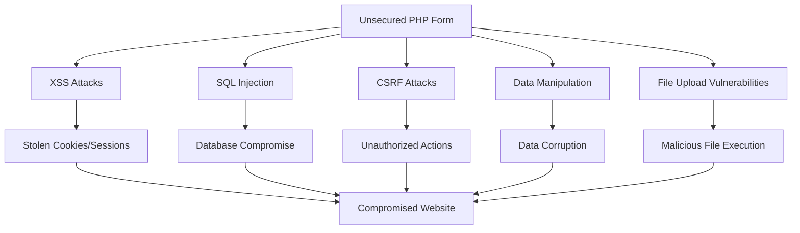

# PHP Form Security

## Introduction

When developing websites with PHP, forms are one of the most common ways users interact with your application. However, they also represent one of the biggest security vulnerabilities if not properly secured. In this guide, we'll explore essential techniques to protect your PHP forms from common attacks such as Cross-Site Scripting (XSS), SQL Injection, Cross-Site Request Forgery (CSRF), and more.

Form security isn't just about preventing malicious attacks—it's about building trust with your users and ensuring their data remains protected. Let's dive into how you can create secure PHP forms!

## Why Form Security Matters

Before we get into the code, it's important to understand what we're protecting against:



When your form is vulnerable, attackers can:
- Steal sensitive user information
- Gain unauthorized access to your database
- Perform actions on behalf of your users
- Upload and execute malicious files
- Compromise your entire website

## Essential PHP Form Security Techniques

### 1. Input Validation and Sanitization

The first line of defense is never trusting user input. Always validate and sanitize any data received from forms.

```php
// Bad practice - no validation
$username = $_POST['username'];
$email = $_POST['email'];

// Good practice - with validation and sanitization
$username = trim(filter_input(INPUT_POST, 'username', FILTER_SANITIZE_STRING));
$email = filter_input(INPUT_POST, 'email', FILTER_VALIDATE_EMAIL);

if($email === false) {
    // Handle invalid email
    echo "Invalid email address provided";
}
```

#### Input Validation Methods

PHP offers several built-in functions for validation:

| Function | Description | Example |
|----------|-------------|---------|
| `filter_input()` | Validates variables from external sources | `filter_input(INPUT_POST, 'email', FILTER_VALIDATE_EMAIL)` |
| `filter_var()` | Validates a variable with a specified filter | `filter_var($email, FILTER_VALIDATE_EMAIL)` |
| `is_numeric()` | Checks if a variable is a number or numeric string | `is_numeric($age)` |
| `preg_match()` | Performs regular expression matching | `preg_match('/^[a-zA-Z0-9]{5,12}$/', $username)` |

### 2. Preventing XSS (Cross-Site Scripting)

XSS attacks involve injecting malicious JavaScript into your pages. To prevent this, always escape output:

```php
// Form submission
$userComment = $_POST['comment'];

// Bad practice - direct output
echo "Your comment: " . $userComment;

// Good practice - escape output
echo "Your comment: " . htmlspecialchars($userComment, ENT_QUOTES, 'UTF-8');
```

#### Output before escaping
If a user submits: `<script>alert('Hacked!');</script>`

#### Output after escaping
The browser will display: `<script>alert('Hacked!');</script>` as plain text rather than executing it.

### 3. Preventing SQL Injection

SQL injection happens when user input is directly included in database queries.

```php
// Database connection
$conn = new mysqli('localhost', 'username', 'password', 'database');

// Bad practice - direct insertion of user input
$username = $_POST['username'];
$query = "SELECT * FROM users WHERE username = '$username'";
$result = $conn->query($query);

// Good practice - using prepared statements
$username = $_POST['username'];
$stmt = $conn->prepare("SELECT * FROM users WHERE username = ?");
$stmt->bind_param("s", $username);
$stmt->execute();
$result = $stmt->get_result();
```

### 4. CSRF (Cross-Site Request Forgery) Protection

CSRF attacks trick users into unknowingly submitting forms to your site. Implement token-based protection:

```php
// At the beginning of your session
session_start();
if(empty($_SESSION['csrf_token'])) {
    $_SESSION['csrf_token'] = bin2hex(random_bytes(32));
}

// In your form
echo '<form method="post" action="process.php">';
echo '<input type="hidden" name="csrf_token" value="' . $_SESSION['csrf_token'] . '">';
echo '<input type="text" name="username">';
echo '<input type="submit" value="Submit">';
echo '</form>';

// When processing the form
session_start();
if(!isset($_POST['csrf_token']) || $_POST['csrf_token'] !== $_SESSION['csrf_token']) {
    // Invalid request
    die('CSRF token validation failed');
}

// Continue with form processing
```

### 5. Secure File Uploads

File uploads pose special security risks. Here's how to handle them safely:

```php
// File upload form
echo '<form method="post" action="upload.php" enctype="multipart/form-data">';
echo '<input type="file" name="uploadedFile">';
echo '<input type="submit" value="Upload">';
echo '</form>';

// Processing the upload
if(isset($_FILES['uploadedFile'])) {
    $fileName = $_FILES['uploadedFile']['name'];
    $fileSize = $_FILES['uploadedFile']['size'];
    $fileTmp = $_FILES['uploadedFile']['tmp_name'];
    $fileType = $_FILES['uploadedFile']['type'];
    
    // Get file extension
    $fileExt = strtolower(pathinfo($fileName, PATHINFO_EXTENSION));
    
    // Set allowed file types
    $allowedExtensions = ['jpg', 'jpeg', 'png', 'pdf'];
    
    // Validate file extension
    if(!in_array($fileExt, $allowedExtensions)) {
        die("Error: Only JPG, JPEG, PNG and PDF files are allowed");
    }
    
    // Validate file size (limit to 2MB)
    if($fileSize > 2097152) {
        die("Error: File size must be under 2MB");
    }
    
    // Generate a unique file name to prevent overwriting
    $newFileName = uniqid('file_') . '.' . $fileExt;
    $uploadPath = 'uploads/' . $newFileName;
    
    // Move the file and set restrictive permissions
    if(move_uploaded_file($fileTmp, $uploadPath)) {
        // Set proper permissions
        chmod($uploadPath, 0644);
        echo "File uploaded successfully!";
    } else {
        echo "Error uploading file";
    }
}
```

### 6. Rate Limiting

Prevent brute force attacks by implementing rate limiting on your forms:

```php
session_start();

// Initialize attempt tracking
if(!isset($_SESSION['login_attempts'])) {
    $_SESSION['login_attempts'] = 0;
    $_SESSION['last_attempt_time'] = time();
}

// Check if user is temporarily blocked
if($_SESSION['login_attempts'] >= 5) {
    $timeElapsed = time() - $_SESSION['last_attempt_time'];
    if($timeElapsed < 300) { // 5 minutes lockout
        die("Too many login attempts. Please try again after " . 
            ceil((300 - $timeElapsed) / 60) . " minutes.");
    } else {
        // Reset after lockout period
        $_SESSION['login_attempts'] = 0;
    }
}

// Process login
if($_SERVER['REQUEST_METHOD'] === 'POST') {
    $username = $_POST['username'];
    $password = $_POST['password'];
    
    // Authentication logic here...
    $isAuthenticated = authenticate($username, $password);
    
    if($isAuthenticated) {
        // Reset attempts on success
        $_SESSION['login_attempts'] = 0;
        // Redirect to dashboard
    } else {
        // Increment attempts on failure
        $_SESSION['login_attempts']++;
        $_SESSION['last_attempt_time'] = time();
        echo "Invalid login. Attempts: " . $_SESSION['login_attempts'] . "/5";
    }
}

function authenticate($username, $password) {
    // Your authentication logic
    // return true or false
}
```

## Real-World Example: Secure Contact Form

Let's put everything together in a complete, secure contact form example:

```php
<?php
session_start();

// Generate CSRF token
if(empty($_SESSION['csrf_token'])) {
    $_SESSION['csrf_token'] = bin2hex(random_bytes(32));
}

// Form processing
$errors = [];
$success = false;

if($_SERVER['REQUEST_METHOD'] === 'POST') {
    // Validate CSRF token
    if(!isset($_POST['csrf_token']) || $_POST['csrf_token'] !== $_SESSION['csrf_token']) {
        die('CSRF token validation failed');
    }
    
    // Sanitize and validate inputs
    $name = trim(filter_input(INPUT_POST, 'name', FILTER_SANITIZE_STRING));
    $email = filter_input(INPUT_POST, 'email', FILTER_VALIDATE_EMAIL);
    $message = trim(filter_input(INPUT_POST, 'message', FILTER_SANITIZE_STRING));
    
    // Validate name
    if(empty($name) || strlen($name) < 2) {
        $errors[] = "Please enter a valid name (at least 2 characters)";
    }
    
    // Validate email
    if($email === false) {
        $errors[] = "Please enter a valid email address";
    }
    
    // Validate message
    if(empty($message) || strlen($message) < 10) {
        $errors[] = "Please enter a message (at least 10 characters)";
    }
    
    // If no errors, process the form
    if(empty($errors)) {
        // In a real application, you would store in database or send email
        // Example database storage with prepared statement:
        
        /* 
        $conn = new mysqli('localhost', 'username', 'password', 'database');
        $stmt = $conn->prepare("INSERT INTO contact_messages (name, email, message, created_at) VALUES (?, ?, ?, NOW())");
        $stmt->bind_param("sss", $name, $email, $message);
        $stmt->execute();
        $stmt->close();
        $conn->close();
        */
        
        // For this example, we'll just show success
        $success = true;
        
        // Generate new CSRF token for next submission
        $_SESSION['csrf_token'] = bin2hex(random_bytes(32));
    }
}
?>

<!DOCTYPE html>
<html>
<head>
    <title>Secure Contact Form</title>
    <style>
        .error { color: red; }
        .success { color: green; }
    </style>
</head>
<body>
    <h1>Contact Us</h1>
    
    <?php if($success): ?>
        <div class="success">
            <p>Thank you for your message! We'll respond shortly.</p>
        </div>
    <?php else: ?>
        <?php if(!empty($errors)): ?>
            <div class="error">
                <ul>
                    <?php foreach($errors as $error): ?>
                        <li><?= htmlspecialchars($error) ?></li>
                    <?php endforeach; ?>
                </ul>
            </div>
        <?php endif; ?>
        
        <form method="post" action="">
            <input type="hidden" name="csrf_token" value="<?= $_SESSION['csrf_token'] ?>">
            
            <div>
                <label for="name">Name:</label>
                <input type="text" id="name" name="name" value="<?= isset($name) ? htmlspecialchars($name) : '' ?>">
            </div>
            
            <div>
                <label for="email">Email:</label>
                <input type="email" id="email" name="email" value="<?= isset($email) ? htmlspecialchars($email) : '' ?>">
            </div>
            
            <div>
                <label for="message">Message:</label>
                <textarea id="message" name="message"><?= isset($message) ? htmlspecialchars($message) : '' ?></textarea>
            </div>
            
            <div>
                <button type="submit">Send Message</button>
            </div>
        </form>
    <?php endif; ?>
</body>
</html>
```

## Security Checklist for PHP Forms

Use this checklist to ensure your forms are secure:

✅ Validate and sanitize all user inputs  
✅ Use prepared statements for database operations  
✅ Implement CSRF protection with tokens  
✅ Escape all output with `htmlspecialchars()`  
✅ Implement proper file upload validation  
✅ Use HTTPS for all form submissions  
✅ Set appropriate input maxlength and other HTML5 validations  
✅ Implement rate limiting for sensitive forms  
✅ Use strong password hashing for authentication forms  
✅ Provide clear error messages (without revealing system details)  

## Summary

Securing PHP forms is a multi-layered approach that requires vigilance at every step of the development process. By implementing the techniques covered in this guide—input validation, output escaping, prepared statements, CSRF protection, and secure file handling—you can significantly reduce the risk of your application being compromised.

Remember that security is not a one-time implementation but an ongoing process. Stay updated on the latest security best practices and regularly audit your code for potential vulnerabilities.

## Additional Resources and Exercises

### Resources

1. [PHP Manual: Security](https://www.php.net/manual/en/security.php)
2. [OWASP Top Ten](https://owasp.org/www-project-top-ten/)
3. [PHP Filter Functions](https://www.php.net/manual/en/ref.filter.php)

### Practice Exercises

1. **Secure Login Form**: Create a login form with rate limiting, CSRF protection, and proper password hashing.

2. **File Upload Challenge**: Implement a secure file upload system that validates file types, sizes, and generates safe filenames.

3. **Security Audit**: Review an existing PHP form and identify potential security vulnerabilities. Then implement fixes for each issue you find.

4. **Advanced Validation**: Create a registration form with complex validation rules (password strength, username requirements, etc.) and provide helpful error messages.

5. **Challenge: Form Honeypot**: Research and implement a honeypot field to reduce spam submissions without using CAPTCHA.