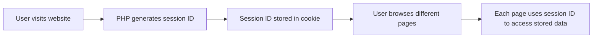

# PHP Sessions

## Introduction

When browsing the web, HTTP is designed to be stateless - each request to a server is independent, with no memory of previous interactions. However, web applications often need to remember information about users as they navigate between pages. For example, an online store needs to remember what items are in your shopping cart, or a website needs to keep you logged in.

**PHP Sessions** provide a way to solve this problem by storing user information on the server across multiple page requests. Unlike cookies (which store data on the client's computer), sessions store data on the server while using a small cookie to identify which session belongs to which visitor.

## What Are PHP Sessions?

A PHP session creates a file on the server that stores variables and makes them available to all pages on a website for a specific user. Each visitor is assigned a unique session ID, which is used to retrieve their stored variables.



## Starting a PHP Session

Before you can store and retrieve session data, you must first start a session using the `session_start()` function:

```php
<?php
// This must be the very first thing in your PHP file
// before any HTML or other output
session_start();

// Now you can work with session variables
?>
```

:::caution
Always call `session_start()` at the beginning of your script, before any HTML or other output. This is because sessions use cookies, and cookies must be sent before any output is generated.
:::

## Creating and Using Session Variables

Once you've started a session, you can create variables and store them in the `$_SESSION` superglobal array:

```php
<?php
session_start();

// Store data in session variables
$_SESSION["username"] = "JohnDoe";
$_SESSION["favorite_color"] = "blue";
$_SESSION["login_time"] = time();

echo "Session variables are set.";
?>
```

To access these variables on another page, you simply start the session again and access the `$_SESSION` array:

```php
<?php
session_start();

// Access session variables
echo "Welcome back, " . $_SESSION["username"] . "!<br>";
echo "Your favorite color is " . $_SESSION["favorite_color"] . ".<br>";
echo "You logged in " . (time() - $_SESSION["login_time"]) . " seconds ago.";
?>
```

### Example Output:
```
Welcome back, JohnDoe!
Your favorite color is blue.
You logged in 45 seconds ago.
```

## A Complete Login Example

Let's create a simple login system using PHP sessions. This example includes three files:

1. A login form
2. A login processor
3. A protected page that requires login

### login_form.php

```php
<?php
session_start();

// If already logged in, redirect to welcome page
if (isset($_SESSION["loggedin"]) && $_SESSION["loggedin"] === true) {
    header("location: welcome.php");
    exit;
}
?>

<!DOCTYPE html>
<html>
<head>
    <title>Login Form</title>
</head>
<body>
    <h2>Login Form</h2>
    <form action="process_login.php" method="post">
        <div>
            <label>Username:</label>
            <input type="text" name="username" required>
        </div>    
        <div>
            <label>Password:</label>
            <input type="password" name="password" required>
        </div>
        <div>
            <input type="submit" value="Login">
        </div>
    </form>
</body>
</html>
```

### process_login.php

```php
<?php
session_start();

// Demo credentials (in a real app, you would check against a database)
$valid_username = "user123";
$valid_password = "password123";

if ($_SERVER["REQUEST_METHOD"] == "POST") {
    // Check if username and password are correct
    if ($_POST["username"] == $valid_username && $_POST["password"] == $valid_password) {
        // Store data in session variables
        $_SESSION["loggedin"] = true;
        $_SESSION["username"] = $_POST["username"];
        
        // Redirect to welcome page
        header("location: welcome.php");
        exit;
    } else {
        // Invalid credentials, redirect back to login with an error
        $_SESSION["login_error"] = "Invalid username or password";
        header("location: login_form.php");
        exit;
    }
}
?>
```

### welcome.php

```php
<?php
session_start();

// Check if the user is logged in
if (!isset($_SESSION["loggedin"]) || $_SESSION["loggedin"] !== true) {
    header("location: login_form.php");
    exit;
}
?>

<!DOCTYPE html>
<html>
<head>
    <title>Welcome</title>
</head>
<body>
    <h1>Welcome, <?php echo $_SESSION["username"]; ?>!</h1>
    <p>This is a protected page that only logged-in users can see.</p>
    <a href="logout.php">Logout</a>
</body>
</html>
```

### logout.php

```php
<?php
session_start();

// Unset all session variables
$_SESSION = array();

// Destroy the session
session_destroy();

// Redirect to login page
header("location: login_form.php");
exit;
?>
```

## Session Lifetime and Configuration

By default, PHP sessions expire when the user closes their browser. However, you can change this behavior by modifying PHP's session configuration settings:

```php
<?php
// Set session to expire after 30 minutes of inactivity
ini_set('session.gc_maxlifetime', 1800);

// Set cookie to expire after 30 minutes
session_set_cookie_params(1800);

session_start();
?>
```

You can also configure these settings in your `php.ini` file:

```ini
session.gc_maxlifetime = 1800
session.cookie_lifetime = 1800
```

## Security Considerations

Sessions can introduce security vulnerabilities if not handled correctly:

### 1. Session Hijacking

If an attacker steals a user's session ID, they can impersonate that user. To mitigate this risk:

- Always use HTTPS to encrypt the session cookie
- Implement session timeout for sensitive applications
- Regenerate session IDs after login using `session_regenerate_id()`

```php
<?php
session_start();

// After successful login
if ($login_successful) {
    // Regenerate session ID to prevent session fixation
    session_regenerate_id(true);
    $_SESSION["loggedin"] = true;
    // ... other session variables
}
?>
```

### 2. Session Fixation

An attacker might set a known session ID on a victim's browser before they log in. To prevent this:

- Always regenerate session IDs upon login
- Validate session data for consistency

### 3. Session Data Exposure

Session files are stored on the server, usually in a temporary directory. Ensure proper server permissions to prevent unauthorized access.

## Session Alternatives

While sessions are powerful, they're not always the best choice:

1. **Cookies**: For simple, non-sensitive data that needs to persist longer
2. **JWT (JSON Web Tokens)**: For stateless authentication in APIs and SPAs
3. **Database storage**: For complex user data that needs to be queried

## Practical Example: Shopping Cart

Let's create a simple shopping cart using PHP sessions:

### product_list.php

```php
<?php
session_start();

// Initialize shopping cart if it doesn't exist
if (!isset($_SESSION["cart"])) {
    $_SESSION["cart"] = array();
}

// Sample products (in a real app, these would come from a database)
$products = array(
    1 => array("name" => "T-shirt", "price" => 19.99),
    2 => array("name" => "Jeans", "price" => 49.99),
    3 => array("name" => "Shoes", "price" => 79.99)
);
?>

<!DOCTYPE html>
<html>
<head>
    <title>Product List</title>
</head>
<body>
    <h1>Products</h1>
    
    <?php foreach ($products as $id => $product): ?>
        <div>
            <h3><?php echo $product["name"]; ?> - $<?php echo $product["price"]; ?></h3>
            <form action="add_to_cart.php" method="post">
                <input type="hidden" name="product_id" value="<?php echo $id; ?>">
                <input type="submit" value="Add to Cart">
            </form>
        </div>
    <?php endforeach; ?>
    
    <p><a href="view_cart.php">View Cart (<?php echo count($_SESSION["cart"]); ?> items)</a></p>
</body>
</html>
```

### add_to_cart.php

```php
<?php
session_start();

// Initialize shopping cart if it doesn't exist
if (!isset($_SESSION["cart"])) {
    $_SESSION["cart"] = array();
}

// Get the product ID from the form
if ($_SERVER["REQUEST_METHOD"] == "POST" && isset($_POST["product_id"])) {
    $product_id = $_POST["product_id"];
    
    // Sample products (in a real app, these would come from a database)
    $products = array(
        1 => array("name" => "T-shirt", "price" => 19.99),
        2 => array("name" => "Jeans", "price" => 49.99),
        3 => array("name" => "Shoes", "price" => 79.99)
    );
    
    // Check if the product exists
    if (isset($products[$product_id])) {
        // Add product to cart
        if (isset($_SESSION["cart"][$product_id])) {
            // Increment quantity if already in cart
            $_SESSION["cart"][$product_id]["quantity"]++;
        } else {
            // Add new product to cart
            $_SESSION["cart"][$product_id] = array(
                "name" => $products[$product_id]["name"],
                "price" => $products[$product_id]["price"],
                "quantity" => 1
            );
        }
    }
}

// Redirect back to product list
header("Location: product_list.php");
exit;
?>
```

### view_cart.php

```php
<?php
session_start();

// Initialize shopping cart if it doesn't exist
if (!isset($_SESSION["cart"])) {
    $_SESSION["cart"] = array();
}

// Calculate total
$total = 0;
foreach ($_SESSION["cart"] as $item) {
    $total += $item["price"] * $item["quantity"];
}
?>

<!DOCTYPE html>
<html>
<head>
    <title>Shopping Cart</title>
</head>
<body>
    <h1>Your Shopping Cart</h1>
    
    <?php if (empty($_SESSION["cart"])): ?>
        <p>Your cart is empty.</p>
    <?php else: ?>
        <table border="1" cellpadding="5">
            <tr>
                <th>Product</th>
                <th>Price</th>
                <th>Quantity</th>
                <th>Subtotal</th>
            </tr>
            <?php foreach ($_SESSION["cart"] as $item): ?>
                <tr>
                    <td><?php echo $item["name"]; ?></td>
                    <td>$<?php echo $item["price"]; ?></td>
                    <td><?php echo $item["quantity"]; ?></td>
                    <td>$<?php echo $item["price"] * $item["quantity"]; ?></td>
                </tr>
            <?php endforeach; ?>
            <tr>
                <td colspan="3" align="right"><strong>Total:</strong></td>
                <td><strong>$<?php echo number_format($total, 2); ?></strong></td>
            </tr>
        </table>
    <?php endif; ?>
    
    <p><a href="product_list.php">Continue Shopping</a></p>
    <p><a href="clear_cart.php">Clear Cart</a></p>
</body>
</html>
```

### clear_cart.php

```php
<?php
session_start();

// Clear the shopping cart
$_SESSION["cart"] = array();

// Redirect back to product list
header("Location: product_list.php");
exit;
?>
```

## Debugging Sessions

Sometimes you need to troubleshoot session-related issues. Here's how:

```php
<?php
session_start();

// View all session variables
echo "<pre>";
print_r($_SESSION);
echo "</pre>";

// Get session information
echo "Session ID: " . session_id() . "<br>";
echo "Session Name: " . session_name() . "<br>";
echo "Session Status: " . session_status() . "<br>";
echo "Session Save Path: " . session_save_path();
?>
```

## Summary

PHP Sessions provide a powerful way to maintain state across multiple pages in web applications. They allow you to:

- Store user-specific data on the server
- Keep users logged in as they navigate your site
- Create shopping carts and multi-step forms
- Personalize user experiences

By understanding how to start sessions, store and retrieve data, and implement proper security measures, you can create dynamic, interactive web applications that remember user preferences and actions.

## Exercises

1. Create a simple visitor counter that increments each time a user visits your page.
2. Build a multi-step form that collects data across several pages before final submission.
3. Implement a "remember me" functionality for a login system.
4. Create a theme selector that allows users to choose a color scheme that persists across pages.
5. Build a basic quiz application that tracks user answers across multiple questions.

## Additional Resources

- [PHP Sessions Manual](https://www.php.net/manual/en/book.session.php)
- [PHP.net Session Functions](https://www.php.net/manual/en/ref.session.php)
- [PHP Session Security Best Practices](https://www.php.net/manual/en/session.security.php)