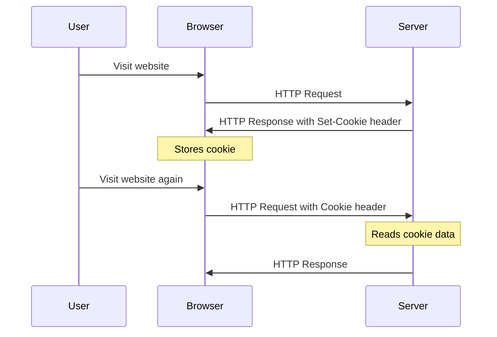

# PHP Cookies

## Introduction

Cookies are small pieces of data stored on the client's computer by the web browser while browsing a website. They are designed to be a reliable mechanism for websites to remember stateful information (such as items added in the shopping cart, user preferences) or to record the user's browsing activity (including clicking particular buttons, logging in).

In PHP, cookies provide a way to store data in the visitor's browser, allowing you to retrieve that information later when the user visits your site again. This is particularly useful for:

- Remembering user preferences
- Tracking user sessions
- Storing basic user information
- Implementing "remember me" functionality

## How Cookies Work

Before diving into the code, let's understand how cookies actually work:



When a server receives an HTTP request, it can send an HTTP response that includes a `Set-Cookie` header. The browser typically stores the cookie and sends it back to the server with every subsequent request to the same server.

## Creating Cookies in PHP

In PHP, you can create cookies using the `setcookie()` function. The basic syntax is:

```php
setcookie(name, value, expire, path, domain, secure, httponly);
```

Let's break down these parameters:

- `name`: The name of the cookie (required)
- `value`: The value of the cookie (required)
- `expire`: When the cookie will expire as Unix timestamp (optional)
- `path`: The path on the server where the cookie will be available (optional)
- `domain`: The domain that the cookie is available to (optional)
- `secure`: Indicates if the cookie should only be transmitted over HTTPS (optional)
- `httponly`: If set to TRUE, the cookie will be accessible only through the HTTP protocol (optional)

### Simple Example of Creating a Cookie

```php
<?php
// Set a cookie named "username" with the value "JohnDoe" that expires in one hour
setcookie("username", "JohnDoe", time() + 3600);
?>

<!DOCTYPE html>
<html>
<head>
    <title>Setting a Cookie</title>
</head>
<body>
    <h1>Cookie has been set!</h1>
    <p>A cookie named 'username' with value 'JohnDoe' has been set for one hour.</p>
</body>
</html>
```

### Important Notes About Setting Cookies

1. The `setcookie()` function must be called before any output is sent to the browser (before any HTML, whitespace, or text).
2. The expiration time is set as a Unix timestamp (number of seconds since January 1, 1970).
3. If you want to delete a cookie, set its expiration time to a time in the past.

## Retrieving Cookie Values

Once a cookie has been set, you can retrieve its value using the `$_COOKIE` superglobal array:

```php
<?php
// Check if the cookie "username" exists
if(isset($_COOKIE["username"])) {
    echo "Welcome back, " . htmlspecialchars($_COOKIE["username"]) . "!";
} else {
    echo "Welcome, guest!";
}
?>
```

### Input and Output Example

**Input:** A user visits the site after the cookie was set.

**Output:**
```
Welcome back, JohnDoe!
```

**Input:** A user visits the site without having the cookie set.

**Output:**
```
Welcome, guest!
```

## Modifying Cookies

To modify a cookie, simply set a new cookie with the same name:

```php
<?php
// Update the "username" cookie with a new value
setcookie("username", "JaneDoe", time() + 3600);
?>
```

## Deleting Cookies

To delete a cookie, use the `setcookie()` function with an expiration time in the past:

```php
<?php
// Delete the "username" cookie
setcookie("username", "", time() - 3600);
?>
```

## Cookie Settings and Security

### Setting Cookie Options

Modern PHP applications often use additional options for security:

```php
<?php
// Set a cookie with additional security options
setcookie(
    "user_preference",
    "dark_theme",
    [
        'expires' => time() + 86400,
        'path' => '/',
        'domain' => 'example.com',
        'secure' => true,
        'httponly' => true,
        'samesite' => 'Strict' // Requires PHP 7.3+
    ]
);
?>
```

### Security Considerations

When working with cookies, keep these security practices in mind:

1. **Never store sensitive information in cookies** (like passwords or credit card numbers)
2. **Always sanitize cookie data** when retrieving it using functions like `htmlspecialchars()`
3. Use `httponly` flag to prevent JavaScript access to cookies (helps prevent XSS attacks)
4. Use `secure` flag to ensure cookies are only sent over HTTPS
5. Use `SameSite` attribute to prevent CSRF attacks (PHP 7.3+)

## Practical Examples

### Example 1: User Theme Preference

```php
<?php
// Check if form is submitted
if (isset($_POST['theme'])) {
    // Set a cookie with the theme preference that lasts for 30 days
    setcookie("theme", $_POST['theme'], time() + (86400 * 30), "/");
    
    // Redirect to refresh the page with the new theme
    header("Location: " . $_SERVER['PHP_SELF']);
    exit();
}

// Get the current theme
$theme = isset($_COOKIE['theme']) ? $_COOKIE['theme'] : 'light';
?>

<!DOCTYPE html>
<html>
<head>
    <title>Theme Preference</title>
    <style>
        body.light {
            background-color: #f0f0f0;
            color: #333;
        }
        body.dark {
            background-color: #333;
            color: #f0f0f0;
        }
    </style>
</head>
<body class="<?php echo htmlspecialchars($theme); ?>">
    <h1>Theme Preference Example</h1>
    
    <form method="post">
        <label>
            <input type="radio" name="theme" value="light" <?php echo ($theme == 'light') ? 'checked' : ''; ?>> 
            Light Theme
        </label>
        <br>
        <label>
            <input type="radio" name="theme" value="dark" <?php echo ($theme == 'dark') ? 'checked' : ''; ?>> 
            Dark Theme
        </label>
        <br><br>
        <input type="submit" value="Save Preference">
    </form>
    
    <p>Your current theme preference is: <?php echo htmlspecialchars($theme); ?></p>
</body>
</html>
```

### Example 2: "Remember Me" Login System

```php
<?php
// Simplified login system with "Remember Me" functionality
session_start();

// Check if user is already logged in
if (isset($_SESSION['logged_in']) && $_SESSION['logged_in'] === true) {
    echo "<h1>Welcome, you are logged in!</h1>";
    echo "<p><a href='logout.php'>Logout</a></p>";
    exit();
}

// Check if the remember me cookie exists
if (isset($_COOKIE['remember_user'])) {
    // In a real application, you would verify this token against a database
    // This is a simplified example
    $_SESSION['logged_in'] = true;
    $_SESSION['username'] = $_COOKIE['remember_user'];
    
    echo "<h1>Welcome back, " . htmlspecialchars($_SESSION['username']) . "!</h1>";
    echo "<p>You were logged in automatically using a cookie.</p>";
    echo "<p><a href='logout.php'>Logout</a></p>";
    exit();
}

// Login form submission
if (isset($_POST['login'])) {
    // In a real application, you would verify against a database
    // For this example, we'll use a fixed username and password
    $username = "demo";
    $password = "password123";
    
    if ($_POST['username'] === $username && $_POST['password'] === $password) {
        $_SESSION['logged_in'] = true;
        $_SESSION['username'] = $_POST['username'];
        
        // If "Remember Me" is checked, set a cookie
        if (isset($_POST['remember']) && $_POST['remember'] === 'on') {
            // In a real application, you would generate and store a secure token
            setcookie("remember_user", $_POST['username'], time() + (86400 * 30), "/");
        }
        
        echo "<h1>Login Successful!</h1>";
        echo "<p><a href='index.php'>Go to Home</a></p>";
        exit();
    } else {
        $error = "Invalid username or password!";
    }
}
?>

<!DOCTYPE html>
<html>
<head>
    <title>Login with Remember Me</title>
    <style>
        .error { color: red; }
    </style>
</head>
<body>
    <h1>Login</h1>
    
    <?php if (isset($error)): ?>
        <p class="error"><?php echo $error; ?></p>
    <?php endif; ?>
    
    <form method="post">
        <div>
            <label for="username">Username:</label>
            <input type="text" id="username" name="username" required>
        </div>
        <div>
            <label for="password">Password:</label>
            <input type="password" id="password" name="password" required>
        </div>
        <div>
            <label>
                <input type="checkbox" name="remember"> Remember Me
            </label>
        </div>
        <div>
            <button type="submit" name="login">Login</button>
        </div>
    </form>
</body>
</html>
```

## Cookie vs. Session

It's important to understand the difference between cookies and sessions:

| Feature | Cookies | Sessions |
|---------|---------|----------|
| Storage Location | Client (Browser) | Server |
| Security | Less secure | More secure |
| Size Limit | ~4KB | Typically larger |
| Expiration | Can be set to any time | Usually expires when browser closes |
| Accessibility | Can be accessed by JavaScript (unless httponly) | Cannot be accessed by client-side code |

When to use cookies vs. sessions:
- Use **cookies** for non-sensitive data that needs to persist across sessions
- Use **sessions** for sensitive data or temporary storage during a single visit

## Common Challenges and Solutions

### Cookie Not Setting

If your cookie is not being set, it could be due to:

1. Output before the `setcookie()` function call
2. Headers already sent
3. Browser cookie settings

**Solution:** Ensure that `setcookie()` is called before any output, including whitespace or HTML.

```php
<?php
// This will work
setcookie("test", "value", time() + 3600);

// Output after cookie is set
echo "Cookie has been set";
?>
```

### Handling Cookie Permissions

Modern browsers allow users to block cookies. You can detect this using JavaScript:

```php
<?php
// Set a test cookie
setcookie("test_cookie", "test", time() + 60);
?>

<!DOCTYPE html>
<html>
<head>
    <title>Cookie Test</title>
    <script>
    window.onload = function() {
        if (document.cookie.indexOf("test_cookie") === -1) {
            document.getElementById("cookie-warning").style.display = "block";
        }
    }
    </script>
</head>
<body>
    <div id="cookie-warning" style="display: none; background-color: #ffcccc; padding: 10px;">
        <p>This website requires cookies to function properly. Please enable cookies in your browser settings.</p>
    </div>
    
    <h1>Welcome to our website</h1>
</body>
</html>
```

## Summary

In this tutorial, we covered:

- What cookies are and how they work in web applications
- How to create, read, update, and delete cookies in PHP
- Security considerations when working with cookies
- Practical examples showing real-world applications of cookies
- Differences between cookies and sessions

Cookies are a fundamental part of web development that allow you to create more personalized user experiences. While they have limitations and security considerations, when used properly, cookies can significantly enhance your PHP applications.

## Additional Resources

- [PHP.net Official Documentation on Cookies](https://www.php.net/manual/en/features.cookies.php)
- [MDN Web Docs: HTTP Cookies](https://developer.mozilla.org/en-US/docs/Web/HTTP/Cookies)
- [OWASP Cookie Security Guide](https://owasp.org/www-community/controls/SecureCookieAttribute)

## Exercises

1. Create a form that allows users to save their name in a cookie, and then displays a personalized greeting when they return.
2. Build a simple website that allows users to customize the site's appearance (colors, font size) using cookies to save preferences.
3. Implement a "recently viewed products" feature for an e-commerce site using cookies to track which products the user has viewed.
4. Create a basic website visit counter using cookies to track how many times a user has visited your site.
5. Implement a system that displays a "cookie consent" notification for new visitors and remembers their choice using a cookie.