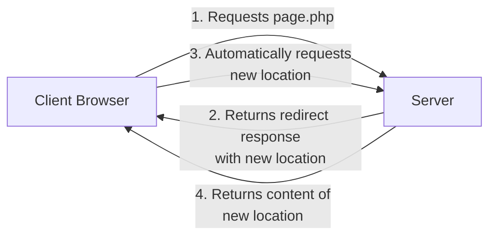

# PHP Redirects

## Introduction

When building web applications, you'll often need to redirect users from one page to another. Redirects are essential for various scenarios like:

- After successful form submission
- When a user needs to be logged in to access certain pages
- When a page has moved to a new location
- After processing a request that doesn't need to display results

In this tutorial, you'll learn how to implement redirects in PHP, understand the different methods available, and explore common use cases especially related to form handling.

## Understanding Redirects

A redirect instructs the browser to navigate to a different URL than the one initially requested. Instead of returning HTML content, the server sends a special HTTP response with a status code and the new location.

Here's a simplified flow of how redirects work:



## Redirect Methods in PHP

PHP offers several methods to implement redirects:

### 1. Using the `header()` Function

The most common method is using PHP's `header()` function with the `Location:` directive:

```php
<?php
// Redirect to another page
header("Location: thank-you.php");
exit(); // Important: stops script execution after redirect
```

The `exit()` statement is crucial as it prevents any further code execution after the redirect header is sent. Without it, your script would continue running, which can cause issues or unexpected behavior.

### 2. Using HTTP Status Codes

You can specify HTTP status codes with your redirects:

```php
<?php
// 301 redirect (permanent)
header("Location: new-page.php", true, 301);
exit();

// 302 redirect (temporary)
header("Location: temporary-page.php", true, 302);
exit();
```

The status codes have specific meanings:
- `301`: Permanent redirect - the resource has moved permanently
- `302`: Temporary redirect - the resource is temporarily at a different URL
- `303`: See Other - typically used after form submissions
- `307`: Temporary redirect (preserves the request method)

### 3. Redirecting to External Websites

You can redirect to external websites by providing the full URL:

```php
<?php
header("Location: https://www.example.com");
exit();
```

## Common Redirect Use Cases with Forms

### Redirect After Form Submission

One of the most common use cases is redirecting after a form is submitted and processed:

```php
<?php
// process-form.php
if ($_SERVER["REQUEST_METHOD"] == "POST") {
    // Process form data
    $name = $_POST["name"];
    $email = $_POST["email"];
    
    // Save to database, send email, etc.
    saveToDatabase($name, $email);
    
    // Redirect to thank you page
    header("Location: thank-you.php");
    exit();
}
?>
```

This pattern, known as the Post/Redirect/Get (PRG) pattern, prevents form resubmission if the user refreshes the page after submitting.

### Passing Data Through Redirects

Sometimes you need to pass data along with the redirect. Since HTTP headers don't carry request data, you can use:

1. **Query Parameters**:

```php
<?php
// Add parameters to the URL
$username = "johndoe";
header("Location: welcome.php?user=" . urlencode($username) . "&status=new");
exit();
```

On the receiving page, you can access these with `$_GET`:

```php
<?php
// welcome.php
$username = $_GET["user"] ?? "";
$status = $_GET["status"] ?? "";

echo "Welcome, " . htmlspecialchars($username);
if ($status === "new") {
    echo " (New User)";
}
?>
```

2. **Using Sessions**:

For sensitive or larger amounts of data, use sessions instead:

```php
<?php
// On the first page
session_start();
$_SESSION["user_data"] = [
    "name" => "John Doe",
    "email" => "john@example.com",
    "status" => "premium"
];
header("Location: dashboard.php");
exit();
```

```php
<?php
// On the receiving page (dashboard.php)
session_start();
if (isset($_SESSION["user_data"])) {
    $userData = $_SESSION["user_data"];
    echo "Welcome to your dashboard, " . htmlspecialchars($userData["name"]);
    // Use other data as needed
}
?>
```

### Conditional Redirects

You can use redirects conditionally based on various factors:

```php
<?php
session_start();

// Check if user is logged in
if (!isset($_SESSION["user_id"])) {
    // Redirect to login page
    header("Location: login.php");
    exit();
}

// Check user role for access control
if ($_SESSION["user_role"] !== "admin") {
    header("Location: access-denied.php");
    exit();
}

// Continue with admin-only content...
?>
```

## Practical Example: Complete Form Processing with Redirect

Let's build a complete example of a registration form with proper handling and redirects:

**register_form.php** - The form page:
```php
<!DOCTYPE html>
<html>
<head>
    <title>Register</title>
</head>
<body>
    <h1>Register Account</h1>
    
    <?php
    // Display any error messages passed back to this page
    if (isset($_GET['error'])) {
        echo '<div style="color: red;">' . htmlspecialchars($_GET['error']) . '</div>';
    }
    ?>
    
    <form action="process_registration.php" method="post">
        <div>
            <label for="username">Username:</label>
            <input type="text" id="username" name="username" required>
        </div>
        <div>
            <label for="email">Email:</label>
            <input type="email" id="email" name="email" required>
        </div>
        <div>
            <label for="password">Password:</label>
            <input type="password" id="password" name="password" required>
        </div>
        <div>
            <button type="submit">Register</button>
        </div>
    </form>
</body>
</html>
```

**process_registration.php** - The form processing script:
```php
<?php
session_start();

// Check if form was submitted
if ($_SERVER["REQUEST_METHOD"] != "POST") {
    header("Location: register_form.php");
    exit();
}

// Validate inputs (simplified example)
$username = trim($_POST["username"] ?? "");
$email = trim($_POST["email"] ?? "");
$password = $_POST["password"] ?? "";

// Basic validation
if (empty($username) || empty($email) || empty($password)) {
    header("Location: register_form.php?error=" . urlencode("All fields are required"));
    exit();
}

if (strlen($password) < 8) {
    header("Location: register_form.php?error=" . urlencode("Password must be at least 8 characters"));
    exit();
}

// If validation passes, process the registration
// (In a real app, you would hash the password and save to database)

// For demonstration, we'll simulate a successful registration
$_SESSION["registered_user"] = [
    "username" => $username,
    "email" => $email
];

// Redirect to success page
header("Location: registration_success.php");
exit();
?>
```

**registration_success.php** - The success page:
```php
<?php
session_start();

// Check if we have registration data
if (!isset($_SESSION["registered_user"])) {
    // If someone tries to access this page directly without registering
    header("Location: register_form.php");
    exit();
}

$userData = $_SESSION["registered_user"];
?>

<!DOCTYPE html>
<html>
<head>
    <title>Registration Successful</title>
</head>
<body>
    <h1>Registration Successful!</h1>
    
    <p>Thank you for registering, <?php echo htmlspecialchars($userData["username"]); ?>!</p>
    <p>A confirmation email has been sent to <?php echo htmlspecialchars($userData["email"]); ?>.</p>
    
    <p><a href="login.php">Click here to log in</a></p>
</body>
</html>
```

## Common Redirect Errors and How to Fix Them

### 1. Headers Already Sent Error

A common issue is the "headers already sent" error:

```
Warning: Cannot modify header information - headers already sent by (output started at /path/to/file.php:10)
```

This happens because:

1. PHP can't send HTTP headers after content has been sent to the browser
2. Even a single whitespace, HTML tag, or echo statement before the redirect will cause this error

To fix this:

- Make sure there's no output before the `header()` call
- Check for whitespace before the `<?php` opening tag
- Use output buffering if needed:

```php
<?php
ob_start(); // Start output buffering

// Your code and potential output here

// Redirect (works even if there was output)
header("Location: another-page.php");
exit();

ob_end_flush(); // End output buffering
?>
```

### 2. Relative vs. Absolute URLs

Be careful with relative URLs in redirects:

```php
// This might not work as expected depending on your directory structure
header("Location: success.php");

// For reliability, use site-relative paths starting with a slash
header("Location: /path/to/success.php");

// Or absolute URLs
header("Location: https://example.com/success.php");
```

## Browser Caching and Redirects

Browsers may cache redirects, which can cause issues if you're changing redirect targets. You can prevent this by:

```php
<?php
// Prevent caching of this redirect
header("Cache-Control: no-store, no-cache, must-revalidate, max-age=0");
header("Cache-Control: post-check=0, pre-check=0", false);
header("Pragma: no-cache");

// Then do your redirect
header("Location: destination.php");
exit();
?>
```

## Security Considerations

### Preventing Open Redirects

If you allow dynamic redirects based on user input, you might create an "open redirect" vulnerability:

```php
<?php
// VULNERABLE: Never do this!
$redirect = $_GET["redirect"] ?? "home.php";
header("Location: " . $redirect);
exit();
?>
```

This could allow attackers to create links to your site that redirect users to malicious sites.

Instead, whitelist allowed destinations:

```php
<?php
$redirect = $_GET["redirect"] ?? "home.php";
$allowed_redirects = ["home.php", "dashboard.php", "profile.php"];

if (in_array($redirect, $allowed_redirects)) {
    header("Location: " . $redirect);
    exit();
} else {
    // Default safe redirect
    header("Location: home.php");
    exit();
}
?>
```

For external URLs, validate them carefully:

```php
<?php
$redirect = $_GET["redirect"] ?? "";

// Only allow redirects to specific trusted domains
if (preg_match('/^https:\/\/(www\.example\.com|api\.example\.com)\//', $redirect)) {
    header("Location: " . $redirect);
    exit();
} else {
    // Default safe redirect
    header("Location: home.php");
    exit();
}
?>
```

## Summary

PHP redirects are a fundamental technique in web development that:

- Improves user experience by automatically navigating users
- Prevents form resubmission issues
- Enables authentication and access control flows
- Allows for graceful handling of moved content

Key points to remember:

- Always use `exit()` after sending a redirect header
- Be mindful of output before redirects
- Choose the appropriate HTTP status code for your use case
- Use sessions for passing sensitive data between pages
- Implement security measures to prevent open redirect vulnerabilities

## Exercises

1. Create a simple login system that redirects to a welcome page on success or back to the login form with an error message on failure.
2. Implement a multi-step form that uses redirects between steps and stores data in the session.
3. Build a URL shortener that redirects users from short codes to full URLs with proper HTTP status codes.
4. Create an access control system that redirects users based on their roles and permissions.

## Additional Resources

- [PHP Manual: header function](https://www.php.net/manual/en/function.header.php)
- [HTTP Status Codes](https://developer.mozilla.org/en-US/docs/Web/HTTP/Status)
- [Post/Redirect/Get Pattern](https://en.wikipedia.org/wiki/Post/Redirect/Get)
- [OWASP: Unvalidated Redirects and Forwards](https://cheatsheetseries.owasp.org/cheatsheets/Unvalidated_Redirects_and_Forwards_Cheat_Sheet.html)