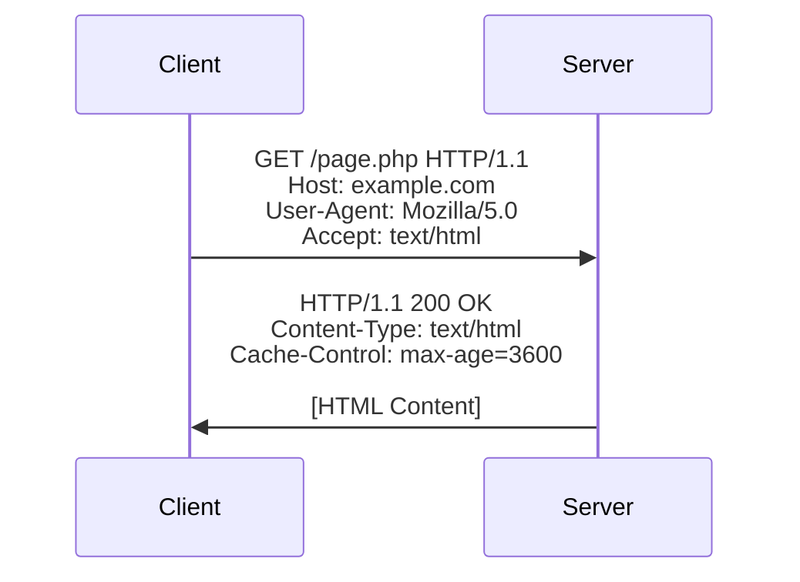

# PHP HTTP Headers

## Introduction

HTTP headers are an essential part of the communication between a client (like a web browser) and a server. They provide important metadata about the HTTP request or response, such as content type, caching instructions, cookies, and much more. In PHP, you can both read incoming headers from client requests and set custom headers in your server responses.

Understanding how to work with HTTP headers is crucial for developing secure, efficient, and feature-rich web applications. In this tutorial, we'll explore how PHP allows you to manipulate HTTP headers and why they're important in web development.

## What Are HTTP Headers?

HTTP headers are key-value pairs sent at the beginning of HTTP requests and responses. They appear before the actual content (body) and provide instructions about how to handle the data being transferred.

Here's a simplified view of what HTTP headers look like:



## Reading HTTP Headers in PHP

PHP makes incoming request headers available through several methods:

### Using `$_SERVER` Superglobal

The simplest way to access HTTP headers is through the `$_SERVER` superglobal array. PHP automatically converts incoming HTTP headers to `$_SERVER` variables by prefixing them with `HTTP_` and converting dashes to underscores.

```php
<?php
// Reading common HTTP headers
$userAgent = $_SERVER['HTTP_USER_AGENT'] ?? 'Unknown';
$acceptLanguage = $_SERVER['HTTP_ACCEPT_LANGUAGE'] ?? 'en';
$referer = $_SERVER['HTTP_REFERER'] ?? 'Direct visit';

echo "User Agent: $userAgent<br>";
echo "Accept Language: $acceptLanguage<br>";
echo "Referred from: $referer<br>";
?>
```

**Output:**
```
User Agent: Mozilla/5.0 (Windows NT 10.0; Win64; x64) AppleWebKit/537.36 (KHTML, like Gecko) Chrome/96.0.4664.110 Safari/537.36
Accept Language: en-US,en;q=0.9
Referred from: https://google.com
```

### Using `getallheaders()`

PHP also provides the `getallheaders()` function, which returns all HTTP request headers as an associative array:

```php
<?php
// Get all HTTP headers
$headers = getallheaders();

echo "<h3>All Request Headers:</h3>";
echo "<pre>";
print_r($headers);
echo "</pre>";
?>
```

**Output:**
```
All Request Headers:

Array
(
    [Host] => example.com
    [User-Agent] => Mozilla/5.0 (Windows NT 10.0; Win64; x64) AppleWebKit/537.36
    [Accept] => text/html,application/xhtml+xml
    [Accept-Language] => en-US,en;q=0.9
    [Accept-Encoding] => gzip, deflate
    [Connection] => keep-alive
    [Referer] => https://google.com
    [Cache-Control] => max-age=0
)
```

### Using `apache_request_headers()`

If you're using Apache, you can also use the `apache_request_headers()` function, which works similarly to `getallheaders()`:

```php
<?php
if (function_exists('apache_request_headers')) {
    $headers = apache_request_headers();
    echo "<h3>Apache Request Headers:</h3>";
    echo "<pre>";
    print_r($headers);
    echo "</pre>";
} else {
    echo "apache_request_headers() function is not available.";
}
?>
```

## Setting HTTP Headers in PHP

PHP allows you to send custom headers in your responses using the `header()` function.

### Basic Syntax

```php
header("Header-Name: Header-Value");
```

### Important Rules for Setting Headers

1. Headers must be sent before any actual output (HTML, echo statements, etc.)
2. Once content begins to output, you can no longer send headers
3. You can use `header_remove()` to remove a previously set header

Here's a simple example:

```php
<?php
// This will work
header("Content-Type: text/plain");
echo "This is plain text";

// This would cause an error
// echo "Some output";
// header("Content-Type: text/plain"); // Error: Headers already sent
?>
```

## Common Use Cases for HTTP Headers

### 1. Redirecting Users

One of the most common uses of headers is to redirect users to different pages:

```php
<?php
// Redirect to another page
header("Location: thank-you.php");
exit; // Important: Always exit after a redirect
?>
```

### 2. Setting Content Types

You can specify the type of content you're sending:

```php
<?php
// Sending JSON data
header("Content-Type: application/json");

$data = [
    "name" => "John Doe",
    "email" => "john@example.com",
    "age" => 30
];

echo json_encode($data);
?>
```

**Output:**
```json
{"name":"John Doe","email":"john@example.com","age":30}
```

### 3. File Downloads

You can use headers to make the browser download a file instead of displaying it:

```php
<?php
// File to download
$file = "documents/report.pdf";

// Check if file exists
if (file_exists($file)) {
    // Set headers
    header("Content-Description: File Transfer");
    header("Content-Type: application/pdf");
    header("Content-Disposition: attachment; filename=report.pdf");
    header("Content-Length: " . filesize($file));
    
    // Send file content
    readfile($file);
    exit;
} else {
    echo "File not found.";
}
?>
```

### 4. Caching Control

You can control how browsers and proxies cache your content:

```php
<?php
// Prevent caching
header("Cache-Control: no-store, no-cache, must-revalidate, max-age=0");
header("Cache-Control: post-check=0, pre-check=0", false);
header("Pragma: no-cache");

// Display current time to show the page is fresh
echo "Current time: " . date("Y-m-d H:i:s");
?>
```

### 5. Cross-Origin Resource Sharing (CORS)

For APIs, you might need to enable cross-origin requests:

```php
<?php
// Allow requests from any domain
header("Access-Control-Allow-Origin: *");
header("Access-Control-Allow-Methods: GET, POST, OPTIONS");
header("Access-Control-Allow-Headers: Content-Type");

// Return some API data
header("Content-Type: application/json");
echo json_encode(["message" => "API is working!"]);
?>
```

## HTTP Headers for Forms Processing

When working with PHP forms, HTTP headers play a crucial role. Here are some common scenarios:

### Redirecting After Form Submission

```php
<?php
if ($_SERVER["REQUEST_METHOD"] == "POST") {
    // Process form data
    $name = $_POST["name"] ?? "";
    $email = $_POST["email"] ?? "";
    
    // Save to database (simplified)
    $success = true; // Assume saving was successful
    
    if ($success) {
        // Redirect to prevent form resubmission
        header("Location: thank-you.php?name=" . urlencode($name));
        exit;
    }
}
?>

<form method="post" action="<?php echo htmlspecialchars($_SERVER["PHP_SELF"]); ?>">
    <label for="name">Name:</label>
    <input type="text" id="name" name="name" required><br>
    
    <label for="email">Email:</label>
    <input type="email" id="email" name="email" required><br>
    
    <input type="submit" value="Submit">
</form>
```

### Creating a File Download from Form Data

```php
<?php
if ($_SERVER["REQUEST_METHOD"] == "POST") {
    // Get form data
    $userData = [
        "name" => $_POST["name"] ?? "Anonymous",
        "email" => $_POST["email"] ?? "",
        "comments" => $_POST["comments"] ?? ""
    ];
    
    // Create a text file with the data
    $content = "Name: " . $userData["name"] . "
";
    $content .= "Email: " . $userData["email"] . "
";
    $content .= "Comments: " . $userData["comments"] . "
";
    
    // Send headers to make browser download a file
    header("Content-Type: text/plain");
    header("Content-Disposition: attachment; filename=user_feedback.txt");
    header("Content-Length: " . strlen($content));
    
    // Output content
    echo $content;
    exit;
}
?>

<form method="post" action="<?php echo htmlspecialchars($_SERVER["PHP_SELF"]); ?>">
    <label for="name">Name:</label>
    <input type="text" id="name" name="name"><br>
    
    <label for="email">Email:</label>
    <input type="email" id="email" name="email"><br>
    
    <label for="comments">Comments:</label>
    <textarea id="comments" name="comments" rows="4" cols="50"></textarea><br>
    
    <input type="submit" value="Download as Text File">
</form>
```

### Handling File Uploads

```php
<?php
if ($_SERVER["REQUEST_METHOD"] == "POST" && isset($_FILES["fileToUpload"])) {
    $uploadDir = "uploads/";
    $uploadFile = $uploadDir . basename($_FILES["fileToUpload"]["name"]);
    $uploadSuccess = false;
    
    // Check if file is valid and move it to uploads directory
    if (move_uploaded_file($_FILES["fileToUpload"]["tmp_name"], $uploadFile)) {
        $uploadSuccess = true;
    }
    
    // Set content type to JSON
    header("Content-Type: application/json");
    
    // Return result as JSON
    echo json_encode([
        "success" => $uploadSuccess,
        "filename" => basename($_FILES["fileToUpload"]["name"]),
        "filepath" => $uploadSuccess ? $uploadFile : null
    ]);
    exit;
}
?>

<form method="post" action="<?php echo htmlspecialchars($_SERVER["PHP_SELF"]); ?>" enctype="multipart/form-data">
    <label for="fileToUpload">Select file to upload:</label>
    <input type="file" id="fileToUpload" name="fileToUpload"><br>
    
    <input type="submit" value="Upload File">
</form>

<div id="result"></div>

<script>
document.querySelector('form').addEventListener('submit', function(e) {
    e.preventDefault();
    
    const formData = new FormData(this);
    
    fetch(this.action, {
        method: 'POST',
        body: formData
    })
    .then(response => response.json())
    .then(data => {
        document.getElementById('result').innerHTML = 
            data.success 
                ? `File <strong>${data.filename}</strong> uploaded successfully!` 
                : 'File upload failed.';
    });
});
</script>
```

## Common HTTP Status Codes

You can set the HTTP status code in your response using the `http_response_code()` function or including it in the header:

```php
<?php
// Set 404 Not Found status
header("HTTP/1.1 404 Not Found");
// or
http_response_code(404);

echo "The page you requested was not found.";
?>
```

Common status codes include:

- **200 OK**: The request succeeded
- **301 Moved Permanently**: Resource has permanently moved to a new location
- **302 Found**: Temporary redirect
- **400 Bad Request**: The server couldn't understand the request
- **401 Unauthorized**: Authentication is required
- **403 Forbidden**: Server understood but refuses to authorize
- **404 Not Found**: Resource not found
- **500 Internal Server Error**: Server encountered an unexpected condition

## Security Considerations

### 1. Setting Security Headers

Modern web applications should include security headers:

```php
<?php
// Protect against XSS attacks
header("Content-Security-Policy: default-src 'self'");

// Prevent MIME type sniffing
header("X-Content-Type-Options: nosniff");

// Enable XSS protection in browsers
header("X-XSS-Protection: 1; mode=block");

// Prevent clickjacking
header("X-Frame-Options: DENY");

// Force HTTPS
header("Strict-Transport-Security: max-age=31536000; includeSubDomains; preload");

echo "This page has enhanced security headers.";
?>
```

### 2. Preventing Header Injection

Always validate and sanitize data used in headers to prevent header injection attacks:

```php
<?php
// Unsafe way (vulnerable to header injection)
$page = $_GET["page"] ?? "home";
// header("Location: " . $page . ".php"); // UNSAFE!

// Safe way
$allowed_pages = ["home", "about", "contact"];
if (in_array($page, $allowed_pages)) {
    header("Location: " . $page . ".php");
} else {
    header("Location: home.php");
}
exit;
?>
```

## Real-World Application: API Authentication

Here's a simplified example of how HTTP headers can be used for API authentication:

```php
<?php
// API key authentication example
function authenticate() {
    // Get API key from headers
    $headers = getallheaders();
    $apiKey = $headers['X-API-Key'] ?? '';
    
    // Check if API key is valid (in real-world, check against database)
    $validApiKeys = ['api123', 'secret456', 'token789'];
    
    if (in_array($apiKey, $validApiKeys)) {
        return true;
    }
    
    // If not valid, send unauthorized response
    header("HTTP/1.1 401 Unauthorized");
    header("Content-Type: application/json");
    echo json_encode([
        "error" => "Invalid API key",
        "message" => "Please provide a valid API key in the X-API-Key header"
    ]);
    exit;
}

// First authenticate the request
authenticate();

// If we get here, the request is authenticated
header("Content-Type: application/json");
echo json_encode([
    "status" => "success",
    "message" => "You are authenticated",
    "data" => ["user_id" => 123, "permissions" => ["read", "write"]]
]);
?>
```

To test this API, you would need to include an `X-API-Key` header in your request:

```
curl -H "X-API-Key: api123" https://example.com/api.php
```

## Debugging HTTP Headers

When debugging, it can be helpful to see all headers being sent:

```php
<?php
// Function to display all headers sent
function debug_headers() {
    // Get all headers that will be sent
    $headers = headers_list();
    
    echo "<h3>Headers Being Sent:</h3>";
    echo "<pre>";
    print_r($headers);
    echo "</pre>";
}

// Set some headers
header("Content-Type: text/html");
header("X-Debug: true");

// Display debug info
debug_headers();

// Continue with regular output
echo "<p>Regular page content here.</p>";
?>
```

## Summary

HTTP headers are a fundamental part of web communication, allowing servers and clients to exchange metadata and instructions. In PHP, you can both read incoming headers and set custom headers in your responses.

Key takeaways from this tutorial:

1. HTTP headers must be sent before any content output
2. Common uses include redirects, setting content types, and controlling caching
3. Headers play a crucial role in security, authentication, and form processing
4. Understanding HTTP headers is essential for building robust web applications

## Exercises for Practice

1. Create a script that detects the user's browser based on the User-Agent header and displays a custom message
2. Build a simple file download system that uses headers to allow users to download files in different formats
3. Implement a basic API that requires authentication via custom headers
4. Create a page that uses headers to prevent caching and displays the current server time
5. Build a form that processes data and redirects to different pages based on the form input

## Additional Resources

- [PHP Manual: header](https://www.php.net/manual/en/function.header.php)
- [PHP Manual: headers_sent](https://www.php.net/manual/en/function.headers-sent.php)
- [MDN Web Docs: HTTP Headers](https://developer.mozilla.org/en-US/docs/Web/HTTP/Headers)
- [OWASP: Secure Headers Project](https://owasp.org/www-project-secure-headers/)