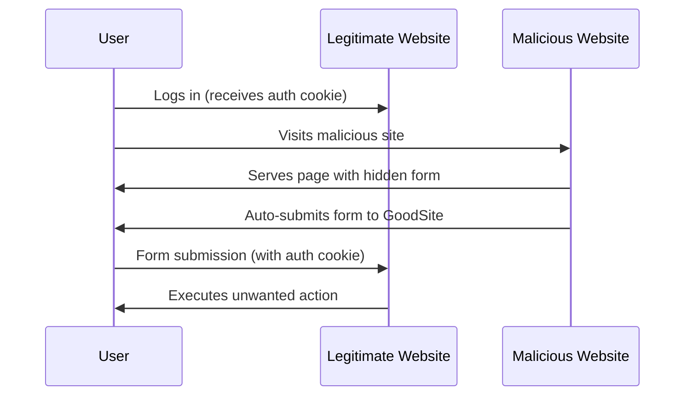

# PHP CSRF Protection

## Introduction

Cross-Site Request Forgery (CSRF) is a common web security vulnerability that allows attackers to trick users into performing unwanted actions on websites where they're already authenticated. In this tutorial, we'll explore how to protect your PHP forms against CSRF attacks, making your web applications more secure.

CSRF attacks work by exploiting the trust that a website has in a user's browser. When you're logged into a website, your browser typically stores authentication cookies. An attacker can create a malicious page that submits a form to that website, and if you visit the attacker's page, your browser will automatically include your authentication cookies with the request.

## Understanding CSRF Attacks

Let's illustrate with a simple example:



### Real-world example:

Imagine you're logged into your bank's website. Without CSRF protection, an attacker could create a page containing a hidden form that transfers money to their account. When you visit this page, the form automatically submits, and your bank processes the transaction because the request includes your authentication cookies.

## Implementing CSRF Protection in PHP

The core idea of CSRF protection is simple: require a secret token in all form submissions that only your server and the legitimate user know.

### Step 1: Generate a CSRF Token

First, we need to generate a random, unique token and store it in the user's session:

```php
<?php
// Start session if not already started
if (session_status() === PHP_SESSION_NONE) {
    session_start();
}

// Generate CSRF token if it doesn't exist
if (!isset($_SESSION['csrf_token'])) {
    $_SESSION['csrf_token'] = bin2hex(random_bytes(32));
}

$csrf_token = $_SESSION['csrf_token'];
?>
```

### Step 2: Include the Token in Your Forms

Add a hidden input field to your HTML forms that contains the CSRF token:

```php
<form method="POST" action="process_form.php">
    <!-- Your other form fields -->
    <input type="text" name="username" placeholder="Username">
    <input type="password" name="password" placeholder="Password">
    
    <!-- CSRF Token hidden field -->
    <input type="hidden" name="csrf_token" value="<?php echo $csrf_token; ?>">
    
    <button type="submit">Submit</button>
</form>
```

### Step 3: Verify the Token on Form Submission

When processing the form submission, verify that the token is valid:

```php
<?php
session_start();

// Verify CSRF token
if (!isset($_POST['csrf_token']) || $_POST['csrf_token'] !== $_SESSION['csrf_token']) {
    // Invalid token, reject the request
    die('CSRF token validation failed');
}

// Token is valid, process the form
// ...your form processing code here...
echo "Form submitted successfully!";
?>
```

## A Complete Example

Let's put it all together with a complete example of a protected form:

### form.php (The form page)

```php
<?php
// Start session
session_start();

// Generate CSRF token
if (!isset($_SESSION['csrf_token'])) {
    $_SESSION['csrf_token'] = bin2hex(random_bytes(32));
}

$csrf_token = $_SESSION['csrf_token'];
?>

<!DOCTYPE html>
<html>
<head>
    <title>CSRF Protected Form</title>
</head>
<body>
    <h1>User Profile Update</h1>
    
    <form method="POST" action="process.php">
        <div>
            <label for="name">Name:</label>
            <input type="text" id="name" name="name" required>
        </div>
        <div>
            <label for="email">Email:</label>
            <input type="email" id="email" name="email" required>
        </div>
        
        <!-- CSRF Token -->
        <input type="hidden" name="csrf_token" value="<?php echo $csrf_token; ?>">
        
        <button type="submit">Update Profile</button>
    </form>
</body>
</html>
```

### process.php (The form processor)

```php
<?php
// Start session
session_start();

// Check if form is submitted
if ($_SERVER['REQUEST_METHOD'] === 'POST') {
    // Verify CSRF token
    if (!isset($_POST['csrf_token']) || $_POST['csrf_token'] !== $_SESSION['csrf_token']) {
        // Invalid token
        http_response_code(403);
        die('Error: CSRF token validation failed');
    }
    
    // Token is valid, process the form data
    $name = htmlspecialchars($_POST['name']);
    $email = htmlspecialchars($_POST['email']);
    
    // Here you would typically update the database
    // For this example, we'll just echo the results
    echo "<h1>Profile Updated</h1>";
    echo "<p>Name: $name</p>";
    echo "<p>Email: $email</p>";
    
    // Optional: Generate a new token for the next request
    $_SESSION['csrf_token'] = bin2hex(random_bytes(32));
} else {
    // Not a POST request
    http_response_code(405);
    echo "Method not allowed";
}
?>
```

## Best Practices for CSRF Protection

1. **Use a Strong Random Token**: Always use a cryptographically secure random number generator.

2. **One-Time Tokens**: For maximum security, generate a new token after each successful form submission.

3. **Set Proper Cookie Attributes**: Use the `SameSite=Lax` or `SameSite=Strict` attribute for your session cookies to provide an additional layer of protection.

4. **Implement Token Expiration**: Set an expiration time for your tokens to limit the window of opportunity for attacks.

5. **Double Submit Cookie**: For added security, send the token both in a cookie and as a hidden form field, then verify they match.

## Example Implementation with Token Expiration

Here's an enhanced version that includes token expiration:

```php
<?php
// Start session
session_start();

// Generate a new token if it doesn't exist or is expired
if (!isset($_SESSION['csrf_token']) || 
    !isset($_SESSION['csrf_token_time']) || 
    time() - $_SESSION['csrf_token_time'] > 3600) { // 1 hour expiration
    
    $_SESSION['csrf_token'] = bin2hex(random_bytes(32));
    $_SESSION['csrf_token_time'] = time();
}

$csrf_token = $_SESSION['csrf_token'];
?>
```

And the verification:

```php
<?php
session_start();

// Verify CSRF token
if (!isset($_POST['csrf_token']) || 
    !isset($_SESSION['csrf_token']) ||
    !isset($_SESSION['csrf_token_time']) ||
    $_POST['csrf_token'] !== $_SESSION['csrf_token'] ||
    time() - $_SESSION['csrf_token_time'] > 3600) { // Check if token is expired
    
    // Invalid or expired token
    die('CSRF token validation failed or token expired');
}

// Token is valid, process the form
// ... your form processing code here ...
?>
```

## Common Pitfalls to Avoid

1. **Using Predictable Tokens**: Never use simple or predictable tokens like user IDs or timestamps.

2. **Not Enforcing Token Verification**: Make sure all sensitive actions require token verification.

3. **Using GET Requests for State Changes**: Always use POST, PUT, or DELETE for actions that change state.

4. **Storing Tokens in JavaScript Variables**: This can expose them to XSS attacks.

## Real-World Applications

### Banking Transfers

When implementing a money transfer form:

```php
<form method="POST" action="transfer.php">
    <div>
        <label for="recipient">Recipient Account:</label>
        <input type="text" id="recipient" name="recipient" required>
    </div>
    <div>
        <label for="amount">Amount:</label>
        <input type="number" id="amount" name="amount" min="0.01" step="0.01" required>
    </div>
    
    <!-- CSRF Token -->
    <input type="hidden" name="csrf_token" value="<?php echo $csrf_token; ?>">
    
    <button type="submit">Transfer Money</button>
</form>
```

### User Settings Updates

```php
<form method="POST" action="update_settings.php">
    <div>
        <label for="notifications">
            <input type="checkbox" id="notifications" name="notifications" value="1">
            Enable email notifications
        </label>
    </div>
    <div>
        <label for="theme">Theme:</label>
        <select id="theme" name="theme">
            <option value="light">Light</option>
            <option value="dark">Dark</option>
            <option value="system">System Default</option>
        </select>
    </div>
    
    <!-- CSRF Token -->
    <input type="hidden" name="csrf_token" value="<?php echo $csrf_token; ?>">
    
    <button type="submit">Save Settings</button>
</form>
```

## CSRF Protection in AJAX Requests

For JavaScript-based form submissions with AJAX, you can pass the token in the headers or as part of the request body:

```javascript
// Get the token from a meta tag
const csrfToken = document.querySelector('meta[name="csrf-token"]').getAttribute('content');

// Using fetch to submit the form
fetch('process.php', {
    method: 'POST',
    headers: {
        'Content-Type': 'application/json',
        'X-CSRF-Token': csrfToken  // Send token in header
    },
    body: JSON.stringify({
        name: document.getElementById('name').value,
        email: document.getElementById('email').value,
        csrf_token: csrfToken  // Also include in the body
    })
})
.then(response => response.json())
.then(data => console.log(data))
.catch(error => console.error('Error:', error));
```

On the server side, you'd check for the token in both the header and the request body.

## Summary

CSRF protection is a crucial security measure for all web applications that process forms. By implementing the techniques we've covered:

1. Generating random, secure tokens
2. Including them in all forms
3. Verifying them on submission
4. Implementing token expiration

You can significantly reduce the risk of CSRF attacks on your PHP applications.

## Exercises

1. **Basic Implementation**: Create a simple contact form with CSRF protection.
2. **Token Expiration**: Implement a system where tokens expire after 30 minutes.
3. **AJAX Integration**: Build a form that submits via AJAX while maintaining CSRF protection.
4. **Multiple Forms**: Create a page with multiple forms, each with its own CSRF token.
5. **Framework Integration**: If you're using a PHP framework like Laravel or Symfony, research how they implement CSRF protection and practice using their built-in features.

## Additional Resources

- [OWASP CSRF Prevention Cheat Sheet](https://cheatsheetseries.owasp.org/cheatsheets/Cross-Site_Request_Forgery_Prevention_Cheat_Sheet.html)
- [PHP Security Manual: Cross-Site Request Forgeries](https://www.php.net/manual/en/security.csrf.php)
- [Mozilla Developer Network (MDN): Cross-Site Request Forgery](https://developer.mozilla.org/en-US/docs/Glossary/CSRF)