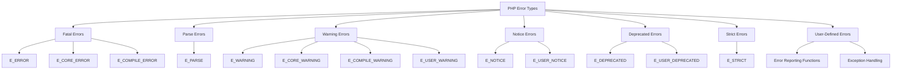

# PHP Error Types

## Introduction

When writing PHP code, errors are inevitable. Understanding the different types of errors that can occur in PHP is crucial for effective debugging and creating robust applications. PHP categorizes errors into several distinct types, each with its own severity level and handling requirements.

This guide will walk you through the main types of errors in PHP, explain how they differ, and provide practical examples of how they occur and how to handle them. Whether you're debugging your code or implementing error handling strategies, knowing these error types will significantly improve your PHP development skills.

## PHP Error Type Overview

PHP has several predefined error types, each represented by a constant. These error types help developers identify the nature and severity of problems in their code.



Let's explore each of these error types in detail.

## Fatal Errors

Fatal errors are the most serious type of errors in PHP. When a fatal error occurs, script execution stops immediately, and no further code is processed.

### E_ERROR

These are critical runtime errors that cannot be recovered from. They indicate problems such as memory allocation issues, calling undefined functions, or other serious problems.

**Example:**

```php
<?php
// Attempting to call a function that doesn't exist
nonExistentFunction();

echo "This line will never be executed";
?>
```

**Output:**
```
Fatal error: Uncaught Error: Call to undefined function nonExistentFunction() in /path/to/your/file.php:3
Stack trace:
#0 {main}
  thrown in /path/to/your/file.php on line 3
```

### E_CORE_ERROR

These are fatal errors that occur during PHP's initial startup, often related to core PHP functions or extensions.

### E_COMPILE_ERROR

These are fatal errors that occur during compilation. They're typically related to syntax or structural issues in your code.

## Parse Errors (E_PARSE)

Parse errors occur when the PHP parser encounters syntax errors in your code. Like fatal errors, parse errors halt script execution.

**Example:**

```php
<?php
// Missing semicolon
$name = "John"
echo "Hello, $name!";
?>
```

**Output:**
```
Parse error: syntax error, unexpected 'echo' (T_ECHO), expecting ',' or ';' in /path/to/your/file.php on line 4
```

## Warning Errors

Warning errors indicate issues that are not fatal but might lead to problems in your script. Unlike fatal errors, warnings allow the script to continue execution.

### E_WARNING

Runtime warnings that don't halt script execution but indicate potential issues.

**Example:**

```php
<?php
// Attempting to include a file that doesn't exist
include 'non_existent_file.php';

echo "This line will still be executed despite the warning.";
?>
```

**Output:**
```
Warning: include(non_existent_file.php): Failed to open stream: No such file or directory in /path/to/your/file.php on line 3

Warning: include(): Failed opening 'non_existent_file.php' for inclusion in /path/to/your/file.php on line 3
This line will still be executed despite the warning.
```

### E_USER_WARNING

Similar to E_WARNING, but triggered manually by the programmer using the `trigger_error()` function.

**Example:**

```php
<?php
// User-defined warning
function divide($numerator, $denominator) {
    if ($denominator == 0) {
        trigger_error("Division by zero is not allowed", E_USER_WARNING);
        return null;
    }
    return $numerator / $denominator;
}

$result = divide(10, 0);
echo "The script continues after the warning.";
?>
```

**Output:**
```
Warning: Division by zero is not allowed in /path/to/your/file.php on line 5
The script continues after the warning.
```

## Notice Errors

Notices are minor issues that indicate that PHP encountered something that might be an error, but could also be expected in some contexts. The script continues to run.

### E_NOTICE

Runtime notices that indicate potential issues but are less severe than warnings.

**Example:**

```php
<?php
// Trying to access an undefined variable
echo $undefinedVariable;

echo "The script continues after the notice.";
?>
```

**Output:**
```
Notice: Undefined variable: undefinedVariable in /path/to/your/file.php on line 3
The script continues after the notice.
```

### E_USER_NOTICE

Similar to E_NOTICE, but manually triggered by the programmer.

**Example:**

```php
<?php
function processData($data) {
    if (empty($data)) {
        trigger_error("Empty data provided, using default values", E_USER_NOTICE);
        $data = ["default" => "value"];
    }
    return $data;
}

$result = processData([]);
var_dump($result);
?>
```

**Output:**
```
Notice: Empty data provided, using default values in /path/to/your/file.php on line 4
array(1) {
  ["default"]=>
  string(5) "value"
}
```

## Deprecated Errors

Deprecated errors indicate that you're using PHP functions or features that are scheduled for removal in future PHP versions.

### E_DEPRECATED

Alerts about features that will be removed in future PHP versions.

**Example:**

```php
<?php
// Using a deprecated PHP function
$password = "password123";
$hash = mcrypt_encrypt(MCRYPT_RIJNDAEL_256, $password, "data", MCRYPT_MODE_ECB);
// mcrypt functions are deprecated as of PHP 7.1.0

echo "The script continues after the deprecation notice.";
?>
```

**Output (in PHP 7.1 or higher):**
```
Deprecated: Function mcrypt_encrypt() is deprecated in /path/to/your/file.php on line 4
The script continues after the deprecation notice.
```

### E_USER_DEPRECATED

Similar to E_DEPRECATED, but triggered manually by the programmer, often used in libraries or frameworks to mark functions that will be removed in future versions.

**Example:**

```php
<?php
// Marking a function as deprecated
function oldFunction() {
    trigger_error("This function is deprecated. Use newFunction() instead", E_USER_DEPRECATED);
    // Function implementation
}

oldFunction();
echo "The script continues after the user deprecation notice.";
?>
```

**Output:**
```
Deprecated: This function is deprecated. Use newFunction() instead in /path/to/your/file.php on line 4
The script continues after the user deprecation notice.
```

## Strict Errors (E_STRICT)

Strict errors are suggestions made by PHP to help you use the latest and best practices. They don't affect script execution.

**Example:**

```php
<?php
// Example that might trigger a strict standards error
class ParentClass {
    function myMethod() {
        echo "Parent method";
    }
}

class ChildClass extends ParentClass {
    function myMethod() {
        echo "Child method";
    }
}

$obj = new ChildClass();
$obj->myMethod();
?>
```

In newer PHP versions, this might generate a strict standards notice suggesting that you should declare the methods with the same signature (including parameter types and return types).

## Practical Error Handling Examples

Now that we've covered the various error types, let's look at some practical examples of how to handle them in real-world applications.

### Setting Error Reporting Level

You can configure which errors PHP reports using the `error_reporting()` function:

```php
<?php
// Report all errors except notices
error_reporting(E_ALL & ~E_NOTICE);

// Only report fatal errors
// error_reporting(E_ERROR | E_PARSE | E_CORE_ERROR);

// Report all errors (recommended during development)
// error_reporting(E_ALL);

// Suppress all errors (not recommended, especially in development)
// error_reporting(0);

// Continue with your code...
?>
```

### Custom Error Handling

For more control, you can define your own error handler using `set_error_handler()`:

```php
<?php
// Custom error handler function
function customErrorHandler($errno, $errstr, $errfile, $errline) {
    echo "<div style='border: 1px solid red; padding: 10px; margin: 10px;'>";
    echo "<h2>Error Detected:</h2>";
    echo "<p>Error Level: $errno</p>";
    echo "<p>Error Message: $errstr</p>";
    echo "<p>File: $errfile</p>";
    echo "<p>Line: $errline</p>";
    echo "</div>";
    
    // Return false for fatal errors to allow PHP's internal handler to run
    if ($errno == E_ERROR || $errno == E_CORE_ERROR || $errno == E_COMPILE_ERROR || $errno == E_PARSE) {
        return false;
    }
    
    // Return true to indicate the error has been handled
    return true;
}

// Set the custom error handler
set_error_handler("customErrorHandler");

// This will trigger our custom error handler
echo $undefinedVariable;

// This will also trigger our custom error handler
include 'non_existent_file.php';

echo "The script continues execution.";
?>
```

### Exception Handling

Modern PHP code often uses exceptions instead of traditional error handling:

```php
<?php
function divideNumbers($a, $b) {
    if ($b == 0) {
        throw new Exception("Division by zero is not allowed");
    }
    return $a / $b;
}

try {
    echo divideNumbers(10, 2) . "<br>"; // Works fine
    echo divideNumbers(10, 0) . "<br>"; // This will throw an exception
    echo "This line will not be executed";
} catch (Exception $e) {
    echo "Caught exception: " . $e->getMessage() . "<br>";
    echo "in file " . $e->getFile() . " on line " . $e->getLine() . "<br>";
} finally {
    echo "This block always executes, regardless of whether an exception occurred";
}

echo "<br>Script continues after the try-catch block";
?>
```

**Output:**
```
5
Caught exception: Division by zero is not allowed
in file /path/to/your/file.php on line 4
This block always executes, regardless of whether an exception occurred
Script continues after the try-catch block
```

## Real-World Application: Form Validation

Here's a practical example of handling different error types in a form validation scenario:

```php
<?php
// Initialize an array to store errors
$formErrors = [];

// Check if the form is submitted
if ($_SERVER["REQUEST_METHOD"] == "POST") {
    try {
        // Validate email
        if (empty($_POST["email"])) {
            $formErrors["email"] = "Email is required";
        } elseif (!filter_var($_POST["email"], FILTER_VALIDATE_EMAIL)) {
            $formErrors["email"] = "Invalid email format";
        }
        
        // Validate age
        if (empty($_POST["age"])) {
            $formErrors["age"] = "Age is required";
        } elseif (!is_numeric($_POST["age"])) {
            $formErrors["age"] = "Age must be a number";
        } elseif ($_POST["age"] < 18) {
            throw new Exception("You must be at least 18 years old");
        }
        
        // If no errors, process the form
        if (empty($formErrors)) {
            echo "Form processed successfully!";
            // Process form data here...
        }
    } catch (Exception $e) {
        $formErrors["general"] = $e->getMessage();
    }
}
?>

<!-- HTML Form -->
<form method="post" action="<?php echo htmlspecialchars($_SERVER["PHP_SELF"]); ?>">
    <div>
        <label for="email">Email:</label>
        <input type="text" name="email" id="email" value="<?php echo isset($_POST['email']) ? htmlspecialchars($_POST['email']) : ''; ?>">
        <?php if (isset($formErrors["email"])) echo "<span style='color: red;'>" . $formErrors["email"] . "</span>"; ?>
    </div>
    
    <div>
        <label for="age">Age:</label>
        <input type="text" name="age" id="age" value="<?php echo isset($_POST['age']) ? htmlspecialchars($_POST['age']) : ''; ?>">
        <?php if (isset($formErrors["age"])) echo "<span style='color: red;'>" . $formErrors["age"] . "</span>"; ?>
    </div>
    
    <?php if (isset($formErrors["general"])) echo "<div style='color: red;'>" . $formErrors["general"] . "</div>"; ?>
    
    <button type="submit">Submit</button>
</form>
```

This example demonstrates how to:
1. Validate form inputs and handle different types of errors
2. Use exceptions for critical errors
3. Display appropriate error messages to the user
4. Maintain form state when errors occur

## Error Logging

In production environments, it's often better to log errors rather than displaying them to users:

```php
<?php
// Disable displaying errors to users
ini_set('display_errors', 0);

// Enable error logging
ini_set('log_errors', 1);

// Set the error log file
ini_set('error_log', '/path/to/error.log');

// Log a custom error message
error_log("This is a custom error message");

// Log an error with severity level
trigger_error("This is a warning", E_USER_WARNING);

// Intentionally cause an error (for demonstration)
nonExistentFunction();

echo "The user won't see any errors, but they'll be logged";
?>
```

## Summary

Understanding PHP error types is essential for effective debugging and building robust applications:

1. **Fatal Errors (E_ERROR)**: Critical errors that stop script execution
2. **Parse Errors (E_PARSE)**: Syntax errors that prevent code compilation
3. **Warning Errors (E_WARNING)**: Non-fatal issues that might indicate problems
4. **Notice Errors (E_NOTICE)**: Minor issues or potential problems
5. **Deprecated Errors (E_DEPRECATED)**: Features that will be removed in future PHP versions
6. **Strict Errors (E_STRICT)**: Suggestions for best practices
7. **User-Defined Errors**: Custom errors triggered by the programmer

Proper error handling is crucial for:
- Debugging your code efficiently
- Creating user-friendly applications
- Maintaining code quality
- Ensuring security and reliability

## Additional Resources and Exercises

### Further Reading
- [PHP Manual: Error Handling](https://www.php.net/manual/en/book.errorfunc.php)
- [PHP Manual: Exceptions](https://www.php.net/manual/en/language.exceptions.php)
- [PHP Manual: Error Constants](https://www.php.net/manual/en/errorfunc.constants.php)

### Exercises

1. **Basic Error Recognition**:
   Create a PHP script with different types of errors (parse, notice, warning, fatal) and observe how PHP handles each.

2. **Custom Error Handler**:
   Implement a custom error handler that logs different error types to separate files.

3. **Exception Chaining**:
   Create a scenario with multiple functions where exceptions are thrown, caught, and re-thrown with additional information.

4. **Error Logging System**:
   Build a simple error logging system that categorizes errors by severity and provides an interface to view them.

5. **Try-Catch Practice**:
   Refactor an existing piece of code to use exception handling instead of traditional error checking.

By mastering PHP error types and implementing proper error handling, you'll significantly improve your debugging skills and the overall quality of your PHP applications.