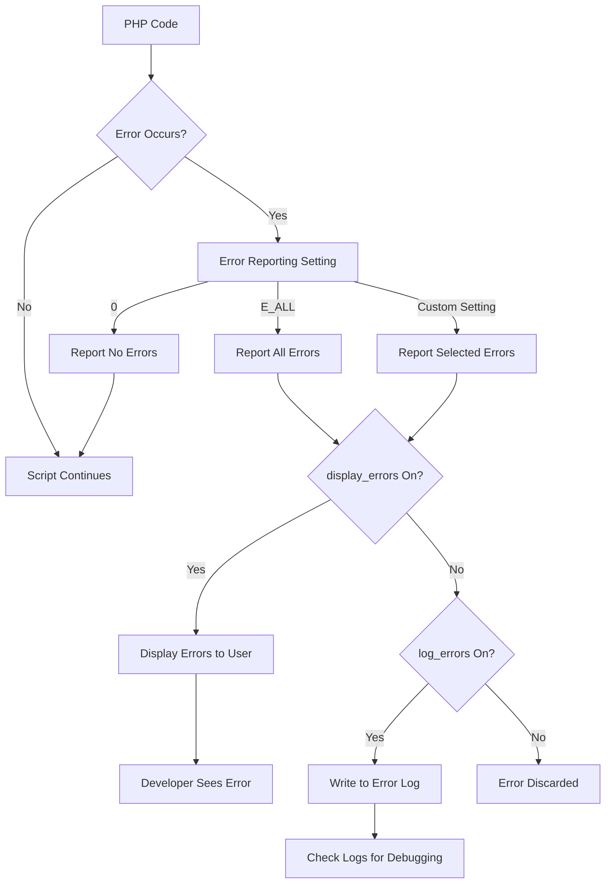

# PHP Error Reporting

## Introduction

When developing PHP applications, encountering errors is inevitable. Understanding how to properly configure and use PHP's error reporting system is crucial for efficient debugging and creating robust applications. This guide will walk you through PHP's error reporting mechanisms, helping you identify and fix issues in your code more effectively.

Error reporting in PHP allows you to:
- Display errors during development
- Log errors in production environments
- Control which types of errors are reported
- Create custom error handlers

## PHP Error Types

Before diving into error reporting configuration, let's understand the different types of errors PHP can generate:

| Error Type | Description | Example |
|------------|-------------|---------|
| Notice | Non-critical errors that PHP encounters while executing a script | Using an undefined variable |
| Warning | More serious errors that don't stop script execution | Including a file that doesn't exist |
| Fatal Error | Critical errors that terminate script execution | Calling an undefined function |
| Parse Error | Syntax errors in your code | Missing semicolon or bracket |
| Deprecated | Function or feature that will be removed in future PHP versions | Using functions marked as deprecated |

## Configuring Error Reporting

### Using the `error_reporting()` Function

The `error_reporting()` function allows you to set which errors are reported during script execution.

```php
// Report all PHP errors
error_reporting(E_ALL);

// Report all errors except notices
error_reporting(E_ALL & ~E_NOTICE);

// Report only fatal errors
error_reporting(E_ERROR | E_PARSE);
```

### Error Reporting Constants

PHP provides predefined constants for error reporting:

| Constant | Value | Description |
|----------|-------|-------------|
| E_ERROR | 1 | Fatal run-time errors |
| E_WARNING | 2 | Run-time warnings |
| E_PARSE | 4 | Compile-time parse errors |
| E_NOTICE | 8 | Run-time notices |
| E_DEPRECATED | 8192 | Functions that will be removed in future versions |
| E_ALL | 32767 | All errors and warnings |

### Displaying Errors

By default, PHP might not display errors in your browser. You can control this with the `display_errors` directive:

```php
// Enable display of errors
ini_set('display_errors', 1);

// Disable display of errors
ini_set('display_errors', 0);
```

### Error Logging

For production environments, it's recommended to log errors rather than display them:

```php
// Enable error logging
ini_set('log_errors', 1);

// Set path to error log
ini_set('error_log', '/path/to/error.log');
```

## Practical Example: Debugging a PHP Script

Let's see how error reporting helps in a real-world scenario:

```php
<?php
// Enable comprehensive error reporting during development
error_reporting(E_ALL);
ini_set('display_errors', 1);

// Attempt to use an undefined variable
$total = $price * $quantity;

// Try to include a file that might not exist
include('config.php');

// Call a function that might not be defined
calculate_total();
?>
```

**Output:**
```
Notice: Undefined variable: price in /path/to/file.php on line 7
Notice: Undefined variable: quantity in /path/to/file.php on line 7
Warning: include(config.php): Failed to open stream: No such file or directory in /path/to/file.php on line 10
Warning: include(): Failed opening 'config.php' for inclusion in /path/to/file.php on line 10
Fatal error: Uncaught Error: Call to undefined function calculate_total() in /path/to/file.php:13
```

With error reporting enabled, you can quickly identify:
1. The undefined variables (`$price` and `$quantity`)
2. A missing include file (`config.php`)
3. A call to an undefined function (`calculate_total()`)

## Configuration in php.ini

You can also set error reporting settings in your `php.ini` configuration file:

```ini
; Report all PHP errors
error_reporting = E_ALL

; Display errors
display_errors = On

; Don't display errors in production
; display_errors = Off

; Log errors
log_errors = On

; Set error log path
error_log = /path/to/error.log
```

## Error Reporting Flow



## Creating a Custom Error Handler

PHP allows you to define your own error handler function to customize error processing:

```php
<?php
// Define custom error handler
function customErrorHandler($errno, $errstr, $errfile, $errline) {
    echo "<div style='border:1px solid red; padding:10px; margin:10px; background-color:#ffeeee;'>";
    echo "<h2>Error Occurred</h2>";
    echo "<p><strong>Error Level:</strong> $errno</p>";
    echo "<p><strong>Error Message:</strong> $errstr</p>";
    echo "<p><strong>File:</strong> $errfile</p>";
    echo "<p><strong>Line:</strong> $errline</p>";
    echo "</div>";
    
    // Log the error
    error_log("Error [$errno]: $errstr in $errfile on line $errline");
    
    // Don't execute PHP's internal error handler
    return true;
}

// Set the custom error handler
set_error_handler("customErrorHandler");

// Test with an undefined variable
$test = $undefinedVariable;
?>
```

**Output:**
```
Error Occurred
Error Level: 8
Error Message: Undefined variable: undefinedVariable
File: /path/to/file.php
Line: 23
```

## Development vs. Production Error Handling

Error reporting should be configured differently depending on your environment:

### Development Environment

```php
<?php
// Development environment - Show all errors
error_reporting(E_ALL);
ini_set('display_errors', 1);
ini_set('display_startup_errors', 1);
?>
```

### Production Environment

```php
<?php
// Production environment - Log errors but don't display them
error_reporting(E_ALL);
ini_set('display_errors', 0);
ini_set('log_errors', 1);
ini_set('error_log', '/path/to/error.log');
?>
```

## Best Practices for Error Handling

1. **Always enable comprehensive error reporting during development**
   ```php
   error_reporting(E_ALL);
   ini_set('display_errors', 1);
   ```

2. **Never display errors in production**
   ```php
   ini_set('display_errors', 0);
   ```

3. **Always log errors in production**
   ```php
   ini_set('log_errors', 1);
   ini_set('error_log', '/path/to/error.log');
   ```

4. **Use try-catch blocks for handling exceptions**
   ```php
   try {
       // Code that might throw an exception
       $result = riskyOperation();
   } catch (Exception $e) {
       // Handle the exception
       echo "An error occurred: " . $e->getMessage();
       // Log the exception
       error_log("Exception: " . $e->getMessage());
   }
   ```

5. **Check error logs regularly in production**

## Summary

PHP error reporting is a crucial component of the development process. By properly configuring error reporting, you can:

- Quickly identify and fix bugs during development
- Keep user experiences smooth in production by hiding errors
- Maintain detailed error logs for troubleshooting
- Create custom error handlers for specific needs

Understanding how to effectively use PHP's error reporting mechanisms will help you build more robust applications and significantly reduce debugging time.

## Additional Resources

- [PHP Manual: Error Handling](https://www.php.net/manual/en/book.errorfunc.php)
- [PHP Manual: Error Constants](https://www.php.net/manual/en/errorfunc.constants.php)
- [PHP Manual: set_error_handler](https://www.php.net/manual/en/function.set-error-handler.php)

## Exercises

1. Create a PHP script that demonstrates the difference between E_WARNING and E_NOTICE errors.
2. Write a custom error handler that formats errors as JSON for an API response.
3. Configure a development environment with comprehensive error reporting and a production environment with error logging.
4. Create a script that intentionally generates different types of errors and handles them appropriately.
5. Modify the custom error handler to send critical errors via email to the administrator.