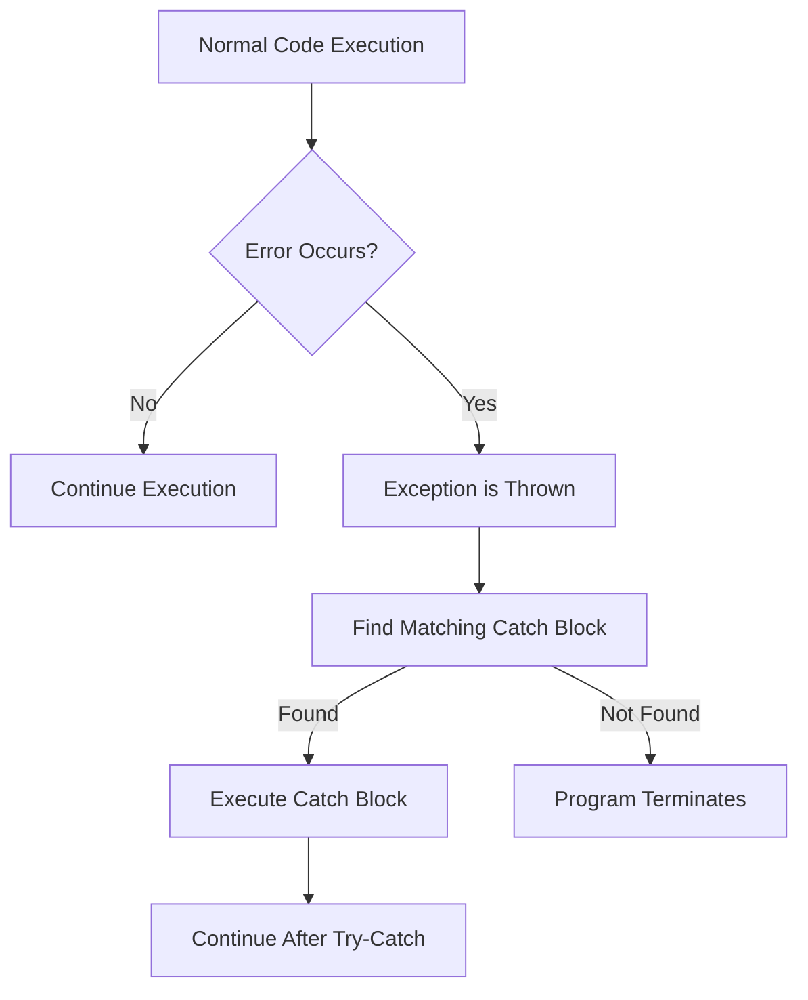

# PHP Try Catch

## Introduction

When developing PHP applications, errors are inevitable. Whether it's a database connection failure, a missing file, or invalid user input, your code needs to handle these situations gracefully. This is where PHP's exception handling mechanism, specifically the `try-catch` blocks, comes into play.

Exception handling allows you to:
- Separate error handling code from your normal code
- Handle different errors in different ways
- Provide meaningful error messages to users
- Prevent your application from crashing when something goes wrong

In this tutorial, we'll explore how to use `try-catch` blocks to handle exceptions in PHP and make your applications more robust.

## Understanding Exceptions in PHP

An exception is an object that describes an error or unexpected behavior in your PHP script. When an error occurs, PHP "throws" an exception, which interrupts the normal flow of your program.

Here's a simple diagram showing the flow of execution when an exception occurs:



## Basic Syntax of Try-Catch

The basic structure of a try-catch block in PHP looks like this:

```php
try {
    // Code that might throw an exception
} catch (ExceptionType $exception) {
    // Code to handle the exception
}
```

Here's what each part does:
- The `try` block contains the code that might cause an error
- The `catch` block contains the code that will execute if an exception occurs
- `ExceptionType` specifies what kind of exception this block can catch
- `$exception` is a variable that holds the exception object, which contains information about the error

## Your First Try-Catch Example

Let's look at a simple example of using try-catch to handle a division by zero error:

```php
<?php
// Example 1: Basic try-catch
try {
    $numerator = 10;
    $denominator = 0;
    
    if ($denominator === 0) {
        throw new Exception("Division by zero is not allowed");
    }
    
    $result = $numerator / $denominator;
    echo "Result: $result";
} catch (Exception $e) {
    echo "Error: " . $e->getMessage();
}
?>
```

**Output:**
```
Error: Division by zero is not allowed
```

In this example:
1. We try to divide 10 by 0
2. We check if the denominator is zero, and if it is, we throw an exception
3. The catch block catches the exception and displays an error message

Without the try-catch block, this would have resulted in a fatal error and the script would have stopped execution.

## The Exception Object

When you catch an exception, you have access to the exception object, which provides several useful methods:

```php
<?php
try {
    throw new Exception("Something went wrong", 100);
} catch (Exception $e) {
    echo "Message: " . $e->getMessage() . "<br>";
    echo "Code: " . $e->getCode() . "<br>";
    echo "File: " . $e->getFile() . "<br>";
    echo "Line: " . $e->getLine() . "<br>";
    echo "Trace: <pre>" . $e->getTraceAsString() . "</pre>";
}
?>
```

**Output:**
```
Message: Something went wrong
Code: 100
File: /path/to/your/file.php
Line: 3
Trace: 
#0 {main}
```

These methods allow you to access detailed information about where and why the exception occurred.

## Multiple Catch Blocks

You can have multiple catch blocks to handle different types of exceptions:

```php
<?php
try {
    $file = fopen("nonexistent_file.txt", "r");
    if (!$file) {
        throw new Exception("File not found");
    }
    // More code...
} catch (InvalidArgumentException $e) {
    echo "Invalid argument: " . $e->getMessage();
} catch (Exception $e) {
    echo "General error: " . $e->getMessage();
}
?>
```

**Output:**
```
General error: File not found
```

The catch blocks are checked in order, and the first matching one is executed. This allows you to handle specific exceptions differently from general ones.

## Built-in Exception Classes

PHP provides several built-in exception classes:

- `Exception` - The base class for all exceptions
- `Error` - The base class for all internal PHP errors (PHP 7+)
- `ArgumentCountError` - Thrown when few arguments are passed to a function
- `ArithmeticError` - Thrown when an error occurs during mathematical operations
- `AssertionError` - Thrown when an assertion fails
- `DivisionByZeroError` - Thrown when attempting to divide by zero
- `ParseError` - Thrown when there's a syntax error
- `TypeError` - Thrown when a value is not of the expected type

These can be caught specifically or generally by catching their parent classes.

## Creating Custom Exceptions

You can create your own exception classes by extending the base `Exception` class:

```php
<?php
// Define custom exception
class DatabaseException extends Exception {
    public function errorMessage() {
        return "Database Error: " . $this->getMessage();
    }
}

// Using the custom exception
try {
    // Simulate a database connection error
    $connected = false;
    
    if (!$connected) {
        throw new DatabaseException("Failed to connect to the database");
    }
    
    echo "Database connection successful!";
} catch (DatabaseException $e) {
    echo $e->errorMessage();
} catch (Exception $e) {
    echo "General Error: " . $e->getMessage();
}
?>
```

**Output:**
```
Database Error: Failed to connect to the database
```

Custom exceptions allow you to categorize and handle different types of errors in a more organized way.

## The Finally Block

The `finally` block will be executed regardless of whether an exception was thrown or caught:

```php
<?php
$file = null;

try {
    $file = fopen("example.txt", "w");
    fwrite($file, "Writing to file");
    // Some code that might throw an exception
    throw new Exception("Something went wrong");
} catch (Exception $e) {
    echo "Caught exception: " . $e->getMessage() . "<br>";
} finally {
    if ($file) {
        fclose($file);
        echo "File closed successfully";
    }
}
?>
```

**Output:**
```
Caught exception: Something went wrong
File closed successfully
```

The `finally` block is especially useful for cleanup operations like closing files or database connections that need to happen regardless of whether an error occurred.

## Real-World Examples

### Example 1: Database Connection

```php
<?php
function connectToDatabase($host, $username, $password, $database) {
    try {
        $conn = new mysqli($host, $username, $password, $database);
        
        if ($conn->connect_error) {
            throw new Exception("Connection failed: " . $conn->connect_error);
        }
        
        echo "Connected successfully!<br>";
        return $conn;
    } catch (Exception $e) {
        error_log("Database connection error: " . $e->getMessage());
        echo "We're sorry, but we couldn't connect to the database. Please try again later.<br>";
        return null;
    }
}

// Usage
$conn = connectToDatabase("localhost", "wrong_user", "wrong_password", "my_database");
if ($conn) {
    // Proceed with database operations
    echo "Performing database operations...";
} else {
    // Handle the error case
    echo "Skipping database operations due to connection error.";
}
?>
```

This example shows a practical way to handle database connection errors.

### Example 2: File Upload Handling

```php
<?php
function uploadFile($fileData) {
    try {
        // Check if file was uploaded
        if (!isset($fileData) || $fileData['error'] !== UPLOAD_ERR_OK) {
            throw new Exception("File upload failed with error code: " . $fileData['error']);
        }
        
        // Check file size
        if ($fileData['size'] > 1000000) {
            throw new Exception("File is too large. Maximum size is 1MB.");
        }
        
        // Check file type
        $fileType = pathinfo($fileData['name'], PATHINFO_EXTENSION);
        if (!in_array(strtolower($fileType), ['jpg', 'jpeg', 'png', 'gif'])) {
            throw new Exception("Only JPG, JPEG, PNG, and GIF files are allowed.");
        }
        
        // Generate unique filename
        $newFilename = uniqid() . '.' . $fileType;
        $destination = 'uploads/' . $newFilename;
        
        // Try to move the uploaded file
        if (!move_uploaded_file($fileData['tmp_name'], $destination)) {
            throw new Exception("Failed to move uploaded file.");
        }
        
        return $destination;
    } catch (Exception $e) {
        // Log error
        error_log("File upload error: " . $e->getMessage());
        
        // Return error message to user
        return ['error' => $e->getMessage()];
    }
}

// Usage example (with simulated file data for demonstration)
$fileData = [
    'name' => 'image.pdf',  // Not an allowed type
    'error' => UPLOAD_ERR_OK,
    'size' => 500000,
    'tmp_name' => 'temp/abc123'
];

$result = uploadFile($fileData);
if (is_array($result) && isset($result['error'])) {
    echo "Error: " . $result['error'];
} else {
    echo "File uploaded successfully to: " . $result;
}
?>
```

**Output:**
```
Error: Only JPG, JPEG, PNG, and GIF files are allowed.
```

This example demonstrates how to use exceptions to handle various error conditions during file uploads.

## Best Practices for Using Try-Catch

1. **Only catch what you can handle**: Don't catch exceptions if you don't know how to recover from them.

2. **Be specific with exception types**: Catch specific exception types rather than the generic `Exception` class when possible.

3. **Provide meaningful error messages**: Make your error messages descriptive and helpful.

4. **Log exceptions**: Always log exceptions for debugging purposes, especially in production environments.

5. **Don't overuse exceptions**: Exceptions should be used for exceptional circumstances, not for normal control flow.

6. **Always include try-catch blocks when working with external systems**: Databases, APIs, file systems, etc.

7. **Use finally for cleanup**: Always clean up resources (close files, database connections) in a `finally` block.

## Summary

PHP's try-catch mechanism is a powerful tool for handling errors and exceptions in your applications. By implementing proper exception handling:

- Your applications become more robust and can recover from errors
- Users receive friendly error messages instead of seeing technical error details
- You can log detailed error information for debugging
- Resources are properly cleaned up even when errors occur

The basic flow involves:
1. Placing potentially problematic code in `try` blocks
2. Catching exceptions in `catch` blocks
3. Handling cleanup operations in `finally` blocks
4. Creating custom exceptions when needed for more specific error handling

## Exercises

1. Create a function that reads a file and returns its contents. Use try-catch to handle the case where the file doesn't exist.

2. Modify the database connection example to include custom exceptions for different types of database errors.

3. Write a user registration script that validates user input and throws exceptions for invalid data.

4. Create a calculator function that handles division by zero and other arithmetic errors using try-catch.

## Additional Resources

- [PHP Exception Documentation](https://www.php.net/manual/en/language.exceptions.php)
- [PHP Built-in Exceptions](https://www.php.net/manual/en/reserved.exceptions.php)
- [Error Handling Best Practices](https://phptherightway.com/#exceptions)

Remember that proper error handling is a critical part of any robust application. The time you invest in implementing good exception handling will save you much more time in debugging and maintenance in the future!