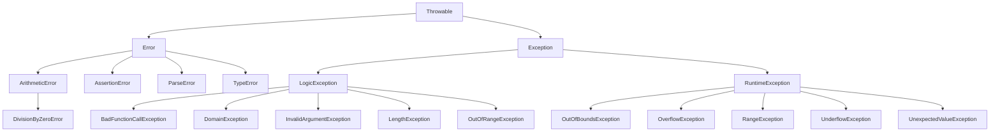

# PHP Throw Exception

## Introduction

When developing PHP applications, you'll inevitably encounter situations where things don't go as planned. A database connection might fail, a file might not exist, or user input might be invalid. PHP's exception handling system provides a structured and elegant way to handle such errors, and at the heart of this system is the `throw` statement.

In this tutorial, we'll explore how to throw exceptions in PHP, why you'd want to do so, and how to create and use custom exception classes to make your error handling more robust and informative.

## What Are Exceptions?

Before diving into throwing exceptions, let's understand what exceptions are:

An exception is an object that represents an error or unusual condition that occurs during the execution of a program. In PHP, all exceptions are instances of the `Exception` class or a subclass of it.

When an exception is thrown, the normal flow of the program is disrupted, and PHP looks for a corresponding `catch` block to handle the exception. If no `catch` block is found, PHP will terminate the script and display an error message.

## Basic Syntax for Throwing Exceptions

The basic syntax for throwing an exception in PHP is:

```php
throw new ExceptionType("Error message");
```

Here's a simple example:

```php
<?php
// A function that checks if a number is positive
function checkPositive($number) {
    if ($number <= 0) {
        throw new Exception("Number must be positive");
    }
    return true;
}

// Try-catch block to handle the exception
try {
    echo "Checking -5: ";
    checkPositive(-5);
    echo "This line won't be executed if an exception is thrown";
} catch (Exception $e) {
    echo "Caught exception: " . $e->getMessage();
}
?>
```

**Output:**
```
Checking -5: Caught exception: Number must be positive
```

In this example:
1. We defined a function `checkPositive()` that throws an exception if the input number is not positive.
2. We called this function with `-5`, which triggered the exception.
3. The exception was caught by the `catch` block, which displayed the error message.

## The Exception Class

The built-in `Exception` class in PHP has several useful methods:

- `getMessage()` - Returns the exception message
- `getCode()` - Returns the exception code
- `getFile()` - Returns the filename where the exception occurred
- `getLine()` - Returns the line number where the exception occurred
- `getTrace()` - Returns an array of the backtrace
- `getTraceAsString()` - Returns the backtrace as a string

Let's see these methods in action:

```php
<?php
try {
    throw new Exception("Something went wrong", 100);
} catch (Exception $e) {
    echo "Message: " . $e->getMessage() . "<br>";
    echo "Code: " . $e->getCode() . "<br>";
    echo "File: " . $e->getFile() . "<br>";
    echo "Line: " . $e->getLine() . "<br>";
    echo "Trace: " . $e->getTraceAsString() . "<br>";
}
?>
```

**Output:**
```
Message: Something went wrong
Code: 100
File: /path/to/your/file.php
Line: 3
Trace: #0 {main}
```

## Creating Custom Exception Classes

While the built-in `Exception` class is useful, you can create custom exception classes to better categorize and handle specific types of errors.

To create a custom exception class, you simply extend the base `Exception` class:

```php
<?php
// Custom exception class for file operations
class FileException extends Exception {
    // You can add custom methods or override existing ones
    public function getErrorDetails() {
        return "File Error: " . $this->getMessage();
    }
}

// Custom exception class for database operations
class DatabaseException extends Exception {
    public function getErrorDetails() {
        return "Database Error: " . $this->getMessage();
    }
}

// Function that might throw different types of exceptions
function connectToDatabase($config) {
    if (!file_exists($config)) {
        throw new FileException("Configuration file not found");
    }
    
    // Simulating a database connection issue
    $connectionSuccess = false;
    if (!$connectionSuccess) {
        throw new DatabaseException("Failed to connect to database server");
    }
    
    return true;
}

// Handling different exception types
try {
    connectToDatabase("config.ini");
} catch (FileException $e) {
    echo $e->getErrorDetails();
} catch (DatabaseException $e) {
    echo $e->getErrorDetails();
} catch (Exception $e) {
    // Catch any other exceptions
    echo "General Error: " . $e->getMessage();
}
?>
```

**Output:**
```
File Error: Configuration file not found
```

In this example:
1. We created two custom exception classes: `FileException` and `DatabaseException`.
2. We implemented a custom method `getErrorDetails()` in each class.
3. In our `connectToDatabase()` function, we threw different exception types based on the error.
4. We used multiple `catch` blocks to handle each exception type differently.

## When to Throw Exceptions

Knowing when to throw exceptions is crucial. Here are some guidelines:

1. **Exceptional Conditions**: Throw exceptions for truly exceptional conditions, not for expected failures.
2. **Invalid Arguments**: When a function receives invalid arguments, it's appropriate to throw an exception.
3. **Resource Failures**: When a resource (file, database, network) is unavailable, throw an exception.
4. **Domain-Specific Errors**: Throw custom exceptions for domain-specific errors in your application.

```php
<?php
function divideNumbers($a, $b) {
    // Check for invalid arguments
    if (!is_numeric($a) || !is_numeric($b)) {
        throw new InvalidArgumentException("Both arguments must be numbers");
    }
    
    // Check for division by zero
    if ($b == 0) {
        throw new DivisionByZeroError("Cannot divide by zero");
    }
    
    return $a / $b;
}

try {
    echo divideNumbers(10, 2) . "<br>";  // Works fine
    echo divideNumbers(10, 0) . "<br>";  // Throws DivisionByZeroError
} catch (InvalidArgumentException $e) {
    echo "Invalid arguments: " . $e->getMessage();
} catch (DivisionByZeroError $e) {
    echo "Division error: " . $e->getMessage();
} catch (Throwable $e) {
    echo "Other error: " . $e->getMessage();
}
?>
```

**Output:**
```
5
Division error: Cannot divide by zero
```

## PHP 7 Exception Hierarchy

PHP 7 introduced a new exception hierarchy:



This hierarchy provides more specific exception types for different error conditions. When creating custom exceptions, you can extend the most appropriate class from this hierarchy.

## Real-World Example: User Registration System

Let's consider a real-world example of a user registration system where we use custom exceptions to handle various error conditions:

```php
<?php
// Custom exceptions for user registration
class UserRegistrationException extends Exception {}
class InvalidEmailException extends UserRegistrationException {}
class WeakPasswordException extends UserRegistrationException {}
class DuplicateUserException extends UserRegistrationException {}

class UserRegistration {
    private $users = []; // Simulate a database of users
    
    // Register a new user
    public function register($email, $password) {
        // Validate email
        if (!filter_var($email, FILTER_VALIDATE_EMAIL)) {
            throw new InvalidEmailException("Invalid email format");
        }
        
        // Check password strength
        if (strlen($password) < 8) {
            throw new WeakPasswordException("Password must be at least 8 characters long");
        }
        
        // Check for duplicate users
        foreach ($this->users as $user) {
            if ($user['email'] === $email) {
                throw new DuplicateUserException("User with this email already exists");
            }
        }
        
        // If all validations pass, register the user
        $this->users[] = [
            'email' => $email,
            'password' => password_hash($password, PASSWORD_DEFAULT)
        ];
        
        return true;
    }
}

// Using the user registration system
$registration = new UserRegistration();

try {
    // Adding a user with invalid email
    $registration->register("not-an-email", "password123");
} catch (InvalidEmailException $e) {
    echo "Email error: " . $e->getMessage() . "<br>";
}

try {
    // Adding a user with weak password
    $registration->register("user@example.com", "123");
} catch (WeakPasswordException $e) {
    echo "Password error: " . $e->getMessage() . "<br>";
}

try {
    // Successfully adding a user
    $registration->register("user@example.com", "password123");
    echo "User registered successfully!<br>";
    
    // Trying to add the same user again
    $registration->register("user@example.com", "password123");
} catch (DuplicateUserException $e) {
    echo "Duplicate user error: " . $e->getMessage() . "<br>";
} catch (UserRegistrationException $e) {
    echo "Registration error: " . $e->getMessage() . "<br>";
}
?>
```

**Output:**
```
Email error: Invalid email format
Password error: Password must be at least 8 characters long
User registered successfully!
Duplicate user error: User with this email already exists
```

In this example:
1. We defined a hierarchy of custom exceptions for user registration errors.
2. We implemented a `UserRegistration` class with a `register()` method that validates user input.
3. We threw different exceptions for different validation failures.
4. We used specific catch blocks to handle each type of exception.

## Best Practices for Throwing Exceptions

1. **Use Descriptive Messages**: Include enough information in the exception message to understand the problem.
2. **Create a Hierarchy**: Create a hierarchy of custom exception classes for your application.
3. **Catch Exceptions Near the Call Site**: Catch exceptions as close as possible to where they're thrown.
4. **Log Exceptions**: Log exceptions for debugging and monitoring.
5. **Don't Swallow Exceptions**: Don't catch exceptions without handling them properly.

```php
<?php
// Bad practice - swallowing exceptions
try {
    // Some code that might throw exceptions
} catch (Exception $e) {
    // Empty catch block - exceptions are swallowed
}

// Good practice - handling exceptions properly
try {
    // Some code that might throw exceptions
} catch (Exception $e) {
    // Log the exception
    error_log("Exception caught: " . $e->getMessage());
    
    // Display a user-friendly message
    echo "An error occurred. Please try again later.";
    
    // Optionally, rethrow the exception for higher-level handling
    // throw $e;
}
?>
```

## Exception Handling with Finally

PHP provides a `finally` block that is executed regardless of whether an exception was thrown or caught:

```php
<?php
function processFile($filename) {
    $file = null;
    
    try {
        $file = fopen($filename, 'r');
        
        if (!$file) {
            throw new Exception("Failed to open file");
        }
        
        // Process the file
        $content = fread($file, filesize($filename));
        return $content;
    } catch (Exception $e) {
        echo "Error: " . $e->getMessage();
        return null;
    } finally {
        // This block is always executed
        if ($file) {
            fclose($file);
            echo "File closed successfully.";
        }
    }
}

// Using the function
$content = processFile("non_existent_file.txt");
?>
```

**Output:**
```
Error: Failed to open file
```

In this example, the `finally` block ensures that the file is closed even if an exception is thrown.

## Summary

In this tutorial, we've covered:

1. The basics of throwing exceptions in PHP
2. The built-in `Exception` class and its methods
3. Creating custom exception classes
4. When to throw exceptions
5. PHP 7's exception hierarchy
6. Real-world examples of exception handling
7. Best practices for throwing and catching exceptions
8. Using the `finally` block

Exception handling is a powerful technique that helps you write more robust and maintainable PHP code. By creating a hierarchy of custom exceptions, you can handle different error conditions in a structured and organized way, making your code more reliable and easier to debug.

## Additional Resources

- [PHP Manual: Exceptions](https://www.php.net/manual/en/language.exceptions.php)
- [PHP Manual: Predefined Exceptions](https://www.php.net/manual/en/reserved.exceptions.php)
- [PHP Manual: Error Handling](https://www.php.net/manual/en/book.errorfunc.php)

## Exercises

1. Create a custom exception class for handling file operations. Implement methods to get the file path and operation type.
2. Write a function that validates user input and throws appropriate exceptions for different validation failures.
3. Implement a database connection class that uses exceptions to handle connection errors.
4. Modify the user registration example to include additional validations (e.g., username requirements, age verification).
5. Create a logging mechanism that logs different types of exceptions to different files.