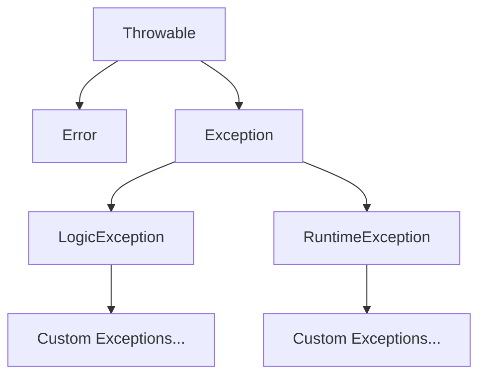

# PHP Custom Exceptions

## Introduction

Exception handling is a crucial aspect of creating robust PHP applications. While PHP provides several built-in exception classes, you'll often need to create your own custom exceptions to handle specific error scenarios in your application.

Custom exceptions allow you to:
- Define application-specific error types
- Provide more meaningful error messages
- Organize error handling in a structured way
- Implement different handling strategies for different error types

In this tutorial, we'll explore how to create and use custom exceptions in PHP, with practical examples to solidify your understanding.

## PHP Exception Hierarchy

Before diving into custom exceptions, let's understand PHP's exception hierarchy:



- **Throwable**: The base interface for all errors and exceptions
- **Error**: Represents internal PHP errors (typically not caught)
- **Exception**: The base class for all exceptions
- **LogicException**: For errors that could be avoided by proper coding
- **RuntimeException**: For errors that can only be detected during runtime

Your custom exceptions will typically extend either the base `Exception` class or one of its subclasses.

## Creating Your First Custom Exception

Let's create a simple custom exception class:

```php
<?php
// Define a custom exception
class InsufficientFundsException extends Exception
{
    // Redefine the constructor to add additional information
    public function __construct($message, $code = 0, Exception $previous = null)
    {
        // Make sure everything is assigned properly
        parent::__construct($message, $code, $previous);
    }

    // Custom string representation of the object
    public function __toString()
    {
        return __CLASS__ . ": [{$this->code}]: {$this->message}
";
    }
}
```

This custom exception:
1. Extends the base `Exception` class
2. Customizes the constructor to accept the standard exception parameters
3. Implements a `__toString()` method to provide a custom string representation

## Using Custom Exceptions

Now let's see how to use our custom exception in a practical scenario:

```php
<?php
// Include our custom exception
require_once 'InsufficientFundsException.php';

class BankAccount
{
    private $balance;
    private $accountNumber;
    
    public function __construct($accountNumber, $initialBalance = 0)
    {
        $this->accountNumber = $accountNumber;
        $this->balance = $initialBalance;
    }
    
    public function withdraw($amount)
    {
        if ($amount > $this->balance) {
            throw new InsufficientFundsException(
                "Cannot withdraw $amount. Account #$this->accountNumber has a balance of $this->balance."
            );
        }
        
        $this->balance -= $amount;
        return $this->balance;
    }
    
    public function getBalance()
    {
        return $this->balance;
    }
}

// Usage example
try {
    $account = new BankAccount('12345', 100);
    echo "Initial balance: $" . $account->getBalance() . "
";
    
    // This will work
    $account->withdraw(50);
    echo "Balance after withdrawing $50: $" . $account->getBalance() . "
";
    
    // This will throw an exception
    $account->withdraw(100);
    echo "This line won't be executed";
} catch (InsufficientFundsException $e) {
    echo "Error: " . $e->getMessage() . "
";
} catch (Exception $e) {
    echo "General error: " . $e->getMessage() . "
";
}
```

**Output:**
```
Initial balance: $100
Balance after withdrawing $50: $50
Error: Cannot withdraw 100. Account #12345 has a balance of 50.
```

In this example:
1. We create a `BankAccount` class with `withdraw` and `getBalance` methods
2. The `withdraw` method throws our custom `InsufficientFundsException` when trying to withdraw more than the available balance
3. We handle this specific exception type in a dedicated `catch` block

## Adding Custom Properties and Methods

Custom exceptions become even more powerful when you add application-specific properties and methods:

```php
<?php
class DatabaseConnectionException extends Exception
{
    private $dbHost;
    private $attemptCount;
    
    public function __construct($message, $dbHost, $attemptCount, $code = 0, Exception $previous = null)
    {
        $this->dbHost = $dbHost;
        $this->attemptCount = $attemptCount;
        
        // Append additional info to the message
        $message .= " (Host: $dbHost, Attempts: $attemptCount)";
        
        parent::__construct($message, $code, $previous);
    }
    
    public function getDbHost()
    {
        return $this->dbHost;
    }
    
    public function getAttemptCount()
    {
        return $this->attemptCount;
    }
    
    public function logError()
    {
        // Custom method for logging database errors
        $logMessage = date('Y-m-d H:i:s') . " - {$this->message}
";
        file_put_contents('database_errors.log', $logMessage, FILE_APPEND);
    }
}
```

Now let's use this exception with custom properties:

```php
<?php
// Database connection class
class Database
{
    private $host;
    private $username;
    private $password;
    private $connection;
    private $maxAttempts = 3;
    
    public function __construct($host, $username, $password)
    {
        $this->host = $host;
        $this->username = $username;
        $this->password = $password;
    }
    
    public function connect()
    {
        $attempts = 0;
        
        while ($attempts < $this->maxAttempts) {
            $attempts++;
            
            try {
                // Simulate connection attempt (in real code, this would use mysqli or PDO)
                if ($this->host === 'localhost' && $this->username === 'admin') {
                    $this->connection = true;
                    echo "Successfully connected to database
";
                    return true;
                }
                
                // If we get here, connection failed
                throw new DatabaseConnectionException(
                    "Failed to connect to database",
                    $this->host,
                    $attempts
                );
            } catch (DatabaseConnectionException $e) {
                // Last attempt, rethrow the exception
                if ($attempts >= $this->maxAttempts) {
                    throw $e;
                }
                
                // Otherwise, log the attempt and try again
                echo "Connection attempt $attempts failed. Retrying...
";
                sleep(1); // Wait before retrying
            }
        }
    }
}

// Usage example
try {
    $db = new Database('invalid_host', 'admin', 'password123');
    $db->connect();
} catch (DatabaseConnectionException $e) {
    echo "Fatal error: " . $e->getMessage() . "
";
    echo "Failed connecting to: " . $e->getDbHost() . "
";
    echo "Number of attempts: " . $e->getAttemptCount() . "
";
    
    // Use the custom logging method
    $e->logError();
}
```

**Output:**
```
Connection attempt 1 failed. Retrying...
Connection attempt 2 failed. Retrying...
Connection attempt 3 failed. Retrying...
Fatal error: Failed to connect to database (Host: invalid_host, Attempts: 3)
Failed connecting to: invalid_host
Number of attempts: 3
```

In this enhanced example:
1. We've added custom properties (`$dbHost`, `$attemptCount`) to our exception
2. We've included getter methods for these properties
3. We've added a custom `logError()` method for specific error handling
4. The `Database` class uses these features to provide detailed error information

## Creating an Exception Hierarchy

For larger applications, it's common to create a hierarchy of custom exceptions:

```php
<?php
// Base application exception
class AppException extends Exception
{
    // Common functionality for all application exceptions
}

// More specific exceptions
class ValidationException extends AppException
{
    private $invalidFields = [];
    
    public function addInvalidField($fieldName, $errorMessage)
    {
        $this->invalidFields[$fieldName] = $errorMessage;
    }
    
    public function getInvalidFields()
    {
        return $this->invalidFields;
    }
}

class AuthenticationException extends AppException
{
    // Authentication-specific methods
}

class AuthorizationException extends AppException
{
    // Authorization-specific methods
}
```

This approach allows you to:
1. Catch specific exception types for detailed handling
2. Catch parent exception types for general handling
3. Share common functionality across related exception types

Here's how you might use this hierarchy:

```php
<?php
function validateUserData($userData)
{
    $exception = new ValidationException("Validation failed for user data");
    
    if (empty($userData['username'])) {
        $exception->addInvalidField('username', 'Username is required');
    }
    
    if (empty($userData['email'])) {
        $exception->addInvalidField('email', 'Email is required');
    } elseif (!filter_var($userData['email'], FILTER_VALIDATE_EMAIL)) {
        $exception->addInvalidField('email', 'Invalid email format');
    }
    
    if (count($exception->getInvalidFields()) > 0) {
        throw $exception;
    }
    
    return true;
}

// Usage
try {
    $userData = [
        'username' => '',
        'email' => 'invalid-email'
    ];
    
    validateUserData($userData);
    echo "User data is valid
";
} catch (ValidationException $e) {
    echo "Validation error: " . $e->getMessage() . "
";
    
    foreach ($e->getInvalidFields() as $field => $error) {
        echo "- $field: $error
";
    }
} catch (AppException $e) {
    echo "Application error: " . $e->getMessage() . "
";
} catch (Exception $e) {
    echo "General error: " . $e->getMessage() . "
";
}
```

**Output:**
```
Validation error: Validation failed for user data
- username: Username is required
- email: Invalid email format
```

## Best Practices for Custom Exceptions

When creating and using custom exceptions in PHP, follow these best practices:

1. **Choose meaningful names**: Exception class names should clearly indicate the error type (e.g., `DatabaseConnectionException`, `InvalidArgumentException`).

2. **Provide detailed messages**: Include specific information about what went wrong and possibly how to fix it.

3. **Use a proper hierarchy**: Extend from the most appropriate base exception class.

4. **Add relevant context**: Include application-specific data that would help with debugging.

5. **Document your exceptions**: Add PHPDoc comments to explain when and why each exception is thrown.

6. **Catch exceptions strategically**: Only catch exceptions you can actually handle.

7. **Consider exception codes**: Use numeric codes consistently to categorize different error conditions.

```php
<?php
/**
 * Exception thrown when a required configuration value is missing.
 */
class MissingConfigurationException extends RuntimeException
{
    /**
     * @param string $configKey The configuration key that was missing
     * @param int $code Error code
     * @param Exception|null $previous Previous exception
     */
    public function __construct($configKey, $code = 0, Exception $previous = null)
    {
        $message = "Missing required configuration key: '$configKey'";
        parent::__construct($message, $code, $previous);
    }
}
```

## Real-World Example: API Client

Let's look at a more comprehensive example of using custom exceptions in a REST API client:

```php
<?php
// API exception hierarchy
class ApiException extends Exception {}
class ApiConnectionException extends ApiException {}
class ApiAuthenticationException extends ApiException {}
class ApiRateLimitException extends ApiException {}
class ApiResourceNotFoundException extends ApiException {}

// Simple API client
class ApiClient
{
    private $apiKey;
    private $baseUrl;
    
    public function __construct($apiKey, $baseUrl = 'https://api.example.com/v1')
    {
        $this->apiKey = $apiKey;
        $this->baseUrl = $baseUrl;
    }
    
    public function request($endpoint, $method = 'GET', $data = [])
    {
        // Simulate API request
        $responseCode = $this->simulateApiResponse($endpoint);
        
        switch ($responseCode) {
            case 200:
                return ['status' => 'success', 'data' => ['id' => 123, 'name' => 'Test']];
            case 401:
                throw new ApiAuthenticationException("Invalid API key");
            case 404:
                throw new ApiResourceNotFoundException("Resource not found: $endpoint");
            case 429:
                throw new ApiRateLimitException("Rate limit exceeded. Try again later.");
            case 500:
                throw new ApiException("API server error");
            default:
                throw new ApiConnectionException("Connection error. Status code: $responseCode");
        }
    }
    
    // Simulate API responses for demonstration
    private function simulateApiResponse($endpoint)
    {
        if ($this->apiKey !== 'valid_key') {
            return 401;
        }
        
        if ($endpoint === '/users/1') {
            return 200;
        } elseif ($endpoint === '/nonexistent') {
            return 404;
        } elseif ($endpoint === '/rate_limited') {
            return 429;
        } elseif ($endpoint === '/server_error') {
            return 500;
        }
        
        return 200;
    }
}

// Usage with different endpoints
$endpoints = [
    '/users/1', 
    '/nonexistent', 
    '/rate_limited', 
    '/server_error'
];

$client = new ApiClient('valid_key');

foreach ($endpoints as $endpoint) {
    try {
        echo "Requesting $endpoint...
";
        $response = $client->request($endpoint);
        echo "Success! Received data: " . json_encode($response) . "
";
    } catch (ApiAuthenticationException $e) {
        echo "Authentication error: " . $e->getMessage() . "
";
    } catch (ApiResourceNotFoundException $e) {
        echo "Resource error: " . $e->getMessage() . "
";
    } catch (ApiRateLimitException $e) {
        echo "Rate limit error: " . $e->getMessage() . "
";
        // We could implement retry logic here
    } catch (ApiException $e) {
        echo "API error: " . $e->getMessage() . "
";
    } catch (Exception $e) {
        echo "General error: " . $e->getMessage() . "
";
    }
    
    echo "
";
}
```

**Output:**
```
Requesting /users/1...
Success! Received data: {"status":"success","data":{"id":123,"name":"Test"}}

Requesting /nonexistent...
Resource error: Resource not found: /nonexistent

Requesting /rate_limited...
Rate limit error: Rate limit exceeded. Try again later.

Requesting /server_error...
API error: API server error
```

This example demonstrates:
1. A hierarchical exception structure
2. Specific exceptions for different error scenarios
3. Catching different exception types to handle them appropriately

## Summary

Custom exceptions are a powerful tool in PHP error handling that allow you to:

- Create application-specific error types
- Include context-specific data with errors
- Build hierarchical error structures
- Handle different error types with appropriate strategies

By implementing custom exceptions in your PHP applications, you'll create more robust, maintainable, and user-friendly code. Exception handling should be an integral part of your application architecture, not an afterthought.

## Additional Resources

- [PHP Exception Documentation](https://www.php.net/manual/en/class.exception.php)
- [PHP SPL Exceptions](https://www.php.net/manual/en/spl.exceptions.php)
- [PHP Try/Catch Documentation](https://www.php.net/manual/en/language.exceptions.php)

## Exercises

1. Create a custom exception class called `FileUploadException` with properties for file name, file size, and error type.

2. Extend the bank account example to include different exceptions for various scenarios (insufficient funds, account closed, invalid amount).

3. Implement a logging mechanism that records different types of exceptions in different log files.

4. Create a validation system that collects multiple validation errors before throwing a single exception with all the errors.

5. Build a simple HTTP client that uses custom exceptions to handle different HTTP error codes.