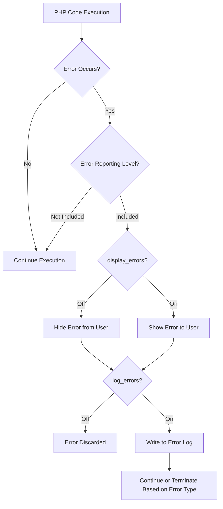

# PHP Error Logging

## Introduction

Error logging is a critical aspect of PHP development that helps you track, analyze, and troubleshoot issues in your applications. Rather than displaying errors directly to users (which can be both confusing and a security risk), proper error logging captures error information in log files for developers to review.

In this tutorial, you'll learn how to configure PHP's error logging system, write errors to different destinations, and implement best practices for effective error management in your applications.

## Understanding PHP Error Logging

Error logging in PHP allows you to:

- Record errors without exposing sensitive information to users
- Create a permanent record of application issues
- Track patterns of errors over time
- Debug issues that occur in production environments

Let's explore how to set up and use PHP's error logging capabilities.

## PHP Error Logging Configuration

PHP provides several configuration options that control how errors are logged. You can set these values in your `php.ini` file or dynamically within your scripts.

### Key Configuration Directives

Here are the main configuration directives for error logging:

```php
// In php.ini or using ini_set()
error_reporting = E_ALL                // What error levels to report
display_errors = Off                   // Whether to display errors in output
log_errors = On                        // Whether to log errors
error_log = /path/to/php_errors.log    // Where to log errors
```

### Setting Error Logging Configuration Dynamically

You can configure error logging at runtime in your scripts:

```php
<?php
// Set error reporting level
error_reporting(E_ALL);

// Turn off error display
ini_set('display_errors', '0');

// Enable error logging
ini_set('log_errors', '1');

// Set error log file location
ini_set('error_log', '/path/to/custom_errors.log');
```

## Logging Errors to a File

By default, PHP can log errors to a file specified in your configuration. Here's an example of how errors appear in a log file:

```
[03-Mar-2025 14:32:10 UTC] PHP Warning: Division by zero in /var/www/html/example.php on line 15
[03-Mar-2025 14:33:22 UTC] PHP Notice: Undefined variable: username in /var/www/html/example.php on line 23
[03-Mar-2025 14:35:47 UTC] PHP Fatal error: Uncaught Error: Call to undefined function connect_db() in /var/www/html/example.php:42
```

Each log entry includes:
- Timestamp
- Error type
- Error message
- File path and line number where the error occurred

## Custom Error Logging with error_log()

PHP provides the `error_log()` function to manually log custom error messages:

```php
<?php
// Log a simple error message
error_log("User authentication failed for user ID: 1234");

// Example with different message types
// Type 0: Log to the server's system logger or a file specified by error_log configuration directive
error_log("Database connection failed", 0);

// Type 1: Send the error by email
error_log("Critical payment processing error", 1, "admin@example.com");

// Type 3: Append to a specified file (provides more control than type 0)
error_log("API request failed with response code 500", 3, "/var/log/app_errors.log");
```

### Example: Practical Error Logging in a Web Application

Here's a real-world example of implementing error logging in a small application:

```php
<?php
// config.php - Application configuration
define('DEBUG_MODE', false); // Set to true in development
define('LOG_FILE', '/var/log/app/errors.log');

// Set up error handling based on environment
if (DEBUG_MODE) {
    // Development environment: Show all errors
    error_reporting(E_ALL);
    ini_set('display_errors', '1');
} else {
    // Production environment: Log errors but don't display them
    error_reporting(E_ALL);
    ini_set('display_errors', '0');
    ini_set('log_errors', '1');
    ini_set('error_log', LOG_FILE);
}

// Custom error logging function
function app_log($message, $level = 'ERROR') {
    $timestamp = date('Y-m-d H:i:s');
    $log_message = "[$timestamp] [$level] $message" . PHP_EOL;
    error_log($log_message, 3, LOG_FILE);
}

// Example usage
try {
    // Some risky operation
    $result = database_query("SELECT * FROM users");
    if (!$result) {
        throw new Exception("Database query failed");
    }
} catch (Exception $e) {
    app_log($e->getMessage());
    // Show user-friendly message
    echo "Sorry, we encountered an issue. Our team has been notified.";
}
```

## Structured Error Logging

For more complex applications, you might want to implement structured logging. Here's an example using JSON to store structured error data:

```php
<?php
function log_structured_error($type, $message, $context = []) {
    $data = [
        'timestamp' => date('c'),
        'type' => $type,
        'message' => $message,
        'context' => $context
    ];
    
    error_log(json_encode($data) . PHP_EOL, 3, '/var/log/app/structured_errors.log');
}

// Example usage
try {
    $userId = 42;
    $article = fetchArticle($articleId);
    if (!$article) {
        log_structured_error(
            'WARNING',
            'Article not found',
            [
                'user_id' => $userId,
                'article_id' => $articleId,
                'referrer' => $_SERVER['HTTP_REFERER'] ?? 'unknown'
            ]
        );
        // Handle the error appropriately
    }
} catch (Exception $e) {
    log_structured_error(
        'ERROR',
        $e->getMessage(),
        [
            'exception' => get_class($e),
            'file' => $e->getFile(),
            'line' => $e->getLine(),
            'trace' => $e->getTraceAsString()
        ]
    );
}
```

## Error Logging Flow Diagram

Here's a visual representation of how error logging works in a PHP application:



## Best Practices for PHP Error Logging

To make the most of error logging in your PHP applications:

1. **Configure Appropriately for Each Environment**
   - Development: Enable display_errors for immediate feedback
   - Production: Disable display_errors but enable log_errors

2. **Log Sufficient Context**
   - Include relevant variables, user IDs, and other context with error messages
   - Log stack traces for exceptions to understand the error path

3. **Implement Log Rotation**
   - Set up log rotation to prevent log files from growing too large
   - Consider tools like `logrotate` on Linux systems

4. **Monitor Your Logs**
   - Regularly check logs for errors
   - Consider automated monitoring tools that alert you to critical issues

5. **Use Error Levels Effectively**
   - Log warnings and notices, not just fatal errors
   - Consider filtering different error types to different log files for large applications

## Example: Implementing Log Rotation

Here's a simple example of how to implement basic log rotation in PHP:

```php
<?php
function write_to_rotating_log($message, $log_file, $max_size = 1048576) { // 1MB default
    // Check if log file exists and exceeds size limit
    if (file_exists($log_file) && filesize($log_file) > $max_size) {
        $backup_file = $log_file . '.' . date('Y-m-d-H-i-s') . '.bak';
        rename($log_file, $backup_file);
    }
    
    // Append to log file
    error_log($message . PHP_EOL, 3, $log_file);
}

// Example usage
write_to_rotating_log("User login failed: incorrect password", "/var/log/app/auth.log");
```

## Summary

PHP error logging is an essential tool for maintaining healthy applications. By properly configuring error logging, you can:

- Capture errors without exposing sensitive information to users
- Create a permanent record of application issues for later analysis
- Implement different logging strategies for development and production
- Gather context-rich information to assist in debugging

Remember that effective error logging is about finding the right balance between logging enough information to be useful while avoiding excessive logging that can obscure important issues and consume resources.

## Additional Resources

- [PHP Manual: Error Handling](https://www.php.net/manual/en/book.errorfunc.php)
- [PHP Manual: error_log function](https://www.php.net/manual/en/function.error-log.php)
- [Monolog](https://github.com/Seldaek/monolog) - A popular PHP logging library for more advanced logging needs

## Exercises

1. Configure PHP to log errors to a custom file instead of the default location.
2. Create a custom error handler function that logs detailed information about errors.
3. Implement structured logging for a small PHP application that tracks user actions.
4. Set up different error handling configurations for development and production environments.
5. Create a script that analyzes an error log file and generates a report of the most common errors.