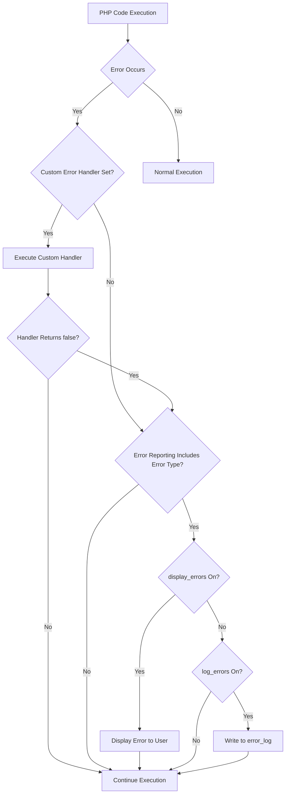

# PHP Error Handling Functions

## Introduction

When developing PHP applications, errors are inevitable. They can range from simple syntax mistakes to complex runtime issues. Properly handling these errors is crucial for creating robust, user-friendly applications that don't crash unexpectedly or expose sensitive information.

PHP provides several built-in functions specifically designed for error handling. These functions allow you to:

- Set how PHP reports errors
- Create custom error handlers
- Log errors to files
- Trigger your own errors
- Handle fatal errors that would otherwise crash your application

In this guide, we'll explore these functions in detail, with practical examples to help you implement effective error handling in your PHP projects.

## Understanding PHP Error Types

Before diving into error handling functions, it's important to understand the different types of errors PHP can produce:

| Error Type | Constant | Description |
|------------|----------|-------------|
| Notice | E_NOTICE | Non-critical errors that PHP encounters while executing a script |
| Warning | E_WARNING | Runtime warnings that don't halt script execution |
| Fatal Error | E_ERROR | Critical runtime errors that halt script execution |
| Parse Error | E_PARSE | Syntax errors found during the parsing phase |
| Deprecated | E_DEPRECATED | Functions that will be removed in future PHP versions |

## Core PHP Error Handling Functions

### 1. error_reporting()

The `error_reporting()` function sets which errors are reported. It takes a parameter that specifies the error reporting level.

```php
// Report all PHP errors
error_reporting(E_ALL);

// Report all errors except notices
error_reporting(E_ALL & ~E_NOTICE);

// Turn off all error reporting
error_reporting(0);
```

**Example with output:**

```php
<?php
// Original error reporting level
$original = error_reporting();
echo "Original error reporting level: " . $original . "<br>";

// Change to only show fatal errors
error_reporting(E_ERROR);
echo "New error reporting level: " . error_reporting() . "<br>";

// This will not show because E_NOTICE is not included
$undefined_variable;
echo $undefined_variable;

// Restore original error reporting
error_reporting($original);
?>
```

**Output:**
```
Original error reporting level: 32767
New error reporting level: 1
```

### 2. ini_set()

While not exclusively for error handling, `ini_set()` is often used to configure error-related PHP settings at runtime.

```php
// Log errors to a file instead of displaying them
ini_set('display_errors', 0);
ini_set('log_errors', 1);
ini_set('error_log', '/path/to/error.log');
```

**Example with real-world application:**

```php
<?php
// Configuration for development environment
function configure_dev_environment() {
    ini_set('display_errors', 1);
    ini_set('display_startup_errors', 1);
    error_reporting(E_ALL);
}

// Configuration for production environment
function configure_prod_environment() {
    ini_set('display_errors', 0);
    ini_set('log_errors', 1);
    ini_set('error_log', 'app_errors.log');
    error_reporting(E_ALL & ~E_DEPRECATED & ~E_STRICT);
}

// Use based on environment
$environment = 'development'; // This would typically come from a config file

if ($environment === 'development') {
    configure_dev_environment();
} else {
    configure_prod_environment();
}

// Now errors will be handled according to the environment
?>
```

### 3. set_error_handler()

This function allows you to define your own custom function to handle errors.

```php
set_error_handler(callable $error_handler, int $error_types = E_ALL | E_STRICT);
```

**Example with custom error handler:**

```php
<?php
// Define custom error handler function
function custom_error_handler($errno, $errstr, $errfile, $errline) {
    echo "<div style='border: 1px solid red; padding: 10px; margin: 10px;'>";
    echo "<h2>Error Occurred</h2>";
    echo "<p><strong>Error:</strong> [$errno] $errstr</p>";
    echo "<p><strong>File:</strong> $errfile on line $errline</p>";
    echo "</div>";
    
    // Return false to execute the PHP internal error handler as well
    return false;
}

// Set the custom error handler
set_error_handler("custom_error_handler");

// Generate a test error
echo $undefined_variable;
?>
```

**Output:**
```
Error Occurred
Error: [8] Undefined variable 'undefined_variable'
File: /var/www/html/test.php on line 20
```

### 4. restore_error_handler()

Restores the previous error handler that was in place before calling `set_error_handler()`.

```php
<?php
// Original error handler
function first_error_handler($errno, $errstr, $errfile, $errline) {
    echo "First error handler: $errstr<br>";
    return true;
}

// Second error handler
function second_error_handler($errno, $errstr, $errfile, $errline) {
    echo "Second error handler: $errstr<br>";
    return true;
}

// Set the first error handler
set_error_handler("first_error_handler");

// Trigger an error
trigger_error("This is handled by the first handler");

// Set the second error handler
set_error_handler("second_error_handler");

// Trigger another error
trigger_error("This is handled by the second handler");

// Restore to the first handler
restore_error_handler();

// This will be handled by the first handler again
trigger_error("Back to the first handler");
?>
```

**Output:**
```
First error handler: This is handled by the first handler
Second error handler: This is handled by the second handler
First error handler: Back to the first handler
```

### 5. trigger_error()

This function allows you to trigger user-defined errors.

```php
trigger_error(string $error_msg, int $error_type = E_USER_NOTICE);
```

**Example with different error levels:**

```php
<?php
function check_user_input($data) {
    if (empty($data)) {
        // Trigger a notice - non-critical
        trigger_error("Input data is empty!", E_USER_NOTICE);
        return false;
    }
    
    if (!is_array($data)) {
        // Trigger a warning - something important but not critical
        trigger_error("Input data must be an array!", E_USER_WARNING);
        return false;
    }
    
    if (count($data) < 3) {
        // Trigger an error - critical issue
        trigger_error("Input data must contain at least 3 elements!", E_USER_ERROR);
        // E_USER_ERROR halts script execution
    }
    
    return true;
}

// Test the function
check_user_input([]);  // Will trigger E_USER_NOTICE
check_user_input("string");  // Will trigger E_USER_WARNING
check_user_input([1, 2]);  // Will trigger E_USER_ERROR and halt execution
echo "This line will not be executed if E_USER_ERROR is triggered.";
?>
```

### 6. error_log()

The `error_log()` function sends an error message to the defined error handling routines, such as a server log, an email, or a specified file.

```php
error_log(string $message, int $message_type = 0, string $destination = null, string $extra_headers = null);
```

**Parameters:**
- `$message`: The error message to be logged
- `$message_type`: Destination of the error message (0 = system log, 1 = email, 3 = append to file, 4 = SAPI)
- `$destination`: Destination of the error message (only used when type is 1 or 3)
- `$extra_headers`: Extra headers (only used when type is 1)

**Example of logging to a file:**

```php
<?php
function log_database_error($message, $query = '', $error = '') {
    $log_entry = date('[Y-m-d H:i:s]') . " - Database Error: $message
";
    
    if (!empty($query)) {
        $log_entry .= "Query: $query
";
    }
    
    if (!empty($error)) {
        $log_entry .= "Error: $error
";
    }
    
    $log_entry .= "-----------------------------
";
    
    // Log to a specific file
    error_log($log_entry, 3, 'database_errors.log');
}

// Example usage
try {
    // Simulated database query
    $connection = null; // This would be a real database connection
    $query = "SELECT * FROM non_existent_table";
    
    if (!$connection) {
        throw new Exception("Database connection failed");
    }
    
    // If we got here, execute query...
    
} catch (Exception $e) {
    log_database_error("Failed to execute query", $query, $e->getMessage());
    echo "An error occurred. Please try again later.";
}
?>
```

### 7. set_exception_handler()

This function sets a user-defined function to handle uncaught exceptions.

```php
<?php
// Define custom exception handler
function custom_exception_handler($exception) {
    echo "<div style='border: 1px solid red; padding: 10px; margin: 10px;'>";
    echo "<h2>Uncaught Exception</h2>";
    echo "<p><strong>Message:</strong> " . $exception->getMessage() . "</p>";
    echo "<p><strong>File:</strong> " . $exception->getFile() . "</p>";
    echo "<p><strong>Line:</strong> " . $exception->getLine() . "</p>";
    echo "</div>";
    
    // Log the exception
    error_log("Uncaught Exception: " . $exception->getMessage() . 
              " in " . $exception->getFile() . 
              " on line " . $exception->getLine());
}

// Set the custom exception handler
set_exception_handler('custom_exception_handler');

// Test by throwing an exception without catching it
throw new Exception("This is a test exception");

// This line will not be executed
echo "This line never runs";
?>
```

### 8. restore_exception_handler()

Restores the previously defined exception handler function.

```php
<?php
// First exception handler
function first_exception_handler($exception) {
    echo "First handler: " . $exception->getMessage() . "<br>";
}

// Second exception handler
function second_exception_handler($exception) {
    echo "Second handler: " . $exception->getMessage() . "<br>";
}

// Set the first handler
set_exception_handler('first_exception_handler');

// Change to the second handler
set_exception_handler('second_exception_handler');

// Restore to the first handler
restore_exception_handler();

// This will be handled by the first handler
throw new Exception("Test exception");
?>
```

**Output:**
```
First handler: Test exception
```

## Error Handling Flow in PHP

Let's examine how errors flow through PHP's handling system:



## Practical Error Handling Strategies

### Creating a Reusable Error Handler

Here's a more comprehensive error handler that you might use in a real-world application:

```php
<?php
class ErrorHandler {
    private $logFile;
    private $displayErrors;
    
    public function __construct($logFile = 'application_errors.log', $displayErrors = false) {
        $this->logFile = $logFile;
        $this->displayErrors = $displayErrors;
        
        // Set error and exception handlers
        set_error_handler([$this, 'handleError']);
        set_exception_handler([$this, 'handleException']);
        
        // Register shutdown function to catch fatal errors
        register_shutdown_function([$this, 'handleFatalError']);
        
        // Configure PHP error settings
        ini_set('display_errors', $this->displayErrors ? 1 : 0);
        ini_set('log_errors', 1);
        ini_set('error_log', $this->logFile);
        
        // Report all errors
        error_reporting(E_ALL);
    }
    
    public function handleError($errno, $errstr, $errfile, $errline) {
        // Create formatted error message
        $errorMessage = $this->formatError($errno, $errstr, $errfile, $errline);
        
        // Log the error
        $this->logError($errorMessage);
        
        // Display error if configured to do so
        if ($this->displayErrors) {
            $this->displayError($errorMessage, $errno);
        }
        
        // Don't execute PHP internal error handler
        return true;
    }
    
    public function handleException($exception) {
        // Create formatted exception message
        $exceptionMessage = $this->formatException($exception);
        
        // Log the exception
        $this->logError($exceptionMessage);
        
        // Display exception if configured to do so
        if ($this->displayErrors) {
            $this->displayError($exceptionMessage, E_ERROR);
        } else {
            $this->displayFriendlyError();
        }
        
        exit(1);
    }
    
    public function handleFatalError() {
        $error = error_get_last();
        
        // Check if the error is a fatal error type
        if ($error !== null && in_array($error['type'], [E_ERROR, E_CORE_ERROR, E_COMPILE_ERROR])) {
            // Create formatted fatal error message
            $errorMessage = $this->formatError(
                $error['type'],
                $error['message'],
                $error['file'],
                $error['line']
            );
            
            // Log the fatal error
            $this->logError($errorMessage);
            
            // Display error if configured to do so
            if ($this->displayErrors) {
                $this->displayError($errorMessage, E_ERROR);
            } else {
                $this->displayFriendlyError();
            }
        }
    }
    
    private function formatError($errno, $errstr, $errfile, $errline) {
        $errorTypes = [
            E_ERROR             => 'Fatal Error',
            E_WARNING           => 'Warning',
            E_PARSE             => 'Parse Error',
            E_NOTICE            => 'Notice',
            E_CORE_ERROR        => 'Core Error',
            E_CORE_WARNING      => 'Core Warning',
            E_COMPILE_ERROR     => 'Compile Error',
            E_COMPILE_WARNING   => 'Compile Warning',
            E_USER_ERROR        => 'User Error',
            E_USER_WARNING      => 'User Warning',
            E_USER_NOTICE       => 'User Notice',
            E_STRICT            => 'Strict Standard',
            E_RECOVERABLE_ERROR => 'Recoverable Error',
            E_DEPRECATED        => 'Deprecated',
            E_USER_DEPRECATED   => 'User Deprecated'
        ];
        
        $type = isset($errorTypes[$errno]) ? $errorTypes[$errno] : 'Unknown Error';
        
        return sprintf(
            "[%s] %s: %s in %s on line %d",
            date('Y-m-d H:i:s'),
            $type,
            $errstr,
            $errfile,
            $errline
        );
    }
    
    private function formatException($exception) {
        return sprintf(
            "[%s] Uncaught Exception: %s in %s on line %d
Stack trace:
%s",
            date('Y-m-d H:i:s'),
            $exception->getMessage(),
            $exception->getFile(),
            $exception->getLine(),
            $exception->getTraceAsString()
        );
    }
    
    private function logError($message) {
        error_log($message . PHP_EOL, 3, $this->logFile);
    }
    
    private function displayError($message, $severity) {
        $color = ($severity > E_WARNING) ? '#dc3545' : ($severity > E_NOTICE ? '#ffc107' : '#17a2b8');
        
        echo '<div style="background-color: #f8f9fa; border-left: 5px solid ' . $color . '; padding: 15px; margin: 10px 0; font-family: monospace;">';
        echo '<pre>' . htmlspecialchars($message) . '</pre>';
        echo '</div>';
    }
    
    private function displayFriendlyError() {
        echo '<div style="text-align: center; padding: 40px; margin: 20px; font-family: Arial, sans-serif;">';
        echo '<h1>Oops! Something went wrong.</h1>';
        echo '<p>We apologize for the inconvenience. Our technical team has been notified.</p>';
        echo '<p>Please try again later or contact support if the problem persists.</p>';
        echo '</div>';
    }
}

// Usage in your application
$errorHandler = new ErrorHandler('application_errors.log', true); // true for development, false for production

// Your code here...
```

### Implementing a Try-Catch Block with Error Logging

```php
<?php
// Assume the ErrorHandler class from above is already included

function process_user_data($userData) {
    try {
        // Validate user data
        if (empty($userData['name'])) {
            throw new InvalidArgumentException("User name cannot be empty");
        }
        
        if (!filter_var($userData['email'], FILTER_VALIDATE_EMAIL)) {
            throw new InvalidArgumentException("Invalid email format");
        }
        
        // Process user data...
        return [
            'status' => 'success',
            'message' => 'User data processed successfully'
        ];
        
    } catch (InvalidArgumentException $e) {
        // Log specific validation errors but don't halt execution
        error_log("Validation error: " . $e->getMessage());
        
        return [
            'status' => 'error',
            'message' => $e->getMessage()
        ];
        
    } catch (Exception $e) {
        // Log any other exceptions and return error response
        error_log("Error processing user data: " . $e->getMessage());
        
        return [
            'status' => 'error',
            'message' => 'An unexpected error occurred. Please try again later.'
        ];
    }
}

// Example usage
$result = process_user_data([
    'name' => 'John Doe',
    'email' => 'invalid-email'
]);

// Display appropriate message to user
if ($result['status'] === 'success') {
    echo '<div style="color: green;">' . $result['message'] . '</div>';
} else {
    echo '<div style="color: red;">' . $result['message'] . '</div>';
}
?>
```

## Summary

PHP provides a robust set of error handling functions that allow developers to:

1. **Control error reporting** with `error_reporting()` and `ini_set()`
2. **Create custom error handlers** with `set_error_handler()` and `restore_error_handler()`
3. **Generate custom errors** with `trigger_error()`
4. **Log errors** with `error_log()`
5. **Handle exceptions** with `set_exception_handler()` and `restore_exception_handler()`

Proper error handling is essential for creating robust PHP applications. By implementing appropriate error handling strategies, you can:

- Provide better user experiences by displaying friendly error messages
- Capture detailed error information for debugging
- Maintain security by preventing sensitive information exposure
- Create more stable applications that can gracefully recover from errors

## Additional Resources

- [PHP Manual: Error Handling](https://www.php.net/manual/en/book.errorfunc.php)
- [PHP Manual: Exceptions](https://www.php.net/manual/en/language.exceptions.php)
- [PHP Manual: Predefined Constants](https://www.php.net/manual/en/errorfunc.constants.php)

## Exercises

1. **Basic Error Handling**: Create a script that demonstrates the use of `set_error_handler()` to catch and handle different types of PHP errors.

2. **Exception Handling**: Write a function that performs file operations using try-catch blocks to handle potential exceptions and provide meaningful error messages.

3. **Error Logging**: Implement a custom logging system that writes different types of errors to different log files based on their severity.

4. **Production vs. Development**: Create a configuration system that automatically sets appropriate error handling settings based on whether the application is running in a development or production environment.

5. **Error Handler Class**: Extend the `ErrorHandler` class provided in this guide to include additional features, such as email notifications for critical errors or integration with popular logging libraries.