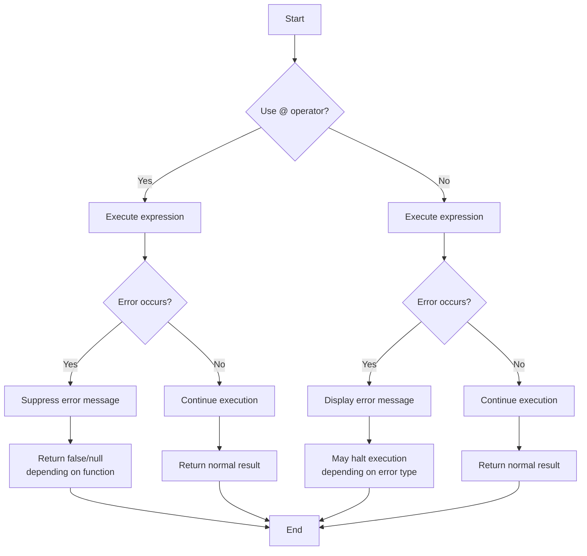

# PHP Error Suppression

## Introduction

When writing PHP code, you'll inevitably encounter errors. Sometimes, you might want to prevent these errors from being displayed to users or being logged. This is where PHP error suppression comes into play. Error suppression allows you to temporarily silence specific errors that might occur during script execution.

While error suppression can be useful in certain scenarios, it's important to understand both its benefits and drawbacks. This guide will walk you through PHP's error suppression mechanisms, explain when they should be used, and provide best practices for handling errors in your applications.

## The Error Control Operator (@)

PHP provides a special operator called the **error control operator** (represented by the `@` symbol) that suppresses error messages generated by expressions.

### Basic Syntax

```php
@expression;
```

When you place the `@` symbol before an expression, any error message that might be generated by that expression will be ignored.

### Example: Suppressing File Operation Errors

```php
// Without error suppression
$content = file_get_contents('non_existent_file.txt');
// Output: Warning: file_get_contents(non_existent_file.txt): Failed to open stream: No such file or directory

// With error suppression
$content = @file_get_contents('non_existent_file.txt');
// No warning is displayed
```

### Input and Output Comparison

| Input | Output |
|-------|--------|
| `file_get_contents('non_existent_file.txt');` | Warning: file_get_contents(non_existent_file.txt): Failed to open stream: No such file or directory |
| `@file_get_contents('non_existent_file.txt');` | (No output) |

## Common Use Cases for Error Suppression

While error suppression should be used sparingly, there are legitimate scenarios where it can be appropriate:

### 1. Checking if a File Exists

```php
// Approach 1: Using file_exists() (preferred)
if (file_exists('config.txt')) {
    $config = file_get_contents('config.txt');
} else {
    // Handle missing file
}

// Approach 2: Using error suppression
$config = @file_get_contents('config.txt');
if ($config === false) {
    // Handle missing file
}
```

### 2. Database Connections in Production

```php
// In development environment
$connection = mysqli_connect('localhost', 'username', 'password', 'database');
// Shows error if connection fails

// In production environment
$connection = @mysqli_connect('localhost', 'username', 'password', 'database');
if (!$connection) {
    // Log the error privately
    error_log('Database connection failed: ' . mysqli_connect_error());
    // Show user-friendly message
    echo "We're experiencing technical difficulties. Please try again later.";
}
```

### 3. Handling Division by Zero

```php
function safeDivide($numerator, $denominator) {
    if ($denominator == 0) {
        return null; // Preferred approach: check before division
    }
    return $numerator / $denominator;
}

// Alternative with error suppression
function quickDivide($numerator, $denominator) {
    $result = @($numerator / $denominator);
    return is_nan($result) || is_infinite($result) ? null : $result;
}
```

## Errors That Cannot Be Suppressed

It's important to understand that the `@` operator can only suppress certain types of errors:

- It can suppress notices, warnings, and user-defined errors
- It **cannot** suppress parse errors, fatal errors, or syntax errors

```php
// This will still produce a fatal error despite the @ operator
@require_once('non_existent_file.php');

// This will still produce a parse error
@eval('echo "Incomplete statement');
```

## Error Suppression in a Functional Context

Let's look at a practical example where error suppression might be used in a real-world application:

```php
/**
 * Safely retrieves a configuration value from a file
 * @param string $configFile Path to configuration file
 * @param string $key Configuration key to retrieve
 * @param mixed $default Default value if key not found or file doesn't exist
 * @return mixed Configuration value or default
 */
function getConfigValue($configFile, $key, $default = null) {
    // Try to read the file, suppressing warnings if it doesn't exist
    $contents = @file_get_contents($configFile);
    
    // If file couldn't be read, return default
    if ($contents === false) {
        error_log("Config file not found: $configFile");
        return $default;
    }
    
    // Try to parse JSON, suppressing warnings if JSON is invalid
    $config = @json_decode($contents, true);
    
    // If JSON parsing failed, return default
    if ($config === null) {
        error_log("Invalid JSON in config file: $configFile");
        return $default;
    }
    
    // Return config value or default if key doesn't exist
    return isset($config[$key]) ? $config[$key] : $default;
}

// Usage
$dbHost = getConfigValue('app_config.json', 'database_host', 'localhost');
```

In this example, we use error suppression to handle potential issues when reading configuration files, while still properly handling errors and logging them for debugging purposes.

## Error Suppression Flow

Below is a diagram showing the flow of execution when using error suppression:



## The Dangers of Error Suppression

While error suppression can be convenient, it comes with significant risks:

### 1. Hidden Bugs

```php
// Bad practice: Hiding potential issues
function getUserData($userId) {
    $data = @fetchUserFromDatabase($userId);
    return $data;
}

// Better practice: Explicit error handling
function getUserData($userId) {
    try {
        $data = fetchUserFromDatabase($userId);
        return $data;
    } catch (DatabaseException $e) {
        error_log("Database error: " . $e->getMessage());
        return null;
    }
}
```

### 2. Performance Impact

The `@` operator can slow down PHP execution because it modifies the error handling state, processes any error, and then restores the previous state.

```php
// Benchmark example
$startTime = microtime(true);
for ($i = 0; $i < 10000; $i++) {
    @file_exists('dummy.txt');
}
$endTime = microtime(true);
echo "With @: " . ($endTime - $startTime) . " seconds
";

$startTime = microtime(true);
for ($i = 0; $i < 10000; $i++) {
    file_exists('dummy.txt');
}
$endTime = microtime(true);
echo "Without @: " . ($endTime - $startTime) . " seconds
";
```

### 3. Masking Critical Issues

```php
// Dangerous: Suppressing database errors without proper handling
@mysqli_query($connection, "INSERT INTO users (username, email) VALUES ('john', 'john@example.com')");
// No way to know if the query succeeded

// Better: Proper error handling
if (!mysqli_query($connection, "INSERT INTO users (username, email) VALUES ('john', 'john@example.com')")) {
    error_log("Database error: " . mysqli_error($connection));
    // Take appropriate action
}
```

## Alternatives to Error Suppression

Instead of relying on the `@` operator, consider these better approaches to error handling:

### 1. Using Conditional Statements

```php
// Instead of:
$result = @mysqli_query($connection, $query);

// Use:
if ($connection) {
    $result = mysqli_query($connection, $query);
    if (!$result) {
        // Handle query error
    }
} else {
    // Handle connection error
}
```

### 2. Try-Catch Blocks

```php
// Modern approach with mysqli in exception mode
mysqli_report(MYSQLI_REPORT_ERROR | MYSQLI_REPORT_STRICT);

try {
    $connection = new mysqli('localhost', 'username', 'password', 'database');
    $result = $connection->query("SELECT * FROM users");
    // Process result
} catch (Exception $e) {
    // Log error
    error_log("Database error: " . $e->getMessage());
    // Display user-friendly message
    echo "An error occurred while fetching data.";
}
```

### 3. Custom Error Handlers

```php
// Set a custom error handler for controlled error management
set_error_handler(function($errno, $errstr, $errfile, $errline) {
    // Log error details
    error_log("Error ($errno): $errstr in $errfile on line $errline");
    
    // Return true to prevent PHP's default error handler from running
    return true;
});

// Your code here...

// Restore the previous error handler when done
restore_error_handler();
```

## Best Practices

When working with error handling in PHP, follow these guidelines:

1. **Use error suppression as a last resort**, not as your default approach
2. **Always check return values** after using error suppression
3. **Log suppressed errors** for debugging purposes
4. **Use try-catch blocks** for handling exceptions in modern PHP code
5. **Set proper error reporting levels** based on your environment (development vs. production)
6. **Use conditional checks** before operations that might fail, rather than suppressing errors
7. **Never suppress errors in critical operations** where failure could lead to security issues or data corruption

## Real-World Example: Configuration File Loader

Here's a comprehensive example of a configuration loader that handles errors properly:

```php
class ConfigLoader {
    private $configFile;
    private $config = null;
    private $errors = [];
    
    public function __construct($configFile) {
        $this->configFile = $configFile;
    }
    
    public function load() {
        // Check if file exists before trying to read it
        if (!file_exists($this->configFile)) {
            $this->addError("Config file not found: {$this->configFile}");
            return false;
        }
        
        // Read file contents
        $contents = file_get_contents($this->configFile);
        if ($contents === false) {
            $this->addError("Failed to read config file: {$this->configFile}");
            return false;
        }
        
        // Parse JSON (using @ only for malformed JSON, but still handling the error)
        $config = @json_decode($contents, true);
        if (json_last_error() !== JSON_ERROR_NONE) {
            $this->addError("Invalid JSON in config file: " . json_last_error_msg());
            return false;
        }
        
        $this->config = $config;
        return true;
    }
    
    public function get($key, $default = null) {
        if ($this->config === null) {
            $loaded = $this->load();
            if (!$loaded) {
                return $default;
            }
        }
        
        return isset($this->config[$key]) ? $this->config[$key] : $default;
    }
    
    public function getErrors() {
        return $this->errors;
    }
    
    private function addError($message) {
        $this->errors[] = $message;
        // Log error for debugging
        error_log($message);
    }
}

// Usage
$config = new ConfigLoader('app_config.json');
$dbHost = $config->get('database_host', 'localhost');

// Check for errors
if ($config->getErrors()) {
    echo "Warning: Config loading had issues. Using defaults where needed.";
}
```

## Summary

PHP error suppression using the `@` operator allows you to silence specific errors, but it should be used carefully and sparingly. Key takeaways include:

1. The `@` operator suppresses warnings and notices but not fatal or parse errors
2. Error suppression can hide bugs and make debugging more difficult
3. Using `@` has a performance impact on your application
4. Better alternatives include conditional checks, try-catch blocks, and custom error handlers
5. Always check return values and log suppressed errors
6. In production environments, configure proper error reporting levels instead of using suppression

## Additional Resources

- [PHP Manual: Error Control Operators](https://www.php.net/manual/en/language.operators.errorcontrol.php)
- [PHP Manual: Error Handling and Logging](https://www.php.net/manual/en/book.errorfunc.php)
- [PHP Manual: Exceptions](https://www.php.net/manual/en/language.exceptions.php)

## Exercises

1. Create a function that safely reads a file and returns its contents, handling errors properly without using the `@` operator.
2. Refactor a piece of code that uses the `@` operator to use try-catch blocks instead.
3. Write a custom error handler that logs errors to a file and displays user-friendly messages.
4. Create a class that loads configuration from different sources (JSON, XML, INI) with proper error handling.
5. Benchmark the performance difference between using the `@` operator and proper conditional checks in a loop that runs 100,000 times.