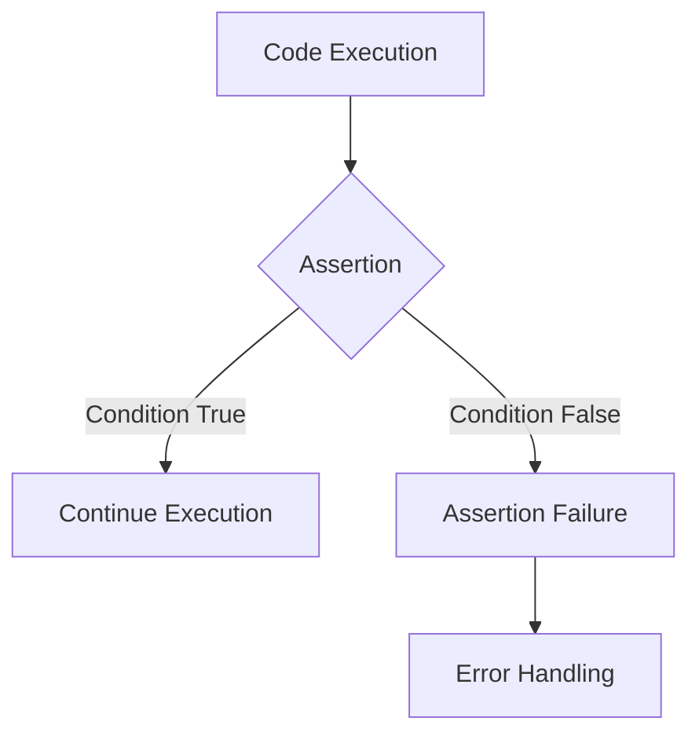

# PHP Assert: Debugging and Testing Your Code

## Introduction

When developing PHP applications, ensuring code correctness is critical. One powerful tool in your error handling toolkit is the `assert()` function. Assertions allow you to validate assumptions in your code during development and testing phases.

Unlike exceptions or error handlers that manage runtime errors, assertions help catch logical errors and invalid assumptions during development. They're a way of saying "this condition must be true at this point in the code" and can be disabled in production for performance reasons.

In this tutorial, we'll explore PHP's assertion mechanism, how it works, when to use it, and best practices for implementation.

## What is an Assertion?

An assertion is a statement that a certain condition is expected to be true at a particular point in your code. If the condition evaluates to false, the assertion fails, triggering a special type of error.

Think of assertions as "sanity checks" that verify your assumptions about your code's state:



## PHP Assert Syntax

PHP provides the `assert()` function for implementing assertions. The basic syntax is:

```php
assert(expression, description);
```

Where:
- `expression`: The condition that should evaluate to true
- `description`: (Optional) A description of the assertion that will be included in error messages

Example:

```php
$age = 25;
assert($age >= 18, "User must be an adult");
```

### PHP 7+ Syntax

PHP 7 introduced an improved version of the `assert()` function that supports a more flexible syntax:

```php
assert(expression, Throwable|string $description = null);
```

With this syntax, you can either provide a string description or a `Throwable` object (like an `Exception` or `AssertionError`).

## Configuring Assertions

PHP allows you to configure how assertions behave through several directives:

### 1. Enabling/Disabling Assertions

You can control whether assertions are evaluated using the `zend.assertions` directive:

```php
// In php.ini or using ini_set():
ini_set('zend.assertions', 1); // Enable assertions
ini_set('zend.assertions', 0); // Disable assertions but retain in code
ini_set('zend.assertions', -1); // Disable assertions and optimize them out
```

Values:
- `1`: Assertions are evaluated (development mode)
- `0`: Assertions are not evaluated but remain in the code
- `-1`: Assertions are not evaluated and are optimized out by the compiler (production mode)

### 2. Assertion Behavior

The `assert.exception` directive controls what happens when an assertion fails:

```php
ini_set('assert.exception', 1); // Throw exceptions on failure
```

Values:
- `0`: Generate a warning and continue execution
- `1`: Throw an `AssertionError` exception

## Basic Examples

Let's look at some simple examples of using assertions:

### Example 1: Basic Assertion

```php
<?php
// Enable assertions
ini_set('zend.assertions', 1);
ini_set('assert.exception', 0); // Generate warnings instead of exceptions

function divide($a, $b) {
    // Assert that we're not dividing by zero
    assert($b != 0, "Division by zero");
    return $a / $b;
}

// This will work
echo "10 / 2 = " . divide(10, 2) . "
";

// This will trigger an assertion failure
echo "10 / 0 = " . divide(10, 0) . "
";
?>
```

**Output:**
```
10 / 2 = 5
Warning: assert(): Division by zero failed in example.php on line 8
PHP Warning:  Division by zero in example.php on line 9
```

### Example 2: Using Exceptions

```php
<?php
// Enable assertions and make them throw exceptions
ini_set('zend.assertions', 1);
ini_set('assert.exception', 1);

function getDiscount($age) {
    assert(is_numeric($age), "Age must be a number");
    assert($age >= 0, "Age cannot be negative");
    
    if ($age < 12) {
        return 50; // 50% discount for children
    } elseif ($age >= 65) {
        return 30; // 30% discount for seniors
    } else {
        return 0; // No discount
    }
}

try {
    echo "Discount for age 25: " . getDiscount(25) . "%
";
    echo "Discount for age 8: " . getDiscount(8) . "%
";
    echo "Discount for age -5: " . getDiscount(-5) . "%
"; // Will fail
} catch (AssertionError $e) {
    echo "Assertion failed: " . $e->getMessage() . "
";
}
?>
```

**Output:**
```
Discount for age 25: 0%
Discount for age 8: 50%
Assertion failed: Age cannot be negative
```

## When to Use Assertions

Assertions are particularly useful in the following scenarios:

1. **Preconditions**: Verify that function arguments meet expected criteria
2. **Postconditions**: Ensure function results match expected values
3. **Invariants**: Check that certain conditions remain true throughout a process
4. **Impossible cases**: Verify that "this should never happen" situations don't occur

### Where NOT to Use Assertions

Don't use assertions for:

1. **Input validation**: User inputs should be validated with proper error handling, not assertions
2. **Error handling that should occur in production**: Assertions can be disabled in production
3. **Checks that have side effects**: The assertion code may be optimized away

## Real-World Examples

Let's explore some more practical examples of using assertions in real-world applications:

### Example 3: Data Processing Pipeline

```php
<?php
class DataProcessor {
    private $data;
    
    public function __construct(array $data) {
        $this->data = $data;
    }
    
    public function process() {
        // Step 1: Normalize data
        $normalized = $this->normalizeData();
        assert(count($normalized) === count($this->data), "Normalization should preserve data count");
        
        // Step 2: Filter invalid entries
        $filtered = $this->filterData($normalized);
        assert(count($filtered) <= count($normalized), "Filtering should only remove entries, not add them");
        
        // Step 3: Transform data into output format
        $transformed = $this->transformData($filtered);
        assert(!empty($transformed) || empty($filtered), "Transformation should produce output if input wasn't empty");
        
        return $transformed;
    }
    
    private function normalizeData() {
        $result = [];
        foreach ($this->data as $item) {
            $result[] = is_string($item) ? strtolower(trim($item)) : $item;
        }
        return $result;
    }
    
    private function filterData(array $data) {
        return array_filter($data, function($item) {
            return $item !== null && $item !== '';
        });
    }
    
    private function transformData(array $data) {
        return array_map(function($item) {
            if (is_string($item)) {
                return ['type' => 'string', 'value' => $item];
            } elseif (is_numeric($item)) {
                return ['type' => 'number', 'value' => $item];
            } else {
                return ['type' => 'other', 'value' => json_encode($item)];
            }
        }, $data);
    }
}

// Example usage:
$processor = new DataProcessor(['Hello', 'World', '', 42, null, 'PHP']);
try {
    $result = $processor->process();
    echo "Processed data: " . json_encode($result, JSON_PRETTY_PRINT) . "
";
} catch (AssertionError $e) {
    echo "Processing failed: " . $e->getMessage() . "
";
}
?>
```

This example uses assertions to verify that each step in a data processing pipeline behaves as expected, ensuring the integrity of the data transformation process.

### Example 4: Custom Assertion Function

For more complex projects, you might want to create your own assertion function that provides better debugging information:

```php
<?php
function customAssert($condition, $message = "Assertion failed") {
    if (ini_get('zend.assertions') != 0) {
        if (!$condition) {
            $trace = debug_backtrace(DEBUG_BACKTRACE_IGNORE_ARGS, 1)[0];
            $location = $trace['file'] . ':' . $trace['line'];
            
            if (ini_get('assert.exception') == 1) {
                throw new AssertionError("$message at $location");
            } else {
                trigger_error("$message at $location", E_USER_WARNING);
            }
        }
    }
}

// Example usage
function calculateArea($width, $height) {
    customAssert($width > 0, "Width must be positive");
    customAssert($height > 0, "Height must be positive");
    
    return $width * $height;
}

try {
    echo "Area of 5x10: " . calculateArea(5, 10) . "
";
    echo "Area of -2x10: " . calculateArea(-2, 10) . "
";
} catch (AssertionError $e) {
    echo "Error: " . $e->getMessage() . "
";
}
?>
```

This custom function provides more detailed error information, including the exact file and line where the assertion failed.

## Best Practices

Follow these guidelines to make the most effective use of assertions:

1. **Be specific with assertion messages**: Include details about what went wrong and why.

2. **Assert invariants and preconditions**: Focus on verifying the correctness of your code's assumptions.

3. **Keep assertions simple**: Avoid complex logic in assertion conditions.

4. **Don't use assertions with side effects**: The condition should not change program state.

5. **Configure assertions properly**: Disable them in production with `zend.assertions = -1`.

6. **Use assertions for developer errors**: Regular error handling should be used for runtime errors.

7. **Combine with logging**: Log assertion failures to help with debugging.

## Assertions vs. Exceptions

While both assertions and exceptions can be used to handle errors, they have different purposes:

| Assertions | Exceptions |
|------------|------------|
| Detect programming/logical errors | Handle runtime/expected errors |
| Usually disabled in production | Must work in all environments |
| Should never fail in working code | May occur in normal operation |
| For developer-oriented checks | For user-facing error handling |

## Summary

PHP's `assert()` function is a powerful tool for maintaining code quality and catching logical errors during development. When used correctly, assertions can:

- Document your assumptions about code behavior
- Catch logical errors early in the development process
- Improve code maintainability and self-documentation
- Make debugging easier by failing fast when conditions aren't met

Remember that assertions are primarily a development and testing tool, not a replacement for proper error handling in production code. Use them to verify your assumptions during development, then disable them in production for optimal performance.

## Additional Resources

- [PHP Manual: Assert](https://www.php.net/manual/en/function.assert.php)
- [PHP Manual: AssertionError](https://www.php.net/manual/en/class.assertionerror.php)
- [PHP Manual: Configuration Directives](https://www.php.net/manual/en/errorfunc.configuration.php#ini.zend.assertions)

## Exercises

1. Create a simple calculator class that uses assertions to verify input parameters.
2. Write a function that validates an email address and uses assertions to check internal assumptions.
3. Implement a stack data structure with push/pop methods that use assertions to verify the stack's state.
4. Create a custom assertion function that logs failures to a file.
5. Develop a simple testing framework that uses assertions to verify results.