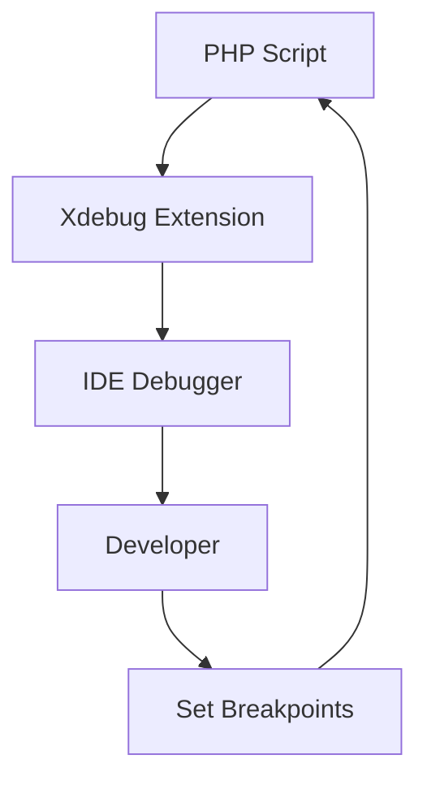
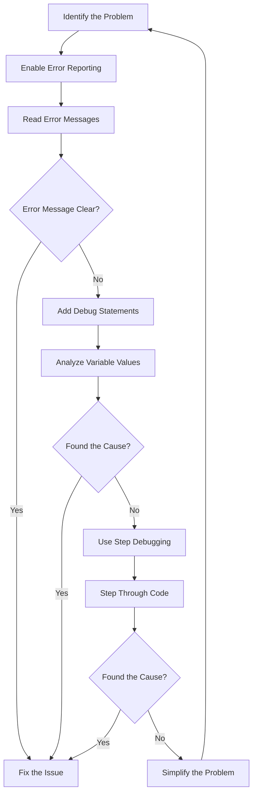

# PHP Debugging Techniques

## Introduction

Debugging is an essential skill for every PHP developer. No matter how experienced you are, errors will inevitably occur in your code. The ability to efficiently identify, analyze, and fix these errors can save you countless hours of frustration and help you build more robust applications.

In this guide, we'll explore various PHP debugging techniques, from basic methods like echo and print statements to more advanced tools like Xdebug. By the end, you'll have a comprehensive toolkit to tackle any PHP error you encounter.

## Basic Debugging Techniques

### Using echo and print Statements

The simplest debugging technique is to use `echo` or `print` statements to display variable values or confirm if certain code blocks are being executed.

```php
<?php
// Basic example of using echo for debugging
$username = "john_doe";
echo "Current username: " . $username; // Output: Current username: john_doe

// Checking if a condition is met
$age = 25;
if ($age > 18) {
    echo "Debug: Age condition met!"; // This will be displayed
}
?>
```

### Using var_dump() and print_r()

When dealing with arrays or objects, `var_dump()` and `print_r()` are more useful than simple echo statements:

```php
<?php
// Example array
$user = [
    'name' => 'John Doe',
    'email' => 'john@example.com',
    'roles' => ['editor', 'subscriber']
];

// Using print_r()
echo "<pre>";
print_r($user);
echo "</pre>";

// Output:
// Array
// (
//     [name] => John Doe
//     [email] => john@example.com
//     [roles] => Array
//         (
//             [0] => editor
//             [1] => subscriber
//         )
// )

// Using var_dump() - provides more detail including data types
var_dump($user);

// Output:
// array(3) {
//   ["name"]=>
//   string(8) "John Doe"
//   ["email"]=>
//   string(16) "john@example.com"
//   ["roles"]=>
//   array(2) {
//     [0]=>
//     string(6) "editor"
//     [1]=>
//     string(10) "subscriber"
//   }
// }
?>
```

The `<pre>` tags help format the output in a more readable way. `var_dump()` is generally more informative as it shows data types and string lengths.

### Adding die() or exit()

You can use `die()` or `exit()` to stop script execution at a specific point and display information:

```php
<?php
$user_id = 15;
$query = "SELECT * FROM users WHERE id = " . $user_id;

echo $query; // Debug the query
die(); // Stop execution here

// The code below won't execute
$result = db_query($query);
?>
```

This is particularly useful when debugging database queries or API calls.

## PHP Error Reporting Configuration

### Enabling Error Reporting

Making sure PHP displays errors is crucial during development:

```php
<?php
// Display all errors in development environment
ini_set('display_errors', 1);
ini_set('display_startup_errors', 1);
error_reporting(E_ALL);

// Now you'll see all errors, warnings, and notices
?>
```

Add this at the beginning of your PHP script or in your development environment configuration.

### Error Logging

For production environments, it's better to log errors rather than display them:

```php
<?php
// In production, disable error display but enable logging
ini_set('display_errors', 0);
ini_set('log_errors', 1);
ini_set('error_log', '/path/to/error.log');

// This error will be logged but not displayed
$undefined_variable;
?>
```

## Using the Error Handler

PHP allows you to create custom error handlers:

```php
<?php
// Custom error handler function
function customErrorHandler($errno, $errstr, $errfile, $errline) {
    echo "<b>Error:</b> [$errno] $errstr<br>";
    echo "Line $errline in $errfile<br>";
    
    // For serious errors, you might want to log additional information
    if ($errno == E_USER_ERROR) {
        echo "Fatal error occurred. Exiting...<br>";
        exit(1);
    }
    
    // Return false to execute the standard PHP error handler as well
    return false;
}

// Set the custom error handler
set_error_handler("customErrorHandler");

// Test with a user-defined error
trigger_error("This is a custom error", E_USER_WARNING);

// Output:
// Error: [512] This is a custom error
// Line 17 in /path/to/your/file.php
?>
```

## Advanced Debugging with Xdebug

[Xdebug](https://xdebug.org/) is a powerful PHP extension that provides advanced debugging capabilities.

### Installing Xdebug

Installation varies by platform, but generally involves these steps:

1. Install the Xdebug extension
2. Configure php.ini to enable Xdebug
3. Configure your IDE to work with Xdebug

For example, on Ubuntu with PHP 8.0:

```bash
sudo apt-get install php8.0-xdebug
```

Then add to your php.ini:

```
[xdebug]
zend_extension=xdebug.so
xdebug.mode=develop,debug
xdebug.start_with_request=yes
xdebug.client_host=127.0.0.1
xdebug.client_port=9003
```

### Key Features of Xdebug

Xdebug offers several powerful features:

1. **Step Debugging**: Execute code line by line
2. **Stack Traces**: See the complete call stack when an error occurs
3. **Function Tracing**: Log all function calls, including parameters and return values
4. **Code Coverage Analysis**: See which lines of code are executed during tests

### Using Xdebug with IDEs

Most modern IDEs (PhpStorm, VS Code, etc.) have excellent Xdebug integration:



With IDE integration, you can:
- Set breakpoints
- Inspect variables
- Step through code execution
- Evaluate expressions during execution

## Browser Developer Tools

Modern browsers include developer tools that can help debug PHP applications:

### Network Tab

The Network tab in browser dev tools allows you to:
- See all AJAX requests
- View response data from PHP scripts
- Check HTTP status codes
- Measure load times

### Console.log from PHP

You can send messages to the browser's JavaScript console from PHP:

```php
<?php
// This will appear in the browser's JavaScript console
echo "<script>console.log('Debug from PHP: User ID = " . $user_id . "');</script>";
?>
```

## Practical Debugging Example

Let's go through a complete example of debugging a simple user authentication system:

```php
<?php
// Enable error reporting
ini_set('display_errors', 1);
error_reporting(E_ALL);

// Debug function to log messages
function debug_log($message, $variable = null) {
    echo "<div style='padding: 10px; margin: 5px; border: 1px solid #ccc; background: #f8f8f8;'>";
    echo "<strong>DEBUG:</strong> $message";
    
    if ($variable !== null) {
        echo "<pre>";
        var_dump($variable);
        echo "</pre>";
    }
    
    echo "</div>";
}

// Mock database function - in real code, this would query a database
function get_user_from_database($username) {
    // Simulating a database
    $users = [
        'admin' => [
            'id' => 1,
            'username' => 'admin',
            'password_hash' => password_hash('admin123', PASSWORD_DEFAULT),
            'role' => 'administrator'
        ],
        'john' => [
            'id' => 2,
            'username' => 'john',
            'password_hash' => password_hash('john123', PASSWORD_DEFAULT),
            'role' => 'editor'
        ]
    ];
    
    return isset($users[$username]) ? $users[$username] : null;
}

// Login function
function authenticate_user($username, $password) {
    debug_log("Attempting to authenticate user", $username);
    
    // Get user from database
    $user = get_user_from_database($username);
    
    debug_log("User data retrieved", $user);
    
    // Check if user exists
    if ($user === null) {
        debug_log("Authentication failed: User not found");
        return false;
    }
    
    // Verify password
    if (password_verify($password, $user['password_hash'])) {
        debug_log("Authentication successful for " . $user['username']);
        return $user;
    } else {
        debug_log("Authentication failed: Invalid password");
        return false;
    }
}

// Test the authentication
$username = "admin";
$password = "wrong_password";  // Deliberately wrong for illustration

debug_log("Starting authentication process");
$result = authenticate_user($username, $password);

if ($result) {
    echo "User authenticated successfully!";
} else {
    echo "Authentication failed!";
}
?>
```

In this example:
1. We define a custom debug logging function
2. We use it at key points in our authentication flow
3. We can clearly see where and why authentication fails

## Debugging Common PHP Issues

### Debugging Database Connections

```php
<?php
try {
    $pdo = new PDO('mysql:host=localhost;dbname=mydb', 'username', 'password');
    $pdo->setAttribute(PDO::ATTR_ERRMODE, PDO::ERRMODE_EXCEPTION);
    echo "Database connection successful!";
} catch (PDOException $e) {
    echo "Database connection failed: " . $e->getMessage();
    // More detailed debugging
    echo "<pre>";
    print_r([
        'error_code' => $e->getCode(),
        'error_info' => $e->errorInfo ?? null,
        'trace' => $e->getTraceAsString()
    ]);
    echo "</pre>";
}
?>
```

### Debugging JSON Issues

```php
<?php
// Debugging JSON encoding/decoding
$data = ['name' => 'John', 'skills' => ['PHP', 'JavaScript']];

$json = json_encode($data);
if ($json === false) {
    echo "JSON encoding failed: " . json_last_error_msg();
    exit;
}

echo "JSON encoded successfully: " . $json;

// When decoding JSON from an external source
$input_json = '{"name": "John", "skills": ["PHP", "JavaScript"]}';
$decoded = json_decode($input_json, true);

if ($decoded === null && json_last_error() !== JSON_ERROR_NONE) {
    echo "JSON decoding failed: " . json_last_error_msg();
    exit;
}

echo "JSON decoded successfully:";
print_r($decoded);
?>
```

## Debugging Tools and Extensions

Beyond the techniques we've already covered, several tools can enhance PHP debugging:

1. **PHPUnit** - For unit testing and finding bugs before they reach production
2. **PHP Debug Bar** - Provides a configurable debug bar in web applications
3. **Clockwork** - A dev tool that gathers debugging data from your PHP application
4. **Whoops** - A pretty error reporting library for PHP

## Best Practices for Effective Debugging

1. **Start with Error Messages**: Always read error messages carefully; they often point directly to the issue.
2. **Isolate the Problem**: Try to narrow down where the issue is occurring.
3. **Use Version Control**: Debug by comparing working and non-working versions of your code.
4. **Check Server Logs**: Apache/Nginx logs can provide additional information.
5. **Debug Methodically**: Make one change at a time and test after each change.
6. **Log Strategically**: Add logging at key decision points in your code.
7. **Use Descriptive Variable Names**: This makes debugging easier when reviewing code.
8. **Keep the Development Environment Consistent**: Ensures bugs aren't environment-specific.

## Advanced Debugging Workflow

A systematic debugging workflow can save time:



## Summary

PHP debugging is a crucial skill that improves with practice. We've covered:

- Basic techniques like echo, var_dump(), and die()
- PHP error reporting configuration
- Custom error handlers
- Advanced debugging with Xdebug
- Browser developer tools
- Practical debugging examples
- Common debugging scenarios
- Best practices for efficient debugging

By applying these techniques methodically, you can identify and fix PHP errors more quickly and build more robust applications.

## Additional Resources

- [PHP Manual: Error Handling](https://www.php.net/manual/en/book.errorfunc.php)
- [Xdebug Official Documentation](https://xdebug.org/docs/)
- [PHPUnit Documentation](https://phpunit.de/documentation.html)
- [Debugging PHP Applications with PHPStorm](https://www.jetbrains.com/help/phpstorm/debugging-with-phpstorm-overview.html)

## Exercises

1. Set up Xdebug with your preferred IDE and practice step debugging.
2. Create a custom error handler that logs errors to a file with timestamp and backtrace information.
3. Debug a complex array or object using different methods (print_r, var_dump) and compare the results.
4. Write a simple PHP script that has intentional errors, then use the techniques from this guide to find and fix them.
5. Create a debugging class with various helper methods that you can include in your projects.