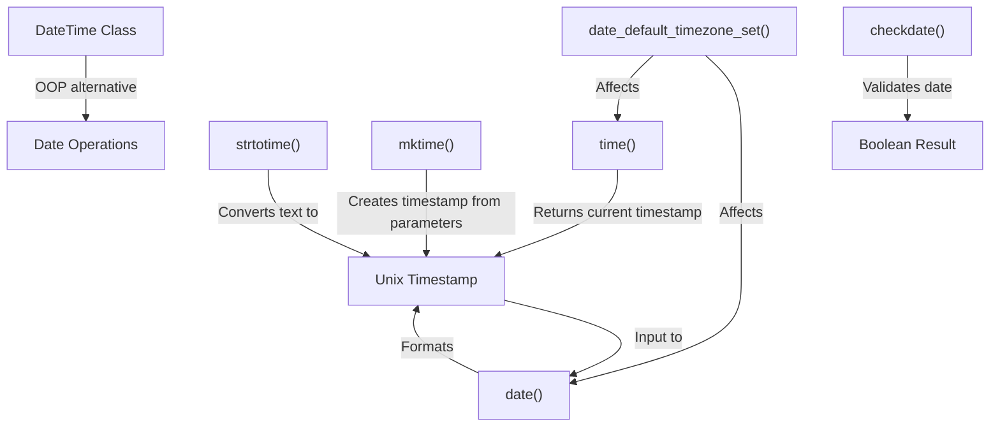

# PHP Date Functions

## Introduction

Working with dates and times is a common requirement in web applications. PHP provides a powerful set of built-in functions specifically designed for date and time manipulation. These functions allow you to format dates, perform date calculations, validate dates, and much more.

In this tutorial, we'll explore the most important PHP date functions, understand their syntax, and see practical examples of how they can be used in real-world applications.

## Basic Date and Time Concepts

Before diving into PHP's date functions, let's understand some basic concepts:

- **Timestamp**: A numeric representation of time, typically counting seconds from the Unix Epoch (January 1, 1970, 00:00:00 GMT)
- **Date Format**: A way to represent dates in a human-readable format
- **Timezone**: A region of the globe that observes a uniform standard time

## Essential PHP Date Functions

### Getting the Current Date and Time

The most basic operation is retrieving the current date and time. PHP provides several functions for this purpose.

#### `date()` Function

The `date()` function formats a timestamp into a readable date and time format.

```php
// Basic syntax
date(format, timestamp);
```

Parameters:
- `format`: Required. Specifies the format of the timestamp
- `timestamp`: Optional. Specifies the timestamp to format. Default is the current time

Example:

```php
echo date("Y-m-d H:i:s");
```

Output:
```
2023-06-15 14:25:30
```

The format parameter uses special characters to represent different parts of a date:

| Format | Description | Example |
|--------|-------------|---------|
| Y | Four digit year | 2023 |
| m | Month with leading zeros | 01 to 12 |
| d | Day with leading zeros | 01 to 31 |
| H | 24-hour format with leading zeros | 00 to 23 |
| i | Minutes with leading zeros | 00 to 59 |
| s | Seconds with leading zeros | 00 to 59 |
| l | Full day name | Sunday to Saturday |
| F | Full month name | January to December |

#### `time()` Function

The `time()` function returns the current timestamp (seconds since the Unix Epoch).

```php
// Get current timestamp
$currentTimestamp = time();
echo $currentTimestamp;
```

Output:
```
1686835530
```

You can use this timestamp with the `date()` function:

```php
$timestamp = time();
echo date("Y-m-d H:i:s", $timestamp);
```

### Creating Custom Timestamps

#### `mktime()` Function

The `mktime()` function creates a timestamp for a specified date and time.

```php
// Syntax
mktime(hour, minute, second, month, day, year);
```

Example:

```php
// Create a timestamp for December 31, 2023, 23:59:59
$timestamp = mktime(23, 59, 59, 12, 31, 2023);
echo "Timestamp: " . $timestamp . "<br>";
echo "Date: " . date("Y-m-d H:i:s", $timestamp);
```

Output:
```
Timestamp: 1704067199
Date: 2023-12-31 23:59:59
```

#### `strtotime()` Function

The `strtotime()` function converts a human-readable date string into a timestamp.

```php
// Syntax
strtotime(time, now);
```

Example:

```php
// Convert string to timestamp
$timestamp = strtotime("2023-06-15 14:30:00");
echo "Timestamp: " . $timestamp . "<br>";
echo "Date: " . date("Y-m-d H:i:s", $timestamp);
```

Output:
```
Timestamp: 1686835800
Date: 2023-06-15 14:30:00
```

The real power of `strtotime()` is in its ability to understand relative dates:

```php
// Relative dates
echo "Next Monday: " . date("Y-m-d", strtotime("next Monday")) . "<br>";
echo "Last Sunday: " . date("Y-m-d", strtotime("last Sunday")) . "<br>";
echo "+1 week: " . date("Y-m-d", strtotime("+1 week")) . "<br>";
echo "+1 month 2 days 4 hours: " . date("Y-m-d H:i", strtotime("+1 month 2 days 4 hours"));
```

Output (may vary based on current date):
```
Next Monday: 2023-06-19
Last Sunday: 2023-06-11
+1 week: 2023-06-22
+1 month 2 days 4 hours: 2023-07-17 18:25
```

### Date Calculations and Manipulations

#### Date Differences

To calculate the difference between two dates, you can use timestamps:

```php
// Calculate days between two dates
$date1 = strtotime("2023-06-01");
$date2 = strtotime("2023-06-15");
$daysApart = ($date2 - $date1) / (60 * 60 * 24);

echo "Days between dates: " . $daysApart;
```

Output:
```
Days between dates: 14
```

#### Adding/Subtracting Time

You can add or subtract time intervals using `strtotime()`:

```php
$baseDate = "2023-06-15";
echo "Base date: " . $baseDate . "<br>";
echo "Add 5 days: " . date("Y-m-d", strtotime($baseDate . " +5 days")) . "<br>";
echo "Subtract 1 month: " . date("Y-m-d", strtotime($baseDate . " -1 month")) . "<br>";
echo "Add 2 years: " . date("Y-m-d", strtotime($baseDate . " +2 years"));
```

Output:
```
Base date: 2023-06-15
Add 5 days: 2023-06-20
Subtract 1 month: 2023-05-15
Add 2 years: 2025-06-15
```

### Date Validation

To check if a date is valid, you can use the `checkdate()` function:

```php
// Syntax
checkdate(month, day, year);
```

Example:

```php
// Check if dates are valid
var_dump(checkdate(2, 29, 2020)); // Leap year
var_dump(checkdate(2, 29, 2021)); // Not a leap year
var_dump(checkdate(13, 1, 2023)); // Invalid month
```

Output:
```
bool(true)
bool(false)
bool(false)
```

### Working with Timezones

PHP allows you to set and use different timezones.

#### Setting the Default Timezone

```php
// Set the default timezone
date_default_timezone_set("America/New_York");
echo "Current timezone: " . date_default_timezone_get() . "<br>";
echo "Current time in New York: " . date("Y-m-d H:i:s");
```

Output:
```
Current timezone: America/New_York
Current time in New York: 2023-06-15 10:25:30
```

#### Displaying Time in Different Timezones

```php
// Display time in different timezones
date_default_timezone_set("UTC");
$timestamp = time();

echo "Time in UTC: " . date("Y-m-d H:i:s", $timestamp) . "<br>";

date_default_timezone_set("Asia/Tokyo");
echo "Time in Tokyo: " . date("Y-m-d H:i:s", $timestamp) . "<br>";

date_default_timezone_set("Europe/London");
echo "Time in London: " . date("Y-m-d H:i:s", $timestamp);
```

Output:
```
Time in UTC: 2023-06-15 14:25:30
Time in Tokyo: 2023-06-15 23:25:30
Time in London: 2023-06-15 15:25:30
```

## DateTime Class

PHP also offers an object-oriented approach to date and time manipulation through the `DateTime` class.

```php
// Create a DateTime object
$date = new DateTime("2023-06-15 14:30:00");
echo "Date: " . $date->format("Y-m-d H:i:s") . "<br>";

// Add 5 days
$date->modify("+5 days");
echo "After adding 5 days: " . $date->format("Y-m-d H:i:s") . "<br>";

// Create another date for comparison
$anotherDate = new DateTime("2023-07-01");
$diff = $date->diff($anotherDate);
echo "Difference in days: " . $diff->days;
```

Output:
```
Date: 2023-06-15 14:30:00
After adding 5 days: 2023-06-20 14:30:00
Difference in days: 11
```

## Practical Applications

### Displaying Dates in User-Friendly Format

```php
// Display dates in user-friendly format
$timestamp = time();

// US format (MM/DD/YYYY)
echo "US format: " . date("m/d/Y", $timestamp) . "<br>";

// European format (DD/MM/YYYY)
echo "European format: " . date("d/m/Y", $timestamp) . "<br>";

// Full text format
echo "Full text format: " . date("l, F j, Y", $timestamp);
```

Output:
```
US format: 06/15/2023
European format: 15/06/2023
Full text format: Thursday, June 15, 2023
```

### Creating a Dynamic Copyright Year

```php
// Dynamic copyright year for website footer
echo "© " . date("Y") . " My Website. All rights reserved.";
```

Output:
```
© 2023 My Website. All rights reserved.
```

### Age Calculator

```php
// Calculate age from birthdate
function calculateAge($birthdate) {
    $birth = new DateTime($birthdate);
    $today = new DateTime('today');
    $age = $birth->diff($today)->y;
    return $age;
}

echo "Age: " . calculateAge("1990-05-15");
```

Output:
```
Age: 33
```

### Due Date Calculator

```php
// Calculate due date (e.g., for pregnancy)
function calculateDueDate($lastPeriodDate) {
    $date = new DateTime($lastPeriodDate);
    $date->modify("+280 days"); // 40 weeks
    return $date->format("F j, Y");
}

echo "Due date: " . calculateDueDate("2022-09-15");
```

Output:
```
Due date: June 22, 2023
```

### Event Countdown

```php
// Calculate days until an event
function daysUntilEvent($eventDate) {
    $event = new DateTime($eventDate);
    $today = new DateTime('today');
    $interval = $today->diff($event);
    
    return $interval->days;
}

$christmasDays = daysUntilEvent("2023-12-25");
echo "Days until Christmas: " . $christmasDays;
```

Output (varies based on current date):
```
Days until Christmas: 193
```

## Date Function Flow Diagram

Here's a flow diagram showing how various PHP date functions relate to each other:



## Summary

PHP offers a robust set of functions and classes for working with dates and times. In this tutorial, we covered:

- Basic date formatting with `date()`
- Getting current timestamp with `time()`
- Creating timestamps with `mktime()` and `strtotime()`
- Date calculations and manipulations
- Date validation with `checkdate()`
- Working with timezones
- The object-oriented `DateTime` class
- Practical applications of PHP date functions

With these tools, you can handle virtually any date and time manipulation task in your PHP applications, from displaying user-friendly dates to complex date calculations.

## Exercises

1. Create a function that displays how long ago a date was (e.g., "2 days ago", "1 month ago").
2. Build a simple calendar that shows the current month with highlighted current day.
3. Create a function that converts a timestamp to a user's local timezone.
4. Implement a "remember me" feature that expires a login after 30 days.
5. Create a function that checks if a given year is a leap year.

## Additional Resources

- [PHP Date/Time Functions (Official Documentation)](https://www.php.net/manual/en/ref.datetime.php)
- [DateTime Class (Official Documentation)](https://www.php.net/manual/en/class.datetime.php)
- [List of Supported Timezones](https://www.php.net/manual/en/timezones.php)