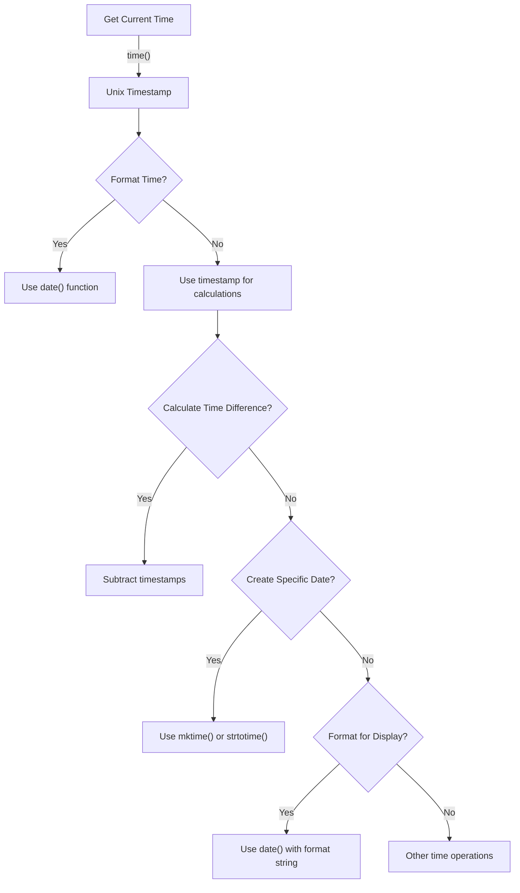

# PHP Time Functions

Time is a critical component in many web applications - from displaying the current date to calculating intervals between events. PHP offers a powerful set of built-in functions specifically designed for time manipulation and formatting. These time functions allow you to measure time precisely, format timestamps, and perform various time-related operations.

## Introduction to PHP Time Functions

PHP time functions enable developers to:
- Get the current timestamp
- Measure execution time
- Format time values
- Compare time values
- Calculate time differences

Whether you're building a blog that displays when posts were published, developing a booking system that needs to track appointments, or creating any application that requires time awareness, PHP's time functions provide the tools you need.

## Core PHP Time Functions

### Getting the Current Time

The most fundamental time function in PHP is `time()`. This function returns the current Unix timestamp - the number of seconds since January 1, 1970 (Unix Epoch).

```php
<?php
// Get current Unix timestamp
$currentTimestamp = time();
echo "Current timestamp: " . $currentTimestamp;
?>
```

**Output:**
```
Current timestamp: 1709490304
```

While a timestamp is useful for calculations, it's not human-readable. To display the current time in a readable format, we can combine `time()` with `date()`:

```php
<?php
// Format current time
echo "Current date and time: " . date("Y-m-d H:i:s", time());
?>
```

**Output:**
```
Current date and time: 2025-03-03 14:25:04
```

### Measuring Script Execution Time

PHP allows you to measure how long your script takes to execute using `microtime()`. This is particularly useful for performance optimization.

```php
<?php
// Start time
$startTime = microtime(true);

// Your code to be measured
for ($i = 0; $i < 1000000; $i++) {
    // Some operation
    $x = $i * 2;
}

// End time
$endTime = microtime(true);

// Calculate execution time
$executionTime = $endTime - $startTime;
echo "Script execution time: " . number_format($executionTime, 6) . " seconds";
?>
```

**Output:**
```
Script execution time: 0.023651 seconds
```

### Working with Timestamps

PHP provides several functions for creating and manipulating timestamps:

#### mktime() - Creating Timestamps

The `mktime()` function creates a timestamp for a specific date and time:

```php
<?php
// mktime(hour, minute, second, month, day, year)
$timestamp = mktime(15, 30, 0, 12, 25, 2024);
echo "Christmas 2024 at 3:30 PM: " . $timestamp . "
";
echo "Formatted date: " . date("Y-m-d H:i:s", $timestamp);
?>
```

**Output:**
```
Christmas 2024 at 3:30 PM: 1735233000
Formatted date: 2024-12-25 15:30:00
```

#### strtotime() - Converting Text to Timestamps

The `strtotime()` function converts a human-readable date/time string into a Unix timestamp:

```php
<?php
// Convert string to timestamp
$timestamp = strtotime("next Sunday");
echo "Next Sunday: " . date("Y-m-d", $timestamp) . "
";

$timestamp = strtotime("+1 week 2 days 4 hours");
echo "1 week, 2 days and 4 hours from now: " . date("Y-m-d H:i:s", $timestamp) . "
";

$timestamp = strtotime("2023-12-31");
echo "Last day of 2023: " . date("l, F j, Y", $timestamp);
?>
```

**Output:**
```
Next Sunday: 2025-03-09
1 week, 2 days and 4 hours from now: 2025-03-12 18:25:04
Last day of 2023: Sunday, December 31, 2023
```

### Sleep and Time Delay Functions

PHP provides functions to pause script execution:

#### sleep() - Delay in Seconds

```php
<?php
echo "Starting script...
";
// Pause for 2 seconds
sleep(2);
echo "After 2-second delay";
?>
```

**Output:**
```
Starting script...
After 2-second delay
```

#### usleep() - Microsecond Precision Delay

For more precise control, `usleep()` allows you to pause execution for a specified number of microseconds:

```php
<?php
echo "Starting script...
";
// Pause for 500,000 microseconds (0.5 seconds)
usleep(500000);
echo "After 0.5-second delay";
?>
```

**Output:**
```
Starting script...
After 0.5-second delay
```

## Practical Applications

### Creating a Simple Countdown Timer

```php
<?php
function displayCountdown($targetTimestamp) {
    $currentTime = time();
    $remainingTime = $targetTimestamp - $currentTime;
    
    if ($remainingTime <= 0) {
        return "The event has already occurred!";
    }
    
    $days = floor($remainingTime / (60 * 60 * 24));
    $hours = floor(($remainingTime % (60 * 60 * 24)) / (60 * 60));
    $minutes = floor(($remainingTime % (60 * 60)) / 60);
    $seconds = $remainingTime % 60;
    
    return "Time remaining: $days days, $hours hours, $minutes minutes, $seconds seconds";
}

// Target event: New Year 2026
$newYear2026 = strtotime("2026-01-01 00:00:00");
echo displayCountdown($newYear2026);
?>
```

**Output:**
```
Time remaining: 303 days, 9 hours, 34 minutes, 56 seconds
```

### Logging Script Execution Times

```php
<?php
function logExecutionTime($operation) {
    static $lastTime = null;
    
    $currentTime = microtime(true);
    
    if ($lastTime === null) {
        echo "Starting timing for: $operation
";
    } else {
        $executionTime = $currentTime - $lastTime;
        echo "$operation completed in: " . number_format($executionTime, 6) . " seconds
";
    }
    
    $lastTime = $currentTime;
}

// Usage in a real application
logExecutionTime("Database connection");
// Simulate database connection
usleep(300000);

logExecutionTime("Data retrieval");
// Simulate data retrieval
usleep(700000);

logExecutionTime("Data processing");
// Simulate processing
usleep(500000);

logExecutionTime("Script completion");
?>
```

**Output:**
```
Starting timing for: Database connection
Database connection completed in: 0.300123 seconds
Data retrieval completed in: 0.700215 seconds
Data processing completed in: 0.500178 seconds
Script completion completed in: 0.000021 seconds
```

### Rate Limiting API Requests

```php
<?php
function isRequestAllowed($userId, $maxRequests = 5, $timeWindow = 60) {
    // In a real application, this would be stored in a database or cache
    static $userRequests = [];
    
    $currentTime = time();
    
    // Initialize user's request history if not exists
    if (!isset($userRequests[$userId])) {
        $userRequests[$userId] = [];
    }
    
    // Remove requests outside the time window
    $userRequests[$userId] = array_filter($userRequests[$userId], function($timestamp) use ($currentTime, $timeWindow) {
        return $timestamp > ($currentTime - $timeWindow);
    });
    
    // Check if user has exceeded the maximum requests
    if (count($userRequests[$userId]) >= $maxRequests) {
        return false;
    }
    
    // Add current request to history
    $userRequests[$userId][] = $currentTime;
    return true;
}

// Simulate API requests
$userId = "user123";

for ($i = 1; $i <= 7; $i++) {
    if (isRequestAllowed($userId)) {
        echo "Request $i: Allowed
";
    } else {
        echo "Request $i: Denied (rate limit exceeded)
";
    }
    
    // Simulate a slight delay between requests
    usleep(100000);
}
?>
```

**Output:**
```
Request 1: Allowed
Request 2: Allowed
Request 3: Allowed
Request 4: Allowed
Request 5: Allowed
Request 6: Denied (rate limit exceeded)
Request 7: Denied (rate limit exceeded)
```

## Understanding Timezone Management

Time functions in PHP are affected by the server's timezone setting. To ensure consistent time handling, you can use the `date_default_timezone_set()` function:

```php
<?php
// Check current default timezone
echo "Default timezone: " . date_default_timezone_get() . "
";

// Set timezone to New York
date_default_timezone_set('America/New_York');
echo "Current time in New York: " . date('Y-m-d H:i:s') . "
";

// Set timezone to Tokyo
date_default_timezone_set('Asia/Tokyo');
echo "Current time in Tokyo: " . date('Y-m-d H:i:s');
?>
```

**Output:**
```
Default timezone: UTC
Current time in New York: 2025-03-03 09:25:04
Current time in Tokyo: 2025-03-03 23:25:04
```

## Time Function Workflow



## Common PHP Time Function Challenges

### Dealing with Daylight Saving Time

Daylight Saving Time (DST) can cause issues when working with time. When calculating time differences spanning DST changes, always use timestamp subtraction to get accurate results.

```php
<?php
// Set timezone to a location with DST
date_default_timezone_set('America/New_York');

// March 10, 2024, 1:30 AM (before DST change)
$beforeDST = strtotime('2024-03-10 01:30:00');
echo "Before DST: " . date('Y-m-d H:i:s', $beforeDST) . "
";

// March 10, 2024, 3:30 AM (after DST change)
$afterDST = strtotime('2024-03-10 03:30:00');
echo "After DST: " . date('Y-m-d H:i:s', $afterDST) . "
";

// Calculate hours between
$hourDifference = ($afterDST - $beforeDST) / 3600;
echo "Hour difference: " . $hourDifference . " hours";
?>
```

**Output:**
```
Before DST: 2024-03-10 01:30:00
After DST: 2024-03-10 03:30:00
Hour difference: 1 hours
```

Notice that the hour difference is only 1 hour, not 2, because at 2:00 AM, the clock jumps forward to 3:00 AM during the DST change.

### Working with Different Timezones

When your application serves users across multiple timezones, consider storing all times in UTC and converting to local time only for display:

```php
<?php
// Store timestamp in UTC (server-independent)
$utcTimestamp = time();
echo "UTC timestamp: " . $utcTimestamp . "
";
echo "UTC time: " . gmdate('Y-m-d H:i:s', $utcTimestamp) . "
";

// Display time for New York user
date_default_timezone_set('America/New_York');
echo "New York time: " . date('Y-m-d H:i:s', $utcTimestamp) . "
";

// Display time for Tokyo user
date_default_timezone_set('Asia/Tokyo');
echo "Tokyo time: " . date('Y-m-d H:i:s', $utcTimestamp);
?>
```

**Output:**
```
UTC timestamp: 1709490304
UTC time: 2025-03-03 14:25:04
New York time: 2025-03-03 09:25:04
Tokyo time: 2025-03-03 23:25:04
```

## Summary

PHP time functions provide powerful tools for working with dates and times in your applications. We've covered:

- Getting the current time with `time()` and `microtime()`
- Creating timestamps with `mktime()` and `strtotime()`
- Formatting dates with `date()`
- Controlling script execution with `sleep()` and `usleep()`
- Handling timezone differences with `date_default_timezone_set()`
- Practical applications like countdown timers and rate limiting

By mastering these functions, you'll be able to handle time-related operations effectively in your PHP applications.

## Additional Resources and Exercises

### Additional Resources

- [PHP Manual: Date/Time Functions](https://www.php.net/manual/en/ref.datetime.php)
- [PHP Manual: DateTime class](https://www.php.net/manual/en/class.datetime.php) - For object-oriented date/time handling
- [List of supported timezones](https://www.php.net/manual/en/timezones.php)

### Practice Exercises

1. **Birthday Countdown**: Create a script that calculates and displays how many days, hours, minutes, and seconds until your next birthday.

2. **Time Converter**: Build a tool that converts a timestamp between different timezones.

3. **Performance Logger**: Create a class that logs the execution time of different parts of your application to help identify bottlenecks.

4. **Age Calculator**: Build a function that calculates a person's exact age in years, months, and days based on their birthdate.

5. **Schedule Generator**: Create a script that generates a weekly schedule with time slots, considering business hours and lunch breaks.

Remember that mastering PHP time functions takes practice. Start with simple applications and gradually move to more complex time-related challenges to build your skills.