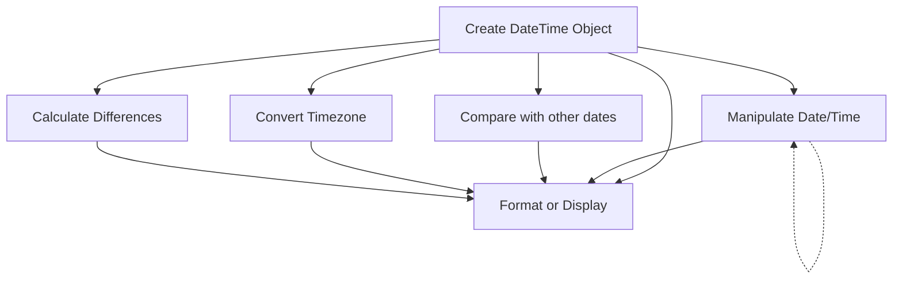

# PHP DateTime Class

## Introduction

Working with dates and times is a common task in programming, and PHP offers a powerful object-oriented solution: the **DateTime** class. Introduced in PHP 5.2, this class provides a comprehensive set of methods for creating, manipulating, formatting, and comparing dates and times, offering significant advantages over the traditional procedural date functions.

The DateTime class is part of PHP's core and doesn't require any additional extensions or libraries. It handles many complex aspects of date/time manipulation, including timezone conversions, daylight saving time adjustments, and date arithmetic, making it an essential tool for PHP developers.

## Basic Usage

### Creating DateTime Objects

There are several ways to create a DateTime object:

```php
// Current date and time
$now = new DateTime();
echo $now->format('Y-m-d H:i:s'); // Output: Current date/time (e.g., 2025-03-03 14:30:45)

// From a specific date string
$date1 = new DateTime('2023-05-15');
echo $date1->format('Y-m-d'); // Output: 2023-05-15

// From a formatted date string
$date2 = new DateTime('15 May 2023');
echo $date2->format('Y-m-d'); // Output: 2023-05-15

// Using createFromFormat() for custom format parsing
$date3 = DateTime::createFromFormat('d/m/Y', '15/05/2023');
echo $date3->format('Y-m-d'); // Output: 2023-05-15
```

### Formatting DateTime Objects

The `format()` method allows you to output dates in various formats using format characters:

```php
$date = new DateTime('2023-05-15 14:30:45');

// Different format examples
echo $date->format('Y-m-d H:i:s'); // Output: 2023-05-15 14:30:45
echo $date->format('F j, Y'); // Output: May 15, 2023
echo $date->format('d/m/Y'); // Output: 15/05/2023
echo $date->format('h:i A'); // Output: 02:30 PM
echo $date->format('l, jS F Y'); // Output: Monday, 15th May 2023
```

Common format characters:
- `Y`: Four-digit year (e.g., 2023)
- `m`: Month as two digits (01-12)
- `d`: Day of the month as two digits (01-31)
- `H`: 24-hour format (00-23)
- `h`: 12-hour format (01-12)
- `i`: Minutes (00-59)
- `s`: Seconds (00-59)
- `F`: Full month name (e.g., January)
- `j`: Day of the month without leading zeros (1-31)
- `l`: Full day of week name (e.g., Monday)
- `A`: AM or PM

## Date Manipulation

### Adding and Subtracting Time

The DateTime class provides methods to modify dates by adding or subtracting intervals:

```php
$date = new DateTime('2023-05-15');

// Adding time
$date->modify('+1 day');
echo $date->format('Y-m-d'); // Output: 2023-05-16

$date->modify('+2 weeks');
echo $date->format('Y-m-d'); // Output: 2023-05-30

// Subtracting time
$date->modify('-3 days');
echo $date->format('Y-m-d'); // Output: 2023-05-27

// You can also chain modifications
$date = new DateTime('2023-05-15');
$date->modify('+1 month')->modify('+5 days');
echo $date->format('Y-m-d'); // Output: 2023-06-20
```

### Using DateInterval

For more precise date manipulation, you can use the `DateInterval` class:

```php
$date = new DateTime('2023-05-15');

// Add 2 years, 3 months, and 15 days
$interval = new DateInterval('P2Y3M15D');
$date->add($interval);
echo $date->format('Y-m-d'); // Output: 2025-08-30

// Subtract 1 month
$interval = new DateInterval('P1M');
$date->sub($interval);
echo $date->format('Y-m-d'); // Output: 2025-07-30

// Add 10 hours and 30 minutes
$interval = new DateInterval('PT10H30M');
$date->add($interval);
echo $date->format('Y-m-d H:i:s'); // Output: 2025-07-30 10:30:00
```

The DateInterval format:
- `P` - Period designator (required)
- `Y` - Years
- `M` - Months
- `D` - Days
- `T` - Time designator (required before any time components)
- `H` - Hours
- `M` - Minutes
- `S` - Seconds

## Date Comparison

You can compare DateTime objects using comparison operators or specific methods:

```php
$date1 = new DateTime('2023-05-15');
$date2 = new DateTime('2023-06-20');

// Using comparison operators
if ($date1 < $date2) {
    echo "date1 is earlier than date2"; // This will be output
}

if ($date1 > $date2) {
    echo "date1 is later than date2"; // This won't be output
}

// Using diff() to get the difference
$interval = $date1->diff($date2);
echo "Difference: " . $interval->format('%R%a days'); // Output: Difference: +36 days

// Checking if dates are equal
$date3 = new DateTime('2023-05-15');
if ($date1 == $date3) {
    echo "date1 and date3 are the same day"; // This will be output
}
```

## Working with Timezones

The DateTime class can handle different timezones:

```php
// Set default timezone
date_default_timezone_set('America/New_York');

// Create date with default timezone
$dateNY = new DateTime('2023-05-15 12:00:00');
echo "New York: " . $dateNY->format('Y-m-d H:i:s T'); // Output: New York: 2023-05-15 12:00:00 EDT

// Change timezone
$dateNY->setTimezone(new DateTimeZone('Europe/Paris'));
echo "Paris: " . $dateNY->format('Y-m-d H:i:s T'); // Output: Paris: 2023-05-15 18:00:00 CEST

// Create with specific timezone
$dateTokyo = new DateTime('2023-05-15 12:00:00', new DateTimeZone('Asia/Tokyo'));
echo "Tokyo: " . $dateTokyo->format('Y-m-d H:i:s T'); // Output: Tokyo: 2023-05-15 12:00:00 JST

// Convert Tokyo time to Los Angeles
$dateTokyo->setTimezone(new DateTimeZone('America/Los_Angeles'));
echo "Los Angeles: " . $dateTokyo->format('Y-m-d H:i:s T'); // Output: Los Angeles: 2023-05-14 20:00:00 PDT
```

## DateTime and Database Operations

When working with databases, the DateTime class is particularly useful:

```php
// Storing dates in a database (MySQL example)
$user_registered = new DateTime();
$formatted_date = $user_registered->format('Y-m-d H:i:s'); // Format for MySQL DATETIME

$sql = "INSERT INTO users (username, registration_date) VALUES ('john_doe', '$formatted_date')";

// Retrieving dates from a database
$date_from_db = '2023-05-15 14:30:45'; // Date retrieved from database
$registration_date = new DateTime($date_from_db);
echo "User registered on: " . $registration_date->format('F j, Y \a\t g:i a');
// Output: User registered on: May 15, 2023 at 2:30 pm
```

## Practical Examples

### Example 1: Event Countdown Timer

```php
function getCountdown($eventDate) {
    $now = new DateTime();
    $event = new DateTime($eventDate);
    
    if ($now > $event) {
        return "This event has already occurred";
    }
    
    $interval = $now->diff($event);
    
    return sprintf(
        "%d days, %d hours, %d minutes, and %d seconds remaining",
        $interval->d,
        $interval->h,
        $interval->i,
        $interval->s
    );
}

// Usage
echo getCountdown('2023-12-31 23:59:59');
// Output: X days, Y hours, Z minutes, and 0 seconds remaining (values depend on current time)
```

### Example 2: Age Calculator

```php
function calculateAge($birthdate) {
    $birth = new DateTime($birthdate);
    $today = new DateTime('today');
    $age = $today->diff($birth);
    
    return $age->y;
}

// Usage
echo "Age: " . calculateAge('1990-05-15'); // Output: Age: 35 (in 2025)
```

### Example 3: Working Day Calculator

```php
function addWorkingDays($startDate, $workingDays) {
    $date = new DateTime($startDate);
    $count = 0;
    
    while ($count < $workingDays) {
        $date->modify('+1 day');
        
        // Skip weekends
        $weekday = $date->format('N');
        if ($weekday < 6) { // 1 (Monday) to 5 (Friday)
            $count++;
        }
    }
    
    return $date->format('Y-m-d');
}

// Add 10 working days (excluding weekends) to May 15, 2023
echo addWorkingDays('2023-05-15', 10); // Output: 2023-05-29
```

## DateTime Class Lifecycle

Here's a visual representation of how the DateTime class is typically used in applications:



## Summary

The PHP DateTime class provides a powerful, object-oriented approach to date and time manipulation in PHP. Key advantages include:

- **Object-oriented interface** for cleaner code
- **Built-in timezone support** for handling global applications
- **Consistent date manipulation** with methods like `add()`, `sub()`, and `modify()`
- **Easy date comparison** and difference calculation
- **Format flexibility** for displaying dates in various formats

When working with dates and times in PHP, the DateTime class should be your go-to solution as it handles many complex issues automatically, such as leap years, daylight saving time, and timezone conversions.

## Additional Resources

- [PHP DateTime Documentation](https://www.php.net/manual/en/class.datetime.php)
- [PHP DateInterval Documentation](https://www.php.net/manual/en/class.dateinterval.php)
- [PHP DateTimeZone Documentation](https://www.php.net/manual/en/class.datetimezone.php)

## Exercises

1. Create a function that checks if a given date is a weekend.
2. Write a script that displays all Mondays in the current month.
3. Create a birthday reminder function that tells you how many days until someone's next birthday.
4. Implement a function that calculates the number of business days between two dates (excluding weekends and holidays).
5. Build a meeting scheduler that checks if a proposed meeting time conflicts with existing appointments.