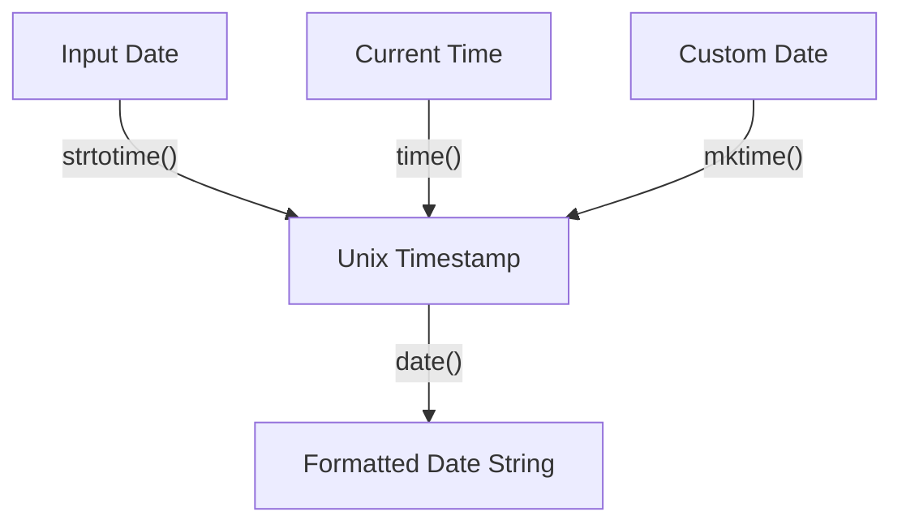

# PHP Date Formatting

## Introduction

Working with dates and times is a common requirement in web development. Whether you're displaying when a blog post was published, calculating subscription periods, or implementing date filters, PHP provides powerful tools for date manipulation and formatting.

In this tutorial, we'll explore PHP's date formatting capabilities, focusing on the `date()` function and its formatting characters. By the end, you'll be able to display dates and times exactly how you want them in your PHP applications.

## The date() Function

The core of PHP date formatting is the `date()` function. This function takes a format string and an optional timestamp, returning a formatted date string:

```php
string date(string $format, ?int $timestamp = null)
```

- `$format`: A string containing formatting characters that tell PHP how to format the date
- `$timestamp`: An optional Unix timestamp (integer representing seconds since January 1, 1970)

If you omit the timestamp parameter, the current date and time will be used.

### Basic Example

```php
// Display the current date
echo date("Y-m-d");

// Output (example): 2023-05-15
```

## Common Formatting Characters

PHP's `date()` function uses a wide range of formatting characters. Here are the most common ones:

### Day Formatting

| Character | Description | Example Output |
|-----------|-------------|----------------|
| d | Day of the month with leading zeros | 01 to 31 |
| j | Day of the month without leading zeros | 1 to 31 |
| D | A textual representation of a day (three letters) | Mon through Sun |
| l | A full textual representation of a day | Sunday through Saturday |
| S | English ordinal suffix for the day of the month | st, nd, rd or th |
| w | Numeric representation of the day of the week | 0 (Sunday) through 6 (Saturday) |
| z | The day of the year (starting from 0) | 0 through 365 |

### Month Formatting

| Character | Description | Example Output |
|-----------|-------------|----------------|
| F | A full textual representation of a month | January through December |
| m | Numeric representation of a month with leading zeros | 01 through 12 |
| M | A short textual representation of a month (three letters) | Jan through Dec |
| n | Numeric representation of a month without leading zeros | 1 through 12 |
| t | Number of days in the given month | 28 through 31 |

### Year Formatting

| Character | Description | Example Output |
|-----------|-------------|----------------|
| Y | A full numeric representation of a year (4 digits) | 2023 |
| y | A two-digit representation of a year | 23 |
| L | Whether it's a leap year | 1 (leap year) or 0 |

### Time Formatting

| Character | Description | Example Output |
|-----------|-------------|----------------|
| a | Lowercase ante meridiem and post meridiem | am or pm |
| A | Uppercase ante meridiem and post meridiem | AM or PM |
| g | 12-hour format of an hour without leading zeros | 1 through 12 |
| G | 24-hour format of an hour without leading zeros | 0 through 23 |
| h | 12-hour format of an hour with leading zeros | 01 through 12 |
| H | 24-hour format of an hour with leading zeros | 00 through 23 |
| i | Minutes with leading zeros | 00 through 59 |
| s | Seconds with leading zeros | 00 through 59 |

## Practical Examples

Let's explore some common real-world date formatting scenarios:

### Example 1: Displaying the Current Date in Different Formats

```php
// Current date in YYYY-MM-DD format
echo date("Y-m-d");  // 2023-05-15

// Current date in DD/MM/YYYY format
echo date("d/m/Y");  // 15/05/2023

// Current date as "Month Day, Year"
echo date("F j, Y");  // May 15, 2023

// Current day of the week
echo date("l");  // Monday
```

### Example 2: Displaying the Current Time

```php
// Current time in 24-hour format (HH:MM:SS)
echo date("H:i:s");  // 14:30:45

// Current time in 12-hour format with AM/PM
echo date("h:i:s A");  // 02:30:45 PM
```

### Example 3: Combining Date and Time

```php
// Date and time combined
echo date("Y-m-d H:i:s");  // 2023-05-15 14:30:45

// Friendly format
echo date("l, F j, Y - h:i A");  // Monday, May 15, 2023 - 02:30 PM
```

### Example 4: Formatting a Specific Date

You can format a specific date by providing a timestamp as the second parameter to the `date()` function. To create a timestamp, you can use the `strtotime()` function or the `mktime()` function:

```php
// Format a specific date using strtotime()
$timestamp = strtotime("2023-12-25");
echo date("l, F j, Y", $timestamp);  // Monday, December 25, 2023

// Format a specific date using mktime()
// mktime(hour, minute, second, month, day, year)
$timestamp = mktime(0, 0, 0, 12, 25, 2023);
echo date("l, F j, Y", $timestamp);  // Monday, December 25, 2023
```

### Example 5: Displaying Relative Dates

```php
// Tomorrow's date
echo date("Y-m-d", strtotime("tomorrow"));  // 2023-05-16

// Next week
echo date("Y-m-d", strtotime("+1 week"));  // 2023-05-22

// Three months from now
echo date("F j, Y", strtotime("+3 months"));  // August 15, 2023
```

### Example 6: Adding Custom Text to Date Outputs

```php
// Adding text with date elements
echo "Today is " . date("l") . ", the " . date("jS") . " of " . date("F Y");
// Output: Today is Monday, the 15th of May 2023

// Another way to do the same thing
echo "Today is " . date("l, \t\h\e jS \of F Y");
// Output: Today is Monday, the 15th of May 2023
```

Notice the backslashes (`\`) before characters in the format string. These escape the characters, telling PHP to treat them as literal text rather than formatting codes.

## Date Formatting Best Practices

Here are some best practices to keep in mind when working with dates in PHP:

1. **Be consistent**: Use a consistent date format throughout your application
2. **Consider internationalization**: Use locale-aware date formatting for international audiences
3. **Store in standard format**: Store dates in a standard format like ISO 8601 (YYYY-MM-DD) and format only for display
4. **Use constants for formats**: Define date format constants in your application to maintain consistency
5. **Handle timezones appropriately**: Be aware of timezone differences, especially for applications with global users

```php
// Define date format constants
define('DATE_FORMAT_DATABASE', 'Y-m-d H:i:s');
define('DATE_FORMAT_DISPLAY', 'F j, Y - g:i A');

// Using the constants
$now = time();
$date_for_database = date(DATE_FORMAT_DATABASE, $now);
$date_for_display = date(DATE_FORMAT_DISPLAY, $now);

echo "Database: $date_for_database<br>";
echo "Display: $date_for_display";

// Output:
// Database: 2023-05-15 14:30:45
// Display: May 15, 2023 - 2:30 PM
```

## Understanding Date Flow in PHP

Here's a diagram showing how dates are processed in PHP:



This shows that regardless of the source, dates in PHP are typically converted to a timestamp before being formatted for output.

## Common Pitfalls and Solutions

### Pitfall 1: Day/Month Ambiguity

When using numeric months and days, it can be unclear whether a date like "05/10/2023" means May 10 or October 5.

**Solution**: Use named months or ISO format (YYYY-MM-DD) to avoid ambiguity:

```php
// Ambiguous
echo date("m/d/Y");  // 05/15/2023 (US format)
echo date("d/m/Y");  // 15/05/2023 (European format)

// Unambiguous
echo date("Y-m-d");  // 2023-05-15 (ISO format)
echo date("d M Y");  // 15 May 2023 (with named month)
```

### Pitfall 2: Forgotten Timezones

PHP uses the server's timezone by default, which might not be what you expect.

**Solution**: Set the timezone explicitly:

```php
// Set timezone for the script
date_default_timezone_set('America/New_York');

// Now display the time
echo date("Y-m-d H:i:s");  // Will use New York time
```

### Pitfall 3: Working with User Input

User-provided dates might come in various formats.

**Solution**: Use `strtotime()` to parse various date formats:

```php
// Parse different user-input formats
$date1 = strtotime("May 15, 2023");
$date2 = strtotime("15-05-2023");
$date3 = strtotime("2023/05/15");

// Format them all consistently
echo date("Y-m-d", $date1) . "<br>";  // 2023-05-15
echo date("Y-m-d", $date2) . "<br>";  // 2023-05-15
echo date("Y-m-d", $date3) . "<br>";  // 2023-05-15
```

## Summary

PHP's date formatting capabilities provide flexible ways to display dates and times in your web applications. The `date()` function, combined with various formatting characters, allows you to create virtually any date format you need.

Key points to remember:
- The `date()` function is the cornerstone of PHP date formatting
- Format characters tell PHP how to display each part of the date
- You can combine literal text with format characters by escaping text with backslashes
- Always consider timezones when working with dates
- Store dates in a standard format and format only for display

## Practice Exercises

1. Create a function that displays how many days, hours, minutes, and seconds until a user's birthday.
2. Build a date formatter that allows users to select from different date formats.
3. Create a "time ago" function that displays dates as "5 minutes ago", "2 hours ago", "3 days ago", etc.
4. Build a calendar display for the current month using PHP's date functions.
5. Create a function that converts dates between different timezones.

## Additional Resources

- [PHP date() Documentation](https://www.php.net/manual/en/function.date.php)
- [PHP strtotime() Documentation](https://www.php.net/manual/en/function.strtotime.php)
- [DateTime Class](https://www.php.net/manual/en/class.datetime.php) - An object-oriented alternative to the date functions
- [DateTimeZone Class](https://www.php.net/manual/en/class.datetimezone.php) - For more advanced timezone handling