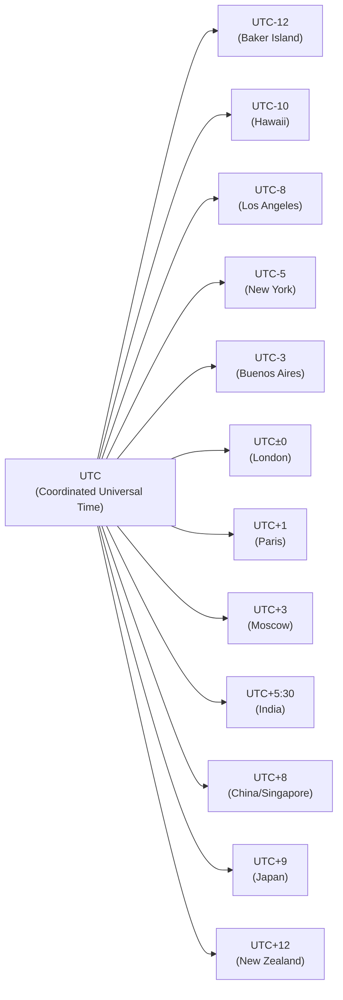

# PHP Timezone Settings

## Introduction

When working with dates and times in PHP applications, understanding timezone settings is crucial for displaying accurate timestamps regardless of where your users are located. PHP provides robust timezone support through its DateTime and DateTimeZone classes, allowing developers to handle time differences across geographical locations effectively.

In this tutorial, we'll explore how to work with timezone settings in PHP, including how to set the default timezone, convert between timezones, and handle common timezone-related challenges.

## Why Timezones Matter

Consider this scenario: Your server is in New York (UTC-5), but your application serves users worldwide. When a user in Tokyo (UTC+9) submits a form at 3:00 PM their local time, without proper timezone handling, your application might record this as 3:00 PM New York time - a 14-hour difference!

This discrepancy can lead to:
- Incorrect meeting schedules
- Misinterpreted transaction timestamps
- Confusing log entries
- Invalid data for time-sensitive operations

## Setting the Default Timezone

### The `date_default_timezone_set()` Function

PHP allows you to set a default timezone for all date/time functions using the `date_default_timezone_set()` function:

```php
// Set default timezone to New York (Eastern Time)
date_default_timezone_set('America/New_York');

// Get current time
echo date('Y-m-d H:i:s'); // Outputs time in America/New_York timezone
```

### In php.ini Configuration

You can also set the default timezone in your `php.ini` file:

```
[Date]
date.timezone = Europe/London
```

### The `date_default_timezone_get()` Function

To check which timezone is currently set as default:

```php
echo date_default_timezone_get(); // Outputs: America/New_York (or your configured timezone)
```

## Working with the DateTimeZone Class

PHP's `DateTimeZone` class provides more advanced timezone handling capabilities.

### Creating DateTimeZone Objects

```php
// Create timezone objects
$tokyoTZ = new DateTimeZone('Asia/Tokyo');
$londonTZ = new DateTimeZone('Europe/London');

// Create a DateTime with specific timezone
$dateInTokyo = new DateTime('now', $tokyoTZ);
echo $dateInTokyo->format('Y-m-d H:i:s');  // Time in Tokyo
```

### Converting Between Timezones

One of the most common timezone operations is converting a time from one timezone to another:

```php
// Create a date in Tokyo timezone
$tokyoTZ = new DateTimeZone('Asia/Tokyo');
$dateInTokyo = new DateTime('now', $tokyoTZ);
echo "Tokyo: " . $dateInTokyo->format('Y-m-d H:i:s') . "
";

// Convert to New York timezone
$newYorkTZ = new DateTimeZone('America/New_York');
$dateInTokyo->setTimezone($newYorkTZ);
echo "New York: " . $dateInTokyo->format('Y-m-d H:i:s') . "
";
```

**Output:**
```
Tokyo: 2025-03-03 22:30:45
New York: 2025-03-03 08:30:45
```

## Listing Available Timezones

PHP provides functions to list all available timezones:

```php
// Get all timezone identifiers
$timezones = DateTimeZone::listIdentifiers();

// Display first 5 timezones
for ($i = 0; $i < 5; $i++) {
    echo $timezones[$i] . "
";
}
```

**Output:**
```
Africa/Abidjan
Africa/Accra
Africa/Addis_Ababa
Africa/Algiers
Africa/Asmara
```

You can also get timezones by region:

```php
// Get European timezones
$europeanTZ = DateTimeZone::listIdentifiers(DateTimeZone::EUROPE);
print_r(array_slice($europeanTZ, 0, 5)); // Display first 5 European timezones
```

**Output:**
```
Array
(
    [0] => Europe/Amsterdam
    [1] => Europe/Andorra
    [2] => Europe/Astrakhan
    [3] => Europe/Athens
    [4] => Europe/Belgrade
)
```

## Timezone Abbreviations

PHP also supports timezone abbreviations like "EST" or "GMT":

```php
// Using an abbreviation
$date = new DateTime('now', new DateTimeZone('GMT'));
echo $date->format('Y-m-d H:i:s');
```

However, it's recommended to use the full identifiers (like 'America/New_York') instead of abbreviations as they handle daylight saving time changes correctly and are more precise.

## TimeZone Offsets

You can calculate the offset between timezones:

```php
$tokyoTZ = new DateTimeZone('Asia/Tokyo');
$londonTZ = new DateTimeZone('Europe/London');

// Get current DateTime object
$date = new DateTime('now', $tokyoTZ);

// Calculate offset in seconds
$offset = $tokyoTZ->getOffset($date) - $londonTZ->getOffset($date);

// Convert to hours
$hours = $offset / 3600;
echo "Tokyo is " . $hours . " hours ahead of London";
```

**Output:**
```
Tokyo is 9 hours ahead of London
```

## Handling Daylight Saving Time (DST)

Daylight Saving Time transitions can be tricky to handle. Let's look at how to check if a date falls within DST:

```php
$tz = new DateTimeZone('America/New_York');
$date = new DateTime('2025-01-15', $tz); // Winter date
$date2 = new DateTime('2025-07-15', $tz); // Summer date

// Check if dates are in DST
echo "January 15: " . ($date->format('I') ? 'DST' : 'No DST') . "
";
echo "July 15: " . ($date2->format('I') ? 'DST' : 'No DST');
```

**Output:**
```
January 15: No DST
July 15: DST
```

## Practical Example: User Registration System

Let's build a practical example of a user registration system that records user registration times in UTC but displays them in the user's local timezone:

```php
class UserRegistration {
    private $utcTimezone;
    
    public function __construct() {
        // Always store dates in UTC
        $this->utcTimezone = new DateTimeZone('UTC');
    }
    
    public function registerUser($username) {
        // Record registration time in UTC
        $registrationTime = new DateTime('now', $this->utcTimezone);
        
        // Simulate database storage
        $userData = [
            'username' => $username,
            'registration_time' => $registrationTime->format('Y-m-d H:i:s')
        ];
        
        return $userData;
    }
    
    public function displayRegistrationTime($userData, $userTimezone) {
        // Convert UTC time to user's timezone
        $regTime = new DateTime($userData['registration_time'], $this->utcTimezone);
        $userTZ = new DateTimeZone($userTimezone);
        $regTime->setTimezone($userTZ);
        
        return "Welcome {$userData['username']}! You registered on " . 
               $regTime->format('F j, Y \a\t g:i A') . " " . 
               $this->getTimezoneAbbr($userTZ, $regTime);
    }
    
    private function getTimezoneAbbr($timezone, $dateTime) {
        // Get timezone abbreviation (like EST, PST, etc.)
        return $dateTime->format('T');
    }
}

// Usage Example
$registration = new UserRegistration();

// Register a new user (registration time saved in UTC)
$newUser = $registration->registerUser('john_doe');

// Display time in different timezones
echo $registration->displayRegistrationTime($newUser, 'America/New_York') . "
";
echo $registration->displayRegistrationTime($newUser, 'Asia/Tokyo') . "
";
echo $registration->displayRegistrationTime($newUser, 'Europe/London');
```

**Output:**
```
Welcome john_doe! You registered on March 3, 2025 at 8:30 AM EST
Welcome john_doe! You registered on March 3, 2025 at 10:30 PM JST
Welcome john_doe! You registered on March 3, 2025 at 1:30 PM GMT
```

## Common Timezone Mistakes and Best Practices

### Common Mistakes

1. **Not setting a default timezone:**
   ```php
   // Without setting default timezone, this might use the server timezone
   $date = new DateTime();
   ```

2. **Using string formats instead of DateTime objects:**
   ```php
   // Problematic approach
   $utcTime = "2025-03-03 13:00:00";
   $localTime = $utcTime . " (converted to local)"; // No actual conversion!
   ```

3. **Hardcoding timezone offsets:**
   ```php
   // Bad practice - doesn't account for DST
   $localTime = strtotime($utcTime) + (3600 * 5); // Adding 5 hours manually
   ```

### Best Practices

1. **Always set a default timezone in your application:**
   ```php
   // At application startup
   date_default_timezone_set('UTC');
   ```

2. **Store dates in UTC format in your database:**
   ```php
   $utcDatetime = new DateTime('now', new DateTimeZone('UTC'));
   $storedValue = $utcDatetime->format('Y-m-d H:i:s');
   // Store $storedValue in database
   ```

3. **Convert to local timezone only for display:**
   ```php
   $utcTime = new DateTime($storedDateFromDb, new DateTimeZone('UTC'));
   $utcTime->setTimezone(new DateTimeZone($userTimezone));
   echo $utcTime->format('Y-m-d H:i:s');
   ```

4. **Use full timezone identifiers instead of abbreviations:**
   ```php
   // Good:
   $tz = new DateTimeZone('America/Los_Angeles');
   
   // Avoid:
   $tz = new DateTimeZone('PST'); // Less specific
   ```

5. **Be aware of DST transitions:**
   ```php
   // Check if a specific datetime is in DST
   $date = new DateTime('2025-03-15', new DateTimeZone('America/New_York'));
   $isDST = (bool)$date->format('I');
   ```

## Visual Representation of Global Timezones

Here's a visual representation of major timezone differences from UTC:



## Summary

Understanding timezone settings in PHP is essential for building applications that handle date and time information correctly. In this tutorial, we've covered:

- Setting the default timezone in PHP
- Working with the DateTimeZone class
- Converting between different timezones
- Listing available timezones in PHP
- Calculating timezone offsets
- Handling Daylight Saving Time transitions
- Best practices for timezone management

Remember that proper timezone handling is crucial for applications with users in different geographical locations. By following the best practices and using PHP's built-in timezone functions, you can ensure that your application's date and time operations are accurate and reliable.

## Additional Resources

- [PHP Date/Time Functions Documentation](https://www.php.net/manual/en/ref.datetime.php)
- [List of Supported Timezones in PHP](https://www.php.net/manual/en/timezones.php)
- [DateTimeZone Class Documentation](https://www.php.net/manual/en/class.datetimezone.php)
- [DateTime Class Documentation](https://www.php.net/manual/en/class.datetime.php)

## Exercises

1. Write a function that displays the current time in three different timezones of your choice.
2. Create a form that allows users to select their timezone, and then display a specific event time in their local timezone.
3. Build a world clock application that shows the current time in 5 major cities around the world.
4. Write a function that calculates the difference in hours between two timezones.
5. Implement a calendar system that stores events in UTC but displays them in the user's local timezone.