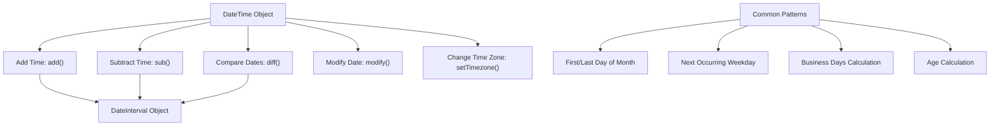

# PHP Date Calculations

## Introduction

Working with dates and times is a common requirement in web applications. You might need to calculate durations, add days to a date, find the difference between two dates, or work with different time zones. PHP provides powerful tools for date manipulation through its DateTime classes.

In this tutorial, we'll explore how to perform various date calculations in PHP, with practical examples that you can apply to your own projects.

## Prerequisites

Before diving into date calculations, you should have:
- Basic knowledge of PHP
- PHP 7.0 or higher installed (though most examples work with PHP 5.3+)
- Understanding of basic date formats

## The DateTime Class

The foundation of date manipulation in PHP is the DateTime class, which was introduced in PHP 5.2 and significantly improved in PHP 5.3. This class provides methods for creating, manipulating, and formatting dates.

```php
// Creating a DateTime object
$date = new DateTime(); // Current date and time
echo $date->format('Y-m-d H:i:s'); // Output: Current date and time (e.g., 2025-03-03 12:30:45)
```

## Basic Date Calculations

### Adding and Subtracting Time Intervals

The `add()` and `sub()` methods allow you to add or subtract time intervals using a DateInterval object.

```php
// Create a date object
$date = new DateTime('2025-01-15');

// Add 10 days
$date->add(new DateInterval('P10D'));
echo 'After adding 10 days: ' . $date->format('Y-m-d') . "
";
// Output: After adding 10 days: 2025-01-25

// Subtract 5 days
$date->sub(new DateInterval('P5D'));
echo 'After subtracting 5 days: ' . $date->format('Y-m-d') . "
";
// Output: After subtracting 5 days: 2025-01-20
```

The DateInterval format follows the ISO 8601 duration format:
- P: Period designator (required)
- Y: Years
- M: Months
- D: Days
- T: Time designator (required before time components)
- H: Hours
- M: Minutes
- S: Seconds

For example:
- `P2Y`: 2 years
- `P3M`: 3 months
- `P5D`: 5 days
- `PT10H`: 10 hours
- `P1YT12H`: 1 year and 12 hours

### Using modify() for Simple Date Calculations

For simpler calculations, you can use the `modify()` method:

```php
$date = new DateTime('2025-01-15');

// Add 10 days
$date->modify('+10 days');
echo 'Date after adding 10 days: ' . $date->format('Y-m-d') . "
";
// Output: Date after adding 10 days: 2025-01-25

// Add 2 months
$date->modify('+2 months');
echo 'Date after adding 2 months: ' . $date->format('Y-m-d') . "
";
// Output: Date after adding 2 months: 2025-03-25

// Subtract 1 year
$date->modify('-1 year');
echo 'Date after subtracting 1 year: ' . $date->format('Y-m-d') . "
";
// Output: Date after subtracting 1 year: 2024-03-25
```

## Finding the Difference Between Dates

The `diff()` method calculates the difference between two DateTime objects and returns a DateInterval object.

```php
$date1 = new DateTime('2025-01-01');
$date2 = new DateTime('2025-06-15');

$interval = $date1->diff($date2);

echo "Difference: {$interval->y} years, {$interval->m} months, {$interval->d} days
";
// Output: Difference: 0 years, 5 months, 14 days

// Total number of days
echo "Total days: {$interval->days}
";
// Output: Total days: 165
```

### Checking if a Date is Before or After Another

```php
$date1 = new DateTime('2025-01-15');
$date2 = new DateTime('2025-03-20');

if ($date1 < $date2) {
    echo "Date1 is before Date2
";
} else {
    echo "Date1 is after Date2
";
}
// Output: Date1 is before Date2

// Alternative using comparison method
if ($date1->getTimestamp() < $date2->getTimestamp()) {
    echo "Date1 is before Date2
";
}
// Output: Date1 is before Date2
```

## Practical Examples

### Example 1: Calculating Age from Birthdate

```php
function calculateAge($birthdate) {
    $birth = new DateTime($birthdate);
    $today = new DateTime('today');
    $age = $birth->diff($today)->y;
    
    return $age;
}

echo "Age: " . calculateAge('1995-10-15') . " years
";
// Output will depend on current date
```

### Example 2: Adding Business Days (Skipping Weekends)

```php
function addBusinessDays($date, $days) {
    $businessDate = new DateTime($date);
    $daysAdded = 0;
    
    while ($daysAdded < $days) {
        $businessDate->modify('+1 day');
        // 6 = Saturday, 7 = Sunday
        $weekday = $businessDate->format('N');
        if ($weekday < 6) {
            $daysAdded++;
        }
    }
    
    return $businessDate->format('Y-m-d');
}

echo "Original date: 2025-01-15 (Wednesday)
";
echo "After adding 5 business days: " . addBusinessDays('2025-01-15', 5) . "
";
// Output: After adding 5 business days: 2025-01-22 (Wednesday)
```

### Example 3: Calculating Due Date (30 Days from Invoice)

```php
function calculateDueDate($invoiceDate, $daysUntilDue = 30) {
    $date = new DateTime($invoiceDate);
    $date->modify("+{$daysUntilDue} days");
    return $date->format('Y-m-d');
}

$invoiceDate = '2025-01-15';
echo "Invoice date: $invoiceDate
";
echo "Due date: " . calculateDueDate($invoiceDate) . "
";
// Output: Due date: 2025-02-14
```

## Working with Time Zones

When working with international applications, it's important to handle time zones correctly.

```php
// Create a date in UTC
$utcDate = new DateTime('2025-01-15 12:00:00', new DateTimeZone('UTC'));
echo "UTC time: " . $utcDate->format('Y-m-d H:i:s') . "
";
// Output: UTC time: 2025-01-15 12:00:00

// Convert to New York time
$utcDate->setTimezone(new DateTimeZone('America/New_York'));
echo "New York time: " . $utcDate->format('Y-m-d H:i:s T') . "
";
// Output: New York time: 2025-01-15 07:00:00 EST

// Convert to Tokyo time
$utcDate->setTimezone(new DateTimeZone('Asia/Tokyo'));
echo "Tokyo time: " . $utcDate->format('Y-m-d H:i:s T') . "
";
// Output: Tokyo time: 2025-01-15 21:00:00 JST
```

### Time Zone Adjustments in Date Calculations

```php
// Person in New York schedules a meeting for 9 AM their time
$meeting = new DateTime('2025-01-15 09:00:00', new DateTimeZone('America/New_York'));

// What time would that be for someone in London?
$meeting->setTimezone(new DateTimeZone('Europe/London'));
echo "Meeting time in London: " . $meeting->format('Y-m-d H:i:s T') . "
";
// Output: Meeting time in London: 2025-01-15 14:00:00 GMT
```

## DatePeriod: Working with Recurring Dates

The DatePeriod class is useful for generating a series of recurring dates:

```php
// Weekly meetings for a month
$start = new DateTime('2025-01-07'); // Tuesday
$end = new DateTime('2025-02-07');
$interval = new DateInterval('P1W'); // 1 week

$period = new DatePeriod($start, $interval, $end);

echo "Weekly meetings:
";
foreach ($period as $date) {
    echo $date->format('Y-m-d (D)') . "
";
}
/*
Output:
Weekly meetings:
2025-01-07 (Tue)
2025-01-14 (Tue)
2025-01-21 (Tue)
2025-01-28 (Tue)
2025-02-04 (Tue)
*/
```

## Common Date Calculation Patterns

### First and Last Day of Month

```php
function getFirstAndLastDayOfMonth($year, $month) {
    $firstDay = new DateTime("$year-$month-01");
    $lastDay = new DateTime("$year-$month-01");
    $lastDay->modify('last day of this month');
    
    return [
        'first_day' => $firstDay->format('Y-m-d'),
        'last_day' => $lastDay->format('Y-m-d')
    ];
}

$monthBoundaries = getFirstAndLastDayOfMonth(2025, 2);
echo "First day of Feb 2025: {$monthBoundaries['first_day']}
";
echo "Last day of Feb 2025: {$monthBoundaries['last_day']}
";
// Output: First day of Feb 2025: 2025-02-01
// Output: Last day of Feb 2025: 2025-02-28
```

### Next Occurring Weekday

```php
function getNextWeekday($date, $weekday) {
    // $weekday should be 1 (Monday) through 7 (Sunday)
    $startDate = new DateTime($date);
    $targetDayOfWeek = $weekday;
    
    $currentDayOfWeek = $startDate->format('N');
    
    if ($currentDayOfWeek < $targetDayOfWeek) {
        $daysToAdd = $targetDayOfWeek - $currentDayOfWeek;
    } else {
        $daysToAdd = 7 - ($currentDayOfWeek - $targetDayOfWeek);
    }
    
    $startDate->modify("+{$daysToAdd} days");
    return $startDate->format('Y-m-d');
}

echo "Next Friday from 2025-01-15: " . getNextWeekday('2025-01-15', 5) . "
";
// Output: Next Friday from 2025-01-15: 2025-01-17
```

## Best Practices for Date Calculations

1. **Use DateTime Objects**: Always use DateTime objects for date manipulations instead of timestamps or string functions.

2. **Be Time Zone Aware**: Always specify time zones when working with dates in international applications.

3. **Watch Out for DST**: Be aware of Daylight Saving Time transitions when performing date arithmetic that spans DST boundaries.

4. **Validate User Input**: Always validate date inputs from users before performing calculations.

5. **Use Immutable Dates When Needed**: For calculations where you need to preserve the original date, consider using DateTimeImmutable:

```php
$date = new DateTimeImmutable('2025-01-15');
$newDate = $date->add(new DateInterval('P1M'));

echo $date->format('Y-m-d') . "
";    // Still 2025-01-15
echo $newDate->format('Y-m-d') . "
"; // 2025-02-15
```

## Date Calculation Diagram

Here's a visual representation of different date calculations:



## Summary

In this tutorial, we've covered:

- Creating and manipulating dates with the DateTime class
- Adding and subtracting time intervals
- Finding differences between dates
- Working with different time zones
- Generating recurring dates with DatePeriod
- Solving common date calculation problems

Date calculations are an essential part of many PHP applications. By leveraging the DateTime classes, you can handle complex date manipulations with ease and accuracy.

## Exercises

1. Create a function that returns all the Mondays in a given month and year.
2. Write code to find the next business day from a given date (skipping weekends and a list of holidays).
3. Calculate the number of working days between two dates.
4. Create a "reminder" system that alerts X days before a deadline.
5. Implement a function that returns date ranges for each quarter of a given year.

## Additional Resources

- [PHP DateTime Documentation](https://www.php.net/manual/en/class.datetime.php)
- [PHP DateInterval Documentation](https://www.php.net/manual/en/class.dateinterval.php)
- [PHP DatePeriod Documentation](https://www.php.net/manual/en/class.dateperiod.php)
- [PHP Date and Time Functions Reference](https://www.php.net/manual/en/ref.datetime.php)