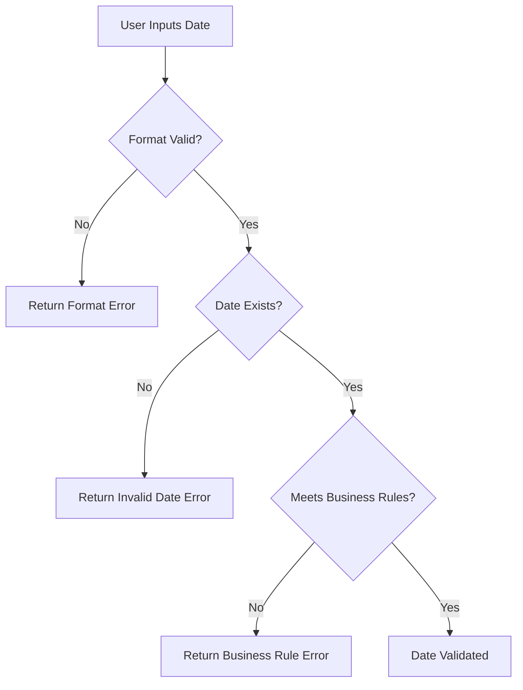

# PHP Date Validation

## Introduction

Date validation is an essential aspect of web application development, especially when dealing with user input. In PHP, validating dates ensures that your application processes correct and meaningful temporal data. Whether you're building a booking system, a calendar application, or simply collecting birthdates, proper date validation helps prevent errors and improves the reliability of your application.

This guide will walk you through various methods to validate dates in PHP, from basic techniques to more advanced approaches. We'll explore built-in functions, regular expressions, and best practices to ensure your dates are valid before processing them.

## Why Date Validation Matters

Before diving into implementation, let's understand why date validation is crucial:

1. **Data Integrity**: Ensures your database contains valid temporal information
2. **User Experience**: Prevents frustrating error messages after form submission
3. **Application Logic**: Avoids runtime errors when performing date calculations
4. **Security**: Helps prevent certain types of injection attacks

## Basic Date Validation

### Using checkdate() Function

PHP provides a built-in function called `checkdate()` which validates a Gregorian calendar date. This function takes three parameters: month, day, and year.

```php
<?php
// Syntax: checkdate(month, day, year)
$isValid = checkdate(2, 29, 2024); // February 29, 2024 (leap year)
var_dump($isValid); // bool(true)

$isValid = checkdate(2, 29, 2023); // February 29, 2023 (not a leap year)
var_dump($isValid); // bool(false)

$isValid = checkdate(4, 31, 2023); // April 31, 2023 (April has 30 days)
var_dump($isValid); // bool(false)
?>
```

The `checkdate()` function is particularly useful because it handles edge cases like:
- Leap years
- Varying month lengths
- Invalid day/month combinations

### Validating Date Strings

When working with date strings (like "2023-12-25"), you can use the `strtotime()` function to validate dates:

```php
<?php
function isValidDateString($dateString) {
    $timestamp = strtotime($dateString);
    return $timestamp !== false && $timestamp > 0;
}

var_dump(isValidDateString("2023-12-25")); // bool(true)
var_dump(isValidDateString("2023-02-30")); // bool(false) - February doesn't have 30 days
var_dump(isValidDateString("not a date")); // bool(false)
?>
```

However, be aware that `strtotime()` can be quite lenient. For example, it will try to interpret "2023-13-01" as "January 1, 2024".

## Advanced Date Validation

### Using DateTime Class

For more robust date validation, PHP's `DateTime` class is recommended. It throws exceptions when invalid dates are provided:

```php
<?php
function validateDate($date, $format = 'Y-m-d') {
    $dateTime = DateTime::createFromFormat($format, $date);
    
    if ($dateTime === false) {
        return false;
    }
    
    // The date string must match exactly with the format
    $errors = DateTime::getLastErrors();
    return $errors['warning_count'] === 0 && $errors['error_count'] === 0;
}

var_dump(validateDate('2023-02-28')); // bool(true)
var_dump(validateDate('2023-02-30')); // bool(false)
var_dump(validateDate('01/15/2023', 'm/d/Y')); // bool(true)
var_dump(validateDate('13/15/2023', 'm/d/Y')); // bool(false) - Invalid month
?>
```

This approach offers several advantages:
1. Strict format validation
2. Detailed error information
3. Support for custom date formats

### Regular Expression Validation

For simple date format validation, regular expressions can be useful. However, they don't check if the date actually exists (e.g., February 30):

```php
<?php
function validateDateFormat($date, $pattern = '/^\d{4}-\d{2}-\d{2}$/') {
    return preg_match($pattern, $date) === 1;
}

var_dump(validateDateFormat('2023-12-25')); // bool(true)
var_dump(validateDateFormat('2023/12/25')); // bool(false) - Doesn't match pattern
var_dump(validateDateFormat('12-25-2023')); // bool(false) - Doesn't match pattern

// For mm/dd/yyyy format
var_dump(validateDateFormat('12/25/2023', '/^\d{2}\/\d{2}\/\d{4}$/')); // bool(true)
?>
```

For complete date validation, combine regular expressions with `checkdate()`:

```php
<?php
function isValidDateFormat($date) {
    // Check format (YYYY-MM-DD)
    if (!preg_match('/^(\d{4})-(\d{2})-(\d{2})$/', $date, $matches)) {
        return false;
    }
    
    // Check if the date actually exists
    $year = (int)$matches[1];
    $month = (int)$matches[2];
    $day = (int)$matches[3];
    
    return checkdate($month, $day, $year);
}

var_dump(isValidDateFormat('2023-12-25')); // bool(true)
var_dump(isValidDateFormat('2023-02-30')); // bool(false) - Invalid date
var_dump(isValidDateFormat('2023/12/25')); // bool(false) - Invalid format
?>
```

## Date Range Validation

Often, you'll need to validate if a date falls within a specific range:

```php
<?php
function isDateInRange($date, $minDate, $maxDate) {
    $timestamp = strtotime($date);
    $minTimestamp = strtotime($minDate);
    $maxTimestamp = strtotime($maxDate);
    
    return $timestamp >= $minTimestamp && $timestamp <= $maxTimestamp;
}

// Check if a date is in the past
function isPastDate($date) {
    return strtotime($date) < strtotime('today');
}

// Check if a date is in the future
function isFutureDate($date) {
    return strtotime($date) > strtotime('today');
}

// Example usage
var_dump(isDateInRange('2023-06-15', '2023-01-01', '2023-12-31')); // bool(true)
var_dump(isPastDate('2020-01-01')); // bool(true)
var_dump(isFutureDate('2030-01-01')); // bool(true)
?>
```

## Real-World Examples

### Form Validation

Here's how you might validate a date in a form submission:

```php
<?php
// Assume $_POST['birth_date'] contains user input
if (isset($_POST['birth_date'])) {
    $birthDate = $_POST['birth_date'];
    
    // Validate date format and existence
    if (!isValidDateFormat($birthDate)) {
        $error = "Please enter a valid date in YYYY-MM-DD format.";
    }
    
    // Validate age (must be at least 18 years old)
    elseif (strtotime($birthDate) > strtotime('-18 years')) {
        $error = "You must be at least 18 years old to register.";
    }
    
    else {
        // Process valid date...
        $validatedDate = $birthDate;
    }
}

// The isValidDateFormat function from earlier examples
function isValidDateFormat($date) {
    if (!preg_match('/^(\d{4})-(\d{2})-(\d{2})$/', $date, $matches)) {
        return false;
    }
    
    $year = (int)$matches[1];
    $month = (int)$matches[2];
    $day = (int)$matches[3];
    
    return checkdate($month, $day, $year);
}
?>
```

### Booking System

In a booking system, you might need to validate that selected dates are available and within permitted ranges:

```php
<?php
function validateBookingDates($checkIn, $checkOut) {
    $errors = [];
    $today = date('Y-m-d');
    $maxBookingDays = 30;
    
    // Basic date validation
    if (!isValidDateFormat($checkIn)) {
        $errors[] = "Invalid check-in date format.";
    }
    
    if (!isValidDateFormat($checkOut)) {
        $errors[] = "Invalid check-out date format.";
    }
    
    if (!empty($errors)) {
        return $errors;
    }
    
    // Check-in must be today or in the future
    if (strtotime($checkIn) < strtotime($today)) {
        $errors[] = "Check-in date cannot be in the past.";
    }
    
    // Check-out must be after check-in
    if (strtotime($checkOut) <= strtotime($checkIn)) {
        $errors[] = "Check-out date must be after check-in date.";
    }
    
    // Check if booking is within allowed range
    $stayDuration = (strtotime($checkOut) - strtotime($checkIn)) / (60 * 60 * 24);
    if ($stayDuration > $maxBookingDays) {
        $errors[] = "Booking cannot exceed {$maxBookingDays} days.";
    }
    
    return $errors;
}
?>
```

## Best Practices for Date Validation

1. **Use the Right Tools**: Choose the appropriate validation method based on your requirements.
2. **Standardize Date Formats**: Use ISO format (YYYY-MM-DD) internally for consistency.
3. **Provide Clear Error Messages**: Help users understand what went wrong and how to fix it.
4. **Consider Timezones**: Be aware of timezone issues when validating dates.
5. **Sanitize Input**: Always sanitize user input before validation.
6. **Combine Approaches**: Use multiple validation methods for robust validation.

## Common Date Validation Workflow

Here's a flowchart showing a typical date validation process:



## Summary

Date validation is an essential aspect of PHP programming, especially when dealing with user inputs. In this guide, we've covered:

- Basic validation using `checkdate()` and `strtotime()`
- Advanced validation with the `DateTime` class
- Format validation using regular expressions
- Range validation to ensure dates fall within acceptable periods
- Real-world applications in forms and booking systems
- Best practices for handling date validation

By implementing proper date validation, you'll improve data integrity, enhance user experience, and make your PHP applications more robust and reliable.

## Additional Resources

- [PHP Date/Time Functions](https://www.php.net/manual/en/ref.datetime.php)
- [DateTime Class Documentation](https://www.php.net/manual/en/class.datetime.php)
- [Regular Expressions in PHP](https://www.php.net/manual/en/book.pcre.php)

## Exercises

1. Create a function that validates a birth date (must be in the past and the person must be at least 13 years old).
2. Implement a date range validator for a hotel booking system that checks if dates are available.
3. Build a form that collects and validates event dates (start date must be before end date).
4. Create a function that validates dates in different formats (YYYY-MM-DD, MM/DD/YYYY, DD-MM-YYYY).
5. Implement a date validator that checks if a given date is a business day (not a weekend or holiday).