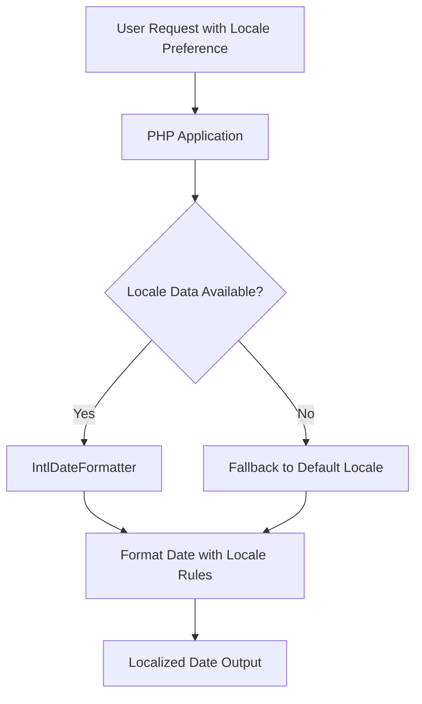

# PHP Date Localization

## Introduction

When developing applications for users around the world, presenting dates and times in a familiar format becomes essential for a good user experience. PHP offers several ways to format dates according to different locales and language preferences. This process, known as date localization, allows your application to display dates in formats that users from different regions will recognize and understand.

In this tutorial, we'll explore how to format dates and times according to different locales using PHP's internationalization (intl) extension and other built-in functions. By the end, you'll be able to display dates like "January 1, 2023" for English users and "1 janvier 2023" for French users without writing custom formatting logic.

## Prerequisites

- Basic knowledge of PHP
- Understanding of basic date and time concepts
- PHP 7.0 or later (with the `intl` extension installed for advanced features)

## Basic Date Formatting in PHP

Before diving into localization, let's review how basic date formatting works in PHP using the `date()` function:

```php
// Current timestamp
$timestamp = time();

// Format the date
$formatted_date = date('F j, Y', $timestamp);

echo $formatted_date;
// Output (example): January 1, 2023
```

While `date()` is useful, it only outputs dates in English. For multilingual applications, we need more powerful tools.

## Using the IntlDateFormatter Class

The PHP Internationalization extension (intl) provides the `IntlDateFormatter` class, which is specifically designed for locale-aware date formatting.

### Installing the Intl Extension

If you don't have the intl extension installed:

- For Ubuntu/Debian: `sudo apt-get install php-intl`
- For Windows with XAMPP: Enable the extension in php.ini
- For macOS with Homebrew: `brew install php@8.1` (includes intl by default)

### Basic Usage of IntlDateFormatter

```php
// Make sure the intl extension is installed
if (!extension_loaded('intl')) {
    die('The intl extension is not installed.');
}

// Create a new IntlDateFormatter instance
$formatter = new IntlDateFormatter(
    'en_US',                             // Locale
    IntlDateFormatter::LONG,            // Date type
    IntlDateFormatter::SHORT,           // Time type
    'America/New_York'                  // Timezone
);

// Format the current time
echo $formatter->format(time());
// Output (example): January 1, 2023 at 3:30 PM
```

### Changing Locales

The real power of `IntlDateFormatter` comes from its ability to format dates according to different locales:

```php
// Array of locales to demonstrate with
$locales = [
    'en_US' => 'English (United States)',
    'fr_FR' => 'French (France)',
    'de_DE' => 'German (Germany)',
    'ja_JP' => 'Japanese (Japan)',
    'ar_SA' => 'Arabic (Saudi Arabia)'
];

// Date to format (January 1, 2023)
$timestamp = strtotime('2023-01-01');

// Display date in different locales
foreach ($locales as $locale => $language) {
    $formatter = new IntlDateFormatter(
        $locale,
        IntlDateFormatter::FULL,
        IntlDateFormatter::NONE
    );
    
    echo "<strong>$language:</strong> " . $formatter->format($timestamp) . "<br>";
}
```

Output:
```
English (United States): Sunday, January 1, 2023
French (France): dimanche 1 janvier 2023
German (Germany): Sonntag, 1. Januar 2023
Japanese (Japan): 2023年1月1日日曜日
Arabic (Saudi Arabia): الأحد، ١ يناير ٢٠٢٣
```

### Customizing Date Formats with IntlDateFormatter

You can also customize the date format pattern:

```php
// Create a formatter with a custom pattern
$formatter = new IntlDateFormatter(
    'fr_FR',                          // Locale
    IntlDateFormatter::FULL,          // Date type  
    IntlDateFormatter::FULL,          // Time type
    null,                             // Timezone
    IntlDateFormatter::GREGORIAN,     // Calendar
    'EEEE dd MMMM y à HH:mm:ss'       // Pattern
);

echo $formatter->format(time());
// Output (example): dimanche 01 janvier 2023 à 15:30:45
```

## Using strftime() with setlocale() (Legacy Approach)

Before PHP 8.1, another common approach was to use `setlocale()` with `strftime()`. However, `strftime()` is deprecated in PHP 8.1 and removed in PHP 9.0, so it's recommended to use the intl extension instead.

For compatibility with older PHP versions, here's how it worked:

```php
// Set the locale
setlocale(LC_TIME, 'fr_FR.UTF-8');

// Format the date
$date = strftime('%A %d %B %Y', strtotime('2023-01-01'));

echo $date;
// Output: dimanche 01 janvier 2023
```

## DateTime::format with IntlDateFormatter

You can also combine the `DateTime` class with `IntlDateFormatter`:

```php
// Create a DateTime object
$date = new DateTime('2023-01-01');

// Create a formatter
$formatter = new IntlDateFormatter(
    'de_DE',
    IntlDateFormatter::LONG,
    IntlDateFormatter::NONE
);

// Format the DateTime object
echo $formatter->format($date);
// Output: 1. Januar 2023
```

## Practical Example: Multilingual Date Display

Here's a practical example of how to implement a function that formats dates based on user preferences:

```php
/**
 * Format a date according to the user's locale preference
 * 
 * @param mixed $date A timestamp, DateTime, or date string
 * @param string $locale The locale to use for formatting
 * @param int $dateType The date formatting style
 * @param int $timeType The time formatting style
 * @return string The formatted date
 */
function formatLocalizedDate($date, $locale = 'en_US', $dateType = IntlDateFormatter::LONG, $timeType = IntlDateFormatter::SHORT) {
    // Convert string dates to timestamps
    if (is_string($date) && !is_numeric($date)) {
        $date = strtotime($date);
    }
    
    // Create formatter with the specified locale and format types
    $formatter = new IntlDateFormatter(
        $locale,
        $dateType,
        $timeType
    );
    
    // Format and return the date
    return $formatter->format($date);
}

// Example usage in a multilingual application
$userLocale = 'fr_FR'; // This would come from user preferences
$event_date = '2023-04-15 14:30:00';

echo "Event Date: " . formatLocalizedDate($event_date, $userLocale);
// Output: Event Date: 15 avril 2023 à 14:30
```

## Working with Different Calendar Systems

IntlDateFormatter also allows you to work with different calendar systems:

```php
// Create a formatter for the Islamic (Hijri) calendar
$formatter = new IntlDateFormatter(
    'ar_SA@calendar=islamic',
    IntlDateFormatter::FULL,
    IntlDateFormatter::NONE,
    null,
    IntlDateFormatter::TRADITIONAL
);

// Format January 1, 2023 in the Islamic calendar
echo $formatter->format(strtotime('2023-01-01'));
// Output (example): الأحد، ٨ جمادى الآخرة ١٤٤٤ هـ
```

## Visualizing Locale Handling Process

Here's a flow diagram showing how PHP handles date localization:



## Common Challenges and Solutions

### Missing Locales

Sometimes, your server might not have all locale data installed:

```php
// Check if a locale is available
function isLocaleAvailable($locale) {
    $available_locales = ResourceBundle::getLocales('');
    return in_array($locale, $available_locales);
}

// Example usage
$user_locale = 'fr_CA';  // French (Canada)
if (!isLocaleAvailable($user_locale)) {
    // Fall back to another locale
    $user_locale = 'fr_FR';  // French (France)
}
```

### Dealing with Different PHP Versions

For code that needs to run on multiple PHP versions, you can create a compatibility function:

```php
/**
 * Format a date according to locale, compatible with different PHP versions
 */
function formatDateLocalized($timestamp, $locale = 'en_US') {
    // If intl extension is available, use it (preferred method)
    if (extension_loaded('intl')) {
        $formatter = new IntlDateFormatter(
            $locale,
            IntlDateFormatter::LONG,
            IntlDateFormatter::NONE
        );
        return $formatter->format($timestamp);
    } 
    // If PHP version < 8.1, use strftime (legacy)
    elseif (function_exists('strftime')) {
        $old_locale = setlocale(LC_TIME, 0);
        setlocale(LC_TIME, $locale);
        $result = strftime('%B %d, %Y', $timestamp);
        setlocale(LC_TIME, $old_locale); // Restore original locale
        return $result;
    } 
    // Fallback to basic date function (English only)
    else {
        return date('F j, Y', $timestamp);
    }
}
```

## Summary

PHP offers several ways to handle date localization, with the IntlDateFormatter class from the intl extension being the most powerful and future-proof approach. By formatting dates according to user locale preferences, you create a more inclusive user experience for your international audience.

Key takeaways:
- Use the intl extension and IntlDateFormatter for modern PHP applications
- Different locales format dates with different conventions, month/day orders, and terms
- Multiple calendar systems can be supported
- Always have fallback mechanisms for when a locale is not available

## Exercises for Practice

1. Create a function that displays a date range (start and end dates) formatted according to a specific locale.
2. Build a small form that allows users to select their preferred locale and see how the current date is displayed in that format.
3. Create a birthday reminder application that shows dates in the user's preferred locale.
4. Implement a function that converts dates between different calendar systems (Gregorian, Islamic, etc.).

## Additional Resources

- [PHP IntlDateFormatter Documentation](https://www.php.net/manual/en/class.intldateformatter.php)
- [PHP Internationalization Functions](https://www.php.net/manual/en/book.intl.php)
- [List of Locale Codes](https://www.localeplanet.com/icu/)
- [Unicode CLDR Project](https://cldr.unicode.org/) - The source of locale data used by the intl extension

By mastering PHP date localization, you're taking an important step toward building truly global applications that respect cultural differences in date and time representation.