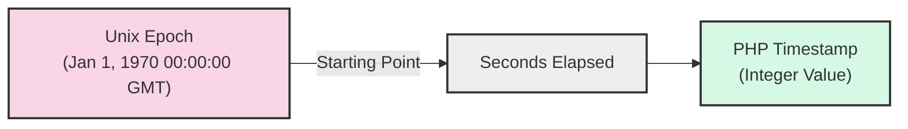

# PHP Timestamp Conversion

## Introduction

Timestamps are a fundamental concept in programming, representing a specific point in time as a numeric value. In PHP, a timestamp is an integer that represents the number of seconds that have elapsed since the Unix Epoch (January 1, 1970, 00:00:00 GMT). Working with timestamps is essential for many programming tasks, including:

- Storing dates in databases
- Calculating time differences
- Scheduling events
- Formatting dates for display
- Creating date-based logic in applications

This guide will walk you through the basics of working with timestamps in PHP, demonstrating how to convert between various date formats and timestamps.

## Understanding Timestamps

Before diving into conversion methods, let's understand what a timestamp actually is:



For example:
- The timestamp `0` represents January 1, 1970, 00:00:00 GMT
- The timestamp `1609459200` represents January 1, 2021, 00:00:00 GMT
- Negative timestamps represent times before the Unix Epoch

## Getting the Current Timestamp

The simplest way to get the current timestamp in PHP is using the `time()` function:

```php
// Get current timestamp
$currentTimestamp = time();
echo "Current timestamp: " . $currentTimestamp;

// Example output: Current timestamp: 1677586432
```

This returns the number of seconds since the Unix Epoch to the current moment.

## Converting Strings to Timestamps

### Using strtotime()

The `strtotime()` function converts a human-readable date string into a timestamp:

```php
// Basic date to timestamp conversion
$timestamp = strtotime("2023-03-15");
echo "Timestamp for March 15, 2023: " . $timestamp;
// Output: Timestamp for March 15, 2023: 1678838400

// Using relative dates
$timestamp = strtotime("next Monday");
echo "Timestamp for next Monday: " . $timestamp;

// Using date and time
$timestamp = strtotime("2023-03-15 14:30:00");
echo "Timestamp for March 15, 2023 2:30 PM: " . $timestamp;
// Output: Timestamp for March 15, 2023 2:30 PM: 1678890600
```

The `strtotime()` function is powerful and can understand a wide variety of date formats and relative expressions:

```php
// Examples of relative expressions
echo strtotime("now") . "<br>";            // Current time
echo strtotime("+1 day") . "<br>";         // Tomorrow
echo strtotime("+1 week") . "<br>";        // Next week
echo strtotime("+1 week 2 days 4 hours") . "<br>"; // Complex relative time
echo strtotime("next Thursday") . "<br>";  // Next Thursday
echo strtotime("last Monday") . "<br>";    // Last Monday
```

### Using DateTime class

For more robust date handling, you can use the `DateTime` class:

```php
// Create a DateTime object from a string
$dateTime = new DateTime("2023-03-15 14:30:00");

// Get the timestamp
$timestamp = $dateTime->getTimestamp();
echo "Timestamp using DateTime: " . $timestamp;
// Output: Timestamp using DateTime: 1678890600
```

## Converting Timestamps to Formatted Dates

### Using date()

The most common way to convert a timestamp back to a human-readable format is using the `date()` function:

```php
$timestamp = 1678890600; // March 15, 2023 2:30 PM

// Format the timestamp into various date formats
echo date("Y-m-d", $timestamp) . "<br>";             // 2023-03-15
echo date("F j, Y", $timestamp) . "<br>";            // March 15, 2023
echo date("D, F j, Y, g:i a", $timestamp) . "<br>";  // Wed, March 15, 2023, 2:30 pm
echo date("Y-m-d H:i:s", $timestamp) . "<br>";       // 2023-03-15 14:30:00
```

Common format characters for the `date()` function:

| Format | Description | Example |
|--------|-------------|---------|
| Y | Four-digit year | 2023 |
| m | Month with leading zeros | 01-12 |
| d | Day with leading zeros | 01-31 |
| H | 24-hour format with leading zeros | 00-23 |
| i | Minutes with leading zeros | 00-59 |
| s | Seconds with leading zeros | 00-59 |
| F | Full month name | January-December |
| j | Day without leading zeros | 1-31 |
| g | 12-hour format without leading zeros | 1-12 |
| a | am/pm | am or pm |
| D | Short day name | Mon-Sun |

### Using DateTime format

You can also use the `DateTime` class to format dates:

```php
$timestamp = 1678890600;
$dateTime = new DateTime();
$dateTime->setTimestamp($timestamp);

echo $dateTime->format('Y-m-d H:i:s') . "<br>";  // 2023-03-15 14:30:00
echo $dateTime->format('F j, Y, g:i a') . "<br>"; // March 15, 2023, 2:30 pm
```

## Practical Examples

### Example 1: Calculating Age

```php
// Calculate age from birth date
function calculateAge($birthDate) {
    $birthTimestamp = strtotime($birthDate);
    $currentTimestamp = time();
    
    // Calculate difference in years
    $age = date('Y', $currentTimestamp) - date('Y', $birthTimestamp);
    
    // Adjust age if birthday hasn't occurred yet this year
    if (date('md', $currentTimestamp) < date('md', $birthTimestamp)) {
        $age--;
    }
    
    return $age;
}

echo "Age: " . calculateAge("1990-05-15");
// Example output: Age: 33 (depending on current date)
```

### Example 2: Time Remaining Until an Event

```php
// Calculate time remaining until an event
function timeRemaining($eventDate) {
    $eventTimestamp = strtotime($eventDate);
    $currentTimestamp = time();
    
    // Calculate difference in seconds
    $secondsDiff = $eventTimestamp - $currentTimestamp;
    
    if ($secondsDiff <= 0) {
        return "Event has already passed!";
    }
    
    // Convert to days, hours, minutes, seconds
    $days = floor($secondsDiff / (60 * 60 * 24));
    $secondsDiff -= $days * (60 * 60 * 24);
    
    $hours = floor($secondsDiff / (60 * 60));
    $secondsDiff -= $hours * (60 * 60);
    
    $minutes = floor($secondsDiff / 60);
    $seconds = $secondsDiff - ($minutes * 60);
    
    return "$days days, $hours hours, $minutes minutes, $seconds seconds";
}

echo "Time until New Year: " . timeRemaining("2024-01-01 00:00:00");
// Example output: Time until New Year: 125 days, 4 hours, 25 minutes, 16 seconds
```

### Example 3: Working with Different Timezones

```php
// Working with different timezones
function convertTimezone($dateString, $fromTimezone, $toTimezone) {
    // Create DateTime object with the original timezone
    $date = new DateTime($dateString, new DateTimeZone($fromTimezone));
    
    // Change the timezone
    $date->setTimezone(new DateTimeZone($toTimezone));
    
    // Return formatted date
    return $date->format('Y-m-d H:i:s');
}

echo "New York time: " . convertTimezone(
    "2023-03-15 14:30:00", 
    "America/New_York", 
    "Europe/London"
);
// Example output: New York time: 2023-03-15 18:30:00 (London time)
```

## Handling Timestamp Limitations

PHP's standard timestamp has limitations. On 32-bit systems, it can only represent dates between December 13, 1901, and January 19, 2038 (known as the Year 2038 problem). For dates outside this range, use the `DateTime` class:

```php
// Working with dates beyond timestamp limitations
$date = new DateTime('2040-01-01'); // Beyond 2038
echo $date->format('Y-m-d'); // Will correctly output 2040-01-01
```

## Common Mistakes and Troubleshooting

### 1. Incorrect timestamp formats

```php
// This will NOT work as expected
$invalidTimestamp = strtotime("15-03-2023"); // Ambiguous format (day-month-year or month-day-year?)

// Better approach - use unambiguous formats:
$validTimestamp = strtotime("2023-03-15"); // Year-month-day format
// or
$validTimestamp = strtotime("15 March 2023"); // Day month year format
```

### 2. Forgetting about timezones

```php
// Set default timezone to avoid unexpected results
date_default_timezone_set('UTC');

// Or specify timezone when creating DateTime objects
$date = new DateTime("2023-03-15", new DateTimeZone('America/New_York'));
```

### 3. Comparing dates without normalization

```php
// Incorrect comparison - includes time components
$date1 = strtotime("2023-03-15 14:30:00");
$date2 = strtotime("2023-03-15 09:15:00");
$sameDay = ($date1 == $date2); // False, but both are the same day

// Correct comparison - normalize to start of day
$date1 = strtotime(date("Y-m-d", strtotime("2023-03-15 14:30:00")));
$date2 = strtotime(date("Y-m-d", strtotime("2023-03-15 09:15:00")));
$sameDay = ($date1 == $date2); // True
```

## Summary

In this guide, we've covered the essentials of PHP timestamp conversion:

- Understanding what timestamps are and how they work in PHP
- Converting between date strings and timestamps using `strtotime()` and `DateTime`
- Formatting timestamps into readable dates with the `date()` function
- Working with practical examples like age calculation and event countdown
- Handling timezone differences
- Overcoming timestamp limitations
- Avoiding common mistakes

Timestamps provide a powerful way to handle dates in PHP applications. By understanding how to convert between timestamps and formatted dates, you can effectively manage time-based operations in your projects.

## Exercises

1. Create a function that returns the day of the week (Monday, Tuesday, etc.) for any given date.
2. Write a script that calculates the number of business days (excluding weekends) between two dates.
3. Build a birthday reminder that shows upcoming birthdays in the next 30 days from a list of birth dates.
4. Create a function that converts a timestamp to a "time ago" format (e.g., "2 hours ago", "3 days ago").
5. Implement a date validation function that checks if a given date string is valid and within a specific range.

## Additional Resources

- [PHP Documentation: Date/Time Functions](https://www.php.net/manual/en/ref.datetime.php)
- [PHP Documentation: DateTime Class](https://www.php.net/manual/en/class.datetime.php)
- [PHP Documentation: date() function format characters](https://www.php.net/manual/en/function.date.php)
- [PHP Documentation: strtotime() function](https://www.php.net/manual/en/function.strtotime.php)
- [PHP: The Right Way - Date and Time](https://phptherightway.com/#date_and_time)