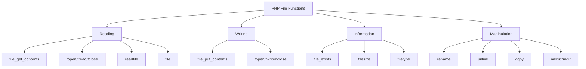

# PHP File Basics

## Introduction

File handling is a crucial skill for any PHP developer. Whether you're building a content management system, processing uploaded files, or working with data, understanding how to manipulate files using PHP is essential. This tutorial will introduce you to the basics of PHP file operations, providing you with the foundation needed to work with files effectively.

PHP provides numerous built-in functions specifically designed for file operations, making it relatively straightforward to create, read, update, and delete files on your web server. These capabilities allow you to store data persistently, generate dynamic content, and manage resources efficiently.

## Why File Handling Matters

Before diving into the technical details, let's understand why file handling is important:

1. **Data Persistence**: Files allow you to store information that persists between user sessions
2. **Configuration Management**: Store application settings in configuration files
3. **Content Management**: Create, modify, and serve dynamic content
4. **Log Management**: Keep track of application events and errors
5. **File Uploads**: Process and store files uploaded by users

## File System Functions Overview

PHP offers a comprehensive set of functions for file operations:



## Opening and Closing Files

The most basic file operations in PHP involve opening a file, performing operations on it, and then closing it. PHP uses a file pointer system to manage file access.

```php
<?php
// Opening a file
$file = fopen("example.txt", "r");

// File operations go here...

// Closing a file
fclose($file);
?>
```

The `fopen()` function requires two parameters:
1. The path to the file
2. The mode in which to open the file

### Common File Modes

| Mode | Description |
|------|-------------|
| `r` | Open for reading only; place the file pointer at the beginning of the file |
| `r+` | Open for reading and writing; place the file pointer at the beginning of the file |
| `w` | Open for writing only; place the file pointer at the beginning and truncate the file to zero length |
| `w+` | Open for reading and writing; place the file pointer at the beginning and truncate the file to zero length |
| `a` | Open for writing only; place the file pointer at the end of the file |
| `a+` | Open for reading and writing; place the file pointer at the end of the file |
| `x` | Create and open for writing only; place the file pointer at the beginning |
| `x+` | Create and open for reading and writing; place the file pointer at the beginning |

## Reading Files

PHP offers several ways to read file content. Let's explore the most common methods:

### Method 1: file_get_contents()

The simplest way to read an entire file into a string:

```php
<?php
$content = file_get_contents("sample.txt");
echo $content;
?>
```

**Input**: A text file named "sample.txt" containing "Hello, World!"  
**Output**: `Hello, World!`

### Method 2: fopen(), fread(), fclose()

For more control over file reading:

```php
<?php
$file = fopen("sample.txt", "r");
// Read the file content (up to 1024 bytes)
$content = fread($file, filesize("sample.txt"));
fclose($file);
echo $content;
?>
```

### Method 3: file()

Read a file into an array, with each element containing one line:

```php
<?php
$lines = file("sample.txt");
foreach ($lines as $lineNumber => $line) {
    echo "Line #" . ($lineNumber + 1) . ": " . $line . "<br>";
}
?>
```

**Input**: A text file containing:
```
Hello
World
PHP is fun!
```

**Output**:
```
Line #1: Hello
Line #2: World
Line #3: PHP is fun!
```

### Method 4: Reading Line by Line

For handling large files efficiently:

```php
<?php
$file = fopen("sample.txt", "r");
if ($file) {
    while (($line = fgets($file)) !== false) {
        echo $line . "<br>";
    }
    fclose($file);
}
?>
```

## Writing Files

Similar to reading, PHP provides multiple ways to write to files:

### Method 1: file_put_contents()

The easiest way to write content to a file:

```php
<?php
$content = "Hello, this is sample content.";
file_put_contents("output.txt", $content);
echo "Content written successfully!";
?>
```

**Output**: Creates or overwrites "output.txt" with the specified content.

### Method 2: fopen(), fwrite(), fclose()

For more control over the writing process:

```php
<?php
$file = fopen("output.txt", "w");
$content = "Hello, this is sample content.";
fwrite($file, $content);
fclose($file);
echo "Content written successfully!";
?>
```

### Appending to Files

To add content to the end of an existing file:

```php
<?php
$file = fopen("log.txt", "a");
$logEntry = date("Y-m-d H:i:s") . " - User logged in
";
fwrite($file, $logEntry);
fclose($file);
echo "Log entry added!";
?>
```

## Checking if a File Exists

Before performing operations on a file, it's a good practice to check if it exists:

```php
<?php
$filename = "sample.txt";
if (file_exists($filename)) {
    echo "The file $filename exists";
} else {
    echo "The file $filename does not exist";
}
?>
```

## File Information Functions

PHP provides several functions to get information about files:

```php
<?php
$filename = "sample.txt";

if (file_exists($filename)) {
    echo "File size: " . filesize($filename) . " bytes<br>";
    echo "File type: " . filetype($filename) . "<br>";
    echo "Last modified: " . date("F d Y H:i:s.", filemtime($filename)) . "<br>";
    echo "Is readable: " . (is_readable($filename) ? "Yes" : "No") . "<br>";
    echo "Is writable: " . (is_writable($filename) ? "Yes" : "No") . "<br>";
}
?>
```

## File Path Handling

Understanding file paths is crucial when working with files in PHP:

1. **Absolute Path**: Specifies the exact location from the root directory
   ```php
   $file = fopen("/var/www/html/data/sample.txt", "r");
   ```

2. **Relative Path**: Specifies the location relative to the current script
   ```php
   $file = fopen("data/sample.txt", "r");
   ```

3. **Using Constants**: PHP provides constants for file paths
   ```php
   // Directory of the current script
   $file = fopen(__DIR__ . "/data/sample.txt", "r");
   ```

## Real-World Examples

Let's explore some practical examples of file handling in PHP:

### Example 1: Simple Log System

```php
<?php
function writeLog($message) {
    $logFile = "application.log";
    $timestamp = date("Y-m-d H:i:s");
    $logMessage = "[$timestamp] $message
";
    
    file_put_contents($logFile, $logMessage, FILE_APPEND);
}

// Usage
writeLog("User registered: john@example.com");
writeLog("Payment processed: Order #12345");
?>
```

### Example 2: CSV File Processing

```php
<?php
// Reading a CSV file
function readCSV($filename) {
    $data = [];
    
    if (($handle = fopen($filename, "r")) !== false) {
        // Read header row
        $header = fgetcsv($handle);
        
        // Read data rows
        while (($row = fgetcsv($handle)) !== false) {
            $item = [];
            for ($i = 0; $i < count($header); $i++) {
                $item[$header[$i]] = $row[$i];
            }
            $data[] = $item;
        }
        fclose($handle);
    }
    
    return $data;
}

// Usage example
$users = readCSV("users.csv");
foreach ($users as $user) {
    echo "Name: " . $user['name'] . ", Email: " . $user['email'] . "<br>";
}
?>
```

### Example 3: Configuration File

```php
<?php
// Read configuration from a file
function getConfig($configFile = "config.ini") {
    if (!file_exists($configFile)) {
        return false;
    }
    
    return parse_ini_file($configFile, true);
}

// Usage
$config = getConfig();
if ($config) {
    $dbHost = $config['database']['host'];
    $dbUser = $config['database']['username'];
    // Use configuration values
}
?>
```

## Error Handling in File Operations

When working with files, it's important to handle errors gracefully:

```php
<?php
$filename = "data.txt";

try {
    if (!file_exists($filename)) {
        throw new Exception("File not found: $filename");
    }
    
    $content = file_get_contents($filename);
    if ($content === false) {
        throw new Exception("Unable to read file: $filename");
    }
    
    echo $content;
} catch (Exception $e) {
    echo "Error: " . $e->getMessage();
    // Log the error
}
?>
```

## File Upload Handling

A common use case for file handling is processing uploaded files:

```php
<?php
if ($_SERVER["REQUEST_METHOD"] == "POST" && isset($_FILES["fileToUpload"])) {
    $targetDir = "uploads/";
    $targetFile = $targetDir . basename($_FILES["fileToUpload"]["name"]);
    $uploadOk = 1;
    $fileType = strtolower(pathinfo($targetFile, PATHINFO_EXTENSION));
    
    // Check if file already exists
    if (file_exists($targetFile)) {
        echo "Sorry, file already exists.";
        $uploadOk = 0;
    }
    
    // Check file size (limit to 5MB)
    if ($_FILES["fileToUpload"]["size"] > 5000000) {
        echo "Sorry, your file is too large.";
        $uploadOk = 0;
    }
    
    // Allow certain file formats
    if ($fileType != "jpg" && $fileType != "png" && $fileType != "jpeg" && $fileType != "gif") {
        echo "Sorry, only JPG, JPEG, PNG & GIF files are allowed.";
        $uploadOk = 0;
    }
    
    // Check if $uploadOk is set to 0 by an error
    if ($uploadOk == 0) {
        echo "Sorry, your file was not uploaded.";
    } else {
        if (move_uploaded_file($_FILES["fileToUpload"]["tmp_name"], $targetFile)) {
            echo "The file " . htmlspecialchars(basename($_FILES["fileToUpload"]["name"])) . " has been uploaded.";
        } else {
            echo "Sorry, there was an error uploading your file.";
        }
    }
}
?>

<!-- HTML form for file upload -->
<form action="upload.php" method="post" enctype="multipart/form-data">
    Select image to upload:
    <input type="file" name="fileToUpload" id="fileToUpload">
    <input type="submit" value="Upload Image" name="submit">
</form>
```

## Security Considerations

When working with files in PHP, keep these security aspects in mind:

1. **Never trust user input**: Always validate and sanitize filenames and content
2. **Restrict file operations**: Limit file operations to specific directories
3. **Set proper permissions**: Ensure files and directories have appropriate permissions
4. **Validate file types**: Check mime types for uploaded files
5. **Limit file sizes**: Prevent denial of service through large file uploads
6. **Use safe functions**: Prefer safe functions like `file_get_contents()` over `include()`

```php
<?php
// Example of unsafe vs. safe file inclusion
$page = $_GET['page']; // User input

// Unsafe - can lead to directory traversal attacks
// include($page . ".php"); // NEVER DO THIS!

// Safe - validate input against whitelist
$allowedPages = ['home', 'about', 'contact'];
if (in_array($page, $allowedPages)) {
    include($page . ".php");
} else {
    include("404.php");
}
?>
```

## Summary

In this tutorial, we covered the fundamentals of file handling in PHP:

- Opening and closing files
- Reading file content using various methods
- Writing and appending to files
- Checking file existence and retrieving file information
- Working with file paths
- Practical examples including logging, CSV processing, and configuration management
- Handling file uploads
- Important security considerations

File handling is a powerful feature in PHP that enables you to create more dynamic and functional web applications. With the knowledge gained from this tutorial, you're now equipped to implement basic file operations in your PHP projects.

## Exercises

To reinforce your learning, try these exercises:

1. Create a simple guestbook application that stores entries in a text file
2. Build a basic file browser that lists files in a directory
3. Implement a log analyzer that reads a log file and displays statistics
4. Create a file-based caching system for your website
5. Build a simple CSV export feature for a data table

## Additional Resources

- [PHP Manual: Filesystem Functions](https://www.php.net/manual/en/book.filesystem.php)
- [PHP File Create/Write](https://www.w3schools.com/php/php_file_create.asp)
- [Working with CSV Files in PHP](https://code.tutsplus.com/tutorials/how-to-work-with-csv-files-in-php--net-3862)
- [PHP Security Best Practices](https://www.php.net/manual/en/security.php)