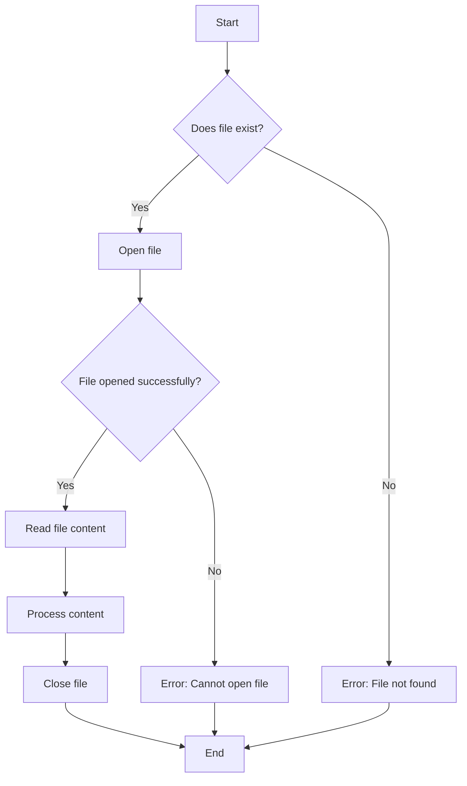

# PHP File Reading

## Introduction

Reading files is an essential skill when developing PHP applications. Whether you need to extract data from configuration files, process user uploads, or analyze log files, PHP provides several functions to read file content efficiently. This tutorial will guide you through various methods of reading files in PHP, from basic to advanced techniques.

## Why Read Files in PHP?

Before we dive into the specific functions, let's understand when and why you might need to read files:

- To load configuration settings stored in external files
- To process data from CSV or text files
- To extract content from user-uploaded files
- To analyze log files for errors or statistics
- To read template files for dynamic content generation

## Prerequisites

Before proceeding, make sure you have:
- A working PHP installation (version 7.0 or later recommended)
- Basic understanding of PHP syntax
- Write permissions to the directory where your PHP files are stored

## Basic File Reading Functions

### 1. `file_get_contents()` - Reading an Entire File at Once

The simplest way to read a file in PHP is using the `file_get_contents()` function, which reads the entire file into a string.

```php
<?php
// Read the entire file into a string
$content = file_get_contents('example.txt');

// Display the content
echo $content;
?>
```

**Input file (example.txt):**
```
Hello World!
This is an example file.
We're learning to read files in PHP.
```

**Output:**
```
Hello World!
This is an example file.
We're learning to read files in PHP.
```

**Advantages:**
- Simple and easy to use
- Perfect for small files
- Works with both local files and URLs

**Limitations:**
- Not memory-efficient for large files
- Reads the entire file at once

### 2. `file()` - Reading a File into an Array

The `file()` function reads a file and stores each line as an element in an array.

```php
<?php
// Read file into an array (each line becomes an array element)
$lines = file('example.txt');

// Loop through the array and display each line with line numbers
foreach ($lines as $lineNumber => $line) {
    // Line numbers start at 0, so add 1
    echo "Line " . ($lineNumber + 1) . ": " . $line;
}
?>
```

**Output:**
```
Line 1: Hello World!
Line 2: This is an example file.
Line 3: We're learning to read files in PHP.
```

**Advantages:**
- Preserves line breaks
- Convenient for line-by-line processing
- Easy to access specific lines

### 3. `fopen()`, `fread()`, and `fclose()` - Reading Files with More Control

For more control over file reading, you can use `fopen()` to open a file handle, `fread()` to read from it, and `fclose()` to close the file.

```php
<?php
// Open the file for reading
$handle = fopen('example.txt', 'r');

// Check if file was opened successfully
if ($handle) {
    // Read 100 bytes from the file
    $content = fread($handle, 100);
    
    // Display the content
    echo $content;
    
    // Close the file
    fclose($handle);
} else {
    echo "Unable to open file!";
}
?>
```

**Output:**
```
Hello World!
This is an example file.
We're learning to read files in PHP.
```

**Advantages:**
- Fine-grained control over reading
- Ability to read only portions of a file
- Memory-efficient for large files
- Can use multiple handles for complex operations

## Reading Files Line by Line

For large files, it's more efficient to read and process one line at a time rather than loading the entire file into memory.

### Using `fgets()` to Read Line by Line

```php
<?php
// Open the file
$handle = fopen('example.txt', 'r');

// Check if file was opened successfully
if ($handle) {
    // Read line by line until end of file
    while (($line = fgets($handle)) !== false) {
        echo "Line: " . $line;
    }
    
    // Close the file
    fclose($handle);
} else {
    echo "Unable to open file!";
}
?>
```

**Output:**
```
Line: Hello World!
Line: This is an example file.
Line: We're learning to read files in PHP.
```

## Reading CSV Files

PHP has built-in functions specifically for reading CSV (Comma-Separated Values) files.

```php
<?php
// Open the CSV file
$handle = fopen('users.csv', 'r');

// Check if file was opened successfully
if ($handle) {
    // Read and display header row
    $header = fgetcsv($handle);
    echo "CSV Header: " . implode(', ', $header) . "<br>";
    
    // Read each data row
    while (($data = fgetcsv($handle)) !== false) {
        echo "User: " . $data[0] . ", Email: " . $data[1] . ", Age: " . $data[2] . "<br>";
    }
    
    // Close the file
    fclose($handle);
} else {
    echo "Unable to open CSV file!";
}
?>
```

**Input file (users.csv):**
```
Name,Email,Age
John Doe,john@example.com,28
Jane Smith,jane@example.com,34
Bob Johnson,bob@example.com,45
```

**Output:**
```
CSV Header: Name, Email, Age
User: John Doe, Email: john@example.com, Age: 28
User: Jane Smith, Email: jane@example.com, Age: 34
User: Bob Johnson, Email: bob@example.com, Age: 45
```

## Error Handling When Reading Files

It's important to handle potential errors when reading files, as files might not exist, be inaccessible, or have unexpected content.

```php
<?php
// File to read
$filename = 'non_existent_file.txt';

// Check if file exists and is readable
if (file_exists($filename) && is_readable($filename)) {
    // Safe to read the file
    $content = file_get_contents($filename);
    echo $content;
} else {
    echo "Error: File does not exist or is not readable!";
}

// Alternative approach using try-catch
try {
    $content = file_get_contents($filename);
    
    if ($content === false) {
        throw new Exception("Unable to read file content");
    }
    
    echo $content;
} catch (Exception $e) {
    echo "Error: " . $e->getMessage();
}
?>
```

## Reading File Metadata

Beyond just content, PHP allows you to get information about files.

```php
<?php
$filename = 'example.txt';

if (file_exists($filename)) {
    echo "File: " . $filename . "<br>";
    echo "Size: " . filesize($filename) . " bytes<br>";
    echo "Last modified: " . date("F d Y H:i:s", filemtime($filename)) . "<br>";
    echo "File type: " . filetype($filename) . "<br>";
    
    // Get and display file permissions
    $perms = fileperms($filename);
    $info = substr(sprintf('%o', $perms), -4);
    echo "Permissions: " . $info . "<br>";
} else {
    echo "File does not exist.";
}
?>
```

**Output:**
```
File: example.txt
Size: 82 bytes
Last modified: January 15 2023 14:32:45
File type: file
Permissions: 0644
```

## File Reading Flow

Here's a diagram showing the typical file reading process in PHP:



## Real-World Examples

### Example 1: Reading a Configuration File

Many PHP applications use external configuration files to store settings. Here's how you might read a simple INI configuration file:

```php
<?php
// Read configuration file
$config = parse_ini_file('config.ini', true);

// Display configuration
echo "<h3>Database Configuration:</h3>";
echo "Host: " . $config['database']['host'] . "<br>";
echo "Username: " . $config['database']['username'] . "<br>";
echo "Database: " . $config['database']['dbname'] . "<br>";

echo "<h3>Application Settings:</h3>";
echo "Debug Mode: " . ($config['settings']['debug'] ? "Enabled" : "Disabled") . "<br>";
echo "Cache Timeout: " . $config['settings']['cache_timeout'] . " seconds<br>";
?>
```

**Input file (config.ini):**
```
[database]
host = localhost
username = phpuser
password = secret
dbname = myapplication

[settings]
debug = true
cache_timeout = 3600
timezone = "America/New_York"
```

**Output:**
```
Database Configuration:
Host: localhost
Username: phpuser
Database: myapplication

Application Settings:
Debug Mode: Enabled
Cache Timeout: 3600 seconds
```

### Example 2: Reading and Processing a Log File

Here's an example that reads an Apache access log file and extracts information:

```php
<?php
// Function to parse a log line
function parseLogLine($line) {
    // Simple regex pattern for common log format
    $pattern = '/^(\S+) \S+ \S+ \[([^:]+):(\d+:\d+:\d+) ([^\]]+)\] "(\S+) (.*?) (\S+)" (\d+) (\d+|-)/';
    
    if (preg_match($pattern, $line, $matches)) {
        return [
            'ip' => $matches[1],
            'date' => $matches[2],
            'time' => $matches[3],
            'timezone' => $matches[4],
            'method' => $matches[5],
            'path' => $matches[6],
            'protocol' => $matches[7],
            'status' => $matches[8],
            'bytes' => $matches[9] === '-' ? 0 : (int)$matches[9]
        ];
    }
    
    return null;
}

// Path to log file
$logFile = 'access.log';

// Check if file exists
if (file_exists($logFile)) {
    // Array to store statistics
    $stats = [
        'total_requests' => 0,
        'unique_ips' => [],
        'status_codes' => [],
        'request_methods' => []
    ];
    
    // Open and process the log file
    $handle = fopen($logFile, 'r');
    
    while (($line = fgets($handle)) !== false) {
        $logData = parseLogLine($line);
        
        if ($logData) {
            // Increment total requests
            $stats['total_requests']++;
            
            // Track unique IPs
            if (!in_array($logData['ip'], $stats['unique_ips'])) {
                $stats['unique_ips'][] = $logData['ip'];
            }
            
            // Track status codes
            if (!isset($stats['status_codes'][$logData['status']])) {
                $stats['status_codes'][$logData['status']] = 0;
            }
            $stats['status_codes'][$logData['status']]++;
            
            // Track request methods
            if (!isset($stats['request_methods'][$logData['method']])) {
                $stats['request_methods'][$logData['method']] = 0;
            }
            $stats['request_methods'][$logData['method']]++;
        }
    }
    
    fclose($handle);
    
    // Display statistics
    echo "<h3>Log File Analysis</h3>";
    echo "Total Requests: " . $stats['total_requests'] . "<br>";
    echo "Unique IP Addresses: " . count($stats['unique_ips']) . "<br>";
    
    echo "<h4>Status Code Distribution:</h4>";
    foreach ($stats['status_codes'] as $code => $count) {
        echo "Status $code: $count requests<br>";
    }
    
    echo "<h4>Request Method Distribution:</h4>";
    foreach ($stats['request_methods'] as $method => $count) {
        echo "$method: $count requests<br>";
    }
} else {
    echo "Log file not found.";
}
?>
```

## Performance Considerations

When reading files in PHP, keep these performance tips in mind:

1. **Memory Usage**: For large files, avoid loading the entire file into memory with `file_get_contents()` or `file()`
2. **Buffered Reading**: Use `fread()` with a buffer size to process large files in chunks
3. **Line-by-Line Processing**: Use `fgets()` for line-by-line reading when appropriate
4. **File Locking**: Consider using `flock()` when reading files that might be accessed by multiple scripts
5. **Resource Management**: Always close file handles with `fclose()` when done

```php
<?php
// Example of reading a large file in chunks efficiently
$filename = 'large_file.txt';
$chunkSize = 1024 * 1024; // 1MB chunks

if (file_exists($filename)) {
    $handle = fopen($filename, 'r');
    
    if ($handle) {
        $bytesProcessed = 0;
        
        // Process file in chunks
        while (!feof($handle)) {
            $chunk = fread($handle, $chunkSize);
            $bytesProcessed += strlen($chunk);
            
            // Process the chunk here
            // ...
            
            // Show progress
            echo "Processed " . number_format($bytesProcessed) . " bytes...<br>";
            
            // Flush output buffer to show progress in real-time
            flush();
        }
        
        fclose($handle);
        echo "Finished processing " . number_format($bytesProcessed) . " bytes.";
    } else {
        echo "Unable to open file.";
    }
} else {
    echo "File does not exist.";
}
?>
```

## Summary

In this tutorial, we've explored various methods for reading files in PHP:

- Using `file_get_contents()` for simple file reading
- Using `file()` to read file contents into an array
- Using `fopen()`, `fread()`, and `fclose()` for more control
- Reading files line by line with `fgets()`
- Processing CSV files with `fgetcsv()`
- Handling errors and checking file metadata
- Real-world examples of configuration file reading and log analysis

Each method has its own advantages and use cases, and choosing the right one depends on your specific requirements and the size of the files you're working with.

## Exercises

To practice what you've learned, try these exercises:

1. Create a PHP script that reads a text file and counts the number of words, lines, and characters
2. Write a function that searches a log file for specific entries based on a date range or error type
3. Create a PHP script that reads a CSV file containing student data and calculates average scores
4. Build a simple file viewer that can display various file types with proper formatting
5. Implement a configuration system that reads settings from both INI and JSON files

## Additional Resources

- [PHP Manual: File System Functions](https://www.php.net/manual/en/book.filesystem.php)
- [PHP Manual: file_get_contents](https://www.php.net/manual/en/function.file-get-contents.php)
- [PHP Manual: fread](https://www.php.net/manual/en/function.fread.php)
- [PHP Manual: file](https://www.php.net/manual/en/function.file.php)
- [PHP Manual: fgetcsv](https://www.php.net/manual/en/function.fgetcsv.php)

Keep practicing and experimenting with file operations in PHP to become proficient. Remember that proper error handling is crucial when working with files to create robust applications.