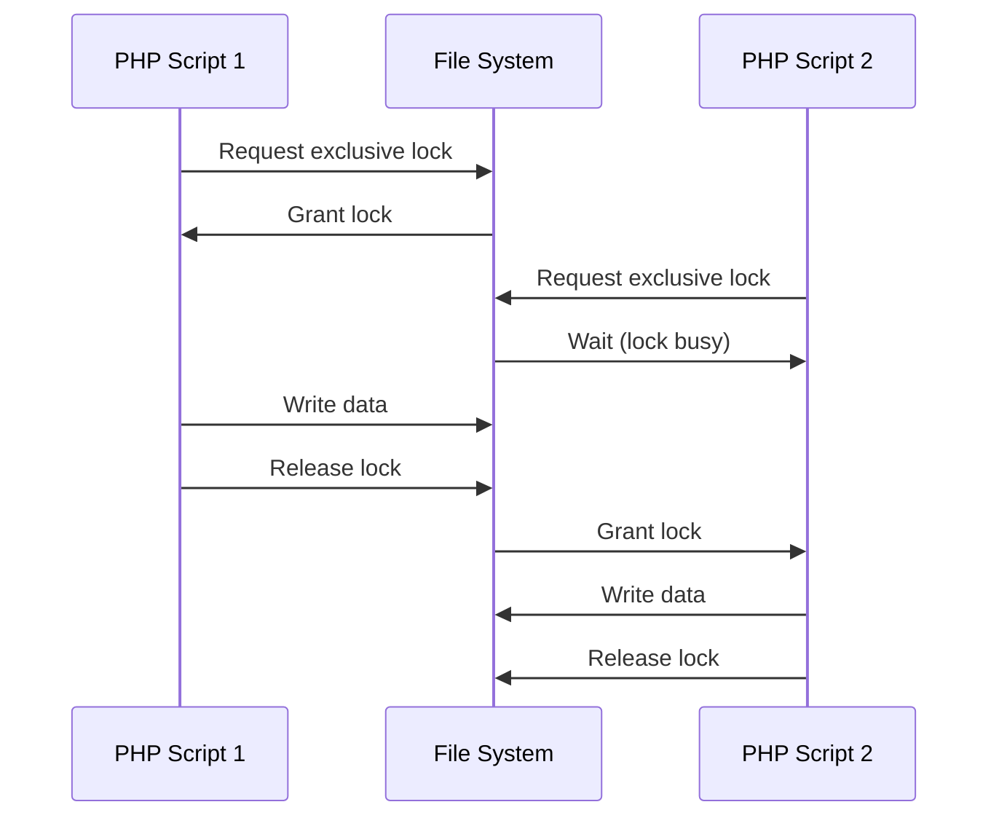

# PHP File Locking

## Introduction

When multiple PHP scripts or users try to access and modify the same file simultaneously, conflicts can arise leading to data corruption or inconsistent results. PHP file locking solves this problem by allowing only one process to modify a file at a time, ensuring data integrity.

File locking is essential when:
- Multiple users might access the same resource concurrently
- Background processes and user requests interact with the same files
- You need to implement simple database-like functionality using files

In this tutorial, we'll explore how PHP handles file locking, when to use it, and practical examples to implement it in your own applications.

## Understanding File Locking

File locking in PHP works by creating a temporary lock on a file while one process is reading from or writing to it. This prevents other processes from accessing the file until the lock is released.

PHP provides two main types of locks:

1. **Shared Locks (Read Locks)**: Multiple processes can read a file simultaneously, but none can write to it
2. **Exclusive Locks (Write Locks)**: Only one process can write to a file, and no other process can read or write to it

Let's visualize how file locking works:



## Basic File Locking in PHP

PHP uses the `flock()` function to implement file locking. Here's the basic syntax:

```php
bool flock(resource $handle, int $operation [, int &$wouldblock])
```

Parameters:
- `$handle`: A file resource obtained from `fopen()`
- `$operation`: Type of lock operation (shared, exclusive, release)
- `$wouldblock`: Optional parameter that will be set to 1 if the lock would block

The `$operation` parameter can have these values:
- `LOCK_SH`: Shared lock (reading)
- `LOCK_EX`: Exclusive lock (writing)
- `LOCK_UN`: Release a lock
- `LOCK_NB`: Non-blocking operation (combined with other operations using the OR operator `|`)

Let's see a basic example:

```php
<?php
// Open the file for writing
$file = fopen("data.txt", "w");

// Attempt to get an exclusive lock
if (flock($file, LOCK_EX)) {
    // Write to the file
    fwrite($file, "This data is safely written with a lock.
");
    
    // Release the lock
    flock($file, LOCK_UN);
    
    echo "Data written successfully and lock released.";
} else {
    echo "Could not get a lock!";
}

// Close the file
fclose($file);
?>
```

**Output**:
```
Data written successfully and lock released.
```

## Non-Blocking Locks

Sometimes you don't want your script to wait indefinitely for a lock. In these cases, you can use a non-blocking lock with the `LOCK_NB` flag:

```php
<?php
$file = fopen("data.txt", "w");

// Try to get exclusive lock without blocking
if (flock($file, LOCK_EX | LOCK_NB)) {
    fwrite($file, "Writing data with a non-blocking lock.
");
    flock($file, LOCK_UN);
    echo "Data written successfully.";
} else {
    echo "File is currently in use by another process.";
}

fclose($file);
?>
```

This approach is useful in situations where you want to give immediate feedback to users instead of making them wait.

## Read Locks vs. Write Locks

Let's explore the difference between read and write locks:

```php
<?php
// Example of a read lock (shared lock)
$file = fopen("data.txt", "r");
if (flock($file, LOCK_SH)) {
    $content = fread($file, filesize("data.txt"));
    echo "File content (with shared lock): $content";
    flock($file, LOCK_UN);
} else {
    echo "Could not acquire a shared lock.";
}
fclose($file);

// Example of a write lock (exclusive lock)
$file = fopen("data.txt", "a");
if (flock($file, LOCK_EX)) {
    fwrite($file, "Adding new data with an exclusive lock.
");
    echo "Data added successfully with exclusive lock.";
    flock($file, LOCK_UN);
} else {
    echo "Could not acquire an exclusive lock.";
}
fclose($file);
?>
```

The main difference is that multiple scripts can hold shared locks simultaneously, but an exclusive lock can only be held by one script at a time.

## Practical Example: Simple Counter

Let's implement a simple visit counter that safely increments a value in a file:

```php
<?php
function incrementCounter($counterFile) {
    // Create file if it doesn't exist
    if (!file_exists($counterFile)) {
        file_put_contents($counterFile, "0");
    }
    
    // Open for reading and writing
    $file = fopen($counterFile, "r+");
    
    // Acquire exclusive lock
    if (flock($file, LOCK_EX)) {
        // Read current value
        $count = (int)fread($file, filesize($counterFile));
        
        // Increment
        $count++;
        
        // Reset file pointer to beginning
        rewind($file);
        
        // Write new value
        fwrite($file, $count);
        
        // Release lock
        flock($file, LOCK_UN);
        
        echo "You are visitor #$count";
    } else {
        echo "Could not lock counter file!";
    }
    
    fclose($file);
}

// Usage
incrementCounter("counter.txt");
?>
```

**Output (first visit)**:
```
You are visitor #1
```

**Output (subsequent visits)**:
```
You are visitor #2
```

## Real-World Application: Simple Log Writer

Here's a more practical example - a simple logging function that ensures multiple processes don't corrupt the log file:

```php
<?php
function writeLog($logFile, $message) {
    // Open log file for appending
    $file = fopen($logFile, "a");
    
    // Get exclusive lock
    if (flock($file, LOCK_EX)) {
        // Format log entry
        $timestamp = date("Y-m-d H:i:s");
        $logEntry = "[$timestamp] $message" . PHP_EOL;
        
        // Write to log
        fwrite($file, $logEntry);
        
        // Release lock
        flock($file, LOCK_UN);
        
        return true;
    } else {
        return false;
    }
    
    fclose($file);
}

// Example usage
if (writeLog("application.log", "User logged in: john_doe")) {
    echo "Log entry written successfully.";
} else {
    echo "Failed to write to log.";
}
?>
```

**Output**:
```
Log entry written successfully.
```

**Content of application.log**:
```
[2023-09-15 14:32:11] User logged in: john_doe
```

## Best Practices for File Locking

1. **Always Release Locks**: Make sure to call `flock($file, LOCK_UN)` before closing the file.
2. **Handle Lock Failures**: Decide what your application should do if it can't acquire a lock.
3. **Use Timeouts**: For critical operations, implement timeouts rather than waiting indefinitely.
4. **Minimize Lock Duration**: Keep the locked section of code as short as possible.
5. **Consider Alternatives**: For complex data management, consider using a proper database instead of files.

Here's an example of implementing a timeout for acquiring a lock:

```php
<?php
function acquireLockWithTimeout($file, $timeout = 5) {
    $startTime = time();
    
    // Try to get lock with LOCK_NB (non-blocking)
    while (!flock($file, LOCK_EX | LOCK_NB)) {
        // If we've waited longer than the timeout, give up
        if (time() - $startTime >= $timeout) {
            return false;
        }
        
        // Sleep for a bit before trying again
        usleep(100000); // 0.1 seconds
    }
    
    return true;
}

$file = fopen("data.txt", "w");

if (acquireLockWithTimeout($file, 3)) {
    fwrite($file, "Data written after acquiring lock with timeout.
");
    flock($file, LOCK_UN);
    echo "Lock acquired successfully within timeout.";
} else {
    echo "Could not acquire lock within timeout period.";
}

fclose($file);
?>
```

## Limitations of File Locking in PHP

It's important to understand the limitations of PHP's file locking:

1. **Works Only on Same Server**: File locking only works between processes on the same server. It won't work across multiple web servers.
2. **NFS Limitations**: Some network file systems may not support file locking properly.
3. **Not for High Concurrency**: File locking isn't ideal for high-concurrency applications.
4. **File Handle Management**: Locks are tied to file handles, not filenames. Different handles to the same file can have different locks.

## Summary

PHP file locking is a powerful feature that helps maintain data integrity when multiple processes access the same files. In this tutorial, you've learned:

- How file locking works and why it's important
- The difference between shared and exclusive locks
- How to implement basic file locking with `flock()`
- Practical examples of file locking in real applications
- Best practices and limitations of PHP file locking

By implementing file locking in your PHP applications, you can prevent data corruption and ensure reliable file operations even in concurrent environments.

## Exercises

1. Create a simple guestbook application that uses file locking to safely append new entries to a text file.
2. Implement a file-based caching system with locks to prevent cache corruption.
3. Modify the counter example to create a daily visitor counter that resets at midnight.
4. Create a function that performs an atomic read-modify-write operation on a configuration file.

## Additional Resources

- [PHP Documentation: flock()](https://www.php.net/manual/en/function.flock.php)
- [PHP Documentation: File System Functions](https://www.php.net/manual/en/ref.filesystem.php)
- [When to use databases instead of file storage](https://www.php.net/manual/en/intro.pdo.php)