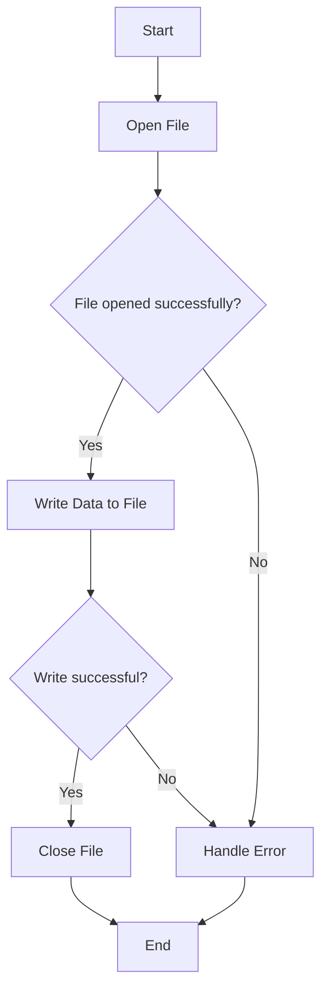

# PHP File Writing

## Introduction

File handling is a crucial aspect of web development that allows your applications to create, read, update, and delete files on the server. In this tutorial, we'll focus specifically on **file writing in PHP** - the process of creating new files and adding content to existing ones.

Writing to files enables you to:
- Store user input or form data
- Create logs for tracking application events
- Generate dynamic reports or documents
- Save configuration settings
- Cache data to improve performance

By the end of this tutorial, you'll understand different methods to write files in PHP and be able to implement file writing operations in your own web applications.

## Prerequisites

Before diving into file writing, make sure you have:
- Basic knowledge of PHP syntax
- A web server with PHP installed (e.g., XAMPP, WAMP, or a hosting environment)
- File system write permissions in your working directory

## PHP File Writing Basics

PHP offers several functions for writing to files. The process typically follows these steps:

1. Open a file (creating it if it doesn't exist)
2. Write data to the file
3. Close the file

Let's explore the main approaches to file writing in PHP.

## Writing Files with `fwrite()` and File Handles

The most common way to write files in PHP is using a combination of `fopen()`, `fwrite()`, and `fclose()` functions.

### Step 1: Opening a File with `fopen()`

```php
$file = fopen("filename.txt", "w");
```

The `fopen()` function takes two parameters:
- The path to the file you want to open
- The mode in which to open the file

The file modes for writing are:

| Mode | Description |
|------|-------------|
| `w` | Open for writing only; create the file if it doesn't exist; erase the contents if it does exist |
| `a` | Open for writing only; create the file if it doesn't exist; append to the file if it exists |
| `w+` | Open for reading and writing; create the file if it doesn't exist; erase the contents if it exists |
| `a+` | Open for reading and writing; create the file if it doesn't exist; append to the file if it exists |
| `x` | Create and open for writing only; returns FALSE if the file already exists |
| `x+` | Create and open for reading and writing; returns FALSE if the file already exists |

### Step 2: Writing to the File with `fwrite()`

After opening a file, you can write to it using the `fwrite()` function:

```php
fwrite($file, "Hello, World!");
```

### Step 3: Closing the File with `fclose()`

Always close your files when you're done with them:

```php
fclose($file);
```

### Complete Example

```php
<?php
// Open or create a file for writing (overwrites existing file)
$file = fopen("example.txt", "w");

// Write content to the file
fwrite($file, "Hello, World!
");
fwrite($file, "This is a new line of text.");

// Close the file
fclose($file);

echo "File written successfully!";
?>
```

**Output:**
- Creates or overwrites a file named "example.txt" with the content:
  ```
  Hello, World!
  This is a new line of text.
  ```
- Displays "File written successfully!" in the browser

## Appending to Files

If you want to add content to an existing file without overwriting its current contents, use the `"a"` mode:

```php
<?php
// Open file for appending
$file = fopen("log.txt", "a");

// Append content
$timestamp = date("Y-m-d H:i:s");
fwrite($file, "$timestamp - User logged in
");

// Close the file
fclose($file);

echo "Log entry added!";
?>
```

**Output:**
- Adds a new line to "log.txt" with the current timestamp and message
- Existing content in the file remains intact

## Using `file_put_contents()` - A Simpler Approach

PHP provides a more straightforward function called `file_put_contents()` that combines opening, writing, and closing operations into a single step:

```php
<?php
// Write content to a file (overwrites existing file)
file_put_contents("simple.txt", "This is a simple way to write to a file.");

echo "File written with file_put_contents()!";
?>
```

**Output:**
- Creates or overwrites "simple.txt" with the specified content

### Appending with `file_put_contents()`

To append content using `file_put_contents()`, you need to include the `FILE_APPEND` flag:

```php
<?php
// Append content to a file
file_put_contents("notes.txt", "New note added.
", FILE_APPEND);

echo "Note appended!";
?>
```

### Writing Arrays to Files

You can write array content to a file by converting it to a string first:

```php
<?php
// Array of data
$users = [
    "John" => "john@example.com",
    "Maria" => "maria@example.com",
    "Alex" => "alex@example.com"
];

// Convert to string format
$content = "";
foreach ($users as $name => $email) {
    $content .= "$name: $email
";
}

// Write to file
file_put_contents("users.txt", $content);

echo "User list saved!";
?>
```

**Output:**
- Creates a file named "users.txt" with content:
  ```
  John: john@example.com
  Maria: maria@example.com
  Alex: alex@example.com
  ```

## File Writing with Error Handling

In real-world applications, it's essential to implement error handling when working with files:

```php
<?php
try {
    // Attempt to open file
    $file = fopen("data.txt", "w");
    
    // Check if file was opened successfully
    if (!$file) {
        throw new Exception("Unable to open file!");
    }
    
    // Write content
    $bytesWritten = fwrite($file, "Important data");
    
    // Check if write was successful
    if ($bytesWritten === false) {
        throw new Exception("Failed to write to file!");
    }
    
    // Close file
    fclose($file);
    
    echo "File operation successful!";
} catch (Exception $e) {
    echo "Error: " . $e->getMessage();
}
?>
```

## File Permissions and Security

When writing files in PHP, always be mindful of file permissions and security concerns:

```php
<?php
// File to write to
$filename = "secure_data.txt";
$content = "Sensitive information";

// Check if the directory is writable
if (!is_writable(dirname($filename))) {
    echo "Directory is not writable!";
    exit;
}

// Write file with specific permissions
file_put_contents($filename, $content);

// Set secure file permissions (readable/writable only by owner)
chmod($filename, 0600);

echo "Secure file created!";
?>
```

### Security Best Practices

1. **Never** write files based on unsanitized user input
2. Avoid writing files to publicly accessible directories when possible
3. Set appropriate file permissions
4. Validate file paths to prevent directory traversal attacks
5. Consider using PHP's `stream_wrapper_register()` for more advanced security

## Practical Example: Creating a Simple Log System

Let's build a simple logging system that records website visits:

```php
<?php
/**
 * Simple logging function
 * 
 * @param string $level Log level (INFO, WARNING, ERROR)
 * @param string $message The message to log
 * @return bool Success status
 */
function writeLog($level, $message) {
    // Create logs directory if it doesn't exist
    $logDir = "logs";
    if (!file_exists($logDir) && !mkdir($logDir, 0755, true)) {
        return false;
    }
    
    // Format the log entry
    $timestamp = date("Y-m-d H:i:s");
    $ip = $_SERVER['REMOTE_ADDR'] ?? 'Unknown';
    $logEntry = "[$timestamp] [$level] [$ip] $message
";
    
    // Write to daily log file
    $filename = "$logDir/" . date("Y-m-d") . ".log";
    
    return file_put_contents($filename, $logEntry, FILE_APPEND) !== false;
}

// Usage example
writeLog("INFO", "User visited homepage");
writeLog("ERROR", "Database connection failed");

echo "Logs created successfully!";
?>
```

## Writing Different File Formats

PHP allows you to write various file formats beyond plain text.

### Writing CSV Files

```php
<?php
// Data to write
$data = [
    ['Name', 'Email', 'Phone'],
    ['John Doe', 'john@example.com', '555-1234'],
    ['Jane Smith', 'jane@example.com', '555-5678'],
    ['Bob Johnson', 'bob@example.com', '555-9012']
];

// Open file for writing
$file = fopen('contacts.csv', 'w');

// Write each row
foreach ($data as $row) {
    fputcsv($file, $row);
}

// Close the file
fclose($file);

echo "CSV file created!";
?>
```

### Writing JSON Files

```php
<?php
// Data structure
$data = [
    "settings" => [
        "theme" => "dark",
        "notifications" => true,
        "autoSave" => true
    ],
    "recentFiles" => [
        "document1.txt",
        "image.jpg",
        "spreadsheet.xlsx"
    ]
];

// Convert to JSON and write to file
$jsonData = json_encode($data, JSON_PRETTY_PRINT);
file_put_contents("config.json", $jsonData);

echo "JSON file created!";
?>
```

## File Writing Process Visualization

Here's a visual representation of the PHP file writing process:



## Summary

In this tutorial, you've learned how to:
- Create and write to files using PHP
- Use different file modes for various writing operations
- Implement basic and advanced file writing techniques
- Handle errors when writing files
- Create practical applications like logging systems
- Write different file formats (plain text, CSV, JSON)

File writing is a fundamental skill for PHP developers that enables you to store and manage data persistently. By mastering these techniques, you'll be able to build more powerful and feature-rich web applications.

## Exercises

1. Create a simple guest book application that saves visitor comments to a file
2. Build a file-based counter that tracks the number of page views
3. Develop a PHP script that generates a daily report file with website statistics
4. Create a file-based task manager that allows adding, updating, and completing tasks

## Additional Resources

- [PHP Official Documentation: File System Functions](https://www.php.net/manual/en/ref.filesystem.php)
- [PHP Manual: fopen](https://www.php.net/manual/en/function.fopen.php)
- [PHP Manual: file_put_contents](https://www.php.net/manual/en/function.file-put-contents.php)
- [PHP File Permissions Best Practices](https://phpsecurity.readthedocs.io/en/latest/Filesystem-Security.html)