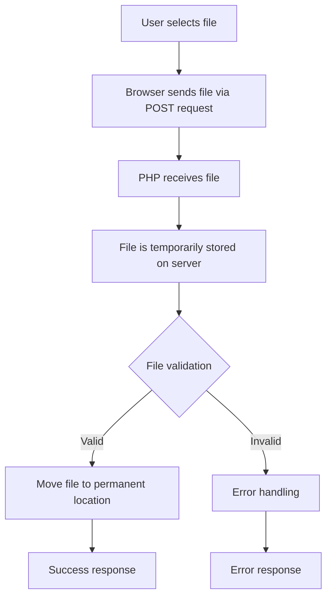

# PHP File Upload

## Introduction

File uploading is an essential feature for many web applications. Whether you're building a social media platform where users share photos, a document management system, or a simple contact form with attachment functionality, understanding how to handle file uploads in PHP is crucial.

In this tutorial, we'll explore how PHP handles file uploads from HTML forms, how to validate uploaded files, store them securely, and implement best practices to prevent security vulnerabilities.

## Prerequisites

Before diving into file uploads, you should be familiar with:
- Basic PHP syntax
- HTML forms
- PHP superglobals (especially `$_FILES`)

## HTML Form for File Upload

To begin uploading files, you need to create an HTML form with the following requirements:

1. The form's `method` attribute must be set to `"POST"`
2. The form's `enctype` attribute must be set to `"multipart/form-data"`
3. The form must include an `<input>` element with `type="file"`

Here's a basic example:

```html
<!DOCTYPE html>
<html>
<head>
    <title>File Upload Form</title>
</head>
<body>
    <h2>Upload a File</h2>
    <form action="upload.php" method="POST" enctype="multipart/form-data">
        <label for="fileToUpload">Select file:</label>
        <input type="file" name="fileToUpload" id="fileToUpload">
        <input type="submit" value="Upload File" name="submit">
    </form>
</body>
</html>
```

## Handling File Uploads in PHP

When a file is uploaded through an HTML form, PHP stores the file information in the `$_FILES` superglobal array. Let's create an `upload.php` file to handle the upload:

```php
<?php
if(isset($_POST["submit"])) {
    // Check if file was uploaded without errors
    if(isset($_FILES["fileToUpload"]) && $_FILES["fileToUpload"]["error"] == 0) {
        $target_dir = "uploads/";
        $target_file = $target_dir . basename($_FILES["fileToUpload"]["name"]);
        
        // Move the uploaded file from temporary location to desired destination
        if(move_uploaded_file($_FILES["fileToUpload"]["tmp_name"], $target_file)) {
            echo "The file " . htmlspecialchars(basename($_FILES["fileToUpload"]["name"])) . " has been uploaded.";
        } else {
            echo "Sorry, there was an error uploading your file.";
        }
    } else {
        echo "Error: " . $_FILES["fileToUpload"]["error"];
    }
}
?>
```

## Understanding the `$_FILES` Array

When a file is uploaded, PHP creates an array structure in `$_FILES` with the following information:

```php
$_FILES["fileToUpload"]["name"]      // Original name of the file
$_FILES["fileToUpload"]["type"]      // MIME type of the file
$_FILES["fileToUpload"]["tmp_name"]  // Temporary location where the file is stored
$_FILES["fileToUpload"]["error"]     // Error code associated with the upload
$_FILES["fileToUpload"]["size"]      // Size of the uploaded file in bytes
```

Here's a diagram showing the file upload process:



## File Validation

Before accepting and storing uploaded files, it's crucial to validate them to prevent security vulnerabilities. Here's an expanded example that includes validation:

```php
<?php
if(isset($_POST["submit"])) {
    // Check if file was uploaded without errors
    if(isset($_FILES["fileToUpload"]) && $_FILES["fileToUpload"]["error"] == 0) {
        $target_dir = "uploads/";
        $target_file = $target_dir . basename($_FILES["fileToUpload"]["name"]);
        $uploadOk = 1;
        $fileType = strtolower(pathinfo($target_file, PATHINFO_EXTENSION));
        
        // Check if file already exists
        if (file_exists($target_file)) {
            echo "Sorry, file already exists.";
            $uploadOk = 0;
        }
        
        // Check file size (limit to 500KB in this example)
        if ($_FILES["fileToUpload"]["size"] > 500000) {
            echo "Sorry, your file is too large.";
            $uploadOk = 0;
        }
        
        // Allow certain file formats
        if($fileType != "jpg" && $fileType != "png" && $fileType != "jpeg"
        && $fileType != "gif" && $fileType != "pdf" && $fileType != "doc" && $fileType != "docx") {
            echo "Sorry, only JPG, JPEG, PNG, GIF, PDF, DOC & DOCX files are allowed.";
            $uploadOk = 0;
        }
        
        // Check if $uploadOk is set to 0 by an error
        if ($uploadOk == 0) {
            echo "Sorry, your file was not uploaded.";
        // If everything is ok, try to upload file
        } else {
            if (move_uploaded_file($_FILES["fileToUpload"]["tmp_name"], $target_file)) {
                echo "The file " . htmlspecialchars(basename($_FILES["fileToUpload"]["name"])) . " has been uploaded.";
            } else {
                echo "Sorry, there was an error uploading your file.";
            }
        }
    } else {
        echo "Error: " . $_FILES["fileToUpload"]["error"];
    }
}
?>
```

## Handling Multiple File Uploads

To allow users to upload multiple files at once, modify your HTML form by adding the `multiple` attribute and changing the input name to an array format:

```html
<input type="file" name="filesToUpload[]" id="filesToUpload" multiple>
```

And here's how to handle multiple file uploads in PHP:

```php
<?php
if(isset($_POST["submit"])) {
    $target_dir = "uploads/";
    $allowed_types = array("jpg", "jpeg", "png", "gif", "pdf");
    $max_size = 1000000; // 1MB
    
    // Count total files
    $countfiles = count($_FILES['filesToUpload']['name']);
    
    // Loop through all files
    for($i = 0; $i < $countfiles; $i++) {
        $filename = $_FILES['filesToUpload']['name'][$i];
        
        // If file is selected
        if(!empty($filename)) {
            $temp = $_FILES['filesToUpload']['tmp_name'][$i];
            $filesize = $_FILES['filesToUpload']['size'][$i];
            $filetype = strtolower(pathinfo($filename, PATHINFO_EXTENSION));
            $target_file = $target_dir . basename($filename);
            
            // Validate file type
            if(!in_array($filetype, $allowed_types)) {
                echo "$filename has an invalid file type.<br>";
                continue;
            }
            
            // Validate file size
            if($filesize > $max_size) {
                echo "$filename is too large.<br>";
                continue;
            }
            
            // Upload file
            if(move_uploaded_file($temp, $target_file)) {
                echo "$filename uploaded successfully.<br>";
            } else {
                echo "Error uploading $filename.<br>";
            }
        }
    }
}
?>
```

## Handling Upload Errors

PHP provides error codes to help identify what went wrong during file uploads. Here's what each error code means:

```php
switch($_FILES['fileToUpload']['error']) {
    case UPLOAD_ERR_OK:
        // No error, file uploaded successfully
        break;
    case UPLOAD_ERR_INI_SIZE:
        echo "The uploaded file exceeds the upload_max_filesize directive in php.ini";
        break;
    case UPLOAD_ERR_FORM_SIZE:
        echo "The uploaded file exceeds the MAX_FILE_SIZE directive in the HTML form";
        break;
    case UPLOAD_ERR_PARTIAL:
        echo "The uploaded file was only partially uploaded";
        break;
    case UPLOAD_ERR_NO_FILE:
        echo "No file was uploaded";
        break;
    case UPLOAD_ERR_NO_TMP_DIR:
        echo "Missing a temporary folder";
        break;
    case UPLOAD_ERR_CANT_WRITE:
        echo "Failed to write file to disk";
        break;
    case UPLOAD_ERR_EXTENSION:
        echo "A PHP extension stopped the file upload";
        break;
    default:
        echo "Unknown error";
        break;
}
```

## Security Best Practices

File uploads can pose significant security risks if not handled properly. Here are some best practices to follow:

1. **Validate file types**: Always check the file extension and MIME type.
2. **Limit file size**: Prevent users from uploading extremely large files.
3. **Generate unique filenames**: Avoid overwriting existing files by using functions like `uniqid()`.
4. **Store files outside the web root**: Prevent direct access to uploaded files.
5. **Scan for malware**: Consider using antivirus software to scan uploaded files.
6. **Use proper permissions**: Set appropriate file permissions on the upload directory.

Here's an example implementing some of these practices:

```php
<?php
if(isset($_POST["submit"])) {
    // Check if file was uploaded without errors
    if(isset($_FILES["fileToUpload"]) && $_FILES["fileToUpload"]["error"] == 0) {
        // Directory where files will be stored, outside web root
        $target_dir = "../private_uploads/";
        
        // Generate a unique filename
        $file_extension = strtolower(pathinfo($_FILES["fileToUpload"]["name"], PATHINFO_EXTENSION));
        $new_filename = uniqid() . '.' . $file_extension;
        $target_file = $target_dir . $new_filename;
        
        // Get file MIME type
        $finfo = new finfo(FILEINFO_MIME_TYPE);
        $file_mime = $finfo->file($_FILES["fileToUpload"]["tmp_name"]);
        
        // Array of allowed file types and corresponding MIME types
        $allowed_types = [
            'jpg' => 'image/jpeg',
            'jpeg' => 'image/jpeg',
            'png' => 'image/png',
            'pdf' => 'application/pdf'
        ];
        
        // Validate file type using both extension and MIME type
        if (!array_key_exists($file_extension, $allowed_types) || $allowed_types[$file_extension] !== $file_mime) {
            echo "Sorry, only JPG, JPEG, PNG, and PDF files are allowed.";
            exit;
        }
        
        // Check file size (limit to 1MB)
        if ($_FILES["fileToUpload"]["size"] > 1000000) {
            echo "Sorry, your file is too large.";
            exit;
        }
        
        // Create directory if it doesn't exist
        if (!file_exists($target_dir)) {
            mkdir($target_dir, 0755, true);
        }
        
        // Move file to destination
        if (move_uploaded_file($_FILES["fileToUpload"]["tmp_name"], $target_file)) {
            // Record file information in database (recommended)
            // saveFileInfoToDatabase($new_filename, $_FILES["fileToUpload"]["name"]);
            
            echo "The file has been uploaded successfully.";
        } else {
            echo "Sorry, there was an error uploading your file.";
        }
    } else {
        echo "Error: " . $_FILES["fileToUpload"]["error"];
    }
}
?>
```

## Practical Example: Image Upload and Thumbnail Generation

Here's a real-world example of uploading an image and generating a thumbnail:

```php
<?php
if(isset($_POST["submit"])) {
    if(isset($_FILES["image"]) && $_FILES["image"]["error"] == 0) {
        $allowed = ["jpg" => "image/jpg", "jpeg" => "image/jpeg", "png" => "image/png"];
        $filename = $_FILES["image"]["name"];
        $filetype = $_FILES["image"]["type"];
        $filesize = $_FILES["image"]["size"];
    
        // Verify file extension
        $ext = pathinfo($filename, PATHINFO_EXTENSION);
        if(!array_key_exists($ext, $allowed)) {
            die("Error: Please select a valid file format.");
        }
    
        // Verify file size - 5MB maximum
        $maxsize = 5 * 1024 * 1024;
        if($filesize > $maxsize) {
            die("Error: File size is larger than the allowed limit.");
        }
    
        // Verify MIME type of the file
        if(in_array($filetype, $allowed)) {
            // Create unique filename
            $new_filename = uniqid() . '.' . $ext;
            $upload_dir = "uploads/";
            $thumbnail_dir = "uploads/thumbnails/";
            
            // Create directories if they don't exist
            if(!file_exists($upload_dir)) {
                mkdir($upload_dir, 0755, true);
            }
            if(!file_exists($thumbnail_dir)) {
                mkdir($thumbnail_dir, 0755, true);
            }
            
            // Save the original image
            if(move_uploaded_file($_FILES["image"]["tmp_name"], $upload_dir . $new_filename)) {
                // Generate thumbnail
                $thumbnail = $thumbnail_dir . $new_filename;
                
                // Get image dimensions
                list($width, $height) = getimagesize($upload_dir . $new_filename);
                
                // Set thumbnail dimensions
                $thumb_width = 200;
                $thumb_height = round($height * ($thumb_width / $width));
                
                // Create thumbnail based on file type
                if($ext == "jpg" || $ext == "jpeg") {
                    $source = imagecreatefromjpeg($upload_dir . $new_filename);
                    $thumb = imagecreatetruecolor($thumb_width, $thumb_height);
                    imagecopyresized($thumb, $source, 0, 0, 0, 0, $thumb_width, $thumb_height, $width, $height);
                    imagejpeg($thumb, $thumbnail, 75);
                } elseif($ext == "png") {
                    $source = imagecreatefrompng($upload_dir . $new_filename);
                    $thumb = imagecreatetruecolor($thumb_width, $thumb_height);
                    
                    // Preserve transparency
                    imagealphablending($thumb, false);
                    imagesavealpha($thumb, true);
                    $transparent = imagecolorallocatealpha($thumb, 255, 255, 255, 127);
                    imagefilledrectangle($thumb, 0, 0, $thumb_width, $thumb_height, $transparent);
                    
                    imagecopyresized($thumb, $source, 0, 0, 0, 0, $thumb_width, $thumb_height, $width, $height);
                    imagepng($thumb, $thumbnail);
                }
                
                imagedestroy($source);
                imagedestroy($thumb);
                
                echo "Your file was uploaded successfully. Original saved as " . $new_filename . 
                     " and thumbnail was created.";
            } else {
                echo "Error: There was a problem uploading your file. Please try again.";
            }
        } else {
            echo "Error: There was a problem with your file type. Please try again.";
        }
    } else {
        echo "Error: " . $_FILES["image"]["error"];
    }
}
?>
```

## Using AJAX for File Uploads

For a better user experience, you can implement file uploads using AJAX. Here's an example using JavaScript's Fetch API:

```html
<!DOCTYPE html>
<html>
<head>
    <title>AJAX File Upload</title>
    <style>
        .progress-bar {
            width: 300px;
            height: 20px;
            border: 1px solid #ccc;
            border-radius: 5px;
            margin-top: 10px;
        }
        .progress {
            height: 100%;
            background-color: #4CAF50;
            width: 0%;
            border-radius: 5px;
            transition: width 0.3s;
        }
    </style>
</head>
<body>
    <h2>Upload a File with AJAX</h2>
    <input type="file" id="fileInput">
    <button onclick="uploadFile()">Upload</button>
    <div class="progress-bar">
        <div class="progress" id="progressBar"></div>
    </div>
    <p id="status"></p>

    <script>
        function uploadFile() {
            const fileInput = document.getElementById('fileInput');
            const progressBar = document.getElementById('progressBar');
            const status = document.getElementById('status');
            
            if (!fileInput.files.length) {
                status.textContent = 'Please select a file first.';
                return;
            }
            
            const file = fileInput.files[0];
            const formData = new FormData();
            formData.append('fileToUpload', file);
            
            // Reset progress and status
            progressBar.style.width = '0%';
            status.textContent = 'Uploading...';
            
            fetch('ajax_upload.php', {
                method: 'POST',
                body: formData
            })
            .then(response => {
                if (!response.ok) {
                    throw new Error('Network response was not ok');
                }
                progressBar.style.width = '100%';
                return response.text();
            })
            .then(data => {
                status.textContent = data;
            })
            .catch(error => {
                status.textContent = 'Upload failed: ' + error.message;
            });
            
            // Simulate progress (in a real app, you would use XMLHttpRequest with progress event)
            let progress = 0;
            const interval = setInterval(() => {
                progress += 5;
                if (progress <= 90) {
                    progressBar.style.width = progress + '%';
                } else {
                    clearInterval(interval);
                }
            }, 200);
        }
    </script>
</body>
</html>
```

And the corresponding PHP file (`ajax_upload.php`):

```php
<?php
header('Content-Type: text/plain');

if(isset($_FILES["fileToUpload"]) && $_FILES["fileToUpload"]["error"] == 0) {
    $target_dir = "uploads/";
    
    // Create directory if it doesn't exist
    if(!file_exists($target_dir)) {
        mkdir($target_dir, 0755, true);
    }
    
    $target_file = $target_dir . basename($_FILES["fileToUpload"]["name"]);
    
    // Simple validation
    $fileType = strtolower(pathinfo($target_file, PATHINFO_EXTENSION));
    if($fileType != "jpg" && $fileType != "png" && $fileType != "jpeg" && $fileType != "pdf") {
        echo "Sorry, only JPG, JPEG, PNG & PDF files are allowed.";
        exit;
    }
    
    if(move_uploaded_file($_FILES["fileToUpload"]["tmp_name"], $target_file)) {
        echo "The file " . htmlspecialchars(basename($_FILES["fileToUpload"]["name"])) . " has been uploaded.";
    } else {
        echo "Sorry, there was an error uploading your file.";
    }
} else {
    echo "No file was uploaded or an error occurred.";
}
?>
```

## PHP Configuration for File Uploads

PHP has several configuration directives in `php.ini` that control file uploads:

1. `file_uploads` - Determines whether file uploads are allowed (should be set to On)
2. `upload_max_filesize` - Maximum size of an uploaded file
3. `post_max_size` - Maximum size of POST data that PHP will accept (should be larger than `upload_max_filesize`)
4. `max_file_uploads` - Maximum number of files that can be uploaded simultaneously
5. `upload_tmp_dir` - Temporary directory used for file uploads

You can check these settings using `phpinfo()` or:

```php
<?php
echo "file_uploads: " . ini_get('file_uploads') . "<br>";
echo "upload_max_filesize: " . ini_get('upload_max_filesize') . "<br>";
echo "post_max_size: " . ini_get('post_max_size') . "<br>";
echo "max_file_uploads: " . ini_get('max_file_uploads') . "<br>";
echo "upload_tmp_dir: " . ini_get('upload_tmp_dir') . "<br>";
?>
```

## Common Issues and Troubleshooting

1. **File not uploading**
   - Check if the form has `enctype="multipart/form-data"`
   - Verify that the uploaded file size doesn't exceed PHP limits
   - Ensure the upload directory exists and is writable

2. **Permission denied errors**
   - Check directory permissions (typically 755 for directories, 644 for files)
   - Make sure the web server user (www-data, apache, etc.) has write access

3. **File size limitations**
   - Modify `php.ini` settings: `upload_max_filesize`, `post_max_size`
   - Add `MAX_FILE_SIZE` hidden field in your HTML form

4. **Browser timing out**
   - For large files, consider using chunked uploads
   - Increase PHP execution time limit with `set_time_limit()`

## Summary

In this tutorial, we've covered:
- Creating HTML forms for file uploads
- Handling file uploads in PHP using the `$_FILES` superglobal
- Validating uploaded files for security
- Implementing multiple file uploads
- Handling upload errors
- Security best practices
- Practical examples including image upload with thumbnail generation
- AJAX file uploads for improved user experience
- PHP configuration settings for file uploads
- Troubleshooting common issues

File uploads are a fundamental feature in web development, and understanding how to implement them securely and efficiently is an essential skill for any PHP developer.

## Exercises

1. Create a file upload form that accepts only PDF files and stores them in a directory named after the current date (e.g., "uploads/2023-03-15/").

2. Implement a profile picture upload system that:
   - Accepts only image files (JPG, PNG, GIF)
   - Resizes the image to a maximum of 500x500 pixels while maintaining aspect ratio
   - Creates a 100x100 thumbnail for use in a user listing

3. Build a file management system that allows users to:
   - Upload files
   - View uploaded files
   - Delete files
   - Search files by name or type

## Additional Resources

- [PHP Manual: Handling File Uploads](https://www.php.net/manual/en/features.file-upload.php)
- [PHP Manual: move_uploaded_file](https://www.php.net/manual/en/function.move-uploaded-file.php)
- [PHP Manual: GD Library](https://www.php.net/manual/en/book.image.php) (for image processing)
- [OWASP - File Upload Security](https://owasp.org/www-community/vulnerabilities/Unrestricted_File_Upload)